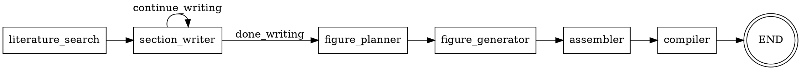

# 本科毕业设计模块 Phase 1 设计文档

> **For Claude:** REQUIRED SUB-SKILL: Use superpowers:writing-plans to create the implementation plan.

**Goal:** 实现本科毕业设计模块核心可用功能，让论文生成工作流真正运行起来。

**Architecture:** 渐进式完善策略，优先实现LangGraph工作流编排和后台任务执行，确保核心功能可用。

**Tech Stack:** Python 3.12, LangGraph, Pydantic v2, FastAPI BackgroundTasks, asyncio

---

## 设计概述

### 方案选择：渐进式完善（Phase 1）

**核心思路**：先让核心功能跑通，再逐步补充

**Phase 1 范围**：
- LangGraph工作流编排
- 后台任务执行框架
- 新增节点实现（配图规划、配图生成、LaTeX编译）
- Subagent调用集成

---

## 模块结构

```
src/thesis/
├── __init__.py                    # 模块导出
├── api.py                         # HTTP API（更新）
├── task_storage.py                # 任务存储（已完成）
├── config.py                      # 🆕 配置管理
│
├── workflow/
│   ├── __init__.py
│   ├── state.py                   # 状态定义（已完成）
│   ├── graph.py                   # 🆕 LangGraph 状态机
│   ├── runner.py                  # 🆕 工作流执行器
│   │
│   ├── nodes/
│   │   ├── __init__.py            # 更新导出
│   │   ├── base.py                # 基础工具（已完成）
│   │   ├── section_writer.py      # 章节写入（已完成）
│   │   ├── literature_search.py   # 文献搜索（已完成）
│   │   ├── figure_planner.py      # 🆕 配图规划节点
│   │   ├── figure_generator.py    # 🆕 配图生成节点
│   │   ├── assembler.py           # LaTeX组装（已完成）
│   │   └── compiler.py            # 🆕 LaTeX编译节点
│   │
│   └── latex_template.py          # 模板（已完成）
```

---

## 组件设计

### 1. 配置管理 (`config.py`)

```python
from pydantic_settings import BaseSettings

class ThesisSettings(BaseSettings):
    """论文模块配置"""

    # 文献配置
    min_references: int = 10
    recommended_references: int = 20

    # 章节配置
    default_target_words: int = 2000
    max_section_words: int = 5000

    # LaTeX配置
    latex_compiler: str = "xelatex"
    bibliography_style: str = "gbt7714"

    # 任务配置
    task_timeout_hours: int = 24
    max_concurrent_tasks: int = 10

    class Config:
        env_prefix = "THESIS_"

thesis_settings = ThesisSettings()
```

### 2. LangGraph 工作流编排 (`workflow/graph.py`)

**工作流图**:



**关键代码**:
- 定义6个节点
- 条件边：section_writer 循环直到所有章节完成
- 使用 MemorySaver 作为 checkpointer

### 3. 工作流执行器 (`workflow/runner.py`)

**核心函数**: `async def run_thesis_workflow(task_id: str, request: dict) -> None`

**流程**:
1. 更新任务状态为 running
2. 构建初始状态 ThesisWorkflowState
3. 使用 `thesis_graph.astream()` 执行工作流
4. 实时更新任务进度到 storage
5. 完成或失败时更新最终状态

### 4. 新增节点

#### 4.1 配图规划节点 (`nodes/figure_planner.py`)

**功能**: 扫描章节内容中的配图占位符，生成配图需求列表

**占位符格式**: `% [FIGURE:id|type|description|caption]`

**输出**: `figure_requests` 列表

#### 4.2 配图生成节点 (`nodes/figure_generator.py`)

**功能**: 根据策略生成配图

**策略选择**:
- `mermaid`: 流程图、架构图 → ExecutionService (MERMAID_DIAGRAM)
- `python`: 数据图表 → ExecutionService (PYTHON_PLOT)
- `kling`: 复杂配图 → ExecutionService (AI_IMAGE)

**输出**: `generated_figures` 列表

#### 4.3 LaTeX编译节点 (`nodes/compiler.py`)

**功能**: 调用 compile_latex_tool 生成 PDF

**输入**: final_latex, bib_content
**输出**: pdf_path

---

## API 更新

### generate_thesis 端点更新

```python
@router.post("/generate", response_model=ThesisStatusResponse)
async def generate_thesis(
    request: ThesisGenerateRequest,
    background_tasks: BackgroundTasks,
) -> ThesisStatusResponse:
    # 创建任务
    task = create_thesis_task(...)

    # 🆕 添加后台任务执行
    background_tasks.add_task(
        run_thesis_workflow,
        task.task_id,
        request.model_dump(),
    )

    return ThesisStatusResponse(...)
```

---

## 测试计划

### 单元测试

| 文件 | 测试内容 |
|------|----------|
| `test_graph.py` | 工作流图构建、节点连接、条件路由 |
| `test_runner.py` | 执行器流程、状态更新、错误处理 |
| `test_figure_planner.py` | 占位符识别、策略选择 |
| `test_figure_generator.py` | 各策略生成 |
| `test_compiler.py` | LaTeX编译调用 |

### 集成测试

| 测试 | 内容 |
|------|------|
| `test_full_workflow` | 从API调用到PDF生成的完整流程 |
| `test_workflow_cancellation` | 任务取消处理 |
| `test_workflow_error_recovery` | 错误恢复 |

---

## 文件清单

| 文件 | 状态 | 说明 |
|------|------|------|
| `src/thesis/config.py` | 🆕 新建 | 配置管理 |
| `src/thesis/workflow/graph.py` | 🆕 新建 | LangGraph状态机 |
| `src/thesis/workflow/runner.py` | 🆕 新建 | 工作流执行器 |
| `src/thesis/workflow/nodes/figure_planner.py` | 🆕 新建 | 配图规划节点 |
| `src/thesis/workflow/nodes/figure_generator.py` | 🆕 新建 | 配图生成节点 |
| `src/thesis/workflow/nodes/compiler.py` | 🆕 新建 | LaTeX编译节点 |
| `src/thesis/api.py` | 📝 更新 | 集成后台任务 |
| `src/thesis/workflow/nodes/__init__.py` | 📝 更新 | 导出新节点 |
| `src/thesis/__init__.py` | 📝 更新 | 模块导出 |
| `tests/thesis/workflow/test_graph.py` | 🆕 新建 | 工作流测试 |
| `tests/thesis/workflow/test_runner.py` | 🆕 新建 | 执行器测试 |

---

## 依赖关系

- 依赖已完成的模块: state.py, task_storage.py, latex_template.py, 现有nodes
- 依赖 deer-flow: ExecutionMiddleware (LaTeX编译)
- 依赖外部: LangGraph (已安装)

---

## 风险与缓解

| 风险 | 缓解措施 |
|------|----------|
| 后台任务失败 | 完善错误处理，更新任务状态 |
| 长时间运行超时 | 添加心跳机制，定期更新状态 |
| LaTeX编译失败 | 捕获错误，返回详细错误信息 |

---

## 后续 Phase 2/3 规划

### Phase 2 - 功能增强
- 文献真实搜索 (Semantic Scholar API)
- WebSocket 实时进度推送
- Memory系统集成

### Phase 3 - 体验优化
- Skills补充 (thesis-outline, thesis-reviewer)
- 完整测试覆盖
- 性能优化
