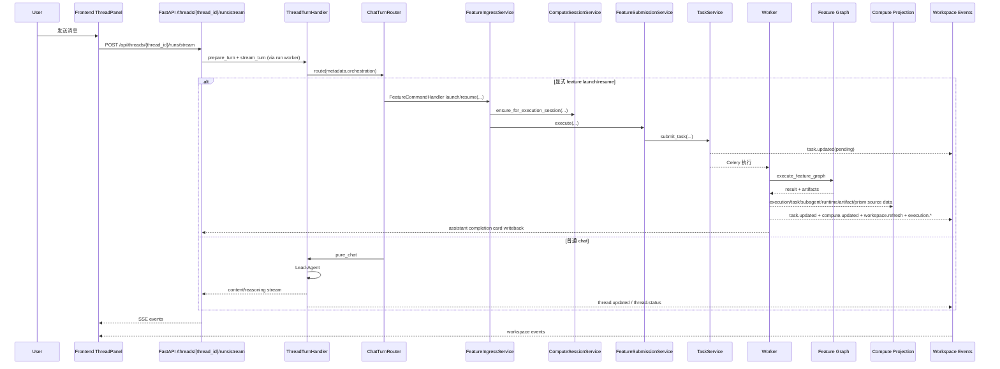

# Wenjin 技术栈与主链路架构说明

更新时间：2026-04-28

## 1. 文档目标与范围

本文档面向研发与架构评审，系统梳理 `/home/cjz/wenjin` 当前实现中的：

- 技术栈（前端 / 后端 / 中间件 / 基础设施 / 可观测）
- 运行架构与部署拓扑（Docker Compose + Nginx）
- Redis 与 SSE 的完整职责边界
- `workspace / feature / skills / thread` 的端到端主链路
- 执行会话（execution session）、任务系统、前端事件驱动状态同步机制

说明：本文只描述当前代码实现，不包含未来规划。

---

## 2. 系统分层与模块边界

### 2.1 分层总览

```text
Frontend (Next.js App Router + Zustand)
  -> HTTP/SSE (/api/*)
Nginx (reverse proxy + rate limit + SSE no-buffer)
  -> Gateway (FastAPI)
    -> Application Handlers (chat / feature / papers)
      -> Domain Services (workspace / credits / literature / execution session)
        -> Feature Ingress + Compute Projection
          -> Task System (TaskService -> Celery -> Worker)
            -> Feature Leader Runtime / LangGraph Graphs / AgentHarness
    -> Workspace Event Bus (Redis PubSub)

State Stores:
- PostgreSQL: durable business state (workspace/thread/task/execution/compute/artifact/subagent/latex)
- Redis: runtime state + locks + pubsub + cache + rate limit backend
```

### 2.2 后端目录职责

- `backend/src/gateway/*`: FastAPI 入口、路由、中间件、健康检查
- `backend/src/application/*`: 应用编排层（`ThreadTurnHandler`、`ChatTurnRouter`、`FeatureCommandHandler`、`FeatureSubmissionService`、`FeatureIngressService`）
- `backend/src/compute/*`: ComputeSession、projection、用户可见工作台聚合
- `backend/src/task/*`: 任务系统（submit/store/progress/worker/sse）
- `backend/src/agents/*`: lead-agent、feature leader、LangGraph 图、AgentHarness contract
- `backend/src/workspace_features/*`: feature registry、runtime profile、feature service、WenjinPrism sync
- `backend/src/services/*`: execution session、activity、credit、thread event 等跨域服务
- `backend/src/academic/cache/redis_client.py`: Redis 双连接与 key 约定

### 2.3 前端目录职责

- `frontend/app/(workbench)/workspaces/[id]/*`: workspace 主工作台
- `frontend/stores/*`: Zustand 状态层（chat / compute / latex / execution / workspace / features / dashboard）
- `frontend/hooks/useWorkspaceEventStream.ts`: workspace 级事件订阅与分发
- `frontend/lib/api/*`: API 客户端与 SSE 流解析

---

## 3. 技术栈清单

### 3.1 Backend

- Python `>=3.12`
- FastAPI + Pydantic v2 + pydantic-settings
- SQLAlchemy Async + asyncpg + Alembic
- Redis (redis-py asyncio)
- Celery（broker/result backend 均为 Redis）
- LangChain + LangGraph + ReAct Agent
- MCP runtime（`langchain-mcp-adapters`）
- Prometheus client
- Sentry SDK

### 3.2 Frontend

- Next.js `^16`（App Router）
- React `^19`
- TypeScript `^5.7`
- Zustand `^5`
- Axios
- Tailwind CSS
- framer-motion

### 3.3 基础设施

- PostgreSQL 16（镜像：`pgvector/pgvector:pg16`）
- Redis 7（AOF 持久化）
- Nginx（统一入口）
- Docker Compose
- Prometheus + Grafana
- 可选 `langgraph` 服务（profile: `langgraph`）

---

## 4. 部署拓扑（Compose + Nginx）

### 4.1 服务与端口

- `nginx`：对外入口 `2026:80`
- `frontend`：Next.js `3000`（容器内）
- `gateway`：FastAPI `8001`（容器内）
- `worker`：Celery worker（无对外端口）
- `postgres`：PostgreSQL（容器内）
- `redis`：Redis（容器内）
- `prometheus`：抓取 `gateway:8001/metrics`、`worker:9153/metrics`
- `grafana`：`3001:3000`

### 4.2 Nginx 关键策略

- `/api/threads/{thread_id}/runs/stream`、`/api/runs/stream`、`/api/runs/{run_id}/stream` 单独 location，关闭缓冲：`proxy_buffering off`
- `/api/workspaces/{id}/events`、`/api/tasks/{id}/stream` 统一 SSE location，关闭缓冲并设置长超时（`86400s`）
- API 与前端分流
- Nginx 层限流（`general`/`api`）

---

## 5. 持久化与状态模型

### 5.1 PostgreSQL 核心实体

- `workspaces`：工作区主实体（类型：`thesis/sci/proposal/software_copyright/patent`）
- `threads`：对话线程（含 `skill`、`messages(JSONB)`）
- `task_records`：任务持久化（含 `workspace_id/feature_id/thread_id/execution_session_id/runtime_state`）
- `execution_sessions`：feature 执行会话聚合（贯穿 launch/resume/task/subagent）
- `compute_sessions`：execution session 的用户可见工作台 shell（不持有业务状态）
- `subagent_task_records`：子代理任务持久化（强关联 `execution_session_id`）
- `latex_projects`、`latex_compile_history`：WenjinPrism 工程与编译历史
- `artifacts`、`papers`：工作产物与文献

### 5.2 Redis 职责全景（重点）

#### 5.2.1 DB 分区

- `redis://.../0`：业务 Redis
- `redis://.../1`：Celery broker
- `redis://.../2`：Celery result backend

#### 5.2.2 `/0` 中的主要 key/channel

- 任务运行态 hash：`task:{task_id}`
- run 元数据 hash：`runtime:runs:{run_id}`
- run 索引：`runtime:runs:index:all`、`runtime:runs:index:thread:{thread_id}`
- run 流事件（Redis Stream）：`runtime:runs:stream:{run_id}`
- 任务进度 pubsub：`task_progress:{task_id}`
- workspace 事件 pubsub：`workspace:{workspace_id}:events`
- 线程 agent 状态：`agent:thread:{thread_id}:status`
- chat SSE 缓冲：`sse:thread:{thread_id}:buffer`
- workspace 分布式锁：`lock:workspace:{workspace_id}:write`
- feature 幂等缓存：`idempotency:{actor_id}:{idempotency_key}`
- RAG 查询缓存：`rag:workspace:{workspace_id}:query:{query_hash}`
- 提取队列：`tier2:extraction:queue`
- 限流键：`rate_limit:{bucket}:{client_ip}`

#### 5.2.3 Redis 连接模型

`RedisClient` 维护两套连接池：

- `client`：普通 KV/Hash/Lock
- `stream_client`：SSE / PubSub 专用（独立 `stream_max_connections`）

---

## 6. SSE 实时链路全景

### 6.1 SSE 通道一览

1. `POST /api/threads/{thread_id}/runs/stream` 或 `POST /api/runs/stream`
- 生产者：`run_lifecycle.launch_thread_run` + `runtime/runs/worker.py`
- 运行时存储：`RunManager(redis)` + `RedisStreamBridge`
- 执行位置：固定由 `src.task.tasks.execute_run` 在 worker 进程执行（`CELERY_ENABLED=true` 且 `REDIS_ENABLED=true` 为硬前置条件）
- 格式：`data: {"type": ...}`
- 事件类型：`thread_id/content/reasoning/assistant_message/error/done`
- 首包 ACK：`run_queued`
- 心跳：`": heartbeat"`（15s）
- 特征：统一 run 生命周期管理，支持 `Content-Location + Last-Event-ID` 续流

2. `GET /api/tasks/{task_id}/stream`
- 生产者：`task/sse.py` + `task_progress:{task_id}`
- 首包：先读 Redis 当前 task state
- 后续：订阅 Redis pubsub
- 特征：任务终态触发流结束

3. `GET /api/workspaces/{workspace_id}/events`
- 生产者：`workspace_events.stream_workspace_events`
- 通道：`workspace:{workspace_id}:events`
- 首包：`workspace.ready`
- 心跳：`": ping"`（15s）
- 超时：代码层 3600s 后主动结束（前端负责重连）

### 6.2 前端消费模式

- chat 流：`streamChat()`（`fetch + ReadableStream` 手动解码）
- workspace/task 流：`subscribeJsonEventStream()`（同样是 `fetch` 解析 SSE）
- workspace 断线重连：`useWorkspaceEventStream` 指数退避（1.5s -> 60s 上限）

---

## 7. `workspace / feature / skills / thread / compute` 主链路

### 7.1 Workspace 页面主链（前端）

1. `WorkbenchLayout` 挂载时：
- 启动 `useWorkspaceEventStream(workspaceId)`
- 并行拉取 workspace/features/skills/artifacts/activity/dashboard/executions/compute sessions

2. 后续由 workspace 事件驱动增量更新：
- `task.updated` -> execution store + activity
- `thread.status/thread.updated/thread.deleted` -> thread store + activity
- `execution.*` -> execution store
- `subagent.updated` -> execution store + activity
- `compute.updated` -> compute store hydrate/projection refresh
- `workspace.refresh` -> 按 target 精准重拉（dashboard/artifacts/papers/workspace/threads/activity）

### 7.2 Chat 主链（普通问答）

1. `POST /api/threads/{thread_id}/runs/stream` / `POST /api/runs/stream`（或 wait 版本）
2. `ThreadTurnHandler.prepare_turn()`：
- 获取或创建线程
- 写入 user message
- `set_thread_status(..., status="running")`
3. `ChatTurnRouter` 路由：
- `feature_launch` / `feature_resume` 交给 `FeatureCommandHandler`，不进入 lead-agent
- `pure_chat` 进入 lead-agent（LangGraph ReAct + middleware + read tools）
4. 完成后：
- assistant message 落库
- token 用量计费（chat billing）
- 发布 `thread.updated`
- `set_thread_status(..., status="completed")`
5. 失败/取消：
- 退款（若已扣费）
- `status=failed`

### 7.3 Chat -> Feature 显式命令链

`ThreadTurnHandler` 在进入 lead-agent 前执行 `ChatTurnRouter`。

- 线程层读取 `metadata.orchestration`（`intent/feature_id/params/execution_session_id`）
- `intent=launch` 进入 `FeatureCommandHandler`
- `intent=resume` 进入 `FeatureCommandHandler`
- `FeatureCommandHandler` 调用 `application/services/thread_feature_service.execute_workspace_feature_request(...)`
- 该 adapter 只负责把 chat 命令转为 `FeatureLaunchCommand` 并调用 `FeatureIngressService.launch(command)`
- pure chat 不创建 execution session、compute session 或 task record

### 7.4 Skills 链路（入口语义，不是执行内核）

1. 前端通过 `/api/workspaces/{id}/skills` 拉取 skill catalog
2. 线程可选择当前 skill（pending/committed 双态）
3. URL entry seed / thread orchestration 会携带 `skill_id` 或 `entry_skill_id`
4. `FeatureIngressService.launch(command)` 合并 feature/skill 上下文并创建或恢复 execution session

结论：`skill = 对话入口语义`，`feature = 可执行单元`。

### 7.5 Feature 执行主链（统一收口）

入口可来自：

- chat orchestration：`metadata.orchestration.intent=launch|resume`
- feature API：`POST /api/workspaces/{id}/features/{feature_id}/execute`
- activity retry / automation adapter

统一路径：

1. 入口 adapter 构造 `FeatureLaunchCommand`
- 统一承载 `workspace_id/feature_id/params/thread_id/skill_id/execution_session_id/launch_source`
- launch 与 resume 使用同一 command 输入

2. `FeatureIngressService.launch(command)`
- 新建或复用 `execution_session`
- 新建或复用唯一 `compute_session`
- 处理 resume（`execution_session_id`）
- 缺参时返回 `awaiting_user_input` advisory，并写 session `next_actions`

3. `FeatureSubmissionService.execute(...)`
- workspace owner 校验
- feature registry 校验
- 特殊策略（如 thesis_writing 文献阈值）
- 任务幂等去重（active task reuse）
- Redis workspace lock（防并发重复提交）
- `TaskService.submit_task(...)`

3. `TaskService` / `TaskStore`
- 落 `task_records`
- 通过 Celery 投递执行
- 发送 `task.updated(pending)` + `workspace.refresh`

4. Worker 执行
- `_execute_task_async` -> `_dispatch_task`
- `workspace_feature` 任务走 `execute_workspace_feature`
- 调用 `FeatureLeaderRuntime.execute_feature` -> `feature_leader.graph_registry.execute_feature_graph`
- 收集 LLM/subagent token usage，并在成功后按 `services/billing_policy.py` 的 feature token policy 结算积分
- 持久化 artifacts / runtime snapshot

5. 收敛回写
- `mark_task_completed` 更新 DB + Redis runtime state
- 推送 `task.updated`、`workspace.refresh`
- 更新 `execution_session`（status/progress/result_summary/artifact_ids/next_actions）
- 回写 chat 线程 completion/failure card
- 通过 compute projection 展示 runtime、sandbox、logs、files、review gate 和 Prism 状态

### 7.6 Execution Session 贯穿机制

`execution_sessions` 是 feature 主链的聚合主键：

- launch 时创建（`status=launching`）
- 任务提交后进入 `pending/running`
- 任务完成进入 `completed/failed`（并附 result/next_actions/artifact_ids）
- subagent 事件强绑定 `execution_session_id`
- compute session 与 execution session 一一绑定，前端以 compute projection 展示 task + subagent + runtime + sandbox + Prism 视图

### 7.7 Compute Session 投影机制

`compute_sessions` 是用户可见工作台 shell，不是第二套业务事实源：

- launch/resume 时由 `ComputeSessionService.ensure_for_execution_session(...)` 创建或复用
- `ComputeProjectionService` 聚合 execution、task、subagent、runtime blocks、artifacts、sandbox file refs、logs、WenjinPrism metadata
- 前端 `ComputeStage` 使用 compute store 查询 projection
- thread message 只保存 pointer 和摘要，不用于恢复当前执行状态

### 7.8 WenjinPrism 写入门禁

写作/LaTeX 类 feature 的落稿链路：

```text
Feature 生成 -> Compute 展示过程 -> Review Gate 确认 -> WenjinPrism 落稿/精修 -> Chat 摘要
```

- 已有 Prism 文件不被 feature 自动覆盖，变化进入 `file_changes`
- `file-changes/preview` 生成 diff 与签名
- `file-changes/apply` 必须携带 preview 签名
- apply 后写入 `applied_file_changes` 和 revert 签名
- `file-changes/revert` 校验签名和当前文件 hash 后撤回
- ComputeStage 和 WenjinPrism 编辑器都可处理 preview / apply / discard / revert

### 7.9 主链时序（简版）



---

## 8. Feature 与 Skill 的实体关系

### 8.1 Workspace 类型

- `thesis`
- `sci`
- `proposal`
- `software_copyright`
- `patent`

### 8.2 Canonical Features（23）

- thesis（5）：`deep_research`、`literature_management`、`opening_research`、`thesis_writing`、`figure_generation`
- sci（8）：`literature_search`、`paper_analysis`、`writing`、`literature_review`、`framework_outline`、`figure_generation`、`peer_review`、`journal_recommend`
- proposal（4）：`proposal_outline`、`background_research`、`experiment_design`、`figure_generation`
- software_copyright（3）：`copyright_materials`、`technical_description`、`figure_generation`
- patent（3）：`patent_outline`、`prior_art_search`、`figure_generation`

### 8.3 Thread Skills（24）

- thesis（6）
- sci（8）
- proposal（4）
- software_copyright（3）
- patent（3）

其中 `thesis_writing` 对应 2 个 skill：`framework-designer` 与 `fullpaper-writer`，体现“同一 feature，不同入口语义”。

---

## 9. 任务系统细节（并发 / 幂等 / 计费）

### 9.1 执行后端

- 统一走 Celery Worker（`CELERY_ENABLED=true`）
- run 流式链路同时要求 Redis runtime（`REDIS_ENABLED=true`）

### 9.2 并发与防重

- 用户并发任务上限：`max_concurrent_tasks_per_user`（默认 3）
- 提交阶段幂等：查 active task（pending/running）
- 分布式锁：`lock:workspace:{workspace_id}:write`
- Idempotency-Key（API Header）可写入 Redis 做 24h 去重映射

### 9.3 计费与补偿

- billing policy SSOT：`backend/src/services/billing_policy.py`
- feature 不在启动前按次数预扣；任务成功后按实际 `token_usage` 结算 `feature_token_billing`
- thread 按 token usage 结算 `thread_token_billing`，回复持久化失败时退款
- legacy fixed feature cost 不再由 feature registry 持有

---

## 10. 前端状态架构（workspace/feature/skills/thread/compute）

### 10.1 store 角色

- `thread`：消息流、thread、skill pending/commit、thread status
- `compute`：compute sessions、active compute session、projection cache
- `latex`：WenjinPrism 项目、文件树、待确认/已应用 file changes、编译结果
- `execution`：execution session 聚合、task/subagent 增量合并
- `features`：workspace 级 feature/skill 缓存与切换
- `workspace`：workspace 实体、artifacts、papers、activity
- `dashboard`：仪表盘摘要

### 10.2 ThreadPanel 的主线能力

- 支持 `entry seed`（URL feature/skill/params 预置）
- 支持 skill pending 选择并与 thread skill 对账
- 读取 assistant `metadata.orchestration`，在 `awaiting_user_input` 场景自动携带 `execution_session_id` 续跑
- 上传附件后自动刷新相关目标（papers/artifacts/dashboard）

### 10.3 ComputeStage 的主线能力

- 读取 compute sessions 并绑定当前 execution session
- 展示 runtime blocks、task/subagent、sandbox files、logs、review gate
- 展示 WenjinPrism 绑定、目标文件、compile 状态、待确认写入和已应用写入
- 触发 Prism file-change preview / apply / discard / revert
- 不从 thread message 推断当前执行状态

---

## 11. 可扩展点与接入规范

### 11.1 新增 Feature

1. 在 `workspace_features/registry.py` 注册 canonical 定义
2. 在 `workspace_features/runtime_profiles.py` 声明 runtime profile
3. 在 `agents/graphs/*` 增加对应 graph；非约定模块路径写入 feature definition 的 `graph_module`
4. 在 `workspace_features/services/*` 增加 payload/生成逻辑
5. 若需要技能入口，在 `workspace_features/skills.py` 增加 skill
6. 前端自动通过 `/features` 与 `/skills` 获取元数据，必要时补 Compute projection 展示

### 11.2 新增 Skill

1. 仅在 `workspace_features/skills.py` 注册
2. 绑定 `feature_id` 与默认参数
3. 保持“skill 是入口，feature 是执行”原则，不新增平行执行链

### 11.3 新增实时事件

1. 后端通过 `publish_workspace_event` 统一发布
2. 在 `frontend/lib/api/types.ts` 扩展类型
3. 在 `useWorkspaceEventStream` 增加分发处理
4. 对应 store 增加最小增量更新逻辑

---

## 12. 关键代码索引

- 网关入口：`backend/src/gateway/app.py`
- Nginx 配置：`nginx.conf`
- Thread 路由：`backend/src/gateway/routers/threads.py`
- Chat 编排：`backend/src/application/handlers/thread_turn_handler.py`
- Chat route 分类：`backend/src/application/handlers/chat_turn_router.py`
- Chat feature 命令：`backend/src/application/handlers/feature_command_handler.py`
- Feature 路由：`backend/src/gateway/routers/features.py`
- Feature 入口服务：`backend/src/application/services/feature_launch_service.py`
- Feature 业务编排：`backend/src/application/services/feature_submission_service.py`
- Compute API：`backend/src/gateway/routers/compute.py`
- Compute session：`backend/src/compute/session_service.py`
- Compute projection：`backend/src/compute/projection_service.py`
- Workspace 事件：`backend/src/workspace_events.py`
- Task 服务：`backend/src/task/service.py`
- Task 存储：`backend/src/task/store.py`
- Task worker：`backend/src/task/tasks/base.py`、`backend/src/task/worker.py`
- Workspace feature task handler：`backend/src/task/handlers/workspace_feature_handler.py`
- Feature registry：`backend/src/workspace_features/registry.py`
- Feature runtime profiles：`backend/src/workspace_features/runtime_profiles.py`
- Skill catalog：`backend/src/workspace_features/skills.py`
- Workspace read tools：`backend/src/tools/builtins/workspace.py`
- 执行会话：`backend/src/services/execution_session_service.py`
- WenjinPrism API：`backend/src/gateway/routers/latex.py`
- 前端 workspace 事件 hook：`frontend/hooks/useWorkspaceEventStream.ts`
- 前端 thread store：`frontend/stores/thread.ts`
- 前端 compute store：`frontend/stores/compute.ts`
- 前端 latex store：`frontend/stores/latex.ts`
- 前端 execution store：`frontend/stores/execution.ts`
- 前端 Compute Stage：`frontend/components/compute/ComputeStage.tsx`
- 前端 thread panel：`frontend/app/(workbench)/workspaces/[id]/components/ThreadPanel.tsx`

---

## 13. 性能与观测基线（Run 主链）

### 13.1 Run 指标（Prometheus）

Gateway 暴露 run 主链指标：

- `run_dispatch_total{result}`：run 分发结果计数（成功、冲突、队列异常、配置异常等）
- `run_wait_seconds{outcome}`：run wait/join 耗时分布（直方图）
- `run_wait_polls{outcome}`：run wait/join 轮询次数分布（直方图）

结合现有 HTTP 与任务指标，可形成完整定位路径：

1. `run_dispatch_total` 看分发是否成功进入 worker 队列；
2. `run_wait_seconds` 看用户感知时延；
3. `run_wait_polls` 看网关等待开销与轮询压力；
4. `task_duration_seconds` 看 worker 实际执行开销。

### 13.2 Grafana Dashboard

- 仪表盘定义：`monitoring/grafana/provisioning/dashboards/wenjin.json`
- 新增 run 关键面板：
  - `Run Dispatch/s By Result`
  - `Run Dispatch Success Ratio`
  - `Run Wait Duration P95 By Outcome`
  - `Run Wait Polls P95 By Outcome`
  - `Run Wait Outcomes/s`

### 13.3 压测脚本

- 脚本：`scripts/run_pressure.py`
- 能力：`wait/stream` 两种模式、并发压测、自动建线程、TTFB/分位统计、失败样本导出
- 目标：把前端“卡住/无流式输出”的主观现象，转成可量化指标并与 Grafana 时间窗对齐分析
