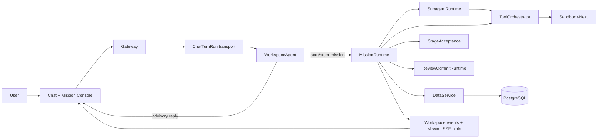

# Wenjin Current Architecture

> Status: Current source of truth
> Updated: 2026-07-11

Wenjin is a chat-native academic workbench. A single `WorkspaceAgent` owns each user conversation and long research goals are executed as durable `MissionRun`s. The runtime gives the model freedom inside pinned policy, tool, quality, review, budget, and sandbox boundaries.

## 1. System shape

There is no separate conversational router and research leader. `WorkspaceAgent` handles chat, intent, mission creation, mission steering, and strict structured mission-loop actions. `SubagentRuntime` supplies isolated, bounded workers when parallel or specialist work is useful.

## 2. Authoritative boundaries

| Boundary | Owns | Does not own |
|---|---|---|
| `WorkspaceAgent` | conversation, intent, strict action frames, mission start/steer | durable mission state or direct room writes |
| `MissionRuntime` | bounded drive slices, commands, stages, leases, wakeups, billing lifecycle | database transactions or UI projection |
| `SubagentRuntime` | isolated worker jobs, tool-scoped context, structured reports | mission lifecycle or acceptance decisions |
| `ToolOrchestrator` | frozen registry, policy resolution, idempotent operations, receipts, error taxonomy | tool-specific business logic |
| `StageAcceptance` | deterministic stage contracts and pass/revise decisions | free-form model grading without evidence |
| `ReviewCommitRuntime` | review decisions, conflict checks, atomic materialization, commit receipts | silent mutation of protected workspace truth |
| `PermissionRuntime` | durable approval/pause requests and resolution | generic sandbox confirmation for every operation |
| `Sandbox vNext` | typed isolated compute and file operations, manifests, read-before-write | host shell access or unbounded output |
| `DataService` | persistence and transaction authority | agent planning or UI state |
| `MissionView` | user-facing projection of mission state | a second client-side workflow state machine |

## 3. Chat and mission lifecycle

`ChatTurnRun` is a transport lifecycle for streaming one conversational turn. It is not the durable research aggregate and is not shown as research history. Conversation messages and blocks are persisted in the conversation domain; transient turn coordination lives under `backend/src/runtime/chat_turns/`.

A mission is created only when the `WorkspaceAgent` emits a valid structured start action with a workspace-scoped idempotency key. At creation time the runtime pins:

- `MissionPolicy` id and content hash;
- resolved `StageAcceptanceContract`s and completion target;
- verified model profile and probe hash;
- exact tool ids, permissions, network profiles, and known capability gaps;
- review mode, reasoning effort, budget estimate, and initial intake.

Each worker invocation drives a bounded `MissionDriveSlice`. It claims a fenced lease, consumes ordered commands, advances the agent loop, invokes tools or subagents, evaluates stage acceptance, emits review candidates, checkpoints state, and either completes or schedules a wakeup. A slice never owns an unbounded in-process research session.

Mission statuses are `created`, `planning`, `running`, `waiting`, `completed`, `failed`, and `cancelled`. `waiting` is durable and may represent user input, permission, review, budget, or an external prerequisite. Terminal missions have no active lease or wakeup.

## 4. Mission persistence

Mission persistence is deliberately four-table:

| Table | Purpose |
|---|---|
| `mission_runs` | one lifecycle aggregate, bounded snapshot, pinned runtime context, counters, command cursor, wakeup, lease, version |
| `mission_items` | append-only ordered semantic ledger for commands, stages, agents, tools, evidence, artifacts, quality, pauses, and events |
| `mission_review_items` | atomic previews and user decisions for proposed mutations |
| `mission_commits` | idempotent materialization attempts and receipts |

`mission_runs.state_version` protects optimistic updates. `lease_owner`, `lease_epoch`, and `lease_expires_at` fence worker effects. `last_item_seq` orders the ledger; `last_command_seq` and `last_applied_command_seq` provide exactly-once command consumption at the aggregate boundary. Redis/Celery messages are hints only; a stale hint cannot make an undelayed waiting mission claimable.

Linked domains use `mission_id`, `mission_item_seq`, `mission_review_item_id`, and `mission_commit_id` provenance. Historical development data was intentionally dropped/reseeded during migrations 086-096 rather than translated through runtime shims.

## 5. Mission catalog and quality

The runtime catalog has two DataService tables:

- `mission_policies`: workspace-scoped goal, completion, stage, tool-group, review, and budget policy snapshots;
- `worker_skills`: reusable worker guidance, examples, constraints, and suggested tool scope.

There is no runtime CRUD surface for assembling fixed workflows. Skills guide worker behavior; they do not create another orchestrator. A policy states what a mission must achieve and which boundaries apply. The `WorkspaceAgent` and its loop decide how to reach that outcome.

`StageAcceptanceContract` is the quality boundary. Each stage defines minimum and excellent criteria, required artifacts/evidence, model effort, iteration budget, blockers, and allowed transitions. `StageGuard` rejects continue, tool, subagent, and review actions before prerequisites pass. Assessment evidence is reconstructed from typed receipts, artifacts are matched to persisted review manifests, and reviewer verdicts must come from completed isolated reviewer jobs. The WorkspaceAgent may propose criterion judgments but cannot self-certify evidence or review.

## 6. Tools and search

`backend/src/tools/orchestrator/` owns the canonical `ToolCatalog`. Production composition builds all registrations, validates policy tool groups, and freezes the catalog before worker startup. Tool operations have stable ids, caller identity, lease fencing, side-effect class, policy decision, started/completed receipts, bounded payloads, and typed failure states. Atomic operation claim and terminal receipts are immutable `MissionItem` entries under the MissionRun row lock; there is no separate operation table or retry SSOT.

Canonical mission groups currently include:

- `model_native_web_search`;
- `workspace_read`;
- `source_import`;
- `source_code_read`;
- `sandbox_compute`;
- `artifact_render`;
- `academic_visual_render`;
- the port-backed `draft_stage` review candidate operation.

Main generation uses the GPT-5.6 Sol/Terra/Luna family through Chat Completions. Native search is a separate Responses SSE tool transport, not a second general generation protocol. Search is available only when a current probe proves a completed `web_search_call`, source receipts, URL citations, and the accepted completion boundary. A policy requiring search fails closed when those receipts cannot be verified.

## 7. Model profile

The current language-model baseline is `gpt-5.6-sol`, `gpt-5.6-terra`, and `gpt-5.6-luna`, with Terra as the catalog default. A Mission pins the user-selected model across its loop, subagents, and review. Supported reasoning effort values are `low`, `medium`, `high`, and `xhigh`; the deployment default is `xhigh`. Requests disable provider response storage.

The image-generation catalog contains `gpt-image-2` only. It uses the standard OpenAI Images API; no legacy image model or transparent-background fallback is enabled.

`academic_visual.render_candidate` is the single visual entry point. It routes evidence charts and structured diagrams to the digest-pinned Docker Sandbox, explanatory illustrations to `gpt-image-2`, and exact-label illustrations to a deterministic overlay. Candidate bytes enter the transient Mission preview store and become a `WorkspaceAsset` only through review and commit.

Static `supports_*` flags are not trusted. `model_catalog_entries` stores `generation_api`, a versioned `ModelCapabilityProfile`, probe evidence/hash, and observation time. Endpoint, model, API, or probe hash drift makes the profile stale. Strict structured tool calls and clean generation streaming are release requirements.

## 8. Review, permission, and commit

Review modes are `review_all`, `balanced_default`, and `auto_draft`. They change which proposed writes require explicit confirmation; they never let evidence, citation, claim, memory, or protected document truth bypass policy.

Review candidates are atomic and previewable. Users may accept, reject, request more evidence, or commit accepted subsets. `ReviewCommitRuntime` verifies ownership, decision state, base revision/hash, and idempotency before materialization. A commit records per-item outcomes, allowing partial save without pretending the whole mission succeeded.

Permissions are durable mission pauses. Approval applies to a specific request and operation; sandboxed low-risk work is not interrupted by generic confirmation prompts. Resume appends an ordered user command and schedules the mission again.

## 9. Sandbox vNext

Mission compute uses the typed Docker sandbox runtime. Production requires a pinned image digest. Operations compile to argv-first commands with explicit cwd, environment keys, timeout, network profile, and policy version. Host shell access, symlink escapes, protected files, and arbitrary network access fail closed.

Mutation uses read-before-write preconditions and emits hashes/diffs. Environments are content-addressed. Network profiles are narrow (`none`, provider-native search outside the container, or package-index access for approved dependency installation). Outputs are bounded and large payloads become references. Execution, reproducibility, dataset, artifact, command-audit, file-change, and failure receipts enter the mission ledger.

## 10. API, events, and frontend

Gateway Mission APIs are:

- `GET /api/missions/{mission_id}`;
- `GET /api/workspaces/{workspace_id}/missions`;
- `GET /api/missions/{mission_id}/items`;
- `GET /api/workspaces/{workspace_id}/missions/events`;
- `POST /api/missions/{mission_id}/actions`;
- `POST /api/missions/{mission_id}/review-decisions`;
- `POST /api/missions/{mission_id}/commits`;
- `POST /api/missions/{mission_id}/permissions/{request_id}/resolve`.

Workspace events notify clients that mission state changed. Mission SSE supports `Last-Event-ID`; events are invalidation hints, so a sequence gap triggers canonical refetch rather than client-side reconstruction.

The right panel is a normally closed Mission Console. It peeks when a mission starts and expands on demand. `MissionView` is the only task projection and combines current stage, progress, dynamic workers, evidence, artifacts, review items, commit state, and lazy trace. Run History lists `MissionRun`s only. Chat remains the navigation and steering surface.

## 11. Deployment topology

- Gateway handles HTTP, chat streams, Mission APIs, and SSE.
- DataService is the only runtime database transaction boundary.
- `worker` consumes `default,priority` for chat and short jobs.
- `mission-worker` consumes `long_running` with concurrency 1 and prefetch 1 for durable slices.
- `celery-beat` is the single periodic scheduler and publishes Mission reconciliation hints every 15 seconds.
- `memory-worker` consumes `memory`.
- PostgreSQL stores durable truth; Redis backs Celery and event hints.

The runtime can recover after process loss because leases expire, commands and items are durable, and the reconciler republishes due missions. In-memory UI state and queue delivery are never authoritative.

## 12. Invariants

1. Every long research task has exactly one durable `MissionRun`.
2. A mission is mutated only under a current fenced lease or through a transactional user command/review API.
3. Policy, stage contracts, model profile, and tool permissions are pinned at mission start.
4. Tool side effects require a registered tool, policy approval, operation id, lease fence, and receipt.
5. Protected workspace truth changes only through review and commit.
6. Stage completion requires deterministic acceptance evidence.
7. Redis and SSE are hints; DataService remains authoritative.
8. The frontend never reconstructs a second workflow state machine.
9. Search claims require verifiable native-search receipts and citations.
10. Removed development architecture is not reintroduced through aliases, fallback routers, serializers, or dual writes.

## 13. Key code

| Area | Entry point |
|---|---|
| Workspace agent | `backend/src/agents/workspace_agent/agent.py` |
| Mission loop actions | `backend/src/agents/workspace_agent/mission_loop.py` |
| Mission runtime | `backend/src/mission_runtime/runtime.py` |
| Production composition | `backend/src/mission_runtime/composition.py` |
| Subagents | `backend/src/subagent_runtime/runtime.py` |
| Tool catalog/orchestrator | `backend/src/tools/orchestrator/`, `backend/src/tools/mission/catalog.py` |
| Policies and stages | `backend/src/contracts/mission_policy.py`, `backend/src/contracts/stage_acceptance.py` |
| Mission store | `backend/src/dataservice/domains/mission/` |
| Review and permissions | `backend/src/review_commit_runtime/`, `backend/src/permission_runtime/` |
| Sandbox | `backend/src/sandbox/` |
| Gateway API | `backend/src/gateway/routers/missions.py` |
| Frontend projection | `frontend/lib/api/missions.ts` |
| Mission Console | `frontend/app/(workbench)/workspaces/[id]/components/mission-console/` |

## 14. Migration record

- `086_mission_runtime_cutover`: creates the four Mission tables and drops the retired run stores.
- `087_model_capability_profile`: replaces model feature flags with probe-backed profiles.
- `088_mission_linked_domains`: moves credit, task, source, Prism, sandbox, memory, and provenance links to Mission ids; removes retired review/runtime tables.
- `089_mission_policy_catalog`: creates the two-table catalog and drops the fixed-workflow catalogs.
- `090_auxiliary_task_cleanup`: removes remaining feature-action fields from auxiliary tasks.
- `091_review_commit_consistency`: persists review-policy projection and fences applying commit attempts with expiry tokens.
- `092_mission_runtime_reliability`: adds dispatch fencing and scheduler indexes while retaining operation receipts in the MissionItem ledger.
- `093_mission_billing_cutover`: moves Mission billing provenance to the canonical aggregate.
- `094_workspace_override_cleanup`: removes the final development workspace override path.
- `095_database_physical_integrity`: completes foreign-key index coverage and removes redundant indexes.
- `096_mission_aggregate_references`: enforces same-Mission item, review, and commit references with composite foreign keys.
- `096_mission_aggregate_references`: enforces cross-row ownership inside the four-table Mission aggregate.

These migrations are intentionally irreversible in development. Recovery is drop/reseed, not compatibility code.
