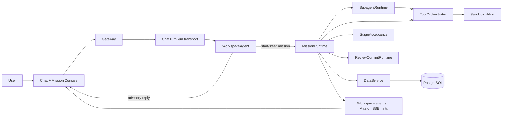

# Wenjin Current Architecture

> Status: Current source of truth
> Updated: 2026-07-17

Wenjin is a chat-native academic workbench. A single `WorkspaceAgent` owns each user conversation and long research goals are executed as durable `MissionRun`s. The runtime gives the model freedom inside pinned policy, tool, quality, review, budget, and sandbox boundaries.

## 1. System shape

There is no separate conversational router and research leader. `WorkspaceAgent` handles chat, intent, mission creation, mission steering, and strict structured mission-loop actions. `SubagentRuntime` supplies isolated, bounded workers when parallel or specialist work is useful.

## 2. Authoritative boundaries

| Boundary | Owns | Does not own |
|---|---|---|
| `WorkspaceAgent` | conversation, intent, strict action frames, mission start/steer | durable mission state or direct room writes |
| `MissionInput` | validate thread-local attachment paths, extract bounded text, seal immutable inputs, project verified excerpts | workspace documents, user-review state, or arbitrary client paths |
| `MissionRuntime` | bounded drive slices, commands, stages, leases, wakeups, Mission credit lifecycle | database transactions or UI projection |
| `SubagentRuntime` | isolated worker jobs, tool-scoped context, structured reports | mission lifecycle or acceptance decisions |
| `ToolOrchestrator` | frozen registry, policy resolution, idempotent operations, receipts, error taxonomy | tool-specific business logic |
| `StageAcceptance` | deterministic stage contracts and pass/revise decisions | free-form model grading without evidence |
| `ReviewCommitRuntime` | review decisions, conflict checks, atomic materialization, commit receipts | silent mutation of protected workspace truth |
| `PermissionRuntime` | durable approval/pause requests and resolution | generic sandbox confirmation for every operation |
| `Sandbox vNext` | typed isolated compute and file operations, manifests, read-before-write | host shell access or unbounded output |
| `DataService` | persistence and transaction authority | agent planning or UI state |
| `MissionView` | user-facing projection of mission state | a second client-side workflow state machine |

## 3. Chat and mission lifecycle

`ChatTurnRun` is a transport lifecycle for streaming one conversational turn. It is not the durable research aggregate and is not shown as research history. Every ChatTurn route is thread-bound under `/api/threads/{thread_id}/runs`; there is no parallel global-run API. Admission deduplicates the actor-bound request key and canonical payload fingerprint before applying multitask interruption or publishing a worker task, so an HTTP retry cannot execute the same user action twice. Conversation messages and blocks are persisted in the conversation domain; transient turn coordination lives under `backend/src/runtime/chat_turns/`.

Chat transport durability is intentionally Redis-scoped rather than a fifth database run model. Admission atomically persists the run, actor-global request index, canonical fingerprint, dispatch payload, and a due dispatch intent before any broker publication. The gateway and a single Celery-beat reconciler may publish that intent at least once with the deterministic run id as the task id; a worker claim clears the intent. Publication uncertainty therefore stays pending and recoverable instead of being mislabeled as an application failure. Worker execution uses an owner-bound renewable lease, and every terminal status, thread bind, billing cleanup, and end-of-stream effect is fenced by that owner. Confirmed lease loss stops the old provider task; temporary Redis unavailability triggers bounded Celery retry. Terminal hashes, request indexes, and streams use bounded TTLs, while dispatch indexes are amortized-pruned. No request-scoped sleeper task owns cleanup, and gateway hydration never mutates an active worker lifecycle.

Chat finance is durable but is not another run model. The browser creates one required `request_id` per user action and preserves it across SSE reconnects; the server binds it to the authenticated actor before deriving the `thread_turn_billings` idempotency key. A transient run id or random server fallback is never a financial identity. DataService atomically appends the user message and freezes free-token/credit capacity before provider work, then atomically appends the assistant message, exact non-zero usage, capped settlement transaction, and terminal billing state. Failure or cancellation releases the hold; if both authorization responses are lost, the handler compensates by the same idempotency key after serializing on the user row. An explicit pre-Mission interruption may also delete only the exact trailing user message. Expired authorizations cannot be settled and are reconciled by Celery beat. Replaying a settled idempotency key returns the stored assistant without another model call or charge. Deleting a thread releases every active authorization in the same transaction, while settled/released billing rows remain as financial audit truth through a deliberate soft thread reference. Periodic grants and turn settlement both lock the canonical user balance row. Generic Gateway message append is not a production API.

Canonical conversation messages are durable history and are never bulk-deleted or rebuilt. Attachment task metadata is patched atomically under the thread lock, so background preprocessing cannot overwrite a concurrently authorized turn or invalidate billing message anchors. Long research context is checkpointed by MissionRuntime rather than by rewriting Chat history.

Readable thread attachments enter the agent through one `MissionInput` path. The server validates the canonical `/mnt/user-data` path against the authenticated thread root, extracts PDF/preprocessed Markdown/plain text under hard limits, and seals the normalized text as `mission-input:<sha256>`. Conversation metadata stores the immutable manifest and a bounded context projection, never an injected pseudo-message or a client-trusted local path. A pending attachment may be promoted on a later turn after background preprocessing succeeds. A Mission pins only refs selected by WorkspaceAgent, and every Mission/subagent read rechecks workspace, thread, content hash, and object size through `workspace.read_input`.

A mission is created only when the `WorkspaceAgent` emits a valid structured start intent. The provider-visible schema contains only model-owned fields: a concise user-facing title, the complete objective, policy choice, initial parameters, and selected Mission input refs. The title is a navigation label rather than a truncated copy of the objective. Workspace, thread, user, model, capability, review mode, runtime, and idempotency identity are injected from authenticated server context after validation and are never accepted back from the provider. At creation time the runtime pins:

- `MissionPolicy` id and content hash;
- resolved `StageAcceptanceContract`s and one completion target that binds required stage families to accepted terminal output kinds;
- verified model profile and probe hash;
- exact tool ids, permissions, network profiles, and known capability gaps;
- user-selected review mode, reasoning effort, budget estimate, initial intake, and exact Mission input manifests.
- one policy-pinned cumulative execution budget for model calls, tool claims, subagent jobs, and the post-response token stop threshold.

Each worker invocation drives a bounded `MissionDriveSlice`. It claims a fenced lease, consumes ordered commands, advances the agent loop, invokes tools or subagents, evaluates stage acceptance, emits review candidates, checkpoints state, and either completes or schedules a wakeup. Production permits one main-agent model decision per durable slice, with a 145-second provider timeout plus a 15-second accounting/closure margin and provider-internal retries disabled; the durable scheduler owns retries. Ordinary planning and tool work retains a 180-second wall clock. An in-process subagent batch receives one runtime-owned 900-second operation window, capped relative to the original delivery start; a job cannot extend that deadline. The Celery soft/hard limits contain the combined planning and subagent window. Repeated transient model failures are capped and terminate with `model_service_unavailable` while preserving partial work. A slice never owns an unbounded in-process research session.

Dynamic tasks such as mathematical-modeling questions use server-owned stage cardinality. The quality action for the prerequisite understanding stage declares each policy-defined `quality_item_counts` source, and MissionRuntime validates the known source, range, projected prerequisite receipts, and absence of per-item work before atomically persisting both the stage pass and the count. A pass cannot become visible without every workload it unlocks, and `continue` cannot mutate cardinality. The client cannot supply or change these counts. Every all-item prerequisite declares its count source explicitly through `all_item_source_context_key`; runtime code never scans templates to guess it. Completion expands every per-item stage family from the pinned cardinality, requires every expanded stage to pass, and requires accepted terminal artifacts of the selected completion target to have a current user-visible confirmation candidate.

Mission statuses are `created`, `planning`, `running`, `waiting`, `completed`, `failed`, and `cancelled`. `waiting` is durable and may represent user input, permission, an in-loop review checkpoint, budget, or an external prerequisite. Final user confirmation is a separate review axis: once every required stage passes and terminal candidates are exposed, MissionRuntime deterministically completes execution even if the model proposes waiting for that confirmation. Terminal missions have no active lease or wakeup.

A provenance-linked child Mission is a strict continuation. When a thread has no foreground Mission, `ThreadTurnHandler` resolves one bounded continuation target: a valid Mission id explicitly referenced in the current message takes precedence, otherwise the latest terminal Mission is used. Invalid or ambiguous explicit targets never fall back silently. An explicit continuation must return that exact parent id; an explicit new task returns no parent. The server rejects any model-authored parent that does not match the resolved target. The parent must be terminal, and workspace, thread, user, workspace type, MissionPolicy id, and pinned policy content hash must match.

MissionRuntime copies only stage receipts whose result is `pass`, the server-owned dynamic stage cardinality established by those receipts, and a bounded canonical lineage of the exact inputs and outputs used by passed work. That lineage may include sealed `mission-input:` refs, accepted internal `artifact-candidate:` refs, verified `sandbox-artifact:` refs, workspace assets/documents, and the latest committed target for a stable `output_key`. It never inherits leases, failures, pending review state, rejected or unaccepted candidates, superseded committed outputs, or raw conversational context.

Review feedback follows the same immutable boundary. During a non-terminal Mission it becomes one durable `review_feedback` command. After terminal completion, `needs_more_evidence`, explicit regeneration, or a stale-target commit starts an idempotent child Mission. The server resolves the exact source stage from the reviewed MissionItem, invalidates that stage and its transitive dependency closure, and inherits only unaffected passed stages. Missing source lineage fails closed; it never guesses by replaying every stage. Review/commit responses return the child Mission id, and the frontend immediately follows that canonical MissionView.

## 4. Mission persistence

Mission persistence is deliberately four-table:

| Table | Purpose |
|---|---|
| `mission_runs` | one lifecycle aggregate, bounded snapshot, pinned runtime context, counters, command cursor, wakeup, lease, version |
| `mission_items` | append-only ordered semantic ledger for commands, stages, agents, tools, evidence, artifacts, quality, pauses, and events |
| `mission_review_items` | atomic previews and user decisions for proposed mutations |
| `mission_commits` | idempotent materialization attempts and receipts |

`mission_runs.state_version` protects optimistic updates. `lease_owner`, `lease_epoch`, and `lease_expires_at` fence worker effects. `last_item_seq` orders the ledger; `last_command_seq` and `last_applied_command_seq` provide exactly-once command consumption at the aggregate boundary. Redis/Celery messages are hints only; a stale hint cannot make an undelayed waiting mission claimable.

`mission_runs.snapshot_json.resource_usage` is a DataService-owned O(1) projection derived only while appending immutable `model_call_started`, `operation_claim`, `subagent_spawned`, and `usage_receipt` facts under the Mission row lock. Agent/runtime snapshots may neither replace nor decrement it. Model/tool/subagent dispatch stops before a count ceiling is crossed. A provider response that reaches or crosses `stop_after_total_tokens` is still recorded exactly, after which no further dispatch is allowed; audit and terminal items remain writable so the Mission can stop durably.

Every `model_call_started` must converge to exactly one immutable terminal fact with the same full call binding: either an exact non-zero `usage_receipt`, or `model_call_terminal` with `failed`, `cancelled`, or `unresolved`. Producers may use `failed` or `cancelled` only when they can prove that provider usage was not incurred; an ambiguous transport, cancellation, malformed metering response, or recovered open call is `unresolved`. DataService projects these pairs from MissionItems and rejects divergent or second terminals. Open or unresolved calls block further dispatch, stage advancement, waiting transitions, and voluntary lease release; an open call also blocks a terminal Mission transition.

Recovery closes an orphaned open call as `unresolved` before any new provider dispatch, then fails the Mission into explicit usage reconciliation. Terminal settlement charges exact receipts even when the Mission failed. If any call is unresolved, settlement emits `billing_reconciliation_required`, keeps the credit reservation and hold live without expiry, and never writes `billing_settled` or silently assumes zero usage. This lifecycle remains inside the four-table Mission aggregate; there is no model-call table.

`MissionStore` is one transaction facade composed from focused core, lifecycle, execution, review, and query modules. The split is an internal ownership boundary, not five stores or five units of work.

Model decisions are strict structured actions. A schema-invalid action receives one budget-counted repair attempt inside the same bounded drive slice. Repeated violations become a durable, recoverable Mission event and schedule another structured-decision repair; prose parsing and compatibility fallbacks are forbidden.

Sequential tool workflows stay with WorkspaceAgent: it issues durable tool or Sandbox operations across Mission slices, inspects their receipts, and revises the next action. The frozen tool policy exposes each operation's exact timeout/retry budget to MissionRuntime. Short tools may execute in the same slice after planning; long tools are first persisted as in-flight work and then resumed only when the current slice contains their full safe execution window. In-process subagents are bounded collaborators for independent parallel analysis and optional diagnosis; they are not an extra relay layer around a sequential Sandbox workflow, and an equivalent timed-out delegation is not retried under a new display name. Subagents inherit the Mission's pinned model and reasoning effort. Their `selected_refs` use one prefix-routed canonical read path: `mission-input:` resolves through the immutable attachment reader, `prism-file:` through the document reader, `artifact-candidate:` through the immutable candidate reader, and `sandbox-artifact:` through the verified Sandbox object reader. Mission input hydration has its own budget and never consumes the worker's exploratory tool-step allowance; the last bounded model turn is reserved for synthesis. A receipt-bearing model call is admitted only when the active subagent operation window contains its full provider timeout and accounting margin, so a deadline boundary cannot create an unresolved usage ledger entry. A worker checks the parent deadline again after every model result and never starts another tool once that deadline has passed. Workers may publish a bounded `finding`, `formula`, `file`, `figure`, or `checkpoint` milestone only after a concrete checkable result exists. These milestones and tool receipts are durable semantic progress, never hidden reasoning, plans, or filler. A verified `artifact-candidate:` may also be a provenance source for a downstream candidate, preserving the accepted inter-stage derivation chain without materializing intermediate files. Within the bounded parent context, an identical read of an immutable input, asset, candidate, or sealed Sandbox object reuses the existing result rather than spending another tool operation. User-review items never become agent input. Unknown or transient refs are not guessed into another tool. `mission_input_inventory` is authoritative for current uploads; persistent workspace asset/document listings are separate namespaces and cannot be used to infer that a Mission upload is missing.

A continuation Mission inherits passed stage receipts plus the bounded canonical lineage actually required to continue accepted work without materializing intermediate files. Accepted internal candidates and verified Sandbox artifacts remain immutable refs; committed outputs resolve through the same `output_key` to the latest committed workspace target. Parent review queues, preview decisions, and unrelated draft candidates never become child runtime state.

Linked domains use `mission_id`, `mission_item_seq`, `mission_review_item_id`, and `mission_commit_id` provenance. Historical development data was intentionally dropped/reseeded during migrations 086-108 rather than translated through runtime shims.

DataService writes user-facing semantic projections at the same transaction boundary as their cause. Finishing a tool operation atomically appends its immutable terminal receipt plus typed `evidence` and `artifact` items; counters are derived from those appended items. A retry either observes the complete projection or none of it and cannot duplicate references. The frontend never scans operation payloads to reconstruct evidence or artifacts.

## 5. Mission catalog and quality

The runtime catalog has two DataService tables:

- `mission_policies`: workspace-scoped goal, completion, stage, tool-group, review, and budget policy snapshots;
- `worker_skills`: reusable worker guidance, examples, constraints, and suggested tool scope.

There is no runtime CRUD surface for assembling fixed workflows. Skills guide worker behavior; they do not create another orchestrator. A policy states what a mission must achieve and which boundaries apply. The `WorkspaceAgent` and its loop decide how to reach that outcome.

Model-usage pricing treats cached-input and reasoning counters as subsets of input and output, so detail rates replace rather than double-count their parent rates. Chat authorization uses the same pricing function to quote a bounded maximum hold; settlement records the uncapped calculation for audit but can never deduct more than the amount authorized under the user-row lock. Mission admission freezes the exact Mission, model, and global pricing policy ids, versions, and validated configs into its immutable admission receipt and credit reservation. Terminal settlement uses only that snapshot, so an admin policy edit cannot reprice or strand in-flight work.

`StageAcceptanceContract` is the quality boundary. Each stage defines minimum and excellent criteria, required artifacts/evidence, model effort, iteration budget, blockers, and allowed transitions. `StageGuard` rejects downstream work before prerequisites pass. The WorkspaceAgent first freezes its best complete result as an internal content-addressed artifact candidate, then proposes criterion judgments against exact candidate and evidence refs. Every decision receives a bounded, server-derived `quality_reference_inventory`; those authoritative ids are also injected as dynamic enums into the strict provider schema, so the model judges content without manually reconstructing identity hashes. An invented, stale, or mismatched quality ref is rejected before it can consume a stage revision attempt. StageAcceptance then reconstructs candidates and evidence from verified Mission receipts, requires every candidate to belong to the current stage, and rejects changed bodies, hashes, unsupported refs, or missing surfaces. The model cannot self-certify evidence or artifact identity.

Quality is built into the main generation loop: `revise` returns concrete missing criteria and a bounded repair action, after which the agent must produce a new complete candidate before reassessment. A `quality-critic` worker is available only when the user explicitly asks to audit an existing output; ordinary uncertainty must be resolved by the main loop through evidence, computation, and revision. Its findings are diagnostic and have no stage authority. Only after `pass` may MissionRuntime expose the exact accepted final candidate as a `MissionReviewItem`; this is user control over a protected write, not another content grader. Creating that preview is sufficient for Mission completion: the user's later accept, reject, request-more-evidence, and commit decisions remain an independent axis and never hold the generation loop open. Intermediate stage candidates are not exposed unless the user explicitly requested a checkpoint.

## 6. Tools and search

`backend/src/tools/orchestrator/` owns the canonical `ToolCatalog`. Production composition builds all registrations, validates policy tool groups, and freezes the catalog before worker startup. Tool operations have stable ids, caller identity, lease fencing, side-effect class, policy decision, claim/terminal receipts, bounded payloads, typed failure states, and typed semantic references. Same-lease concurrent read operations re-read the scalar fence after a state-version conflict instead of invalidating one another. Atomic operation claims, terminal receipts, and their evidence/artifact projection are immutable `MissionItem` entries under the MissionRun row lock; there is no separate operation table, duplicate tool-event ledger, or retry SSOT.

Canonical mission groups currently include:

- `model_native_web_search`;
- `workspace_read`;
- `artifact_candidate_read`;
- `source_import`;
- `source_code_read`;
- `sandbox_compute` for execution and registration;
- `sandbox_read` for bounded reads of verified Sandbox outputs;
- `artifact_render`;
- `academic_visual_render`;
- the port-backed `draft_stage` review candidate operation.

Main generation uses the GPT-5.6 Sol/Terra/Luna family through Chat Completions. Native search is a separate Responses SSE tool transport, not a second general generation protocol. The explicit model probe verifies both transports and reconstructs provider receipts only from completed SSE output items before the final `response.completed` boundary. Search is available only when the resulting hash-bound evidence proves a completed `web_search_call`, source receipts, and URL citations. A policy requiring search fails closed when those receipts cannot be verified.

## 7. Model profile

The current language-model baseline is `gpt-5.6-sol`, `gpt-5.6-terra`, and `gpt-5.6-luna`, with Terra as the catalog default. A Mission pins the user-selected model across its loop, subagents, and review. Supported reasoning effort values are `low`, `medium`, `high`, and `xhigh`; the deployment default is `xhigh`. Requests disable provider response storage.

The image-generation catalog contains `gpt-image-2` only. It uses the standard OpenAI Images API; no legacy image model or transparent-background fallback is enabled.

`academic_visual.render_candidate` is the single visual entry point. It routes evidence charts and structured diagrams to the digest-pinned Docker Sandbox, explanatory illustrations to `gpt-image-2`, and exact-label illustrations to a deterministic overlay. Candidate bytes enter the transient Mission preview store and become a `WorkspaceAsset` only through review and commit.

Static `supports_*` flags are not trusted. `model_catalog_entries` stores `generation_api`, a versioned `ModelCapabilityProfile`, probe evidence/hash, and observation time. Endpoint, model, API, or probe hash drift makes the profile stale. Strict structured tool calls and clean generation streaming are release requirements.

## 8. Review, permission, and commit

Review modes are `review_all`, `balanced_default`, and `auto_draft`. They are selected by the user at workspace/Mission level and injected server-side; the model cannot choose a stricter or looser mode when starting work. They change which proposed writes require explicit confirmation; they never let evidence, citation, claim, memory, or protected document truth bypass policy.

Generation quality is handled before this boundary by the Mission loop and StageAcceptance. Critic workers are optional diagnostics triggered only by an explicit user audit, not mandatory reviewers on every output. Review candidates are atomic, previewable write proposals created only for accepted deliverables that may change protected workspace truth. Users may inspect them when convenient, ask Chat to audit a suspicious section, accept, reject, request more evidence, or commit accepted subsets. `ReviewCommitRuntime` verifies ownership, decision state, base revision/hash, and idempotency before materialization. A commit records per-item outcomes, allowing partial save without pretending the whole mission succeeded.

Every protected target write carries one `MissionWriteAuthority(mission_id, mission_review_item_id, mission_commit_id, attempt_token)`. The target DataService transaction rechecks the applying commit lease, accepted review item, Mission ownership, workspace, token, and expiry before writing. Provenance strings and caller-supplied ids never substitute for this authority. The active Mission materialization surface is exactly Prism document/visual writes, Library Source import, and WorkspaceAsset creation; there are no dormant Memory, Room, or Sandbox materialization operations.

Permissions are durable mission pauses. Approval applies to a specific request and operation; sandboxed low-risk work is not interrupted by generic confirmation prompts. Resume appends an ordered user command and schedules the mission again.

## 9. Sandbox vNext

Mission compute uses the typed Docker sandbox runtime. Production requires a pinned image digest. Operations compile to argv-first commands with explicit cwd, environment keys, timeout, network profile, and policy version. Host shell access, symlink escapes, protected files, and arbitrary network access fail closed.

Mutation uses read-before-write preconditions and emits hashes/diffs. `sandbox.read_file` records the exact stable-path content hash as a verified Mission receipt; subsequent Python or notebook mutations resolve their script and output baselines server-side from those receipts, so models never copy write hashes. Registered datasets and verified derived files under `outputs` or `reports` enter later Python operations as distinct hash-bound read-only inputs; derived files are mounted over operation-local output staging as immutable file mounts, so a plotting step can consume prior results without weakening the writable-output boundary. When an operation produces a reviewable artifact, Sandbox seals its bytes under `control/artifact_objects/sbxobj_<sha256>.bin`; the receipt keeps the original public path only as provenance. `sandbox.read_artifact` resolves a verified `sandbox-artifact:` ledger ref and reads that immutable object, so replacing the public path cannot alter historical evidence. Agents repair the same semantic path after reading it; numbered/versioned escape paths are not a supported overwrite strategy. A non-zero user computation is a typed, model-recoverable `execution_failed` result: the same operation is not blindly retried, but the bounded stderr and current file receipt guide a revised operation. Infrastructure faults remain `internal_error`. Environments and artifact objects are content-addressed. Network profiles are narrow (`none`, provider-native search outside the container, or package-index access for approved dependency installation). Outputs are bounded and large payloads become references. Execution, reproducibility, dataset, artifact, command-audit, file-change, and failure receipts enter the mission ledger.

Docker is the only sandbox provider. It is a deployment invariant, not mutable workspace state; no `sandbox_provider` field exists in workspace settings.

## 10. API, events, and frontend

Gateway Mission APIs are:

- `GET /api/missions/{mission_id}`;
- `GET /api/workspaces/{workspace_id}/missions`;
- `GET /api/workspaces/{workspace_id}/missions/summary`;
- `GET /api/missions/{mission_id}/items`;
- `GET /api/missions/{mission_id}/evidence`;
- `GET /api/missions/{mission_id}/artifacts`;
- `GET /api/workspaces/{workspace_id}/missions/events`;
- `POST /api/missions/{mission_id}/actions`;
- `POST /api/missions/{mission_id}/review-decisions`;
- `POST /api/missions/{mission_id}/commits`;
- `POST /api/missions/{mission_id}/permissions/{request_id}/resolve`.

Workspace events notify clients that mission state changed. Mission SSE supports `Last-Event-ID`; its constant-size cursor contains only the indexed `(updated_at, mission_id)` watermark. Every event is an invalidation hint that triggers canonical MissionView refetch rather than client-side reconstruction. During long model, tool, and worker waits the execution owner renews the durable lease on the heartbeat interval; this advances the canonical projection without inventing synthetic research results. A transient heartbeat transport failure may be retried inside the still-safe slice window, but an observed owner/epoch change or expiry is terminal for that execution owner: its in-process operation is cancelled immediately and the next lease owner performs durable reconciliation.

The right panel is a normally closed Mission Console. It peeks when a mission starts and expands on demand. `MissionView` is the only task projection and combines a typed user-facing activity state, current operation and start time, heartbeat/last-progress timestamps, authoritative input counts, current stage, dynamic workers, evidence, artifacts, review items, commit state, and a structured recoverable failure summary. While a subagent batch is active, dynamic worker rows are projected from the latest durable progress receipt rather than waiting for the terminal batch snapshot. Long-operation heartbeats publish bounded invalidation hints every 30 seconds, so newly confirmed milestones and produced tool results become visible during execution. History and MissionView use a public lifecycle DTO that excludes snapshots, runtime context, leases, dispatch fields, idempotency keys, and user internals. Trace opens on the newest bounded page and pages backward; it returns semantic metadata only, while detail payloads remain server-side. Evidence pagination projects verified semantic receipts; artifact pagination projects only current stage-accepted review candidates, deduplicated by stable output or materialization destination. Internal candidate revisions remain trace-only. Recovery actions route through Chat so WorkspaceAgent remains the single navigation and continuation authority.

Chat `status_line` blocks carry a typed action (`start_mission`, `steer_mission`, `propose_review`, or `request_commit`). Only `start_mission` may trigger the Mission Console peek; prose and a shared Mission id are insufficient. Pending uploads disable send until the immutable attachment ref exists. Switching workspaces aborts the previous chat stream, and stale frames cannot mutate the newly active workspace.

Workspace activity is also Mission-only. Thread, auxiliary Celery task, and artifact events may invalidate their own surfaces, but they never inject synthetic activity rows; reconnect and live updates therefore converge on the same DataService Mission projection.

## 11. Deployment topology

- Gateway handles HTTP, chat streams, Mission APIs, and SSE.
- DataService is the only runtime database transaction boundary.
- `worker` consumes `default,priority` for chat, document preprocessing, and other short jobs.
- `mission-worker` consumes `long_running` with concurrency 1 and prefetch 1 for durable slices.
- `celery-beat` is the single periodic scheduler; it publishes Mission reconciliation hints every 15 seconds, reconciles due ChatTurn dispatch intents every 5 seconds, releases expired chat-turn authorizations every 60 seconds, and advances periodic credit grants in bounded idempotent pages.
- PostgreSQL stores durable truth; Redis backs Celery and event hints.

The runtime can recover after process loss because leases expire, commands and items are durable, and the reconciler republishes due missions. In-memory UI state and queue delivery are never authoritative.

## 12. Invariants

1. Every long research task has exactly one durable `MissionRun`.
2. A mission is mutated only under a current fenced lease or through a transactional user command/review API.
3. Policy, stage contracts, model profile, and tool permissions are pinned at mission start.
4. Tool side effects require a registered tool, policy approval, operation id, lease fence, and receipt.
5. Protected workspace truth changes only through review and commit.
6. Stage completion requires deterministic acceptance evidence.
7. Redis and SSE are hints; DataService remains authoritative.
8. The frontend never reconstructs a second workflow state machine.
9. Search claims require verifiable native-search receipts and citations.
10. Removed development architecture is not reintroduced through aliases, fallback routers, serializers, or dual writes.
11. Public Mission projections never expose internal snapshots, runtime context, leases, dispatch state, or raw item payloads.
12. Evidence/artifact counters and lists are produced by the same DataService transaction.
13. Provider-visible action schemas contain model intent only; authenticated identity and runtime authority are injected server-side.
14. Model retries are bounded at the durable Mission boundary and cannot create an infinite in-process or cross-slice retry loop.
15. User-review items can reference only exact candidate refs accepted for their stage; the agent never reads or grades the user-review queue.
16. Sandbox artifact receipts resolve to immutable content-addressed objects, never mutable public paths.
17. Uploaded research material enters Mission state only as a thread-bound, integrity-checked `mission-input:` manifest; injected upload markup and alternate attachment readers are forbidden.
18. Mission titles are concise navigation labels; full goals live only in the objective and are never truncated into a title.
19. Stage acceptance runs inside generation and auto-continues after pass; user review controls protected writes and does not grade or block completed generation.
20. Dynamic per-item cardinality is declared once by WorkspaceAgent after prerequisite understanding, validated and pinned by MissionRuntime, and never accepted from the client.
21. Mission completion is evaluated against one selected target: all expanded required stages pass and every required terminal output kind is backed by an accepted artifact exposed for user confirmation.
22. Mission resource usage is projected only by DataService from immutable accounting facts; callers cannot overwrite it through a snapshot.
23. A chat success requires a non-zero provider usage receipt, and settled credits never exceed the atomically authorized hold.

## 13. Key code

| Area | Entry point |
|---|---|
| Workspace agent | `backend/src/agents/workspace_agent/agent.py` |
| Mission inputs | `backend/src/contracts/mission_input.py`, `backend/src/services/mission_inputs.py` |
| Mission loop actions | `backend/src/agents/workspace_agent/mission_loop.py` |
| Mission runtime | `backend/src/mission_runtime/runtime.py` |
| Production composition | `backend/src/mission_runtime/composition.py` |
| Subagents | `backend/src/subagent_runtime/runtime.py` |
| Tool catalog/orchestrator | `backend/src/tools/orchestrator/`, `backend/src/tools/mission/catalog.py` |
| Policies and stages | `backend/src/contracts/mission_policy.py`, `backend/src/contracts/stage_acceptance.py` |
| Mission store | `backend/src/dataservice/domains/mission/` |
| Review and permissions | `backend/src/review_commit_runtime/`, `backend/src/permission_runtime/` |
| Sandbox | `backend/src/sandbox/` |
| Gateway API | `backend/src/gateway/routers/missions.py` |
| Frontend projection | `frontend/lib/api/missions.ts` |
| Mission Console | `frontend/app/(workbench)/workspaces/[id]/components/mission-console/` |

## 14. Migration record

- `086_mission_runtime_cutover`: creates the four Mission tables and drops the retired run stores.
- `087_model_capability_profile`: replaces model feature flags with probe-backed profiles.
- `088_mission_linked_domains`: moves credit, task, source, Prism, sandbox, memory, and provenance links to Mission ids; removes retired review/runtime tables.
- `089_mission_policy_catalog`: creates the two-table catalog and drops the fixed-workflow catalogs.
- `090_auxiliary_task_cleanup`: removes remaining feature-action fields from auxiliary tasks.
- `091_review_commit_consistency`: persists review-policy projection and fences applying commit attempts with expiry tokens.
- `092_mission_runtime_reliability`: adds dispatch fencing and scheduler indexes while retaining operation receipts in the MissionItem ledger.
- `093_mission_billing_cutover`: moves Mission billing provenance to the canonical aggregate.
- `094_workspace_override_cleanup`: removes the final development workspace override path.
- `095_database_physical_integrity`: completes foreign-key index coverage and removes redundant indexes.
- `096_mission_aggregate_references`: enforces cross-row ownership inside the four-table Mission aggregate.
- `097_workspace_sandbox_provider_cutover`: removes the obsolete workspace sandbox-provider column; Docker-only sandboxing is an architectural invariant.
- `098_mission_user_projection_index`: adds the single user/update ordering index used by the DataService-owned dashboard Mission aggregate and recent-task projection.
- `099_thread_skill_cutover`: removes obsolete thread-level skill selection; MissionPolicy and WorkerSkill remain the only research methodology catalogs.
- `100_review_output_key_cutover`: gives each semantic Mission output one stable review key; newer candidates supersede older candidates atomically and only the current candidate enters user projections.
- `101_workspace_reasoning_effort_cutover`: makes `low | medium | high | xhigh` the only persisted workspace reasoning preference and removes the obsolete binary thinking flag.
- `102_review_policy_projection_cutover`: removes persisted review-policy projection flags and derives them from review mode/risk; uniquely fences Mission-created workspace assets by their review source.
- `103_dataservice_concurrency_fences`: serializes workspace decision and memory mutations at the DataService transaction boundary and uniquely fences active partial decisions.
- `104_remove_dataservice_sandbox`: removes the obsolete persisted sandbox aggregate; Sandbox vNext keeps typed execution receipts and content-addressed artifacts under Mission ownership.
- `105_remove_latex_compile_history`: removes Gateway-owned LaTeX compilation history and the direct Docker/process execution stack.
- `106_remove_sandbox_pricing_policy`: removes standalone sandbox/refund billing surfaces and converges Mission reservations and public pricing on canonical DataService policy bindings.
- `107_runtime_accounting`: requires pinned Mission execution budgets, adds DataService-owned cumulative Mission resource accounting, and introduces atomic chat-turn financial authorization/settlement. It rejects non-empty development data and requires drop/reseed.
- `108_remove_workspace_discipline`: removes the unused workspace discipline field from persistence and public contracts.

These migrations are intentionally irreversible in development. Recovery is drop/reseed, not compatibility code.
