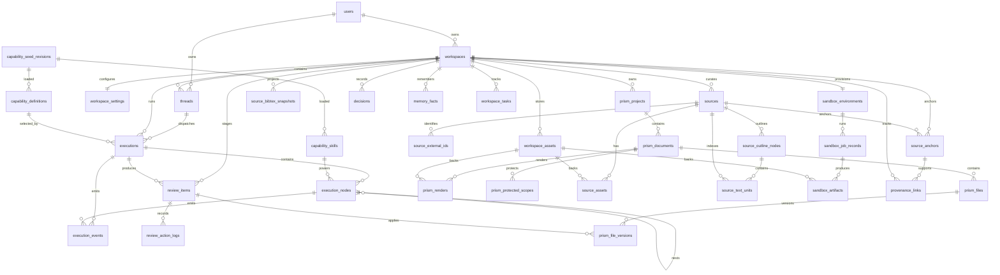

# DataService SSOT Model Design

**Date:** 2026-05-20
**Status:** Accepted implementation gate
**Owner:** Wenjin Super Agent Harness / DataService
**Scope:** Canonical database model, table ownership, migration disposition, architecture gates, and verification rules for the DataService convergence.

---

## 1. Purpose

DataService is the single source of truth for Wenjin business data. It owns canonical ORM models, Pydantic read/write contracts, repositories, Unit of Work transaction boundaries, migration discipline, and projection queries for the Super Agent Harness.

This is a one-time architecture convergence. It is not a compatibility facade around the existing model set. Existing duplicated tables are migrated into canonical tables, renamed to `_legacy_20260520` for one release when rollback safety is needed, and then removed. Runtime code must not read legacy tables after the cutover migration.

The design has four non-negotiable outcomes:

1. Each business fact has exactly one owner table.
2. All database writes go through DataService repositories inside a Unit of Work.
3. UI surfaces receive projections, not ORM rows.
4. Reviewable agent output enters the system through `review_items`, then commits into room, Prism, source, asset, or provenance tables.

---

## 2. DataService Boundary

### 2.1 Owned By DataService

DataService owns these model families:

| Family | Canonical purpose |
| --- | --- |
| Workspace Core | Workspace identity, settings, active thread binding, conversation thread membership. |
| Capability Catalog | Runtime-editable capability and skill definitions seeded from YAML and persisted in DB. |
| Execution Graph | Product execution lifecycle, graph nodes, ordered execution events, and compute traces. |
| Review Queue | Curated result cards, user acceptance/rejection, and commit audit trail. |
| Prism Universal Document | Workspace-owned document editor/previewer state, files, versions, renders, protected scopes. |
| Source Library | Literature, datasets, web sources, uploaded sources, extracted text units, BibTeX snapshots. |
| Workspace Assets | File/blob metadata for uploads, generated files, exports, previews, logs, datasets, figures. |
| Sandbox Runtime | Workspace sandbox environment, sandbox jobs, and sandbox-produced artifacts. |
| Provenance | Links from sources, sandbox outputs, executions, and review items into Prism/files/rooms. |
| Workspace Rooms | Decisions, memory facts, and workspace tasks. |

### 2.2 Not Owned In The First Milestone

The first milestone does not redesign authentication, billing, referrals, or admin audit. Those tables stay in their current domain until DataService has converged the Super Agent Harness core.

| Existing tables | Interim status |
| --- | --- |
| `users` | Keep current identity model. DataService may reference it by FK. |
| `credit_transactions`, `credit_grant_rules`, `credit_redeem_codes`, `credit_redemptions` | Keep billing domain unchanged. |
| `referrals` | Keep growth/referral domain unchanged. |
| `admin_logs`, `audit_logs` | Keep admin/security audit domain unchanged. DataService adds business review/action logs separately. |
| `user_knowledge` | Keep user-level knowledge unchanged until workspace memory and source convergence is complete. |

---

## 3. SSOT Rules

| Rule | Requirement |
| --- | --- |
| One business owner | A business concept has one canonical table. Other views are projections or caches with explicit rebuild paths. |
| No runtime fallback | After cutover, services cannot read old table names or old JSON shapes. If migration fails, deployment stops. |
| No dual-write | Cutover happens in a maintenance window. Code writes only canonical tables after migration. |
| Repository-only writes | Code outside `backend/src/dataservice/` cannot import ORM models or call `session.add`, `session.merge`, or `session.delete` for business data. |
| Unit of Work | Multi-table changes must use `DataServiceUnitOfWork`; repositories do not commit by themselves. |
| Review-first agent output | Lead/subagents stage user-visible mutations into `review_items`; commit service applies accepted items. |
| Projection-only UI | Frontend and API handlers consume Pydantic DTOs or dictionaries returned by DataService queries. |
| Asset indirection | Large content is stored through managed storage and represented by `workspace_assets`; DB keeps metadata and small inline text only. |
| Provenance required | Any accepted generated claim, citation, source-backed manuscript change, figure, table, or dataset has a `provenance_links` row when source context exists. |
| Explicit migration proof | Every migration batch records row counts, FK validation, checksum/hash checks where meaningful, and orphan handling. |

---

## 4. Canonical ERD



---

## 5. Canonical Table Families

### 5.1 Workspace Core

#### `workspaces`

Workspace identity only. Mutable preferences and arbitrary configuration move to `workspace_settings`.

| Column | Type | Required | Notes |
| --- | --- | --- | --- |
| `id` | uuid string | yes | Primary key. |
| `user_id` | uuid string | yes | FK to `users.id`; owner. |
| `name` | string(255) | yes | User-visible workspace name. |
| `workspace_type` | enum string | yes | `thesis`, `sci`, `proposal`, `software_copyright`, `patent`. Replaces ORM attribute `type` in DataService contracts. |
| `discipline` | string(100) | no | Academic or technical discipline. |
| `description` | text | no | User-visible description. |
| `active_thread_id` | uuid string | no | FK to `threads.id`; selected active chat thread only. Replaces current `thread_id`. |
| `created_at` | timestamptz | yes | Creation timestamp. |
| `updated_at` | timestamptz | yes | Last metadata update. |
| `archived_at` | timestamptz | no | Archive marker. |
| `deleted_at` | timestamptz | no | Soft delete marker. |

Indexes:

| Name | Columns | Purpose |
| --- | --- | --- |
| `ix_workspaces_user_updated` | `user_id`, `updated_at` | Workspace list. |
| `ix_workspaces_user_type` | `user_id`, `workspace_type` | Workspace type filter. |
| `ix_workspaces_active_thread` | `active_thread_id` | Active chat lookup. |

Migration notes:

- Copy `workspaces.type` to `workspaces.workspace_type`.
- Copy `workspaces.thread_id` to `workspaces.active_thread_id`.
- Move `workspaces.config` keys into `workspace_settings.settings_json`; keep unknown keys under `settings_json.legacy_import`.

#### `workspace_settings`

One row per workspace. All mutable configuration belongs here.

| Column | Type | Required | Notes |
| --- | --- | --- | --- |
| `workspace_id` | uuid string | yes | PK and FK to `workspaces.id`. |
| `default_model` | string(100) | no | Default LLM/model alias. |
| `thinking_enabled` | boolean | yes | Chat/lead thinking display control. |
| `sandbox_provider` | string(50) | yes | Default sandbox provider alias. |
| `auto_compact_threshold` | numeric | yes | Context compaction threshold. |
| `settings_json` | jsonb | yes | Workspace-level settings not promoted to typed columns. |
| `capability_overrides_json` | jsonb | yes | Runtime workspace-specific capability overrides. |
| `sandbox_policy_json` | jsonb | yes | Workspace sandbox limits/policy snapshot. |
| `created_at` | timestamptz | yes | Creation timestamp. |
| `updated_at` | timestamptz | yes | Last update. |

Migration notes:

- Rename current `capability_overrides` to `capability_overrides_json`.
- Merge current `metadata_json` and `workspaces.config` into `settings_json`.
- Initialize `sandbox_policy_json` from global defaults if no workspace override exists.

#### `threads`

Conversation thread membership. A workspace can have multiple threads; the active selection lives on `workspaces.active_thread_id`.

| Column | Type | Required | Notes |
| --- | --- | --- | --- |
| `id` | uuid string | yes | Primary key. |
| `user_id` | uuid string | yes | FK to `users.id`. |
| `workspace_id` | uuid string | no | FK to `workspaces.id`; null only for non-workspace chat. |
| `title` | string(255) | no | User-visible thread title. |
| `model` | string(100) | yes | Last/default model alias for this thread. |
| `skill` | string(100) | no | Legacy thread-level skill tag; retained as display metadata, not routing SSOT. |
| `message_count` | integer | yes | Non-negative. |
| `last_message_preview` | string(255) | no | Thread list preview. |
| `last_message_role` | string(32) | no | Last role. |
| `messages_json` | json/jsonb | yes | Ordered block/chat message storage until message blocks are split into a dedicated table. |
| `created_at` | timestamptz | yes | Creation timestamp. |
| `updated_at` | timestamptz | yes | Last message/update timestamp. |

Migration notes:

- Rename current ORM field `messages` to DataService DTO field `messages_json`; DB column may remain `messages` in the mechanical migration if renaming would create avoidable churn, but DataService contracts expose `messages_json`.
- Validate `workspaces.active_thread_id` always points to a thread with the same `workspace_id`.

### 5.2 Capability Catalog

#### `capability_seed_revisions`

Records every YAML seed load that changes the capability catalog.

| Column | Type | Required | Notes |
| --- | --- | --- | --- |
| `id` | uuid string | yes | Primary key. |
| `schema_version` | string(50) | yes | Seed manifest schema, e.g. `capability_seed.v1`. |
| `source_root` | string(500) | yes | Seed folder root. |
| `checksum` | string(128) | yes | Manifest checksum across loaded files. |
| `loaded_by` | string(100) | yes | Actor/process. |
| `loaded_at` | timestamptz | yes | Load timestamp. |
| `summary_json` | jsonb | yes | Counts, changed ids, removed ids. |

#### `capability_definitions`

Runtime-editable capability definition. This replaces the composite-PK `capabilities` table shape while preserving workspace-type scoping.

| Column | Type | Required | Notes |
| --- | --- | --- | --- |
| `id` | string(100) | yes | Capability id, stable across workspace types when semantics are shared. |
| `workspace_type` | string(50) | yes | Workspace type scope. Composite PK with `id`. |
| `schema_version` | string(50) | yes | `capability.v2`. |
| `enabled` | boolean | yes | Runtime availability. |
| `display_name` | string(200) | yes | UI name. |
| `description` | text | yes | User/admin description. |
| `intent_description` | text | yes | Chat Agent routing description. |
| `trigger_phrases_json` | jsonb | yes | Routing hints. |
| `required_decisions_json` | jsonb | yes | Decision dependencies. |
| `brief_schema_json` | jsonb | yes | Task brief validation schema. |
| `graph_template_json` | jsonb | yes | Lead graph template. |
| `runtime_json` | jsonb | yes | Runtime policy: sandbox, tool, model, concurrency. |
| `ui_meta_json` | jsonb | yes | UI labels, cards, room hints. |
| `dashboard_meta_json` | jsonb | yes | Admin/workbench display metadata. |
| `seed_revision_id` | uuid string | no | FK to `capability_seed_revisions.id`. |
| `notes` | text | no | Admin notes. |
| `created_at` | timestamptz | yes | Creation timestamp. |
| `updated_at` | timestamptz | yes | Last update. |

Constraints:

- PK: `id`, `workspace_type`.
- Active lookup index: `workspace_type`, `enabled`.
- `schema_version` must be `capability.v2` for new writes.

#### `capability_skills`

Reusable skill pack a Lead Agent node can load. This table remains catalog-level and is not workspace-owned.

| Column | Type | Required | Notes |
| --- | --- | --- | --- |
| `id` | string(100) | yes | Primary key. |
| `schema_version` | string(50) | yes | `capability_skill.v2`. |
| `enabled` | boolean | yes | Runtime availability. |
| `display_name` | string(200) | yes | UI/admin name. |
| `description` | text | yes | Human-readable scope. |
| `worker_type` | string(50) | yes | Super Agent worker kind. Replaces `subagent_type` in the external contract. |
| `prompt` | text | yes | Skill prompt/instruction payload. |
| `allowed_tools_json` | jsonb | yes | Tool allowlist. |
| `resources_json` | jsonb | yes | Required resources/corpus hints. |
| `skill_json` | jsonb | yes | Versioned structured config. Replaces untyped `config`. |
| `seed_revision_id` | uuid string | no | FK to `capability_seed_revisions.id`. |
| `created_at` | timestamptz | yes | Creation timestamp. |
| `updated_at` | timestamptz | yes | Last update. |

Migration notes:

- Copy `subagent_type` to `worker_type`.
- Copy `config` to `skill_json` and stamp `schema_version = capability_skill.v2`.
- Existing YAML seeds must be upgraded before the migration is applied.

### 5.3 Execution Graph

#### `executions`

Product execution SSOT. This table owns run lifecycle, capability dispatch, brief, graph, status, and final summary.

| Column | Type | Required | Notes |
| --- | --- | --- | --- |
| `id` | uuid string | yes | Primary key. |
| `user_id` | uuid string | yes | Owner. |
| `workspace_id` | uuid string | yes for workspace runs | FK to `workspaces.id`; nullable only for global/admin runs. |
| `thread_id` | uuid string | no | FK to `threads.id`. |
| `capability_id` | string(100) | no | Capability id. Replaces `feature_id` in DataService contracts. |
| `workspace_type` | string(50) | no | Denormalized dispatch scope for historical query. |
| `execution_type` | string(30) | yes | `capability`, `system`, `sandbox`, `maintenance`, etc. |
| `display_name` | string(200) | no | User-visible run title. |
| `status` | string(30) | yes | `pending`, `running`, `cancelling`, `completed`, `failed`, `cancelled`. |
| `task_brief_json` | jsonb | yes | Validated `TaskBrief` payload. Replaces generic `params`. |
| `result_json` | jsonb | no | Machine-readable terminal result. Large outputs go to assets/review. |
| `result_summary` | text | no | Human-readable summary. |
| `error` | text | no | Terminal error. |
| `graph_json` | jsonb | no | Static graph structure. Replaces `graph_structure`. |
| `runtime_state_json` | jsonb | no | Runtime state required to resume/inspect. |
| `progress` | integer | yes | 0-100. |
| `message` | text | no | Current status message. |
| `parent_execution_id` | uuid string | no | FK to `executions.id`. |
| `dispatch_mode` | string(30) | no | `inline`, `worker`, `scheduled`, etc. |
| `worker_task_id` | uuid string | no | Optional infra task id. |
| `started_at` | timestamptz | no | Start time. |
| `completed_at` | timestamptz | no | Completion time. |
| `created_at` | timestamptz | yes | Creation timestamp. |
| `updated_at` | timestamptz | yes | Last update. |

Fields removed from canonical external contract:

| Existing field | Replacement |
| --- | --- |
| `feature_id` | `capability_id` |
| `params` | `task_brief_json` |
| `graph_structure` | `graph_json` |
| `node_states` | `execution_nodes` and `execution_events` |
| `artifact_ids` | `review_items`, `workspace_assets`, `sandbox_artifacts`, `provenance_links` |
| `next_actions` | `review_items` and projected run summary |
| `child_execution_ids` | `parent_execution_id` reverse query |
| `advisory_code`, `last_error` | `execution_events` plus terminal `error` |

Constraints:

- One active execution per workspace for Lead Agent dispatch: partial unique index on `workspace_id` where status is `pending`, `running`, or `cancelling`.
- `progress` between 0 and 100.
- If `thread_id` is not null, it must belong to the same workspace unless `workspace_id` is null.

#### `execution_nodes`

Node-level graph state. Subagent task state is represented here, not in `subagent_task_records`.

| Column | Type | Required | Notes |
| --- | --- | --- | --- |
| `id` | uuid string | yes | Primary key. |
| `execution_id` | uuid string | yes | FK to `executions.id`. |
| `parent_node_id` | uuid string | no | FK to `execution_nodes.id`. |
| `node_key` | string(100) | yes | Stable graph node key. Replaces current `node_id` DTO name. |
| `node_type` | string(30) | yes | `chat_agent`, `lead_agent`, `skill`, `tool`, `sandbox`, `commit`, etc. |
| `label` | string(200) | no | UI label. |
| `status` | string(30) | yes | Node lifecycle status. |
| `skill_id` | string(100) | no | FK-like reference to `capability_skills.id`. |
| `input_json` | jsonb | no | Node input. |
| `output_json` | jsonb | no | Node output summary. Large output goes to assets/review. |
| `thinking` | text | no | Persisted thinking/status text when product policy allows. |
| `tool_calls_json` | jsonb | no | Tool invocation summary. |
| `token_usage_json` | jsonb | no | Token usage. |
| `node_metadata_json` | jsonb | no | Node-specific metadata. |
| `started_at` | timestamptz | no | Start time. |
| `completed_at` | timestamptz | no | Completion time. |
| `created_at` | timestamptz | yes | Creation timestamp. |
| `updated_at` | timestamptz | yes | Last update. |

#### `execution_events`

Append-only ordered event stream for run history, live workflow, tool results, block protocol mapping, and debug audit.

| Column | Type | Required | Notes |
| --- | --- | --- | --- |
| `id` | uuid string | yes | Primary key. |
| `execution_id` | uuid string | yes | FK to `executions.id`. |
| `node_id` | uuid string | no | FK to `execution_nodes.id`. |
| `sequence` | bigint | yes | Monotonic per execution. |
| `event_type` | string(80) | yes | `status_line`, `tool_invocation`, `tool_result`, `result_card`, `thinking`, etc. |
| `payload_json` | jsonb | yes | Event payload. |
| `created_at` | timestamptz | yes | Event time. |

Constraints:

- Unique: `execution_id`, `sequence`.
- `payload_json.schema_version` required for new event types.

### 5.4 Review Queue

#### `review_items`

Only source of truth for curated user review. Result cards, Prism review items, room candidates, and sandbox artifact acceptance all stage here.

| Column | Type | Required | Notes |
| --- | --- | --- | --- |
| `id` | uuid string | yes | Primary key. |
| `workspace_id` | uuid string | yes | FK to `workspaces.id`. |
| `execution_id` | uuid string | no | FK to `executions.id`; null only for manual/admin staged items. |
| `producer_kind` | string(50) | yes | `execution_node`, `manual`, `import`, `system`. |
| `producer_id` | string(100) | no | Node id, import id, etc. |
| `logical_key` | string(255) | yes | Idempotency key inside workspace/execution/target. |
| `target_kind` | string(80) | yes | `prism_file`, `decision`, `memory_fact`, `workspace_task`, `source`, `workspace_asset`, `provenance_link`. |
| `target_id` | uuid string | no | Target row if updating an existing entity. |
| `target_payload_json` | jsonb | yes | Canonical write payload applied after acceptance. |
| `title` | string(255) | yes | Review card title. |
| `summary` | string(1000) | no | Review card summary. |
| `status` | string(32) | yes | `pending`, `accepted`, `rejected`, `applied`, `reverted`, `failed`. |
| `preview_payload_json` | jsonb | yes | UI preview payload. |
| `validation_json` | jsonb | yes | Validation result and warnings. |
| `created_by` | string(100) | yes | Actor or system id. |
| `applied_at` | timestamptz | no | Commit time. |
| `reverted_at` | timestamptz | no | Revert time, if supported by target. |
| `created_at` | timestamptz | yes | Creation timestamp. |
| `updated_at` | timestamptz | yes | Last update. |

Constraints:

- Unique: `workspace_id`, `logical_key`.
- Status transitions are enforced by repository methods, not ad hoc updates.

#### `review_action_logs`

Append-only audit of review state transitions and commit application.

| Column | Type | Required | Notes |
| --- | --- | --- | --- |
| `id` | uuid string | yes | Primary key. |
| `review_item_id` | uuid string | yes | FK to `review_items.id`. |
| `workspace_id` | uuid string | yes | Denormalized for workspace audit query. |
| `action` | string(40) | yes | `accept`, `reject`, `apply`, `revert`, `fail`, `edit`. |
| `actor_id` | string(100) | yes | User/system actor. |
| `from_status` | string(32) | no | Previous status. |
| `to_status` | string(32) | yes | New status. |
| `reason` | text | no | Optional user/system reason. |
| `payload_json` | jsonb | yes | Action metadata. |
| `created_at` | timestamptz | yes | Action time. |

### 5.5 Prism Universal Document

Prism is the workspace document editor/previewer surface. It owns editable document structure and render state. LaTeX is an adapter/runtime format, not the root business concept.

#### `prism_projects`

Workspace-owned Prism surface container.

| Column | Type | Required | Notes |
| --- | --- | --- | --- |
| `id` | uuid string | yes | Primary key. |
| `workspace_id` | uuid string | yes | FK to `workspaces.id`. |
| `role` | string(64) | yes | `primary_manuscript`, `supplement`, `scratch`, etc. |
| `title` | string(255) | yes | Surface title. |
| `adapter_kind` | string(50) | yes | `latex`, `markdown`, `docx`, etc. Initial implementation uses `latex`. |
| `status` | string(32) | yes | `active`, `archived`, `trashed`. |
| `settings_json` | jsonb | yes | Adapter/editor/render settings. |
| `created_at` | timestamptz | yes | Creation timestamp. |
| `updated_at` | timestamptz | yes | Last update. |
| `trashed_at` | timestamptz | no | Trash marker. |

Constraints:

- Unique active primary manuscript per workspace: partial unique index on `workspace_id`, `role = 'primary_manuscript'`, `status = 'active'`.

#### `prism_documents`

Logical document inside a Prism project.

| Column | Type | Required | Notes |
| --- | --- | --- | --- |
| `id` | uuid string | yes | Primary key. |
| `workspace_id` | uuid string | yes | FK to `workspaces.id`. |
| `project_id` | uuid string | yes | FK to `prism_projects.id`. |
| `document_kind` | string(50) | yes | `manuscript`, `bibliography`, `appendix`, `figure_set`, etc. |
| `title` | string(255) | yes | Document title. |
| `adapter_kind` | string(50) | yes | Adapter for this logical document. |
| `status` | string(32) | yes | `active`, `archived`, `trashed`. |
| `root_file_id` | uuid string | no | FK to `prism_files.id`. |
| `metadata_json` | jsonb | yes | Structural metadata. |
| `created_at` | timestamptz | yes | Creation timestamp. |
| `updated_at` | timestamptz | yes | Last update. |

#### `prism_files`

Editable file node in a Prism document.

| Column | Type | Required | Notes |
| --- | --- | --- | --- |
| `id` | uuid string | yes | Primary key. |
| `workspace_id` | uuid string | yes | FK to `workspaces.id`. |
| `document_id` | uuid string | yes | FK to `prism_documents.id`. |
| `path` | string(1024) | yes | Adapter path, unique per document. |
| `file_role` | string(50) | yes | `main`, `chapter`, `bibliography`, `style`, `asset_ref`, `generated`. |
| `mime_type` | string(100) | no | MIME type. |
| `current_version_id` | uuid string | no | FK to `prism_file_versions.id`. |
| `content_hash` | string(128) | no | Hash of current content. |
| `sort_order` | integer | yes | Stable display order. |
| `metadata_json` | jsonb | yes | Adapter/editor metadata. |
| `created_at` | timestamptz | yes | Creation timestamp. |
| `updated_at` | timestamptz | yes | Last update. |
| `deleted_at` | timestamptz | no | Soft delete marker. |

Constraints:

- Unique: `document_id`, `path` for non-deleted files.

#### `prism_file_versions`

Immutable file content versions. Versions can contain small inline text or point to `workspace_assets` for large content.

| Column | Type | Required | Notes |
| --- | --- | --- | --- |
| `id` | uuid string | yes | Primary key. |
| `workspace_id` | uuid string | yes | FK to `workspaces.id`. |
| `file_id` | uuid string | yes | FK to `prism_files.id`. |
| `version_no` | integer | yes | Monotonic per file. |
| `review_item_id` | uuid string | no | FK to accepted/applied `review_items.id`. |
| `content_inline` | text | no | Allowed for text files within configured DB size limits. |
| `content_asset_id` | uuid string | no | FK to `workspace_assets.id` for large/binary content. |
| `content_hash` | string(128) | yes | Content hash. |
| `created_by` | string(100) | yes | User/system/execution actor. |
| `created_at` | timestamptz | yes | Version time. |

Constraints:

- Exactly one of `content_inline` or `content_asset_id` must be present.
- Unique: `file_id`, `version_no`.

#### `prism_renders`

Render/compile output for a Prism document.

| Column | Type | Required | Notes |
| --- | --- | --- | --- |
| `id` | uuid string | yes | Primary key. |
| `workspace_id` | uuid string | yes | FK to `workspaces.id`. |
| `document_id` | uuid string | yes | FK to `prism_documents.id`. |
| `execution_id` | uuid string | no | FK to `executions.id` if render happened inside a run. |
| `render_kind` | string(50) | yes | `pdf`, `html`, `preview`, `compile_log`. |
| `status` | string(32) | yes | `pending`, `running`, `succeeded`, `failed`. |
| `engine` | string(50) | no | Adapter engine, e.g. `xelatex`. |
| `input_hash` | string(128) | yes | Hash of render inputs. |
| `output_asset_id` | uuid string | no | FK to `workspace_assets.id`. |
| `log_asset_id` | uuid string | no | FK to `workspace_assets.id`. |
| `error` | text | no | Error summary. |
| `created_at` | timestamptz | yes | Render time. |

#### `prism_protected_scopes`

Scopes that agent writing cannot overwrite directly.

| Column | Type | Required | Notes |
| --- | --- | --- | --- |
| `id` | uuid string | yes | Primary key. |
| `workspace_id` | uuid string | yes | FK to `workspaces.id`. |
| `document_id` | uuid string | yes | FK to `prism_documents.id`. |
| `file_id` | uuid string | no | FK to `prism_files.id`. Null means document-wide scope. |
| `scope_kind` | string(32) | yes | `file`, `section`, `range`, `generated_block`. |
| `scope_key` | string(255) | yes | Section id, file path, range id, etc. |
| `reason` | string(1000) | no | Protection reason. |
| `source` | string(64) | yes | `user`, `system`, `review_item`, `import`. |
| `created_at` | timestamptz | yes | Creation timestamp. |

Constraints:

- Unique: `document_id`, `file_id`, `scope_kind`, `scope_key`.

### 5.6 Source Library

The source library unifies old `library_items`, `workspace_references`, and `reference_*` tables. A source can be a paper, book, dataset, web page, report, uploaded document, or generated/imported corpus item.

#### `sources`

| Column | Type | Required | Notes |
| --- | --- | --- | --- |
| `id` | uuid string | yes | Primary key. |
| `workspace_id` | uuid string | yes | FK to `workspaces.id`. |
| `source_kind` | string(50) | yes | `paper`, `book`, `dataset`, `web`, `report`, `upload`, `patent`, `code`, `other`. |
| `title` | string(1000) | yes | Source title. |
| `normalized_title` | string(1000) | yes | Dedup/search key. |
| `authors_json` | jsonb | yes | Structured authors. |
| `year` | integer | no | Publication year. |
| `venue` | string(500) | no | Venue/source host. |
| `publication_type` | string(80) | no | Article/book/chapter/etc. |
| `doi` | string(255) | no | DOI. |
| `url` | text | no | Canonical URL. |
| `abstract` | text | no | Abstract/summary. |
| `citation_count` | integer | no | External citation count. |
| `ingest_kind` | string(50) | yes | `upload`, `semantic_scholar`, `deep_search`, `manual`, `bibtex`, `sandbox`, `web_search`. |
| `ingest_label` | string(255) | no | Human-readable ingest source. |
| `ingest_execution_id` | uuid string | no | FK to `executions.id`. |
| `verified_at` | timestamptz | no | Verification time. |
| `library_status` | string(32) | yes | `candidate`, `included`, `core`, `excluded`, `used_in_draft`. |
| `evidence_level` | string(32) | yes | `metadata_only`, `external_verified`, `uploaded_fulltext`, `indexed_fulltext`. |
| `fulltext_status` | string(32) | yes | `none`, `uploaded`, `preprocessing`, `indexed`, `failed`. |
| `citation_key` | string(255) | yes | Workspace citation key. |
| `bibtex_entry_type` | string(50) | yes | Default `article`. |
| `bibtex_fields_json` | jsonb | yes | BibTeX fields. |
| `read_status` | string(32) | yes | `unread`, `reading`, `read`, `skimmed`. |
| `tags_json` | jsonb | yes | Tags. |
| `notes` | text | no | User notes. |
| `is_deleted` | boolean | yes | Soft delete marker. |
| `created_at` | timestamptz | yes | Creation timestamp. |
| `updated_at` | timestamptz | yes | Last update. |

Constraints:

- Unique active DOI: `workspace_id`, `doi` where DOI is not null and `is_deleted = false`.
- Unique citation key: `workspace_id`, `citation_key`.

#### `source_external_ids`

| Column | Type | Required | Notes |
| --- | --- | --- | --- |
| `id` | uuid string | yes | Primary key. |
| `workspace_id` | uuid string | yes | FK to `workspaces.id`. |
| `source_id` | uuid string | yes | FK to `sources.id`. |
| `provider` | string(80) | yes | `semantic_scholar`, `arxiv`, `pubmed`, `doi`, etc. |
| `external_id` | string(255) | yes | Provider id. |
| `url` | text | no | Provider URL. |
| `metadata_json` | jsonb | yes | Provider payload. |
| `created_at` | timestamptz | yes | Creation timestamp. |
| `updated_at` | timestamptz | yes | Last update. |

Unique: `workspace_id`, `provider`, `external_id`.

#### `source_assets`

| Column | Type | Required | Notes |
| --- | --- | --- | --- |
| `id` | uuid string | yes | Primary key. |
| `workspace_id` | uuid string | yes | FK to `workspaces.id`. |
| `source_id` | uuid string | yes | FK to `sources.id`. |
| `workspace_asset_id` | uuid string | yes | FK to `workspace_assets.id`. |
| `asset_type` | string(40) | yes | `pdf`, `markdown`, `manifest`, `image`, `supplementary`, `dataset`, `code`. |
| `preprocess_status` | string(32) | yes | `pending`, `running`, `succeeded`, `failed`, `skipped`. |
| `manifest_asset_id` | uuid string | no | FK to `workspace_assets.id` for extraction manifest. |
| `metadata_json` | jsonb | yes | Extraction/storage metadata. |
| `created_at` | timestamptz | yes | Creation timestamp. |
| `updated_at` | timestamptz | yes | Last update. |

#### `source_outline_nodes`

| Column | Type | Required | Notes |
| --- | --- | --- | --- |
| `id` | uuid string | yes | Primary key. |
| `workspace_id` | uuid string | yes | FK to `workspaces.id`. |
| `source_id` | uuid string | yes | FK to `sources.id`. |
| `parent_id` | uuid string | no | FK to `source_outline_nodes.id`. |
| `section_path` | string(255) | yes | Stable section path. |
| `title` | string(500) | yes | Section title. |
| `level` | integer | yes | Heading level. |
| `sort_order` | integer | yes | Sibling order. |
| `page_start` | integer | no | Source page start. |
| `page_end` | integer | no | Source page end. |
| `char_start` | integer | no | Character start offset. |
| `char_end` | integer | no | Character end offset. |
| `summary` | text | no | Section summary. |
| `keywords_json` | jsonb | yes | Keywords. |
| `created_at` | timestamptz | yes | Creation timestamp. |
| `updated_at` | timestamptz | yes | Last update. |

#### `source_text_units`

| Column | Type | Required | Notes |
| --- | --- | --- | --- |
| `id` | uuid string | yes | Primary key. |
| `workspace_id` | uuid string | yes | FK to `workspaces.id`. |
| `source_id` | uuid string | yes | FK to `sources.id`. |
| `outline_node_id` | uuid string | no | FK to `source_outline_nodes.id`. |
| `source_asset_id` | uuid string | no | FK to `source_assets.id`. |
| `unit_type` | string(40) | yes | `section`, `page`, `paragraph`, `chunk`, `abstract`, `table`, `figure_caption`. |
| `unit_index` | integer | yes | Stable ordering. |
| `content` | text | yes | Extracted text. |
| `search_text` | text | no | Normalized search field. |
| `token_count` | integer | no | Token estimate. |
| `page_start` | integer | no | Page start. |
| `page_end` | integer | no | Page end. |
| `char_start` | integer | no | Character start offset. |
| `char_end` | integer | no | Character end offset. |
| `metadata_json` | jsonb | yes | Extraction metadata. |
| `created_at` | timestamptz | yes | Creation timestamp. |
| `updated_at` | timestamptz | yes | Last update. |

#### `source_bibtex_snapshots`

| Column | Type | Required | Notes |
| --- | --- | --- | --- |
| `id` | uuid string | yes | Primary key. |
| `workspace_id` | uuid string | yes | FK to `workspaces.id`. |
| `prism_project_id` | uuid string | no | FK to `prism_projects.id` if projected for a Prism document. |
| `scope` | string(50) | yes | `used_only`, `core`, `included_and_core`, `all_non_excluded`. |
| `content` | text | yes | BibTeX content. |
| `reference_count` | integer | yes | Number of sources. |
| `checksum` | string(128) | yes | Content checksum. |
| `created_at` | timestamptz | yes | Snapshot time. |

### 5.7 Workspace Assets

#### `workspace_assets`

Metadata for every managed file/blob. This is the only canonical file metadata table for workspace business data.

| Column | Type | Required | Notes |
| --- | --- | --- | --- |
| `id` | uuid string | yes | Primary key. |
| `workspace_id` | uuid string | yes | FK to `workspaces.id`. |
| `asset_kind` | string(50) | yes | `upload`, `source_file`, `prism_render`, `sandbox_output`, `export`, `figure`, `dataset`, `log`, `preview`. |
| `name` | string(255) | yes | File/display name. |
| `title` | string(500) | no | Optional user-facing title. |
| `mime_type` | string(100) | no | MIME type. |
| `storage_backend` | string(50) | yes | `local`, `s3`, `minio`, etc. |
| `storage_path` | string(1000) | yes | Backend path/key. |
| `size_bytes` | bigint | no | File size. |
| `content_hash` | string(128) | no | Hash. |
| `parent_asset_id` | uuid string | no | FK to `workspace_assets.id` for derivatives/versions. |
| `created_by` | string(100) | yes | User/system/execution actor. |
| `source_kind` | string(50) | no | `upload`, `execution`, `sandbox`, `prism`, `source_preprocess`, etc. |
| `source_id` | string(100) | no | Producer id. |
| `metadata_json` | jsonb | yes | Asset metadata. |
| `created_at` | timestamptz | yes | Creation timestamp. |
| `updated_at` | timestamptz | yes | Last update. |
| `deleted_at` | timestamptz | no | Soft delete marker. |

Migration notes:

- `documents_v2` rows migrate to `workspace_assets`.
- Binary/large artifact outputs migrate to `workspace_assets`; their business acceptance state migrates to `review_items`.
- `latex_compile_history.pdf_path` and compile logs migrate to `prism_renders` plus assets.

### 5.8 Sandbox Runtime

Sandbox openness defines the harness capability boundary. The model separates environment state, job execution state, and artifacts. Sandbox policy must prevent direct host/container interference while allowing broad Python-based experimentation, data processing, plotting, and web/API access through approved network policy.

#### `sandbox_environments`

Canonical replacement for current `sandboxes`.

| Column | Type | Required | Notes |
| --- | --- | --- | --- |
| `workspace_id` | uuid string | yes | PK and FK to `workspaces.id`; one default environment per workspace. |
| `environment_id` | string(100) | yes | External sandbox id. Replaces current `sandbox_id`. |
| `provider` | string(50) | yes | `local`, `modal`, future provider alias. |
| `state` | string(30) | yes | `active`, `stopped`, `error`, `provisioning`. |
| `workspace_path` | string(1000) | no | Mounted workspace path inside sandbox. |
| `policy_json` | jsonb | yes | Effective network/filesystem/resource policy snapshot. |
| `last_active_at` | timestamptz | no | Last job/activity. |
| `created_at` | timestamptz | yes | Creation timestamp. |
| `updated_at` | timestamptz | yes | Last update. |

#### `sandbox_job_records`

Execution record for one sandbox run.

| Column | Type | Required | Notes |
| --- | --- | --- | --- |
| `id` | uuid string | yes | Primary key. |
| `workspace_id` | uuid string | yes | FK to `workspaces.id`. |
| `environment_id` | string(100) | no | External sandbox environment id. |
| `execution_id` | uuid string | no | FK to `executions.id`. |
| `execution_node_id` | uuid string | no | FK to `execution_nodes.id`. |
| `runtime_image` | string(255) | yes | Runtime image/version. |
| `language` | string(30) | yes | `python`. R is intentionally unsupported. |
| `command_hash` | string(128) | yes | Hash of command. |
| `script_hash` | string(128) | no | Hash of script content. |
| `input_asset_ids_json` | jsonb | yes | Input asset ids. |
| `network_policy_json` | jsonb | yes | Effective network policy for this run. |
| `resource_limits_json` | jsonb | yes | CPU/memory/time/storage limits. |
| `status` | string(32) | yes | `pending`, `running`, `succeeded`, `failed`, `cancelled`, `timed_out`. |
| `stdout_asset_id` | uuid string | no | FK to `workspace_assets.id`. |
| `stderr_asset_id` | uuid string | no | FK to `workspace_assets.id`. |
| `error` | text | no | Terminal error summary. |
| `started_at` | timestamptz | no | Start time. |
| `completed_at` | timestamptz | no | Completion time. |
| `created_at` | timestamptz | yes | Creation timestamp. |

#### `sandbox_artifacts`

Sandbox-produced files staged for review or committed as assets.

| Column | Type | Required | Notes |
| --- | --- | --- | --- |
| `id` | uuid string | yes | Primary key. |
| `workspace_id` | uuid string | yes | FK to `workspaces.id`. |
| `sandbox_job_id` | uuid string | yes | FK to `sandbox_job_records.id`. |
| `workspace_asset_id` | uuid string | yes | FK to `workspace_assets.id`. |
| `artifact_role` | string(60) | yes | `figure`, `table`, `dataset`, `notebook`, `report`, `log`, `preview`. |
| `mime_type` | string(100) | no | MIME type. |
| `preview_metadata_json` | jsonb | yes | UI preview info. |
| `review_item_id` | uuid string | no | FK to `review_items.id` if staged for acceptance. |
| `created_at` | timestamptz | yes | Creation timestamp. |

### 5.9 Provenance

#### `source_anchors`

Reusable anchor pointing into a source, source text unit, asset, sandbox output, or external URL.

| Column | Type | Required | Notes |
| --- | --- | --- | --- |
| `id` | uuid string | yes | Primary key. |
| `workspace_id` | uuid string | yes | FK to `workspaces.id`. |
| `source_kind` | string(50) | yes | `source`, `workspace_asset`, `sandbox_artifact`, `external_url`, `execution`. |
| `source_id` | string(100) | yes | Referenced id. |
| `anchor_kind` | string(50) | yes | `text_range`, `page_range`, `section`, `figure`, `table`, `url`, `dataset_row`. |
| `anchor_payload_json` | jsonb | yes | Structured locator. |
| `text_quote` | text | no | Short supporting quote. |
| `page_start` | integer | no | Page start. |
| `page_end` | integer | no | Page end. |
| `char_start` | integer | no | Character start offset. |
| `char_end` | integer | no | Character end offset. |
| `created_at` | timestamptz | yes | Creation timestamp. |

#### `provenance_links`

Connects source anchors to accepted workspace targets.

| Column | Type | Required | Notes |
| --- | --- | --- | --- |
| `id` | uuid string | yes | Primary key. |
| `workspace_id` | uuid string | yes | FK to `workspaces.id`. |
| `source_anchor_id` | uuid string | no | FK to `source_anchors.id`. |
| `source_kind` | string(50) | yes | Denormalized source kind for query. |
| `source_id` | string(100) | yes | Denormalized source id. |
| `target_kind` | string(80) | yes | `prism_file_version`, `decision`, `memory_fact`, `workspace_task`, `source`, `workspace_asset`, etc. |
| `target_id` | string(100) | yes | Target id. |
| `target_section_key` | string(255) | no | Prism section/room field. |
| `usage_kind` | string(80) | yes | `background`, `citation`, `method_support`, `dataset`, `result_discussion`, `generated_from`, `validated_by`. |
| `confidence` | numeric | no | 0-1 confidence. |
| `quote` | text | no | Short quote copied for audit/search. |
| `review_item_id` | uuid string | no | FK to `review_items.id`. |
| `execution_id` | uuid string | no | FK to `executions.id`. |
| `metadata_json` | jsonb | yes | Additional details. |
| `created_by` | string(100) | yes | Actor. |
| `created_at` | timestamptz | yes | Creation timestamp. |

### 5.10 Workspace Rooms

These room tables remain first-class canonical tables, with review/provenance hooks added.

#### `decisions`

| Column | Type | Required | Notes |
| --- | --- | --- | --- |
| `id` | uuid string | yes | Primary key. |
| `workspace_id` | uuid string | yes | FK to `workspaces.id`. |
| `key` | string(100) | yes | Decision key. |
| `value` | text | yes | Decision value. |
| `confidence` | numeric | yes | 0-1 confidence. |
| `source_message_id` | uuid string | no | Source chat message when applicable. |
| `source_review_item_id` | uuid string | no | FK to `review_items.id`. |
| `extracted_by` | string(100) | yes | Actor/execution id. |
| `superseded_by` | uuid string | no | FK to `decisions.id`. |
| `created_at` | timestamptz | yes | Creation timestamp. |
| `deleted_at` | timestamptz | no | Soft delete marker. |

#### `memory_facts`

| Column | Type | Required | Notes |
| --- | --- | --- | --- |
| `id` | uuid string | yes | Primary key. |
| `workspace_id` | uuid string | yes | FK to `workspaces.id`. |
| `category` | string(50) | yes | `writing_style`, `domain_term`, `user_habit`, `context`, etc. |
| `content` | text | yes | Fact content. |
| `confidence` | numeric | yes | 0-1 confidence. |
| `source_review_item_id` | uuid string | no | FK to `review_items.id`. |
| `last_referenced_at` | timestamptz | no | Last reference time. |
| `reference_count` | integer | yes | Number of references. |
| `created_at` | timestamptz | yes | Creation timestamp. |
| `deleted_at` | timestamptz | no | Soft delete marker. |

#### `workspace_tasks`

| Column | Type | Required | Notes |
| --- | --- | --- | --- |
| `id` | uuid string | yes | Primary key. |
| `workspace_id` | uuid string | yes | FK to `workspaces.id`. |
| `title` | string(200) | yes | Task title. |
| `description` | text | no | Task details. |
| `status` | string(20) | yes | `pending`, `in_progress`, `done`, `cancelled`. |
| `priority` | integer | yes | Higher is more important. |
| `related_execution_ids_json` | jsonb | yes | Related executions. |
| `source_review_item_id` | uuid string | no | FK to `review_items.id`. |
| `created_by` | string(100) | yes | Actor. |
| `completed_at` | timestamptz | no | Completion time. |
| `created_at` | timestamptz | yes | Creation timestamp. |
| `updated_at` | timestamptz | yes | Last update. |
| `deleted_at` | timestamptz | no | Soft delete marker. |

---

## 6. Current Table Disposition Matrix

| Current table | Current model | Disposition | Canonical target | Notes |
| --- | --- | --- | --- | --- |
| `users` | `User` | keep outside first milestone | `users` | Identity domain remains unchanged. |
| `workspaces` | `Workspace` | reshape | `workspaces` | Rename contract field `type` to `workspace_type`; `thread_id` becomes `active_thread_id`; `config` moves to settings. |
| `workspace_settings` | `WorkspaceSettings` | reshape | `workspace_settings` | Rename JSON fields and add sandbox policy. |
| `threads` | `Thread` | keep/reshape | `threads` | Workspace membership remains here; active selection belongs to workspace. |
| `capabilities` | `Capability` | reshape | `capability_definitions` | Add `schema_version`, `seed_revision_id`, explicit JSON field names. |
| `capability_skills` | `CapabilitySkill` | reshape | `capability_skills` | Add `schema_version`; external contract uses `worker_type` and `skill_json`. |
| `executions` | `ExecutionRecord` | reshape | `executions` | Keep as SSOT, remove duplicated artifact/next-action/node-state semantics from contract. |
| `execution_nodes` | `ExecutionNodeRecord` | reshape | `execution_nodes` | Keep node state; add skill id conventions and event split. |
| `task_records` | `TaskRecord` | demote to infra | worker infra table | Product state must not read from it. Long-term queue replacement can drop it. |
| `subagent_task_records` | `SubagentTaskRecord` | merge/delete | `execution_nodes`, `execution_events` | Subagent lifecycle becomes node lifecycle. |
| `workspace_run` | `WorkspaceRunRow` | merge/delete | `executions`, `review_items` | `result_card` becomes `review_items`. |
| `run_history` | `RunHistory` | projection/delete | query projection from `executions` | Runtime should compute from executions, events, review items, assets. |
| `compute_sessions` | `ComputeSessionRecord` | projection/cache | DataService projection cache | Rebuildable UI shell state; not business SSOT. |
| `library_items` | `LibraryItem` | merge/delete | `sources`, `source_assets`, `workspace_assets` | Older reference library shape. |
| `workspace_references` | `WorkspaceReference` | rename/reshape | `sources` | Becomes canonical source table. |
| `reference_external_ids` | `ReferenceExternalId` | rename | `source_external_ids` | Same semantics, source naming. |
| `reference_assets` | `ReferenceAsset` | rename/reshape | `source_assets`, `workspace_assets` | File metadata moves to workspace assets. |
| `reference_outline_nodes` | `ReferenceOutlineNode` | rename | `source_outline_nodes` | Same semantics, source naming. |
| `reference_text_units` | `ReferenceTextUnit` | rename | `source_text_units` | Same semantics, source naming. |
| `reference_usage_events` | `ReferenceUsageEvent` | merge/delete | `provenance_links` | Accepted source usage is provenance. |
| `reference_bibtex_snapshots` | `ReferenceBibtexSnapshot` | rename/reshape | `source_bibtex_snapshots` | Same projection concept. |
| `documents_v2` | `DocumentV2` | merge/delete | `workspace_assets`, `prism_files` | Generic files become assets; editable docs become Prism. |
| `artifacts` | `Artifact` | merge/delete | `workspace_assets`, `review_items`, `provenance_links` | Artifact status is no longer a business lifecycle source. |
| `generation_records` | `GenerationRecord` | merge/delete | `executions`, `execution_events` | Skill execution telemetry belongs to execution graph. |
| `latex_projects` | `LatexProject` | rename/reshape | `prism_projects`, `prism_documents`, `prism_files` | LaTeX becomes Prism adapter. |
| `latex_compile_history` | `LatexCompileHistory` | merge/delete | `prism_renders`, `workspace_assets` | PDFs/logs become assets behind render rows. |
| `latex_templates` | `LatexTemplate` | keep as adapter catalog | `prism_adapter_templates` or existing table in Prism package | No runtime fallback; template catalog can migrate after Prism model. |
| `prism_review_items` | `PrismReviewItem` | merge/delete | `review_items` | Review is universal, not Prism-specific. |
| `prism_source_links` | `PrismSourceLink` | merge/delete | `provenance_links`, `source_anchors` | Source links become general provenance. |
| `prism_protected_sections` | `PrismProtectedSection` | rename/reshape | `prism_protected_scopes` | General file/section/range scopes. |
| `sandboxes` | `Sandbox` | rename/reshape | `sandbox_environments` | Environment state must not be conflated with jobs/artifacts. |
| `decisions` | `Decision` | keep/augment | `decisions` | Add `source_review_item_id`; preserve supersession. |
| `memory_facts` | `MemoryFact` | keep/augment | `memory_facts` | Add `source_review_item_id`. |
| `workspace_tasks` | `WorkspaceTask` | keep/augment | `workspace_tasks` | Add `source_review_item_id`; keep room task state. |
| `workspace_templates` | `WorkspaceTemplate` | keep outside first cut | `workspace_templates` | Revisit after Prism adapter templates are stable. |
| `user_knowledge` | `UserKnowledge` | keep outside first cut | `user_knowledge` | User-level memory/knowledge convergence follows workspace memory. |
| `credit_transactions` | `CreditTransaction` | keep outside first cut | billing domain | Not part of Super Agent Harness data convergence. |
| `credit_grant_rules` | `CreditGrantRule` | keep outside first cut | billing domain | Not part of Super Agent Harness data convergence. |
| `credit_redeem_codes` | `CreditRedeemCode` | keep outside first cut | billing domain | Not part of Super Agent Harness data convergence. |
| `credit_redemptions` | `CreditRedemption` | keep outside first cut | billing domain | Not part of Super Agent Harness data convergence. |
| `referrals` | `Referral` | keep outside first cut | growth domain | Not part of Super Agent Harness data convergence. |
| `admin_logs` | `AdminLog` | keep outside first cut | admin audit domain | Existing security/admin audit remains. |
| `audit_logs` | `AuditLog` | keep outside first cut | audit domain | Existing audit remains; DataService review logs are separate. |

---

## 7. Migration Strategy

### 7.1 Cutover Policy

1. Run migration during a maintenance window.
2. Stop write traffic before data copy.
3. Apply canonical schema.
4. Copy old data into canonical tables.
5. Validate row counts, FK consistency, uniqueness, and content hashes.
6. Rename legacy tables to `_legacy_20260520` only when rollback visibility is required.
7. Deploy code that reads/writes only canonical DataService models.
8. Drop legacy tables after one release with no rollback requirement.

No endpoint, repository, worker, or frontend code may provide runtime fallback to legacy tables.

### 7.2 Domain Migration Order

| Order | Domain | Reason |
| --- | --- | --- |
| 1 | DataService package, Unit of Work, import guard | Prevents new direct DB debt before moving data. |
| 2 | Workspace Core | Every other domain is workspace-scoped. |
| 3 | Capability Catalog | Lead dispatch depends on canonical capability definitions. |
| 4 | Execution Graph | Result review, sandbox, run history, and projections depend on executions. |
| 5 | Review Queue | Commit flow must be universal before Prism/source/assets move. |
| 6 | Workspace Assets | Needed by Prism renders, source files, sandbox outputs. |
| 7 | Prism Universal Document | Manuscript surface becomes adapter-neutral. |
| 8 | Source Library and Provenance | Literature/data/source convergence and citation links. |
| 9 | Sandbox Runtime | Open compute boundary and artifact capture. |
| 10 | Workspace Rooms | Add review/provenance links and remove direct candidate writes. |
| 11 | Projection cleanup | Remove run_history/compute duplicate reads and legacy imports. |

### 7.3 Required Migration Checks

Every data-copy migration must fail loudly when these checks fail:

| Check | Requirement |
| --- | --- |
| Row count | Source rows copied or intentionally skipped with explicit reason table/log. |
| FK integrity | All workspace/user/thread/execution/source references resolve. |
| Workspace isolation | No copied row crosses workspace boundary. |
| Unique constraints | Duplicate keys resolved by deterministic merge rules before creating unique indexes. |
| Content hash | File/content copies preserve hash when source file is available. |
| JSON schema | New JSON contract fields include `schema_version` when externally consumed. |
| Orphans | Orphaned source rows are archived to migration report, not silently dropped. |
| Runtime access | Architecture guard blocks old model imports after the domain cutover commit. |

---

## 8. DataService Package Shape

The implementation must converge toward this package boundary:

```text
backend/src/dataservice/
  __init__.py
  session.py
  unit_of_work.py
  models/
    workspace.py
    catalog.py
    execution.py
    review.py
    prism_document.py
    source.py
    asset.py
    sandbox.py
    provenance.py
    rooms.py
  contracts/
    workspace.py
    catalog.py
    execution.py
    review.py
    prism_document.py
    source.py
    asset.py
    sandbox.py
    provenance.py
    rooms.py
  repositories/
    workspaces.py
    catalog.py
    executions.py
    review_items.py
    prism_documents.py
    sources.py
    assets.py
    sandboxes.py
    provenance.py
    rooms.py
  projections/
    workspace_context.py
    live_workflow.py
    prism_surface.py
    compute_launch.py
    run_history.py
    library.py
    sandbox.py
    activity.py
  guards/
    import_guard.py
```

Rules:

- `backend/src/database/models/` is retired for migrated business domains after their DataService move.
- API routers, agents, services, workers, and frontend API adapters import DataService repositories/contracts, not ORM models.
- Existing DB session wiring can be reused internally by `dataservice.session`, but direct session use outside DataService is blocked for business data.
- Repositories expose intent methods such as `stage_review_item`, `apply_review_item`, `record_execution_event`, `create_prism_file_version`, not generic CRUD only.

---

## 9. Architecture Guard

The guard is part of the first implementation task, not a cleanup task.

### 9.1 Import Rules

Disallowed outside `backend/src/dataservice/`, Alembic migrations, and tests explicitly marked as DataService migration tests:

```text
from backend.src.database.models
from src.database.models
session.add(
session.merge(
session.delete(
db.add(
db.merge(
db.delete(
```

Allowed exceptions:

| Path | Reason |
| --- | --- |
| `backend/alembic/versions/` | Migrations need table definitions/SQL. |
| `backend/tests/dataservice/` | DataService tests can inspect ORM behavior. |
| `backend/tests/database/conftest.py` | SQLite mock model setup until test harness moves. |
| Identity/billing/admin modules before their milestones | Explicitly outside the first DataService cut. |

### 9.2 Test Command

The guard must be runnable locally:

```bash
cd /Users/ze/wenjin/backend && .venv/bin/python -m pytest tests/dataservice/test_architecture_guard.py -v
```

Expected result after each migrated domain:

```text
PASSED tests/dataservice/test_architecture_guard.py::test_no_direct_business_model_imports
PASSED tests/dataservice/test_architecture_guard.py::test_no_direct_business_session_writes
```

---

## 10. Projection Contracts

Projection modules are read-only and return Pydantic schemas or plain dictionaries.

| Projection | Source tables | Consumer |
| --- | --- | --- |
| `workspace_context` | `workspaces`, `workspace_settings`, `threads` | Workspace landing and settings. |
| `live_workflow` | `executions`, `execution_nodes`, `execution_events`, `review_items` | Right-side workbench workflow panel. |
| `prism_surface` | `prism_*`, `review_items`, `provenance_links`, `workspace_assets` | Prism editor/previewer. |
| `compute_launch` | `workspaces`, `workspace_settings`, `executions`, `sandbox_environments` | Compute panel launch/restore state. |
| `run_history` | `executions`, `execution_events`, `review_items`, `workspace_assets` | Run History room. |
| `library` | `sources`, `source_assets`, `source_text_units`, `provenance_links` | Library room and citation picker. |
| `sandbox` | `sandbox_environments`, `sandbox_job_records`, `sandbox_artifacts`, `workspace_assets` | Sandbox room and compute result review. |
| `activity` | `execution_events`, `review_action_logs`, `provenance_links` | Workspace activity feed. |

Projection modules cannot call repository write methods.

---

## 11. Implementation Tasks

### Task 1: Create DataService Architecture Skeleton And Guard

**Files:**

- Create: `/Users/ze/wenjin/backend/src/dataservice/__init__.py`
- Create: `/Users/ze/wenjin/backend/src/dataservice/unit_of_work.py`
- Create: `/Users/ze/wenjin/backend/src/dataservice/session.py`
- Create: `/Users/ze/wenjin/backend/src/dataservice/guards/import_guard.py`
- Create: `/Users/ze/wenjin/backend/tests/dataservice/test_architecture_guard.py`

**Acceptance:**

- Guard test fails if a migrated business module imports `src.database.models`.
- Guard permits Alembic migrations and explicit DataService tests.
- No domain migration begins before this task passes.

### Task 2: Move Workspace Core To DataService

**Files:**

- Create: `/Users/ze/wenjin/backend/src/dataservice/models/workspace.py`
- Create: `/Users/ze/wenjin/backend/src/dataservice/contracts/workspace.py`
- Create: `/Users/ze/wenjin/backend/src/dataservice/repositories/workspaces.py`
- Create: `/Users/ze/wenjin/backend/src/dataservice/projections/workspace_context.py`
- Create migration for workspace field reshaping.

**Acceptance:**

- `workspace_type` and `active_thread_id` are the DataService contract fields.
- `workspaces.config` has no runtime reader after migration.
- Thread/workspace membership consistency is validated.

### Task 3: Move Capability Catalog

**Files:**

- Create: `/Users/ze/wenjin/backend/src/dataservice/models/catalog.py`
- Create: `/Users/ze/wenjin/backend/src/dataservice/contracts/catalog.py`
- Create: `/Users/ze/wenjin/backend/src/dataservice/repositories/catalog.py`
- Update seed loader to write DataService schemas.

**Acceptance:**

- All capability rows have `schema_version = capability.v2`.
- All skill rows have `schema_version = capability_skill.v2`.
- Admin/runtime capability edits go through DataService.

### Task 4: Move Execution Graph

**Files:**

- Create: `/Users/ze/wenjin/backend/src/dataservice/models/execution.py`
- Create: `/Users/ze/wenjin/backend/src/dataservice/contracts/execution.py`
- Create: `/Users/ze/wenjin/backend/src/dataservice/repositories/executions.py`
- Create: `/Users/ze/wenjin/backend/src/dataservice/projections/live_workflow.py`

**Acceptance:**

- Lead Agent writes `executions`, `execution_nodes`, and `execution_events`.
- `subagent_task_records`, `workspace_run`, and `generation_records` are no longer product state readers.
- One-active-execution-per-workspace invariant remains enforced.

### Task 5: Move Review Queue

**Files:**

- Create: `/Users/ze/wenjin/backend/src/dataservice/models/review.py`
- Create: `/Users/ze/wenjin/backend/src/dataservice/contracts/review.py`
- Create: `/Users/ze/wenjin/backend/src/dataservice/repositories/review_items.py`
- Update commit service to apply `review_items`.

**Acceptance:**

- Prism review, result cards, room candidates, and sandbox artifact review all use `review_items`.
- `prism_review_items` has no runtime reader.
- Commit actions append `review_action_logs`.

### Task 6: Move Workspace Assets

**Files:**

- Create: `/Users/ze/wenjin/backend/src/dataservice/models/asset.py`
- Create: `/Users/ze/wenjin/backend/src/dataservice/contracts/asset.py`
- Create: `/Users/ze/wenjin/backend/src/dataservice/repositories/assets.py`

**Acceptance:**

- `documents_v2` file metadata migrates to `workspace_assets`.
- New generated files, uploads, render outputs, sandbox outputs, and source assets all point to `workspace_assets`.
- Large content is not stored directly in business JSON blobs.

### Task 7: Move Prism Universal Document

**Files:**

- Create: `/Users/ze/wenjin/backend/src/dataservice/models/prism_document.py`
- Create: `/Users/ze/wenjin/backend/src/dataservice/contracts/prism_document.py`
- Create: `/Users/ze/wenjin/backend/src/dataservice/repositories/prism_documents.py`
- Create: `/Users/ze/wenjin/backend/src/dataservice/projections/prism_surface.py`

**Acceptance:**

- Workspace primary manuscript is represented by `prism_projects.role = primary_manuscript`.
- `latex_projects` has no runtime reader after Prism cutover.
- Render history uses `prism_renders` and `workspace_assets`.

### Task 8: Move Source Library And Provenance

**Files:**

- Create: `/Users/ze/wenjin/backend/src/dataservice/models/source.py`
- Create: `/Users/ze/wenjin/backend/src/dataservice/models/provenance.py`
- Create: `/Users/ze/wenjin/backend/src/dataservice/contracts/source.py`
- Create: `/Users/ze/wenjin/backend/src/dataservice/contracts/provenance.py`
- Create: `/Users/ze/wenjin/backend/src/dataservice/repositories/sources.py`
- Create: `/Users/ze/wenjin/backend/src/dataservice/repositories/provenance.py`
- Create: `/Users/ze/wenjin/backend/src/dataservice/projections/library.py`

**Acceptance:**

- `library_items` and `workspace_references` converge into `sources`.
- `reference_usage_events` and `prism_source_links` converge into `provenance_links`.
- Source-backed Prism edits have provenance links.

### Task 9: Move Sandbox Runtime

**Files:**

- Create: `/Users/ze/wenjin/backend/src/dataservice/models/sandbox.py`
- Create: `/Users/ze/wenjin/backend/src/dataservice/contracts/sandbox.py`
- Create: `/Users/ze/wenjin/backend/src/dataservice/repositories/sandboxes.py`
- Create: `/Users/ze/wenjin/backend/src/dataservice/projections/sandbox.py`

**Acceptance:**

- `sandboxes` migrates to `sandbox_environments`.
- Sandbox jobs use Python-only `sandbox_job_records`.
- Sandbox outputs are represented by `sandbox_artifacts` plus `workspace_assets`.
- Policy blocks host/container control and direct server-level operations while allowing approved data/API/web workflows.

### Task 10: Move Workspace Rooms

**Files:**

- Create: `/Users/ze/wenjin/backend/src/dataservice/models/rooms.py`
- Create: `/Users/ze/wenjin/backend/src/dataservice/contracts/rooms.py`
- Create: `/Users/ze/wenjin/backend/src/dataservice/repositories/rooms.py`

**Acceptance:**

- Decisions, memory facts, and workspace tasks accept committed review items.
- Room writes outside DataService are removed.
- Provenance links can target room entities.

### Task 11: Remove Legacy Product Readers

**Files:**

- Modify services/agents/API modules found by the architecture guard.
- Remove runtime reads from legacy tables listed as merge/delete in Section 6.

**Acceptance:**

- Architecture guard passes.
- Legacy tables renamed to `_legacy_20260520` have no runtime query path.
- Run History, Library, Prism, Sandbox, Tasks, Decisions, and Memory surfaces render from DataService projections.

---

## 12. Self-Review Checklist

Before the first implementation PR/commit series starts, verify:

- The canonical table family for every current business table is listed in Section 6.
- Every table with user-visible write effects has a repository owner.
- Every accepted user decision is represented: no compatibility layer, no fallback, Python-only sandbox jobs, broad but safe sandbox policy, source/data model can expand.
- `sandbox_environments` is included because the existing `sandboxes` table stores environment state, not only jobs/artifacts.
- Large files and binary outputs always flow through `workspace_assets`.
- Review state is universal through `review_items`; no Prism-only or result-card-only review table remains.
- Execution is the product run SSOT; task/worker rows are infrastructure only.
- Prism is adapter-neutral; LaTeX is not the business root.
- The migration strategy includes row-count, FK, uniqueness, content hash, orphan, and runtime-access checks.
- The architecture guard is implemented before domain migration work starts.
