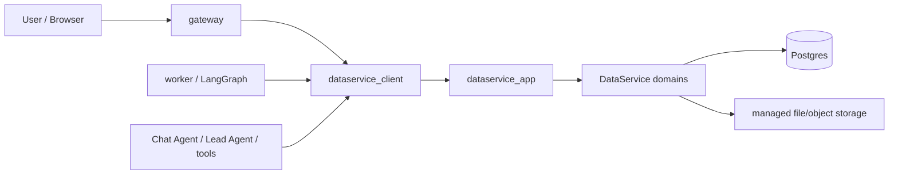
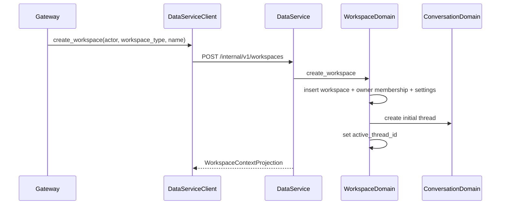

# DataService Full Migration Overview

**Date:** 2026-05-21
**Status:** Architecture overview for full migration
**Scope:** Product context, architecture end state, business aggregate ownership, migration principles, domain-by-domain convergence, operational contract, and long-term stability goals for moving Wenjin's business data layer fully into DataService.

---

## 1. Executive Position

DataService is the long-term business data platform for Wenjin. It is not a helper package, not a repository facade over the old tables, and not a compatibility wrapper for migration-era models.

The end state is:

```text
gateway / worker / agents / compute / tools
  -> dataservice_client
  -> dataservice_app
  -> dataservice domains
  -> Postgres + managed file/object storage
```

After a domain is migrated, no runtime code outside DataService can read or write that domain's canonical business tables. Other services call typed business commands and projections through `dataservice_client`.

This migration exists because Wenjin is moving from workflow-era features to the Super Agent Harness:

- Capability is now a user-facing mission, not a workflow step.
- Prism is now the canonical document editing and preview surface for all workspace primary documents.
- Sandbox work can create empirical outputs, figures, tables, scripts, and reproducibility records.
- Agent outputs must be reviewed, selected, and applied to workspace rooms or Prism.
- Provenance must become a first-class graph from sources and artifacts to manuscript claims and room records.

The old data layer cannot stay as a pile of ORM models accessed from routers, agents, services, tools, and workers. DataService is the migration window to redraw the canonical model once, enforce ownership, and make future product work extend stable domain contracts instead of adding parallel tables.

---

## 2. Source Documents

This overview is the context entry point. Detailed implementation still lives in the existing specs and plan:

| Document | Role |
| --- | --- |
| `/Users/ze/wenjin/docs/superpowers/specs/2026-05-20-dataservice-ssot-model.md` | Canonical table families, current table disposition matrix, migration map, architecture guard. |
| `/Users/ze/wenjin/docs/superpowers/specs/2026-05-20-dataservice-internal-architecture.md` | Internal package layout, aggregate map, domain responsibilities, API shape. |
| `/Users/ze/wenjin/docs/superpowers/plans/2026-05-20-dataservice-convergence.md` | Task-by-task implementation sequence. |
| `/Users/ze/wenjin/docs/superpowers/specs/2026-05-20-super-agent-capability-system-design.md` | Capability, skill, sandbox, review, and Prism product architecture context. |
| `/Users/ze/wenjin/docs/superpowers/specs/2026-05-20-wenjin-native-prism-integration-overview.md` | Prism as Wenjin-native document surface. |

When these documents disagree, this overview states the product and architecture intent; the SSOT model spec and implementation plan should then be updated to match it before code is written.

---

## 3. Current State Context

Wenjin currently has working product flows, but business data ownership is scattered.

Observed current runtime facts:

- Gateway routers import database models and sessions directly.
- Services commit their own transactions independently.
- Agents and tools query capability, artifacts, references, and review state directly.
- Prism review is Prism-specific and separate from result-card commit flow.
- Rooms have separate services and their own commits.
- Execution state overlaps with task queue state, workspace run records, run history, and compute session state.
- Library/reference/source concepts are split across `library_items`, `workspace_references`, reference asset tables, text units, usage events, and Prism source links.
- Documents, artifacts, generation records, uploaded files, render outputs, and sandbox outputs all express file/material concepts with different ownership.
- Workspace access is still partly inferred from old owner fields rather than a first-class membership model.

This does not mean the current system is broken. It means the architecture has reached the point where adding Super Agent Harness capabilities on top would preserve the same ambiguities in more tables.

The important current debt is not only table redundancy. It is business logic redundancy:

| Current location | Business responsibility currently mixed in |
| --- | --- |
| `ThreadService` | Thread creation, message JSON mutation, workspace skill metadata hydration, model selection. |
| `ExecutionCommitService` | Result selection, room writes, run history, idempotency cache, best-effort multi-service commit. |
| `PrismReviewService` | Prism review state, file change payloads, source links, protected sections, review transitions. |
| `WorkspacePrismService` / LaTeX services | Workspace binding, Prism surface projection, adapter-specific file operations, compile state. |
| Room services | Documents, Library, Decisions, Memory, Tasks, Run History each own their own persistence and commits. |
| Reference services | Source import, dedupe, preprocessing, indexing, evidence, BibTeX, usage tracking. |
| Compute services | Launch state, session cache, projection, sandbox output interpretation. |
| Gateway access helpers | Workspace ownership and authorization checks. |
| Agent runtime and tools | Capability/skill loading, artifact listing, reference usage, review item loading. |

DataService must pull these business responsibilities into domain aggregates. Moving only tables while leaving business decisions in old services would not be a migration; it would be a directory rename.

---

## 4. Final Architecture

### 4.1 Runtime Topology

Initial deployment remains one project and one Compose stack:



Later deployment can split DataService onto another host by changing `DATASERVICE_URL` and internal auth settings. Gateway, worker, agent, and compute code should not change.

### 4.2 Package End State

```text
backend/src/dataservice/
  common/
    actor.py
    errors.py
    idempotency.py
    pagination.py
    time.py
    unit_of_work.py
  domains/
    workspace/
      models.py
      contracts.py
      repository.py
      service.py
      projection.py
      policies.py
    conversation/
      models.py
      contracts.py
      repository.py
      service.py
      projection.py
      block_protocol.py
    catalog/
      models.py
      contracts.py
      repository.py
      service.py
      seed_loader.py
    execution/
      models.py
      contracts.py
      repository.py
      service.py
      projection.py
    review/
      models.py
      contracts.py
      repository.py
      service.py
      registry.py
    asset/
      models.py
      contracts.py
      repository.py
      service.py
      review_handler.py
    prism/
      models.py
      contracts.py
      repository.py
      service.py
      projection.py
      review_handler.py
      adapters/
        latex.py
        markdown.py
    source/
      models.py
      contracts.py
      repository.py
      service.py
      projection.py
      importers.py
      preprocess.py
      review_handler.py
    sandbox/
      models.py
      contracts.py
      repository.py
      service.py
      projection.py
      policy.py
      review_handler.py
    provenance/
      models.py
      contracts.py
      repository.py
      service.py
    rooms/
      models.py
      contracts.py
      repository.py
      service.py
      projection.py
      review_handler.py
    operations/
      models.py
      repository.py
      outbox.py
  app_boundary.py
backend/src/dataservice_app/
  app.py
  deps.py
  auth.py
  routers/
    health.py
    workspace.py
    conversation.py
    catalog.py
    execution.py
    review.py
    asset.py
    prism.py
    source.py
    sandbox.py
    rooms.py
backend/src/dataservice_client/
  client.py
  errors.py
  contracts/
```

Important adjustment from the first internal architecture draft:

- Review owns `ReviewBatch` / `ReviewItem` state and the apply orchestration.
- Target business writes stay owned by the target domains through domain-local review handlers.
- Review should not become a new central service that knows how to mutate every domain internally.

### 4.3 Deployment Boundary

DataService is independently deployable from day one:

- Compose service name: `dataservice`.
- Internal URL: `http://dataservice:8080`.
- Public port: not required by default.
- Gateway/worker env: `DATASERVICE_URL`.
- Auth: internal shared token first, later mTLS/service identity.
- Health endpoints: `/livez`, `/readyz`.

DataService shares the same repository initially, but its package and API boundary should be designed so it can later move into its own repo or host.

---

## 5. Non-Negotiable Architecture Principles

1. **One concept, one canonical table family.**
   A product concept can have projections, caches, logs, and indexes, but only one canonical write source.

2. **Business operations, not remote CRUD.**
   Other services call `stage_review_batch`, `apply_review_batch`, `record_execution_event`, `get_workspace_context`, `ensure_primary_prism_project`. They do not call `create_row`, `update_table`, or `select_model`.

3. **Domain aggregates own invariants.**
   DataService is not a global transaction script folder. Each domain has aggregate roots, repositories, services, projections, and tests.

4. **Repositories never commit.**
   Transaction ownership lives in `DataServiceUnitOfWork` and domain services that represent complete use cases.

5. **Review before agent materialization.**
   Agent-produced changes go into `review_batches` / `review_items`; only accepted/applied items can mutate Prism, rooms, sources, assets, or sandbox artifact materialization.

6. **User direct edits are explicit commands.**
   A user can directly edit Prism or rooms, but those writes still go through DataService domain commands with actor context and audit/provenance where needed.

7. **Execution is product run SSOT.**
   Queue/task rows can schedule work but cannot become user-visible run history or Compute state.

8. **Prism owns primary authored documents.**
   Documents room can contain reports, attachments, generated files, and packages. Workspace primary manuscripts/specs/applications live in Prism.

9. **Source is the research material concept.**
   Do not keep LibraryItem and Reference as separate product concepts. Migrate them into Source and SourceAsset.

10. **WorkspaceAsset owns file/blob metadata, not business semantics.**
    A file can be a source PDF, Prism render, sandbox output, exported DOCX, uploaded dataset, or generated chart. Its business meaning is owned by the linking domain.

11. **Provenance is a graph.**
    Source usage, artifact usage, Prism citations, sandbox inputs, and room traceability converge into `provenance_links`.

12. **No fallback, no alias runtime, no dual-write.**
    Migration is direct cutover per domain. Old tables may be renamed for offline validation, but runtime must not read them after cutover.

13. **Architecture guard is part of the product.**
    A shrinking allowlist is required until all direct DB/model access outside DataService is removed.

---

## 6. Domain Ownership Map

| Domain | Aggregate root | Owns | Does not own |
| --- | --- | --- | --- |
| Workspace | `WorkspaceAggregate` | workspace identity, lifecycle, membership, settings, active thread pointer | message blocks, executions, assets |
| Conversation | `ConversationAggregate` | threads, messages, block protocol arrival order, tool invocation/result linkage | execution graph, review apply |
| Catalog | `CapabilityCatalogAggregate` | capability definitions, skills, seed revisions, runtime catalog resolution | execution state |
| Execution | `ExecutionAggregate` | executions, nodes, events, live workflow timeline, run status | worker queue internals, review materialization |
| Review | `ReviewBatchAggregate` | review batches, review items, action logs, state transitions, apply orchestration | target table internals |
| Asset | `WorkspaceAssetAggregate` | file/blob metadata, storage pointers, derivative lineage, deletion state | source meaning, Prism text history |
| Prism | `PrismProjectAggregate` | project/document/file/version/render/protected scope, adapter metadata | source library, binary storage, execution running |
| Source | `SourceAggregate` | source metadata, identifiers, source assets, outline, text units, BibTeX snapshots | generic file storage, Prism files |
| Sandbox | `SandboxEnvironmentAggregate` | environment state, job records, job artifacts, policy snapshot | Docker/container execution implementation |
| Provenance | `ProvenanceGraphAggregate` | anchors and links from sources/assets/executions/users to targets | target mutation state |
| Rooms | `WorkspaceRoomsAggregate` | decisions, memory facts, workspace tasks, non-primary documents if retained | review staging, execution lifecycle |
| Operations | `DataOperationAggregate` | idempotency keys, outbox events, migration reports | user-facing product facts |

---

## 7. Business Logic Aggregation

### 7.1 Workspace

Current scattered responsibilities:

- workspace creation and metadata
- owner checks in gateway helpers
- settings spread across workspace config and settings rows
- active thread pointer
- workspace summary projection

Target commands:

- `create_workspace`
- `archive_workspace`
- `ensure_workspace_access`
- `add_membership`
- `remove_membership`
- `transfer_owner`
- `set_active_thread`
- `patch_workspace_settings`
- `get_workspace_context`

Long-term invariants:

- Every workspace has at least one active owner membership.
- `workspace_memberships` is the access SSOT.
- `workspaces.created_by_user_id` is creator audit, not access control.
- `active_thread_id` must point to a thread in the same workspace.
- Workspace type is immutable outside explicit admin migration.

### 7.2 Conversation And Block Protocol

This domain should be added before full migration is considered complete.

The existing JSON thread message storage is acceptable as a short migration bridge, but it is not the final shape for the Super Agent Harness.

Target tables:

- `threads`
- `thread_messages`
- `message_blocks`
- `tool_invocation_records`
- `tool_result_records`

Target commands:

- `create_thread`
- `append_message`
- `append_block`
- `append_tool_invocation`
- `append_tool_result`
- `compact_thread_context`
- `list_thread_blocks`
- `get_conversation_projection`

Long-term invariants:

- Block arrival order is append-only and explicit.
- Thinking blocks are stored in arrival order, never prepended.
- The 7 block types are canonical: `text`, `thinking`, `status_line`, `question_card`, `result_card`, `tool_invocation`, `tool_result`.
- Tool invocation/result blocks can be traced to execution nodes when they originate from Lead Agent runs.
- Conversation storage should support replay, audit, summarization, and context compaction without rewriting history.

### 7.3 Catalog

Current scattered responsibilities:

- YAML seed loading
- capability DB rows
- skill DB rows
- admin capability/skill editing
- runtime capability resolution
- middleware preload

Target commands:

- `load_seed_revision`
- `patch_capability`
- `patch_skill`
- `resolve_launch_catalog`
- `resolve_skill_pack`
- `list_admin_catalog`

Long-term invariants:

- Runtime consumes DB catalog only.
- YAML is seed input, not runtime fallback.
- Every capability and skill has a schema version.
- Capability is mission-level, not workflow-step-level.
- Skill config is typed and validated, not stored as unstructured catch-all config.

### 7.4 Execution

Current scattered responsibilities:

- execution rows
- node state
- lead runtime event publishing
- workspace run records
- run history rows
- compute session state
- task queue state

Target commands:

- `create_execution`
- `mark_execution_running`
- `record_node_started`
- `record_node_event`
- `record_tool_event`
- `record_result_card_event`
- `complete_execution`
- `fail_execution`
- `cancel_execution`
- `get_live_workflow_projection`
- `get_run_history_projection`

Long-term invariants:

- `executions.status` is product run status.
- `execution_nodes.status` is node status.
- `execution_events` is append-only timeline.
- `task_records` is queue infrastructure only.
- Run History is a projection from execution, review, and artifact state.
- Compute launch/restore state is projection or cache, not a second execution lifecycle.

### 7.5 Review

Current scattered responsibilities:

- Prism review items
- frontend result-card state
- `TaskReport.outputs`
- commit service selection
- room writes
- best-effort idempotency cache

Target commands:

- `stage_review_batch`
- `set_item_decision`
- `edit_item_payload`
- `apply_batch`
- `apply_item`
- `reject_batch`
- `revert_item`
- `get_review_batch_projection`

Long-term invariants:

- Batch is the user-reviewable result package.
- Item is the individual proposed mutation.
- Apply writes target domain, item state, batch state, action log, and provenance links in one transaction.
- Review owns state transitions, not target domain internals.
- Target handlers live in the target domain and are registered with Review.
- No agent can directly mutate Prism, rooms, assets, sources, or sandbox materialization outside review.

Handler ownership:

| Target kind | Handler location | Target owner |
| --- | --- | --- |
| `prism_file_change` | `domains/prism/review_handler.py` | Prism |
| `room_decision` / `room_memory` / `room_task` / `room_document` | `domains/rooms/review_handler.py` | Rooms |
| `source_candidate` | `domains/source/review_handler.py` | Source |
| `workspace_asset` | `domains/asset/review_handler.py` | Asset |
| `sandbox_artifact` | `domains/sandbox/review_handler.py` | Sandbox |

### 7.6 Asset

Current scattered responsibilities:

- artifacts
- documents_v2 file-like rows
- generation records
- uploads
- render outputs
- reference assets
- sandbox outputs

Target commands:

- `register_asset`
- `register_upload`
- `register_derivative`
- `resolve_asset_download`
- `mark_deleted`
- `attach_storage_pointer`

Long-term invariants:

- Large content is outside DB.
- DB stores metadata, storage pointer, hash, MIME type, size, lineage, and lifecycle.
- Asset does not decide whether a file is a source, Prism render, sandbox artifact, or room document.
- Derivative lineage is explicit.

### 7.7 Prism

Current scattered responsibilities:

- LaTeX project as root model
- workspace Prism binding
- file ordering
- review item coupling
- protected sections
- render and compile metadata
- source links

Target commands:

- `ensure_primary_project`
- `create_document`
- `create_file`
- `apply_file_change`
- `record_render`
- `protect_scope`
- `link_source_anchor`
- `get_prism_surface_projection`

Long-term invariants:

- Prism is adapter-neutral.
- LaTeX is one adapter, not the root business model.
- Primary manuscript/project is unique per workspace unless explicitly expanded.
- Editable document history is `prism_file_versions`.
- Render/compile output links to `workspace_assets`.
- Agent-authored file changes go through review.
- User direct edits go through explicit Prism commands.

### 7.8 Source

Current scattered responsibilities:

- `workspace_references`
- `library_items`
- reference imports
- reference preprocessing
- reference indexing
- reference evidence
- BibTeX snapshots
- usage events

Target commands:

- `upsert_source`
- `import_sources`
- `attach_source_asset`
- `apply_preprocess_result`
- `build_bibtex_snapshot`
- `dedupe_sources`
- `get_source_projection`

Long-term invariants:

- Product term is Source.
- DOI/external id/title dedupe is domain logic.
- Source text units are rebuildable from source assets.
- Citation key uniqueness is workspace-scoped.
- Usage is represented through provenance links, not source-local side tables.

### 7.9 Sandbox

Current scattered responsibilities:

- sandbox environment rows
- Docker execution implementation
- compute output parsing
- ad hoc artifact ids
- room sandbox service

Target commands:

- `ensure_environment`
- `record_job_started`
- `record_job_finished`
- `register_artifact`
- `get_sandbox_projection`
- `validate_policy`

Long-term invariants:

- First version is Python-only for analysis, stats, data processing, plotting, compilation helpers, and reproducibility scripts.
- Sandbox policy blocks Docker socket, privileged mode, host network, host paths, sibling container access, and server-level control.
- DataService records job state and artifacts; it does not execute containers.
- Sandbox artifacts enter review before materialization to Prism or rooms.

### 7.10 Provenance

Current scattered responsibilities:

- `prism_source_links`
- `reference_usage_events`
- source fields inside review payloads
- artifact metadata links

Target commands:

- `create_anchor`
- `link_target`
- `replace_target_links`
- `list_target_provenance`
- `list_source_usage`

Long-term invariants:

- Provenance is a graph.
- Source kinds include source, source text unit, workspace asset, sandbox artifact, execution node, user decision, external URL.
- Target kinds include Prism file/version/section, review item, decision, memory, workspace task, source, asset.
- Review apply should create or update provenance links in the same transaction as target writes.

### 7.11 Rooms

Current scattered responsibilities:

- documents service
- library service
- decisions service
- memory service
- workspace tasks service
- run history service

Target commands:

- `apply_decision_candidate`
- `apply_memory_candidate`
- `apply_workspace_task_candidate`
- `create_room_document`
- `update_room_document`
- `get_room_projection`

Long-term invariants:

- Decisions are durable user-approved choices.
- Memory facts are durable workspace context/preferences.
- Workspace tasks are user-visible work items.
- Candidate room writes come through review.
- User direct room edits go through DataService commands.
- Run History is not a room-owned write model; it is a projection.

### 7.12 Operations

Target tables:

- `dataservice_idempotency_keys`
- `dataservice_outbox_events`
- `dataservice_migration_reports`

Target commands:

- `begin_idempotent_command`
- `complete_idempotent_command`
- `append_outbox_event`
- `mark_outbox_published`
- `record_migration_report`

Long-term invariants:

- Mutating API calls require idempotency keys.
- Same idempotency key with same normalized request returns stored response.
- Same idempotency key with different request hash returns conflict.
- Outbox events are written in the same transaction as domain state changes.
- Migration reports preserve row counts, skipped rows, hashes, orphan counts, and validation status.

---

## 8. Canonical Table Families

| Family | Canonical tables | Legacy sources to converge |
| --- | --- | --- |
| Workspace | `workspaces`, `workspace_memberships`, `workspace_settings` | `workspaces.user_id`, `workspaces.thread_id`, `workspaces.config`, `workspace_settings.metadata_json` |
| Conversation | `threads`, `thread_messages`, `message_blocks`, `tool_invocation_records`, `tool_result_records` | JSON `threads.messages`, scattered block metadata in agent/runtime payloads |
| Catalog | `capability_definitions`, `capability_skills`, `capability_seed_revisions` | `capabilities`, `capability_skills.config`, YAML runtime fallback |
| Execution | `executions`, `execution_nodes`, `execution_events` | `workspace_run`, `run_history`, `subagent_task_records`, product reads from `task_records`, `compute_sessions` |
| Review | `review_batches`, `review_items`, `review_action_logs` | `prism_review_items`, `TaskReport.outputs`, frontend ResultCard transient state |
| Asset | `workspace_assets` | `artifacts`, file-like `documents_v2`, room documents, file-like `generation_records`, uploads, render outputs |
| Prism | `prism_projects`, `prism_documents`, `prism_files`, `prism_file_versions`, `prism_renders`, `prism_protected_scopes` | workspace-owned `latex_projects`, Prism-specific review/source/protected-section tables |
| Source | `sources`, `source_external_ids`, `source_assets`, `source_outline_nodes`, `source_text_units`, `source_bibtex_snapshots` | `workspace_references*`, `library_items`, reference preprocessing/index rows |
| Sandbox | `sandbox_environments`, `sandbox_job_records`, `sandbox_artifacts` | `sandboxes`, execution payload artifact ids, ad hoc sandbox output records |
| Provenance | `source_anchors`, `provenance_links` | `prism_source_links`, `reference_usage_events`, source fields in review payloads |
| Rooms | `decisions`, `memory_facts`, `workspace_tasks`, document room projection over `workspace_assets` | candidate decisions/memory/tasks/documents in task reports, direct room writes |
| Operations | `dataservice_idempotency_keys`, `dataservice_outbox_events`, `dataservice_migration_reports` | Redis-only idempotency cache, migration logs outside DB |

---

## 9. Core End-To-End Flows

### 9.1 Workspace Creation



Required transaction:

- workspace row
- owner membership
- workspace settings
- initial thread if requested
- active thread pointer
- outbox event

### 9.2 Capability Launch

```text
Chat Agent resolves intent
  -> dataservice catalog projection returns mission capabilities
  -> Lead Agent creates execution
  -> execution domain records nodes/events
  -> catalog domain resolves skill packs
  -> sandbox jobs are recorded when execution requires code/data work
```

DataService does not run LLMs or tools. It owns the data facts needed to launch, observe, review, and replay the work.

### 9.3 Agent Output To Review

```text
Lead Agent task report / Prism change / sandbox output
  -> stage_review_batch
  -> review batch + default-selected items
  -> user checks/unchecks/edits items
  -> apply_review_batch
  -> target domain handlers mutate target aggregates
  -> provenance links + action logs + outbox event
```

This is the most important product invariant. It is the point where Super Agent output becomes user-approved workspace state.

### 9.4 Prism File Change Apply

```text
ReviewBatch.apply
  -> review registry chooses Prism handler
  -> Prism domain validates protected scope and file identity
  -> create prism_file_version
  -> update current file pointer
  -> record provenance links
  -> record review action log
  -> emit prism surface updated event
```

### 9.5 Sandbox Artifact Materialization

```text
Sandbox executor runs outside DataService
  -> DataService records job started/finished
  -> DataService registers workspace asset metadata
  -> DataService registers sandbox artifact metadata
  -> review batch/item stages artifact materialization
  -> accepted artifact can become room document, source asset, Prism render, or workspace asset reference
```

### 9.6 Source Import And Provenance

```text
Import source
  -> Source domain dedupes by DOI/external id/title
  -> Asset domain stores uploaded/source file metadata
  -> Source domain links source asset
  -> Source preprocess creates outline/text units
  -> Prism/Rooms/Review apply creates provenance links when source is used
```

---

## 10. DataService API Contract

### 10.1 Request Context

Every command/query receives:

| Field | Requirement |
| --- | --- |
| `actor_user_id` | Required for user-scoped operations. |
| `actor_kind` | Required: `user`, `system`, `worker`, `migration`, `admin`. |
| `workspace_id` | Required for workspace-scoped operations. |
| `request_id` | Required for correlation. |
| `idempotency_key` | Required for mutating external calls. |
| `source_service` | Required: `gateway`, `worker`, `langgraph`, `admin`, `migration`. |

### 10.2 Response Envelope

All internal APIs should use one envelope:

```json
{
  "ok": true,
  "data": {},
  "error": null,
  "request_id": "req_...",
  "revision": "optional-domain-revision"
}
```

Error response:

```json
{
  "ok": false,
  "data": null,
  "error": {
    "code": "IDEMPOTENCY_CONFLICT",
    "message": "Idempotency key was reused with a different request payload.",
    "details": {}
  },
  "request_id": "req_..."
}
```

### 10.3 Error Taxonomy

| Code | Meaning | HTTP |
| --- | --- | --- |
| `UNAUTHENTICATED_INTERNAL_CALL` | Missing/invalid internal service auth. | 401 |
| `FORBIDDEN_WORKSPACE_ACCESS` | Actor cannot access workspace. | 403 |
| `NOT_FOUND` | Entity not found in actor scope. | 404 |
| `VALIDATION_ERROR` | Contract or business validation failed. | 422 |
| `IDEMPOTENCY_CONFLICT` | Same key reused with different request hash. | 409 |
| `CONFLICT` | Aggregate invariant conflict, version conflict, active run conflict. | 409 |
| `TARGET_HANDLER_NOT_FOUND` | Review target kind has no registered handler. | 422 |
| `TARGET_APPLY_FAILED` | Target handler failed before transaction commit. | 422 or 500 depending on cause |
| `MIGRATION_VALIDATION_FAILED` | Data copy/check failed. | 500 |
| `INTERNAL_ERROR` | Unexpected service failure. | 500 |

### 10.4 Idempotency Scope

`dataservice_idempotency_keys` should scope uniqueness by:

- `source_service`
- `command_name`
- `workspace_id` when present
- `actor_user_id` when present
- `idempotency_key`

Implementation note: the table should also store a deterministic `scope_hash` derived from the first four scope fields and enforce uniqueness on `scope_hash` plus `idempotency_key`. This avoids nullable-column uniqueness gaps while preserving readable scope fields for operations/debugging.

Rules:

- Same key + same normalized request hash returns the stored response.
- Same key + different normalized request hash returns `IDEMPOTENCY_CONFLICT`.
- Failed commands can be retried only if the operation is known not to have committed, or if a completed/failed stored response is returned explicitly.
- Expiration is command-specific and documented in the command contract.

### 10.5 Pagination And Projections

Read endpoints should use cursor pagination for lists that can grow:

- execution events
- review batches/items
- source text units
- room activity
- provenance links
- workspace assets

Projection endpoints must return DTOs or dictionaries, never ORM-shaped payloads.

---

## 11. Architecture Guard

The guard must ship before domain migration.

It should not be a simple grep test. It should parse Python AST where possible and maintain a baseline allowlist.

Forbidden outside DataService app, DataService domains, Alembic, and explicitly allowed tests:

- import from `src.database.models`
- import business models from `src.database`
- import `src.dataservice.domains.*.models`
- import `src.dataservice.domains.*.repository`
- direct `AsyncSession.add/merge/delete/commit` for business data
- direct `session.execute(select(...))` for migrated domains
- direct SQL text reads/writes to migrated tables

Allowlist behavior:

```text
baseline count is captured in Task 2
each domain cutover removes files from the allowlist
new direct access outside DataService fails immediately
allowlist can shrink, never grow without explicit architecture review
```

The guard should classify violations by domain:

- workspace
- conversation
- catalog
- execution
- review
- asset
- prism
- source
- sandbox
- provenance
- rooms
- identity/admin/billing outside first milestone

This classification matters because migration is domain-sliced.

---

## 12. Migration Strategy

### Phase 0: Design Lock

Deliverables:

- Full migration overview.
- SSOT model spec.
- Internal architecture spec.
- Implementation plan.
- Open decision list resolved or explicitly deferred.

Exit gate:

- No disagreement about domain ownership.
- No disagreement about no fallback / no dual-write.
- No disagreement about DataService as standalone internal service.
- Review handler ownership is target-domain-based.
- Conversation/block final shape is acknowledged.

### Phase 1: Foundation

Implement:

- package skeleton
- DataService FastAPI app
- `dataservice_client`
- internal auth
- health endpoints
- Docker target and Compose `dataservice` service
- `ActorContext`
- `DataServiceUnitOfWork`
- idempotency primitives
- operations tables
- outbox primitive
- migration report primitive
- architecture guard with baseline allowlist
- Docker target and Compose service

No product domain cutover happens in this phase.

Implementation status as of 2026-05-21:

- Done in `fa6f0ef6 feat: add dataservice service foundation`.
- DataService package, FastAPI app, internal auth, health endpoints, client skeleton, operations tables, Docker target, Compose service, and baseline architecture guard exist.

### Phase 2: Workspace And Conversation

Implement:

- workspace aggregate
- `workspace_memberships`
- settings consolidation
- active thread pointer validation
- conversation/block protocol tables or at least migration-compatible contracts
- workspace context projection

Reason:

Every other domain is workspace-scoped. Access and conversation identity must be stable before review/execution/prism data starts moving.

Implementation status as of 2026-05-21:

- Workspace core first slice is implemented.
- `060_dataservice_workspace_core.py` adds `workspace_memberships` and `workspace_settings.settings_json`, backfills owner memberships from existing workspace owners, and copies existing workspace config into canonical settings JSON.
- DataService workspace contracts expose `workspace_type`, `created_by_user_id`, `settings_json`, and `active_thread_id`; old ORM column names remain only as storage aliases until the consumer cutover and physical cleanup step.
- Workspace CRUD, membership access checks, active-thread validation, DataService internal workspace routes, and typed client workspace methods are covered by tests.
- `075_enforce_workspace_owner_membership.py` makes the owner invariant durable at the database layer: existing data is prechecked, the owner lookup index is `(workspace_id, role, status)`, and deferred PostgreSQL constraint triggers reject any transaction that leaves a workspace without an active owner membership.
- Runtime code no longer imports DataService domain modules directly; it uses the DataService public workspace boundary for this in-process slice. The next workspace step is to require the standalone DataService service in dev/test and switch runtime consumers to `dataservice_client`.
- Conversation/block first slice is implemented.
- `061_dataservice_conversation_blocks.py` adds `thread_messages`, `message_blocks`, `tool_invocation_records`, and `tool_result_records`, then backfills existing `threads.messages` JSON into canonical message/block rows.
- DataService conversation contracts preserve the canonical 7 block types: `text`, `thinking`, `status_line`, `question_card`, `result_card`, `tool_invocation`, and `tool_result`.
- `ThreadService` now writes message appends, attachment metadata updates, compaction, and rollback through the DataService conversation boundary without mutating `threads.messages`.
- Thread detail/state/history now read through the DataService conversation projection boundary instead of directly reading `threads.messages`.
- Chat Agent message building, context compaction, interruption rollback, attachment status updates, run wait payloads, and workspace activity feed now consume DataService conversation projections rather than `threads.messages`.
- Runtime code is guarded from accessing `thread.messages`; legacy `Thread.messages` ORM mapping has been removed, and migration `074_drop_legacy_thread_messages_column.py` drops the old JSON column after canonical conversation cutover.

### Phase 3: Catalog And Execution Skeleton

Implement:

- capability catalog v2
- skill catalog v2
- seed revision tracking
- execution aggregate
- node/event stream
- live workflow projection

Reason:

Review batches and sandbox/provenance need execution ids and node ids as stable producers.

Implementation status as of 2026-05-21:

- Capability catalog first slice is implemented.
- `062_dataservice_capability_catalog.py` creates `capability_definitions` and `capability_seed_revisions`, augments `capability_skills` with `schema_version`, `worker_type`, `skill_json`, `checksum`, and `source_path`, and backfills PostgreSQL capability definitions from the old `capabilities` table.
- `backend/src/dataservice/domains/catalog/` owns catalog models, contracts, repository, projection, domain service, and seed loader. `dataservice_app` exposes internal catalog routes and `dataservice_client` has typed catalog methods.
- Capability and skill seed loaders now delegate to the DataService catalog seed loader, which records deterministic checksum revisions instead of using YAML as runtime fallback.
- Runtime catalog consumers now read DataService projections: capability resolver, skill resolver, Chat Agent preload middleware, feature launch/list tools, workspace capability action resolution, dashboard/summary projections, Lead runtime skill loading, and Compute profile projection.
- Admin capability/skill CRUD and cross-reference validation now go through `CatalogDataService`.
- Execution graph first slice is implemented.
- `063_dataservice_execution_graph.py` adds `execution_events`; `backend/src/dataservice/domains/execution/` owns execution contracts, repository, projection, service, and the event model while adopting existing `executions` / `execution_nodes` as the product run SSOT.
- DataService execution contracts expose `capability_id`, `task_brief_json`, `graph_json`, `node_states_json`, `runtime_state_json`, and `result_json`; internal execution routes and typed client methods exist.
- `ExecutionService.append_execution_event()` records ordered DataService events; `ExecutionEngineV2` writes status events and the Celery node callback writes node lifecycle events.
- Public `ExecutionService` create/read/list/update/cancel/node-state write paths now delegate to `ExecutionDataService` while preserving compatibility attributes for existing callers.
- Subagent task semantics now land in `execution_nodes` and `execution_events`; `subagent_task_records` is no longer a product projection input.
- Compute projection, Workspace Activity, User Dashboard, and Admin Dashboard now build from DataService execution/node projections rather than `task_records` / `subagent_task_records`.
- Run History room and Prism recent activity now use `ExecutionRunHistoryProjection` derived from `executions`; `workspace_run` has been removed from active runtime routes and dropped by migration `073_drop_legacy_workspace_run_table.py`, and `compute_sessions` is treated only as a rebuildable UI shell/cache around canonical executions.
- Review batch aggregate foundation is implemented.
- `064_dataservice_review_queue.py` creates `review_batches`, `review_items`, and `review_action_logs`.
- `backend/src/dataservice/domains/review/` owns review contracts, repository, projections, state-machine service, and target handler registry. `dataservice_app` exposes internal review routes and `dataservice_client` has typed review methods.
- Review item statuses are enforced as `pending`, `accepted`, `rejected`, `applied`, `reverted`, and `failed`; batch statuses are recomputed as `pending`, `partially_applied`, `applied`, `rejected`, or `failed`.
- Target apply handlers are registered by `target_domain` / `target_kind` and run inside the review transition transaction boundary. Prism, asset, source, and sandbox handler factories now exist; rooms and cross-domain provenance materialization remain in the next convergence slices.
- Workspace asset aggregate foundation is implemented.
- `065_dataservice_workspace_assets.py` creates `workspace_assets` and migrates file-like `documents_v2`, file-backed `artifacts`, and file-like `generation_records` into canonical asset metadata rows.
- `backend/src/dataservice/domains/asset/` owns asset contracts, model, repository, projection, service, and review handler factory. `dataservice_app` exposes internal asset routes and `dataservice_client` has typed asset methods.
- New asset writes must provide a managed storage pointer; large content is not stored in DataService payload JSON.
- Prism project aggregate foundation is implemented.
- `066_dataservice_prism_documents.py` creates canonical `prism_projects`, `prism_documents`, `prism_files`, `prism_file_versions`, `prism_renders`, and `prism_protected_scopes`, then copies workspace-owned primary LaTeX projects into the Prism aggregate with LaTeX-specific fields under adapter metadata.
- `backend/src/dataservice/domains/prism/` owns Prism contracts, model, repository, projections, service, LaTeX adapter metadata helper, and review handler factory. `dataservice_app` exposes internal Prism routes and `dataservice_client` has typed Prism methods.
- Workspace Prism projection now starts from `PrismDataService`; LaTeX project rows are adapter records, not the workspace-binding SSOT.
- Source and Provenance aggregate foundation is implemented.
- `067_dataservice_sources_provenance.py` creates canonical source library tables, source anchors, and provenance links, then migrates `workspace_references*`, `library_items`, `reference_assets`, `reference_usage_events`, `reference_bibtex_snapshots`, and resolvable `prism_source_links`.
- `backend/src/dataservice/domains/source/` and `backend/src/dataservice/domains/provenance/` own source/provenance contracts, models, repositories, projections, services, and source review handler factory. `dataservice_app` exposes internal source/provenance routes and `dataservice_client` has typed methods.
- Sandbox aggregate foundation is implemented.
- `068_dataservice_sandbox_runtime.py` creates canonical `sandbox_environments`, `sandbox_job_records`, and `sandbox_artifacts`, then migrates legacy `sandboxes` into environment rows with explicit policy/resource snapshots.
- `backend/src/dataservice/domains/sandbox/` owns sandbox contracts, models, repository, projection, service, Python-only policy validation, and sandbox artifact review handler factory. `dataservice_app` exposes internal sandbox routes and `dataservice_client` has typed environment/job/artifact methods.
- Sandbox artifacts are now review-gated metadata rows linked to `workspace_assets`; DataService records reproducibility and policy state but does not execute containers.
- Verification through the Sandbox slice is green through `cd backend && .venv/bin/python -m pytest tests/ -q` with 1910 backend tests.
- Rooms aggregate foundation is implemented.
- `069_dataservice_rooms_hooks.py` adds review trace hooks to `decisions`, `memory_facts`, and `workspace_tasks` while keeping those three tables as the canonical physical room tables.
- `backend/src/dataservice/domains/rooms/` owns room contracts, repository, projections, service, and review handler factory. Legacy room service facades delegate to `RoomsDataService` for decisions, memory, and workspace tasks.
- Execution commit now stages memory/decision/task outputs into `review_batches` / `review_items` and applies them through room review handlers; direct room table writes from `ExecutionCommitService` are removed for those target kinds.
- Verification through the Rooms slice is green through `cd backend && .venv/bin/python -m pytest tests/ -q` with 1914 backend tests.
- Projection cleanup first slice is implemented.
- Runtime code outside DataService/database ownership packages is guarded from importing migrated room/sandbox/source legacy models: `Decision`, `MemoryFact`, `WorkspaceTask`, `Sandbox`, and `LibraryItem`.
- Workspace Prism context now reads decision/memory context through `RoomsDataService`; the sandbox room facade delegates environment state to `SandboxDataService`.
- The library room facade delegates reference-library state to `SourceDataService`, so library room writes no longer create `library_items` rows.
- The documents room facade delegates document create/read/update/delete/version operations to `AssetDataService`, so document room writes now create canonical `workspace_assets` rows and no longer create `documents_v2` rows.
- Runtime code outside DataService/database ownership packages is also guarded from importing `DocumentV2`; migrated `documents_v2` rows are represented only as `workspace_assets` with legacy source metadata.
- The settings room facade delegates settings projection and updates to `WorkspaceDataService`, so `workspace_settings` is now owned by the Workspace aggregate instead of a standalone room service.
- Runtime code outside DataService/database ownership packages is guarded from importing `WorkspaceSettings`.
- The legacy `WorkspaceRunService` runtime path has been deleted; product run state stays on DataService execution projections. Legacy `WorkspaceRunRow` ORM has been removed, `subagent_task_records.run_id` is now an unconstrained historical id field, and `subagent_task_records.execution_id` is the canonical execution FK.
- Runtime code outside DataService/database ownership packages is guarded from importing `WorkspaceRunRow`, and the model no longer exists in ORM metadata.
- Compute session shell state is now controlled through the Execution DataService aggregate, internal DataService routes, and typed DataService client contracts; compute routes/projections no longer query `compute_sessions` directly.
- Runtime code outside DataService/database ownership packages is guarded from importing `ComputeSessionRecord`.
- Workspace Activity artifact entries now read from `AssetDataService` / `workspace_assets`; the activity projection no longer queries the legacy `artifacts` table for artifact cards.
- Execution node lifecycle snapshots are now owned by the Execution DataService aggregate. `ExecutionService` no longer imports or mutates `ExecutionNodeRecord` directly; create/update/find node operations delegate to `ExecutionDataService` and are exposed through internal DataService routes plus typed client contracts.
- Process-restart reconciliation for stale `pending` / `running` / `cancelling` executions is now an Execution DataService aggregate command instead of a runtime-side direct ORM mutation.
- Admin analytics execution DAU/WAU and execution stats now read from Execution DataService aggregate methods. Dashboard feature running-count/latest-status helpers also read through Execution DataService instead of querying `executions` directly.
- Runtime code outside DataService/database ownership packages is guarded from importing `ExecutionRecord` and `ExecutionNodeRecord`.
- Review aggregate item listing now supports workspace/execution/target filters through in-process DataService, internal DataService routes, and typed client contracts. Workspace activity Prism review cards, workspace execution review summaries, and Lead runtime completion reports now read execution-produced Prism review items from canonical `review_items` instead of the legacy `prism_review_items` table.
- Review apply materialization uses target-domain handlers and a single DataService finish step for `apply_many()`, keeping target writes, item transitions, batch recomputation, action logs, and handler-owned provenance writes in one transaction boundary.
- `WorkspacePrismService` now uses canonical `review_items` for Prism file-change review cards, file-change counts, launch-context pending review items, and recent review activity.
- `ReviewDataService` now exposes canonical item get/patch/delete operations across in-process, internal HTTP, and typed client boundaries. `PrismReviewDataService` owns Prism file-change review identity over canonical `review_items`.
- `WorkspaceLatexProjectService` now creates and clears pending Prism file-change review items through `PrismReviewDataService` instead of `prism_review_items`.
- LaTeX file-change preview/apply/discard/revert actions now resolve and transition canonical `review_items`; `defer` has been removed from the Prism action contract, backend routes, frontend API/store, and review UI.
- Prism source links now use canonical `provenance_links` and Prism protected sections now use `prism_protected_scopes`. `WorkspacePrismService` no longer reads legacy `prism_source_links` or `prism_protected_sections`.
- Source citation usage is now a DataService command. Applying a LaTeX/Prism file change records source usage through canonical `sources` and `provenance_links`, marks eligible sources `used_in_draft`, and exposes the same contract through the internal DataService route and typed client. `PrismReviewDataService` also resolves citations through citation-key Source lookup instead of scanning workspace sources.
- Legacy `ReferenceUsageService` and `WorkspaceReferenceService.record_reference_usage` have been removed; runtime citation usage writes only through `SourceDataService.record_citation_usage`.
- Agent-side LaTeX compilation bibliography generation now resolves `citation_ids` through Source DataService within the runtime workspace and formats BibTeX from canonical Source metadata. `ExecutionMiddleware` no longer imports legacy reference ORM models or the bibliography sync service.
- Workspace built-in tools now resolve workspace access through `WorkspaceDataService` and list recent artifacts through `AssetDataService` / `workspace_assets`; they no longer import `Workspace` or `Artifact` ORM models directly.
- Thesis literature-management dashboard counts now use Source DataService count projections for total/core source state instead of reading `workspace_references`.
- Reference Library built-in tools now read outlines, search text units, and fetch source sections through Source DataService. Section access auditing now writes `provenance_links` instead of `reference_usage_events`.
- Source outline/text-unit/section read projections are exposed through internal DataService routes and typed client methods, keeping the Reference Library tool path ready for split DataService deployment.
- Gateway Reference Library list/count/detail/update/delete/status endpoints now use Source DataService projections and mutation commands. Outline/search/outline-node/page read endpoints already use Source read projections instead of `ReferenceIndexService`.
- Legacy `ReferenceIndexService` has been removed; Source outline/text-unit/page reads are owned by Source DataService.
- Historical reference rows were migrated into canonical `sources`; new manual, Semantic Scholar, Deep Search, BibTeX, and PDF-upload imports now write canonical Source rows directly.
- Source DataService now owns `source_external_ids` read/upsert APIs, internal routes, and typed client methods; reference adapter synchronization carries Semantic Scholar/upload hashes into Source detail instead of leaving external ids as an empty projection.
- Manual, Semantic Scholar, Deep Search artifact, BibTeX metadata imports, and PDF upload now use Source/Asset DataService as the canonical write path, so metadata dedupe, citation-key uniqueness, external-id upsert, asset registration, and Source projection serialization are owned by DataService.
- Reference BibTeX build, citation validation, and Prism sync now read canonical Source metadata through Source DataService; Source curation state is reflected in exported `refs.bib`.
- Prism BibTeX sync now writes projection snapshots through Source DataService into canonical `source_bibtex_snapshots`; runtime no longer writes `reference_bibtex_snapshots`.
- Chat/LangGraph citation and literature-context middleware now receives Source DataService projections from FastAPI and Celery run entrypoints, parses LaTeX `\cite{...}` keys, and records usage through Source citation usage/provenance commands. Legacy `search_in_workspace` / `record_reference_usage` fallback has been removed.
- Reference evidence-pack assembly is now a canonical `SourceDataService.build_evidence_pack` contract over Source library outlines and Source text-unit search results; the gateway no longer exports or calls `ReferenceEvidenceService`.
- PDF preprocessing now mirrors rebuilt reference outline/text-unit indexes into Source DataService, including Source status/evidence promotion to indexed full text.
- Reference PDF and derived markdown/manifest assets now register canonical `workspace_assets` rows and `source_assets` links; Source detail/list projections can return asset metadata from DataService.
- Source DataService now exposes source asset read/update APIs for preprocess status and metadata, enabling PDF preprocess to move off `reference_assets`.
- Reference PDF upload now creates canonical `sources`, `workspace_assets`, and `source_assets` directly; queued preprocess payloads use `source_id`, `source_asset_id`, and `workspace_asset_id`, and `SourcePreprocessService` writes canonical Source indexes.
- Legacy `WorkspaceReferenceService` and `ReferencePreprocessService` have been removed from the runtime service surface; reference detail and PDF preprocess no longer use legacy reference ORM tables.
- Legacy reference ORM table models have been removed. Migration `072_drop_legacy_reference_tables.py` drops `workspace_references`, `reference_external_ids`, `reference_assets`, `reference_outline_nodes`, `reference_text_units`, `reference_usage_events`, and `reference_bibtex_snapshots` after the Source DataService cutover.
- Gateway import/BibTeX service classes have been renamed to `SourceLibraryImportService` and `SourceBibliographyService`; no legacy `ReferenceImportService` / `ReferenceBibTeXService` aliases remain.
- Remaining Source convergence debt is limited to broad product route naming decisions, not data ownership or compatibility fallback.
- Architecture guard has an explicit empty `LEGACY_ALLOWED_FILES` set for migrated legacy database model imports; migrated domains have no runtime import exceptions.
- Alembic env no longer imports legacy reference/workspace-run/thread-message JSON ORM models; `cd backend && .venv/bin/python -m alembic heads` resolves `075_enforce_workspace_owner_membership` as the single head.
- Legacy `PrismReviewService` has been deleted. Runtime code outside DataService/database ownership packages is guarded from importing `PrismReviewItem`, `PrismSourceLink`, or `PrismProtectedSection`.
- Legacy Prism review ORM models have been deleted. Migration `071_drop_legacy_prism_review_tables.py` drops `prism_review_items`, `prism_source_links`, and `prism_protected_sections` after the DataService cutover.
- `070_dataservice_projection_cleanup.py` records the cleanup milestone in `dataservice_migration_reports`.
- Verification through the Source curation/evidence/indexer/asset/upload-preprocess/BibTeX snapshot cleanup, workspace-run table drop, Prism action-contract cleanup, conversation JSON-write removal, owner invariant, and review transaction cleanup slices is green through `cd backend && .venv/bin/python -m pytest tests/ -q` with 1938 backend tests; owner invariant target tests pass with 11 tests; review transaction target tests pass with 14 tests; `cd frontend && npm run typecheck` and `cd frontend && npm run lint` also pass.

### Phase 4: Review Materialization

Implement:

- Prism/result-card cutover into review batches/items
- target-domain review handlers
- apply transaction orchestration
- provenance links from applied review items

Reason:

This is the commit gate for Super Agent Harness output.

### Phase 5: Prism, Asset, Source, Sandbox, Provenance

Implement in this order:

1. Asset, because many domains need file metadata.
2. Prism, because primary documents must leave LaTeX-rooted model.
3. Source, because library/reference must converge.
4. Sandbox, because artifacts need asset/review/provenance hooks.
5. Provenance, because target apply should record traceability.

If implementation needs to split further, do it by aggregate and handler boundary, not by old table names.

### Phase 6: Rooms And Projections

Implement:

- rooms aggregate
- direct room edit commands
- review apply handlers for decisions/memory/tasks/documents
- run history projection
- activity projection
- workspace summary projection

Reason:

Rooms should become the durable surface for accepted context and work items, not a set of independent services with separate commits.

### Phase 7: Cut Consumers And Delete Runtime Paths

For each domain:

1. Add canonical tables.
2. Copy legacy data.
3. Validate row counts, FK consistency, hash consistency, orphan handling, uniqueness.
4. Switch consumers to `dataservice_client`.
5. Run architecture guard.
6. Remove old runtime code path.
7. Rename legacy tables to `_legacy_20260520` or current migration-date suffix.
8. Drop legacy tables after backup and one-release validation.

No endpoint, agent, worker, tool, or frontend adapter may read legacy tables after cutover.

---

## 13. Data Copy And Validation Standards

Every data migration must produce a `dataservice_migration_reports` row.

Required checks:

| Check | Requirement |
| --- | --- |
| Row counts | Source, copied, skipped, failed, archived counts. |
| Workspace isolation | No copied row crosses workspace boundary. |
| FK integrity | Every target FK points to an existing canonical row or is reported as orphan. |
| Unique constraints | Conflicts resolved before unique indexes are created. |
| Content hash | File copies preserve or recompute content hash. |
| Idempotency | Running migration twice does not duplicate rows. |
| Unknown payload fields | Preserved under `legacy_import` or explicitly dropped with report. |
| Runtime access | Architecture guard proves no legacy runtime reader remains. |

Migration failures should fail loudly. Silent partial migration is worse than stopping the deployment.

---

## 14. Long-Term Stability Goals

DataService should be considered stable only when these goals are true:

1. New product work can add fields or submodels to existing domains without creating parallel table families.
2. All workspace-scoped business data has a workspace boundary and access policy.
3. All agent-produced durable changes pass through review or explicit user-edit commands.
4. All file-like outputs are represented through `workspace_assets`.
5. All primary document edits happen in Prism.
6. All research/library material is Source.
7. All source/artifact/document traceability is Provenance.
8. Run History, Compute, Prism context rail, Workspace summary, Library, Sandbox, and Activity are projections.
9. Direct ORM imports outside DataService are limited to identity/admin/billing domains that are explicitly outside the first milestone, then removed in later milestones.
10. DataService can be deployed separately without changing gateway/worker/agent business logic.
11. DataService API contracts are versioned and typed.
12. Architecture guard prevents regression.

---

## 15. Definition Of Done For Full Migration

Full DataService migration is done when:

- `backend/src/database/models` no longer contains migrated business domain models.
- Gateway routers do not query business tables directly.
- Agents and tools do not import business ORM models.
- Worker code does not write canonical business tables directly.
- Old room services are removed or rewritten as DataService clients.
- `PrismReviewService` is gone or reduced to a client/projection adapter with no DB ownership.
- `ExecutionCommitService` is replaced by ReviewBatch apply flow.
- `ThreadService` no longer stores the canonical block protocol only as JSON.
- Legacy product tables are archived/dropped after validation.
- All DataService domains have unit tests for invariants and state transitions.
- Architecture guard passes with no legacy allowlist for migrated domains.
- `docker compose up` starts `dataservice` as a separate internal service.
- The same code can move DataService to a different host by changing `DATASERVICE_URL`.

---

## 16. First Implementation Slice

The next implementation slice should not start by moving workspace/review/prism business tables. It should build the service foundation and guard first.

First slice:

1. Add `backend/src/dataservice/common/*`.
2. Add `backend/src/dataservice/domains/operations/*`.
3. Add `backend/src/dataservice_app`.
4. Add `backend/src/dataservice_client`.
5. Add internal auth and health endpoints.
6. Add Docker/Compose `dataservice`.
7. Add architecture guard with baseline allowlist.
8. Add tests proving non-DataService runtime code cannot import new DataService models/repositories.

Only after this slice is green should domain migration begin.

---

## 17. Open Decisions To Track

These are not blockers for foundation, but should be resolved before full domain cutover:

| Decision | Recommended direction |
| --- | --- |
| Conversation/block final table shape | Add `conversation` domain with `thread_messages` and `message_blocks`; do not keep JSON as final SSOT. |
| Review handler location | Keep review state in Review; keep target writes in target-domain handlers. |
| Legacy table suffix | Use migration-date suffix, for example `_legacy_20260520`, and document exact date per migration batch. |
| File storage provider | Keep provider abstraction in asset metadata; do not tie DataService to local disk semantics. |
| Source dedupe merge rules | DOI first, then external id, then normalized title + year + authors, with migration report for conflicts. |
| Idempotency retention | Command-specific, but default 24 hours for UI commands and longer for migration/admin commands. |
| Outbox publisher timing | Foundation writes outbox rows; publishing can initially be no-op or polled worker. |
| Identity/admin/billing migration | Outside first milestone, but DataService architecture should not prevent later ownership. |

---

## 18. Summary

DataService is the architecture move that lets Wenjin stop carrying workflow-era data shapes into the Super Agent Harness.

The correct migration is not:

```text
old ORM model -> new repository wrapper -> same business ambiguity
```

The correct migration is:

```text
business aggregate -> typed command/query contract -> canonical table family -> domain projection
```

If implemented this way, DataService becomes the stable layer underneath Workbench, Prism, Lead Agent, Chat Agent, Sandbox, Source Library, Rooms, Run History, and future workspace types. If implemented as a thin facade, it will only centralize the existing debt. The migration should therefore prioritize domain ownership, transaction boundaries, review materialization, and architecture guard enforcement before moving large amounts of table code.
