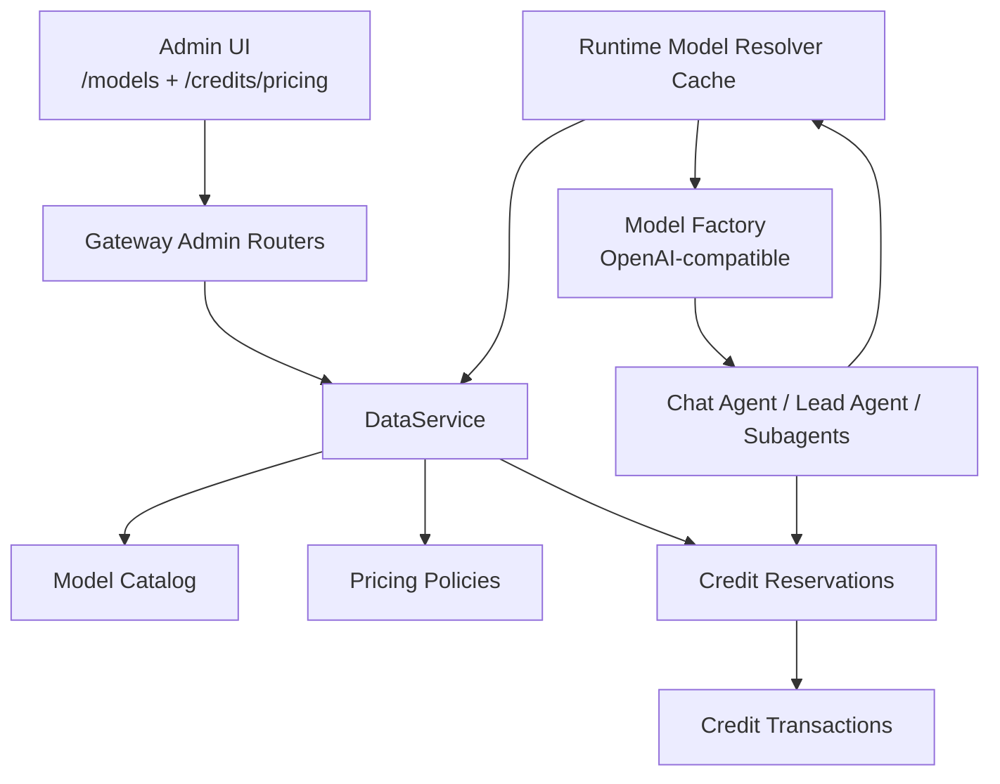
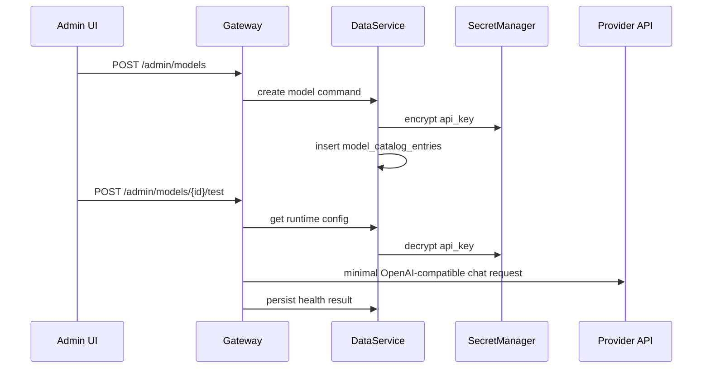
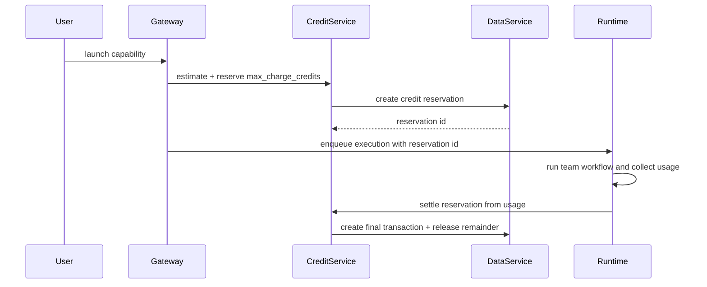

# Admin Model Catalog And Credit Pricing Design

## Scope

This spec turns Wenjin model configuration and credit pricing into a DataService-backed admin-operated system.

The goal is to replace runtime model lists from environment/config files with a secure Model Catalog, and replace fixed token-to-credit conversion with an admin-managed pricing system that prices the product value of Wenjin workflows while still protecting real provider and compute costs.

In scope:

- DataService-owned model catalog for OpenAI-compatible chat models.
- Admin UI for creating, editing, disabling, testing, and choosing the default model.
- Encrypted API key storage with Docker secret backed master key.
- Runtime model resolver/cache used by Chat Agent, Lead Agent, and subagents.
- Admin-managed pricing policies for models, capabilities, tools, and sandbox operations.
- Credit reservation and settlement for long-running feature executions and sandbox operations.
- User-facing credit-only display, admin-facing cost and margin observability.
- One-time migration from the current `LLM_MODELS` / `config.yaml` model configuration.

Out of scope for this phase:

- Non-OpenAI-compatible provider protocols.
- User-owned API keys.
- Payment gateway, subscriptions, invoices, and recharge SKUs.
- External Vault/KMS integration.
- Hard deletion of historical model records.

## Current State

Runtime model configuration is currently environment-driven:

- [backend/src/config/llm_config.py](../../../backend/src/config/llm_config.py) loads `LLM_MODELS` and `LLM_IMAGE_MODELS`.
- [backend/src/models/router.py](../../../backend/src/models/router.py) routes user-selected/default models from that config.
- [backend/src/models/factory.py](../../../backend/src/models/factory.py) creates `ChatOpenAI` / Anthropic model instances from that config.
- [backend/src/gateway/routers/models.py](../../../backend/src/gateway/routers/models.py) exposes read-only `/models`.

Credit billing already has a foundation:

- [backend/src/services/billing_policy.py](../../../backend/src/services/billing_policy.py) defines fixed token-to-credit and sandbox policies.
- [backend/src/services/credit_service.py](../../../backend/src/services/credit_service.py) consumes credits for thread usage, feature usage, and sandbox operations.
- DataService owns credit balance mutation and idempotent transaction creation.
- [docs/superpowers/specs/2026-05-30-credit-billing-foundation-design.md](./2026-05-30-credit-billing-foundation-design.md) established the first billing foundation.

The gap is that both models and pricing are still too static:

- Model changes require environment/config changes and process reloads.
- API keys would be risky if stored directly in Docker env per model.
- `tokens_per_credit` makes credits look like transparent token resale.
- Capability/team/workflow value is not priced explicitly.
- Sandbox compute is underpriced and not reserved before execution.

## Product Principles

1. **Credits price Wenjin work, not raw tokens.** Users buy research assistance, workflow orchestration, sandbox execution, and quality closure. Token cost is an internal floor.
2. **Admin changes affect new runs only.** Running executions keep model and pricing snapshots.
3. **Secrets are write-only from the browser.** Admin UI can replace API keys but never read them back.
4. **DataService is the source of truth.** Model catalog, pricing policies, reservations, and transactions live in DataService.
5. **Runtime remains boring.** Agent code asks the resolver for a model id/config and should not know where it came from.
6. **No silent unsafe routing.** Disabled models, untested default models, and unsupported tool/vision choices fail explicitly.

## Target Architecture



DataService owns persistence. Gateway exposes browser-facing admin endpoints and user-facing model lists. Runtime services use an internal model resolver cache populated from DataService.

The model factory remains synchronous at the final construction boundary. It reads from an in-process immutable snapshot cache that is refreshed asynchronously at request/task boundaries and invalidated by version changes.

## Data Model

### `model_catalog_entries`

Stores admin-managed runtime model configuration. First phase supports only `openai_compatible` chat models.

| Column | Type | Notes |
|---|---|---|
| `id` | UUID PK | Internal record id. |
| `model_id` | string unique | Stable runtime id, e.g. `deepseek-v3`. |
| `display_name` | string | Admin/user display name. |
| `provider_protocol` | enum | `openai_compatible` in this phase. |
| `provider_name` | string | Human label, e.g. `OpenAI`, `DeepSeek`, `QNAIGC`. |
| `category` | enum | `llm`; image models stay out of this phase. |
| `model_name` | string | Value sent as OpenAI `model`. |
| `base_url` | string | OpenAI-compatible base URL. |
| `encrypted_api_key` | bytes/text | AES-256-GCM ciphertext. |
| `api_key_last4` | string | Display only. |
| `api_key_fingerprint` | string | HMAC digest for duplicate detection, not reversible. |
| `enabled` | bool | Disabled models are hidden from routing. |
| `is_default` | bool | Exactly one enabled default LLM. |
| `supports_streaming` | bool | Default true. |
| `supports_tools` | bool | Computed true after tool-call test passes; manual override is a high-risk admin action. |
| `supports_json_mode` | bool | Default true. |
| `supports_json_schema` | bool | Default false. |
| `supports_vision` | bool | Default false. |
| `supports_reasoning_effort` | bool | Default false unless configured/tested. |
| `max_tokens` | int | Default 4096 or admin value. |
| `temperature` | float | Default 0.7. |
| `timeout_seconds` | float | Default from LLM settings. |
| `max_retries` | int | Default from LLM settings. |
| `trust_level` | enum | `trusted` or `custom`; sensitive features may require trusted. |
| `pricing_policy_id` | UUID nullable | Model usage pricing policy. |
| `config_version` | int | Incremented on every runtime-affecting update. |
| `health_status` | enum | `unknown`, `healthy`, `failed`. |
| `last_tested_at` | datetime nullable | Last connection test time. |
| `last_test_error` | text nullable | Redacted error summary. |
| `created_by_admin_id` | UUID nullable | Audit field. |
| `updated_by_admin_id` | UUID nullable | Audit field. |
| `created_at` / `updated_at` | datetime | Standard timestamps. |

Invariants:

- `model_id` is immutable after creation. Rename only changes `display_name`.
- At least one enabled LLM model must exist before runtime starts.
- Exactly one enabled LLM model is default.
- Disabling the default model is rejected unless another enabled model is selected as default in the same transaction.
- Hard delete is not exposed in the admin UI. Admin delete means `enabled=false` or `archived=true` if archived status is added later.

### `pricing_policies`

A generic policy table keeps pricing backend-configurable without creating a table per billable surface. The service validates `config_json` through typed Pydantic models per `policy_kind`.

| Column | Type | Notes |
|---|---|---|
| `id` | UUID PK | Internal id. |
| `policy_key` | string unique | Stable key, e.g. `standard-model`, `sandbox-default`. |
| `policy_kind` | enum | `model_usage`, `capability`, `tool`, `sandbox`, `global_credit`. |
| `name` | string | Admin display name. |
| `enabled` | bool | Disabled policies cannot be newly assigned. |
| `version` | int | Incremented on update. |
| `config_json` | JSONB | Typed policy config. |
| `created_by_admin_id` / `updated_by_admin_id` | UUID nullable | Audit fields. |
| `created_at` / `updated_at` | datetime | Standard timestamps. |

#### `global_credit` config

```json
{
  "credits_per_cny": 10,
  "usd_to_cny": 7.3,
  "target_margin_floor": 0.9,
  "show_token_details_to_users": false
}
```

This keeps the product anchor clear:

```text
1 credit = 0.1 CNY
10 credits = 1 CNY
```

The user interface does not expose this as token cost. It is an internal accounting anchor.

#### `model_usage` config

```json
{
  "input_weight": 0.3,
  "cached_input_weight": 0.05,
  "output_weight": 1.0,
  "reasoning_weight": 1.0,
  "credits_per_1k_weighted_tokens": 6,
  "min_chat_credits": 3,
  "min_feature_model_credits": 10,
  "cost_guard_multiplier": 20,
  "raw_cost": {
    "input_usd_per_1m": 0,
    "cached_input_usd_per_1m": 0,
    "output_usd_per_1m": 0
  }
}
```

`raw_cost` may stay zero for the first model if exact provider pricing is not configured. When present, it protects margin:

```text
raw_cost_credits = raw_cost_usd * usd_to_cny * credits_per_cny
model_credits = max(
  ceil(weighted_tokens / 1000 * credits_per_1k_weighted_tokens),
  ceil(raw_cost_credits * cost_guard_multiplier),
  surface_minimum
)
```

#### `capability` config

```json
{
  "workspace_type": "sci",
  "capability_id": "sci_literature_positioning",
  "base_fee_credits": 120,
  "estimate_min_credits": 200,
  "estimate_max_credits": 600,
  "max_charge_credits": 700,
  "included_revision_loops": 1,
  "platform_failed_refund": "full",
  "user_cancel_policy": "settle_completed_usage"
}
```

Capability pricing is value-based. Model/tool/sandbox usage is still metered underneath, but a capability has a base fee because the value includes orchestration, domain prompts, agent roles, and quality gates.

Suggested initial defaults:

| Capability class | Base fee | Estimate range |
|---|---:|---:|
| Prism selection / small optimization | 20 | 30-100 |
| Literature retrieval / evidence collection | 50 | 80-250 |
| Literature synthesis / positioning | 120 | 200-600 |
| Manuscript section writing | 150 | 250-800 |
| Reviewer response / revision package | 200 | 400-1200 |
| Experiment / reproducibility / data analysis package | 300 | 600-2000 |
| Full thesis / proposal / patent draft | 800 | 1500-5000 |

#### `tool` config

```json
{
  "tool_name": "web_search",
  "base_fee_credits": 20,
  "per_call_credits": 20,
  "included_calls_per_capability": 0,
  "max_charge_credits": 200
}
```

Suggested defaults:

| Tool | Suggested pricing |
|---|---:|
| Web search batch | 20 credits |
| Semantic Scholar search batch | Included in capability base fee; excess 5 credits |
| PDF parsing | 10 credits per file |
| Layout/VLM parsing | 20-80 credits per file |
| External paid API call | Provider cost × 20, minimum 10 credits |

#### `sandbox` config

```json
{
  "operation": "run_python",
  "startup_fee_credits": 10,
  "tiers": [
    {"tier": "1gb_1vcpu", "credits_per_minute": 5},
    {"tier": "4gb_2vcpu", "credits_per_minute": 15},
    {"tier": "16gb_4vcpu", "credits_per_minute": 60}
  ],
  "default_tier": "1gb_1vcpu",
  "minimum_billable_seconds": 30,
  "max_charge_credits": 300,
  "platform_failed_refund": "full",
  "user_code_failed_refund": "none_for_started_runtime"
}
```

Sandbox is charged by pre-authorization and actual settlement. User code failures do not refund startup/runtime usage. Platform failures release or refund the reservation.

### `credit_reservations`

Reservations prevent expensive feature/sandbox work from running after a user has insufficient credits.

| Column | Type | Notes |
|---|---|---|
| `id` | UUID PK | Reservation id. |
| `user_id` | UUID | Balance owner. |
| `workspace_id` | UUID nullable | Workspace context. |
| `execution_id` | UUID/string nullable | Execution run. |
| `node_id` | string nullable | Sandbox/subagent node. |
| `scope` | enum | `feature_execution`, `sandbox_operation`, `thread_turn`. |
| `status` | enum | `reserved`, `settled`, `released`, `expired`. |
| `reserved_credits` | int | Held amount. |
| `settled_credits` | int | Final charge. |
| `transaction_id` | UUID nullable | Final consume transaction. |
| `idempotency_key` | string unique by user/scope | Retry safety. |
| `expires_at` | datetime | Auto-release cutoff. |
| `metadata_json` | JSONB | Estimate, policy versions, model snapshots. |
| `created_at` / `updated_at` | datetime | Standard timestamps. |

Reservation behavior:

- Reserving deducts available balance from spendable balance but does not create a final consumption transaction.
- Settling creates a normal credit transaction for `settled_credits`, marks the reservation settled, and releases any unused reserved credits.
- Releasing returns the entire held amount to spendable balance.
- Existing `credit_transactions` remain the canonical ledger for finalized spend.
- Admin/history projections show reservations separately from finalized ledger entries.

Implementation may represent held balance with either a dedicated `reserved_credits` column on user or by computing active reservations. The first implementation should add `reserved_credits` to the user/account projection for efficient admission checks.

## Secret Storage

Per-model API keys are not written into Docker env.

Runtime uses one master key:

```text
MODEL_SECRET_KEY_FILE=/run/secrets/model_secret_key
```

Fallback `MODEL_SECRET_KEY` is allowed only for local development. Production readiness should fail if neither the secret file nor a strong env key is present while any model has an encrypted API key.

Encryption:

```text
encrypted_api_key = AES-256-GCM(api_key, master_key, aad=model_id)
api_key_fingerprint = HMAC-SHA256(master_key, normalized_api_key)
api_key_last4 = last 4 visible characters
```

Security rules:

- Browser-facing APIs never return plaintext API keys.
- Internal runtime APIs may return decrypted keys only to authenticated backend services.
- Logs, validation errors, admin logs, and test-connection errors redact keys.
- If admin edits a model without entering a new key, the existing encrypted key remains unchanged.
- API key replacement increments `config_version`.

## Base URL Safety

Even with a single trusted administrator, the platform should avoid accidental SSRF and prompt leakage.

Production validation:

- `base_url` must use `https://`.
- Reject `localhost`, `127.0.0.0/8`, `::1`, private IPv4 ranges, link-local ranges, and metadata IP `169.254.169.254`.
- Reject hostnames that resolve only to blocked IP ranges.
- Allow `http://` only in development environment.
- Test connection sends a minimal prompt and no workspace data.

## Admin UI

### `/dashboard/admin/models`

List view:

- Display name
- Model id
- Model name
- Provider protocol
- Base URL host
- Enabled status
- Default marker
- Tool/vision/reasoning support badges
- Pricing policy
- Health status
- Last tested time

Actions:

- Add model
- Edit model
- Disable model
- Set default
- Test connection
- View audit history

Form fields:

- `display_name`
- `model_id` on create only, auto-generated from display/model name when empty
- `model_name`
- `base_url`
- `api_key` write-only
- `provider_name`
- `max_tokens`
- `temperature`
- `supports_tools`
- `supports_vision`
- `supports_reasoning_effort`
- `pricing_policy_id`
- `enabled`

The UI should show `sk-****abcd` when a key exists and an empty password input for replacement. It must not put the key into React state after submit success longer than needed to send the request.

When admin creates a model with only the minimal fields, advanced capability flags are inferred by the test-connection action. A model can pass basic chat but fail tool calling; such a model remains usable only for routes that do not require tools. Setting `supports_tools=true` without a passing tool-call test requires an explicit high-risk confirmation.

### `/dashboard/admin/credits/pricing`

Sections:

- Global credit anchor.
- Model usage policies.
- Capability pricing policies.
- Tool pricing policies.
- Sandbox pricing policies.
- Pricing simulator.

Simulator inputs:

- Surface: chat / capability / sandbox.
- Model.
- Token usage sample.
- Capability id.
- Tool calls.
- Sandbox duration/tier.

Simulator outputs:

- Estimated credits.
- Raw provider/compute cost when configured.
- Gross margin.
- User-facing estimate text.
- Admin-facing policy breakdown.

## Runtime Model Resolution

### Resolver Flow

1. Gateway/worker startup loads enabled model runtime configs from DataService into `ModelCatalogCache`.
2. Runtime request/task boundary checks catalog version.
3. If version changed or TTL expired, refresh cache.
4. `route_model` reads from the cache snapshot.
5. `create_chat_model` builds a `ReasoningChatOpenAI` from the selected cached config.
6. Execution start writes a model snapshot to execution metadata.

The model factory remains synchronous by reading the current cache snapshot. Refresh is asynchronous and happens before factory calls in agent entrypoints and worker bootstrap.

### Snapshot

Each execution records:

```json
{
  "model_id": "default-model",
  "model_catalog_version": 4,
  "display_name": "Default Research Model",
  "provider_protocol": "openai_compatible",
  "model_name": "provider-model-name",
  "base_url_host": "api.example.com",
  "supports_tools": true,
  "supports_vision": false,
  "pricing_policy_id": "standard-model",
  "pricing_policy_version": 3
}
```

The snapshot excludes API keys. It makes audit, replay reasoning, and billing stable when admin changes model config later.

### Cache Invalidation

Primary path:

- DataService increments a global `model_catalog_version`.
- Admin update publishes an invalidation event through Redis if available.
- Gateway and workers refresh cache when version changes.

Fallback path:

- Cache TTL defaults to 30 seconds.
- If Redis is disabled, new requests still converge quickly.

Runtime failure behavior:

- If cache is empty and DataService is unavailable, readiness fails for gateway/worker.
- If a previously cached model is disabled while a run is already executing, the run continues with its snapshot.
- New runs cannot select disabled models.

## Pricing And Settlement

### Weighted Token Formula

```text
weighted_tokens =
  input_tokens * input_weight
+ cached_input_tokens * cached_input_weight
+ output_tokens * output_weight
+ reasoning_tokens * reasoning_weight
```

Initial default:

```text
input_weight = 0.3
cached_input_weight = 0.05
output_weight = 1.0
reasoning_weight = 1.0
```

### Chat Turn Billing

Chat turns are settled after response generation.

```text
chat_credits = max(
  weighted_token_credits,
  raw_cost_guard_credits,
  min_chat_credits
)
```

Admission:

- If model billing is enabled and the user has no free quota, spendable balance must be positive.
- No reservation is required for normal chat in this phase because single-turn cost is bounded by max output tokens.

User-facing ledger:

```text
主线对话扣费 3 积分
```

Admin metadata keeps token usage, model id, policy version, raw cost, and margin.

### Feature Execution Billing

Feature/capability billing uses reservation.

Before launch:

1. Resolve capability pricing policy.
2. Compute `estimate_min_credits`, `estimate_max_credits`, and `max_charge_credits`.
3. Reserve `max_charge_credits`.
4. If spendable balance is insufficient, block launch with a user-facing insufficient-credit message.

At completion:

```text
actual_credits =
  capability_base_fee
+ model_usage_credits
+ tool_usage_credits
+ sandbox_usage_credits
+ extra_quality_loop_credits
```

Then:

```text
settled_credits = min(actual_credits, reserved_credits, max_charge_credits)
```

Quality loops:

- Included automatic revisions are covered by `base_fee_credits`.
- Schema/citation/format failures caused by platform quality gates do not add user-visible charges.
- User-requested scope expansion starts a new capability run and a new reservation.

Failure/cancellation:

- Platform failure before useful output: release reservation; no charge.
- Platform failure after partial durable output: charge only completed accepted outputs when the result card can be reviewed.
- User cancellation: settle completed model/tool/sandbox usage and release the rest.
- Worker retry: reuse reservation and settlement idempotency key.

### Sandbox Billing

Sandbox operations reserve before acquiring compute resources.

For `run_python`:

```text
estimated_credits =
  startup_fee_credits
+ ceil(timeout_seconds / 60) * tier_credits_per_minute
```

Reserve:

```text
min(estimated_credits, sandbox_policy.max_charge_credits)
```

Settle:

```text
sandbox_credits =
  startup_fee_credits
+ ceil(max(actual_duration_seconds, minimum_billable_seconds) / 60)
   * tier_credits_per_minute
```

User code exception still settles startup and runtime. Platform acquisition/runtime failure releases or refunds.

### Tool Billing

Tool usage is recorded as structured usage events during execution and settled with the feature run.

Tool charges are not separately shown to users by default. The result is folded into the capability ledger description:

```text
文献定位任务扣费 386 积分（含团队编排、检索、模型调用、质量检查）
```

Admin detail shows the breakdown.

## Data Flow

### Add Model



### Launch Capability



## API Surface

### Gateway Admin APIs

Browser-facing admin APIs:

```text
GET    /admin/models
POST   /admin/models
GET    /admin/models/{model_id}
PATCH  /admin/models/{model_id}
POST   /admin/models/{model_id}/disable
POST   /admin/models/{model_id}/set-default
POST   /admin/models/{model_id}/test

GET    /admin/pricing-policies?kind=model_usage
POST   /admin/pricing-policies
GET    /admin/pricing-policies/{policy_id}
PATCH  /admin/pricing-policies/{policy_id}
POST   /admin/pricing-policies/{policy_id}/disable
POST   /admin/pricing/simulate
```

Responses redact secrets. Mutations write admin audit logs.

### DataService Internal APIs

Internal APIs:

```text
GET    /internal/v1/model-catalog/runtime
GET    /internal/v1/model-catalog/version
POST   /internal/v1/model-catalog
PATCH  /internal/v1/model-catalog/{model_id}
POST   /internal/v1/model-catalog/{model_id}/health

GET    /internal/v1/pricing-policies
POST   /internal/v1/pricing-policies
PATCH  /internal/v1/pricing-policies/{policy_id}

POST   /internal/v1/credit/reservations
POST   /internal/v1/credit/reservations/{reservation_id}/settle
POST   /internal/v1/credit/reservations/{reservation_id}/release
```

`/runtime` may include decrypted API keys only for internal authenticated runtime callers. Gateway browser-facing APIs must never proxy this payload to the browser.

## Migration Plan

1. Add tables and migrations:
   - `model_catalog_entries`
   - `pricing_policies`
   - `credit_reservations`
   - user/account reserved-credit support if implemented as a column
2. Add `SecretManager` and encryption config.
3. Add DataService model catalog domain and pricing policy domain.
4. Add model catalog seed/import command:
   - Reads current `LLM_MODELS` / `config.yaml`.
   - Creates model records if catalog is empty.
   - API keys are encrypted on import.
5. Switch model resolver to DataService-backed cache.
6. Keep `llm_config.py` as a compatibility facade over the new cache, not as the source of truth.
7. Add admin model and pricing pages.
8. Replace `tokens_per_credit` billing with pricing policy settlement.
9. Add reservation flow for feature executions and sandbox operations.
10. Remove runtime dependency on `LLM_MODELS` after migration tests pass.

No runtime fallback to legacy env model lists remains after the migration. Environment/config models are seed inputs only.

## Testing Plan

Backend unit tests:

- Secret encryption/decryption round trip.
- API key redaction in admin responses, logs, and validation errors.
- Base URL validation rejects localhost/private/metadata addresses in production.
- Model catalog create/edit/disable/default invariants.
- Cannot disable the only enabled default model.
- Test connection uses minimal prompt and stores redacted errors.
- Runtime resolver cache loads enabled models and excludes disabled models.
- Cache refresh on catalog version change.
- `create_chat_model` builds OpenAI-compatible model from catalog cache.
- Execution model snapshot excludes API key.
- Pricing policy validators reject invalid config.
- Weighted token calculation.
- Cost guard calculation.
- Capability estimate and max charge calculation.
- Reservation create/settle/release idempotency.
- Concurrent reservations cannot overspend spendable balance.
- Sandbox reservation settles actual duration and releases remainder.
- Platform failure releases/refunds; user code failure settles used sandbox runtime.

Integration tests:

- Admin creates a model, sets it default, `/models` lists it without secrets.
- Chat route uses the admin-created default model.
- Capability launch creates a reservation and settles a final transaction.
- Failed capability releases reservation.
- Admin pricing simulator matches backend settlement calculation.

Frontend tests:

- Models admin page redacts API key and preserves old key when replacement field is empty.
- Model form validates required OpenAI-compatible fields.
- Disable default model shows backend error.
- Pricing policy editor renders model/capability/tool/sandbox forms.
- Pricing simulator displays user-facing and admin-facing breakdowns.

## Rollout

Phase 1: Model Catalog foundation

- Tables, encryption, DataService domain, admin model CRUD, resolver cache.
- Seed current model into DB.
- Runtime uses catalog for new runs.

Phase 2: Pricing backend

- Pricing policy table, admin pricing UI, model usage pricing.
- Replace fixed `tokens_per_credit` with policy calculation.

Phase 3: Reservations and full settlement

- Feature execution reservation.
- Sandbox operation reservation.
- Tool usage event settlement.
- Admin margin analytics.

Phase 4: Cleanup

- Remove legacy env model runtime dependency.
- Update docs and deployment checklist.
- Add release gate checks for at least one enabled default model and valid pricing policies.

The phases can be implemented in one branch, but each phase should pass tests independently.

## Operational Defaults

Initial one-model deployment:

- One `openai_compatible` model imported as enabled default.
- One `global_credit` policy:
  - `credits_per_cny = 10`
  - `usd_to_cny = 7.3`
  - `target_margin_floor = 0.9`
- One `model_usage` policy:
  - `credits_per_1k_weighted_tokens = 6`
  - `min_chat_credits = 3`
  - `min_feature_model_credits = 10`
  - `cost_guard_multiplier = 20`
- Capability pricing seeded from workspace capability ids with the suggested class defaults.
- Sandbox `run_python`:
  - startup fee 10 credits
  - 1GB tier 5 credits/minute
  - max charge 300 credits

These defaults intentionally make credits much more expensive than raw token resale and price Wenjin's workflow value.

## Admin Experience Rules

- Admin can add a model with only display/model name, base URL, and API key; advanced fields have safe defaults.
- Admin cannot view full API keys after save.
- Admin can replace keys without seeing old keys.
- Admin can simulate pricing before saving a policy.
- Admin can disable a bad model quickly.
- Admin cannot leave the system without an enabled default model.
- User-facing pages never display token price, provider raw cost, or profit margin.

## Release Gates

Before enabling the feature in production:

- `MODEL_SECRET_KEY_FILE` or strong `MODEL_SECRET_KEY` is configured.
- At least one enabled default LLM model exists.
- Default model passes connection test.
- At least one enabled `global_credit` policy exists.
- Every enabled model has an enabled `model_usage` pricing policy.
- Every visible capability has an enabled `capability` pricing policy or a valid workspace-type default.
- Sandbox billing policy exists when sandbox is enabled.
- Admin APIs redact all secret fields.

## Failure Modes

Model unavailable:

- New runs using that model fail admission with a clear message.
- Admin health status records failure.
- Existing runs continue until provider call failure; provider failures follow existing LLM error handling.

Pricing policy missing:

- New billable runs are rejected before execution.
- Admin release gate reports the missing policy.

Reservation settlement failure:

- Runtime retries settlement with idempotency key.
- If settlement remains unavailable, execution result is stored as pending billing settlement and a recovery task retries.
- User cannot accept/commit paid result cards until billing is settled or released.

Secret decryption failure:

- Model is marked unhealthy.
- New runs cannot use it.
- Admin is prompted to replace the API key or rotate the master key through an explicit rotation workflow.

## Future Extensions

- Additional provider protocols such as native Anthropic and Gemini.
- User-owned model keys for enterprise workspaces.
- Recharge packages and subscription plans.
- External KMS/Vault-backed key management.
- Per-workspace model allowlists.
- Cost-aware automatic model routing by task class.
