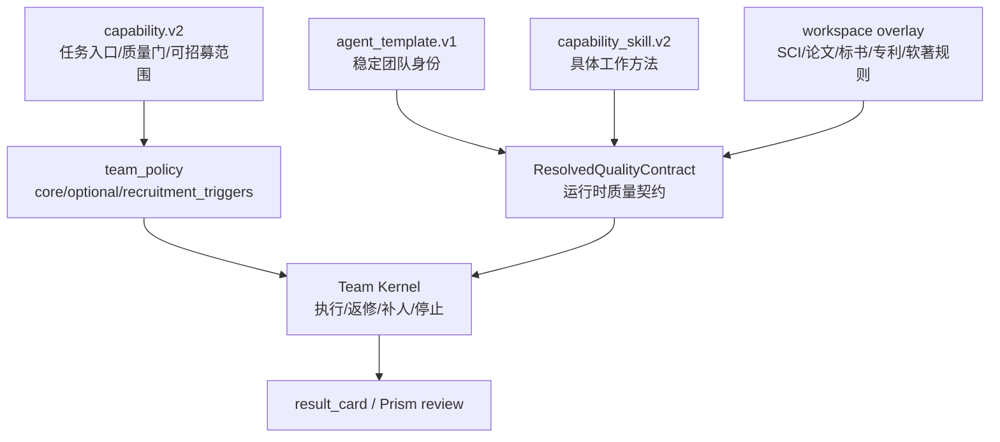
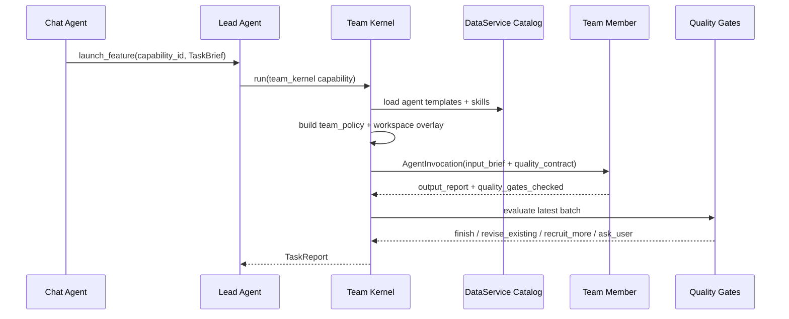

# Research And Writing Agent Foundation

Date: 2026-05-30
Status: Design ready for review
Scope: agent template catalog, capability skill catalog, workspace overlays, team quality contracts, Team Kernel recruitment policy
Related:

- `docs/superpowers/specs/2026-05-30-team-realname-agent-architecture.md`
- `docs/superpowers/specs/2026-05-30-team-quality-contract-adaptation.md`
- `docs/current/architecture.md`

## Goal

优化 agent 性能侧的第一阶段不直接追求“每个 workspace 新增大量 capability”，而是先建立一套通用科研/写作团队底座。

这里的“性能”定义为：

1. 产出质量更稳定：输出有证据链、结构、质量检查和返修闭环。
2. 能力覆盖更完整：同一套角色能覆盖文献、方法、实验、写作、审稿、合规。
3. 团队分工更直观：用户看到的是可理解的团队成员，而不是抽象 subagent 类型。
4. 后续扩展更便宜：新增 workspace 或 capability 时优先组合已有角色和 skills，而不是复制 prompt。
5. 安全边界不降低：工具权限保持能力上限，但 direct commit、引用伪造、实验结果伪造和沙箱越权继续被 hard gate 阻断。

## Non-Goals

- 不新增独立 workflow engine。
- 不新增独立 `quality_spec` catalog。
- 不在本阶段重做前端 execution UI。
- 不让 subagent 互相招募。动态招募仍由 Lead Agent / Team Kernel 统一控制。
- 不把所有旧 static graph capability 一次性迁移到 `team_kernel`。
- 不把外部 prompt 原文照搬进 seed；只提炼角色、流程和质量门模式。
- 不把工具权限收紧成低能力 agent。工具能力上限应由 runtime effective tools、workspace policy 和 safety gate 控制。

## Current Architecture Fit

当前主链路保持不变：

```text
Chat Agent
  -> launch_feature
  -> ExecutionRecord
  -> Lead Agent v2
  -> Team Kernel
  -> AgentInvocation
  -> TaskReport
  -> result_card / Prism review
  -> user accept
  -> Rooms / Prism commit
```

本设计只扩展 DataService catalog 的内容和 Team Kernel 已有派生逻辑：

| Existing Layer | Current Responsibility | Foundation Extension |
| --- | --- | --- |
| `capability.v2` | 任务入口、workspace type、quality gates、runtime mode | 声明可招募角色范围、workspace overlay、能力级质量门 |
| `team_policy` | core / optional templates、limits、recruitment triggers | 细化 trigger taxonomy，避免 Leader 凭空补人 |
| `agent_template.v1` | 团队成员身份、persona、默认 skills、工具偏好 | 扩充稳定角色池，保持跨 workspace 可复用 |
| `capability_skill.v2` | subagent 工作方法、role prompt、tool policy、IO contract | 收敛为方法级 skill taxonomy 和可 gate 输出 schema |
| `ResolvedQualityContract` | 运行时派生质量契约 | 合并 workspace overlay、skill schema、must/should/may rules |
| Team Kernel | core 执行、质量门、动态招募、报告输出 | 更可靠地返修、补人、停止或要求用户决策 |

## External Reference Signals

外部项目给出的有效模式如下：

- DeerFlow 使用 Coordinator / Planner / Researcher / Coder / Reporter 分层，Planner 强制区分信息收集与处理步骤，Researcher 强调工具检索和 source attribution。
- Academic Research Agent Skill 强调 human approval gates、evidence before claims、source matrix、novelty gate、claim verification。
- Agent Laboratory 将科研拆成 literature review、experimentation、report writing，并强调用户反馈、模型/成本分层和 checkpoint。
- LiRA 将文献综述拆为结构规划、细粒度写作、一致性修订、事实核验，说明文献综述质量来自多角色协作，而不是单一长 prompt。

这些参考只进入 Wenjin 的抽象设计，不作为直接 prompt 文案来源。

Reference URLs:

- https://github.com/bytedance/deer-flow
- https://raw.githubusercontent.com/bytedance/deer-flow/main/src/prompts/planner.md
- https://raw.githubusercontent.com/bytedance/deer-flow/main/src/prompts/researcher.md
- https://github.com/ngtiendong/Academic-Research-Agent-Skill
- https://raw.githubusercontent.com/ngtiendong/Academic-Research-Agent-Skill/main/SKILL.md
- https://github.com/SamuelSchmidgall/AgentLaboratory
- https://ojs.aaai.org/index.php/AAAI/article/download/41489/45450

## Core Decision

先建立“通用角色池 + 方法型 skills + workspace overlay + 质量契约”的底座。



管理员后续主要维护三类对象：

1. `agent_template.v1`：这个人是谁，面向用户显示什么职责。
2. `capability_skill.v2`：这个人会用什么工作方法，输出什么结构。
3. `capability.v2.team_policy`：某个任务允许 Leader 组建什么团队，何时补谁。

不要新增第四个长期业务对象承载质量规范。质量规范由 capability / template / skill / overlay 派生到 runtime contract。

## Stable Agent Template Pool

第一阶段将内置团队身份收敛为 11 个稳定模板。它们是“可被 Leader 随时招募的人”，不是 workspace-specific capability。

| Template ID | Display Role | Category | Primary Responsibility | Default Skill Families |
| --- | --- | --- | --- | --- |
| `research_planner.v1` | 研究规划师 | planning | 澄清目标、拆解检索/处理/写作步骤、给出可执行路线 | `query-planner`, `task-scope-planner` |
| `research_scout.v1` | 文献检索员 | research | 搜索、筛选、source log、Library-ready metadata | `source-screener`, `research-scout` |
| `literature_synthesizer.v1` | 文献综合专家 | research | 主题矩阵、gap、claim-evidence map、related work 分组 | `literature-synthesizer`, `novelty-mapper` |
| `methodologist.v1` | 方法学顾问 | method | 研究设计、变量/指标、数据采集、基线、可行性 | `method-design`, `reporting-guideline-checker` |
| `evidence_analyst.v1` | 实验分析工程师 | evidence | 可复现分析、数据/代码核验、结果解释、限制 | `evidence-analyst`, `reproducibility-auditor` |
| `figure_table_engineer.v1` | 图表工程师 | evidence | 表格、图、caption、图文一致性、可视化产物 | `figure-engineer`, `table-builder` |
| `document_architect.v1` | 文档架构师 | writing | 章节结构、论证流、目标格式、材料编排 | `manuscript-architect`, `document-outline-builder` |
| `manuscript_writer.v1` | 正文写手 | writing | 正文草稿、Prism staged change、保守写作和证据缺口标记 | `manuscript-writer`, `style-polisher` |
| `citation_auditor.v1` | 引用审计员 | review | citation key、BibTeX 投影、来源真实性、引用缺口 | `citation-auditor`, `source-quality-auditor` |
| `critical_reviewer.v1` | 质量审稿人 | review | severe finding、required fix、residual risk、审稿视角 | `review-critic`, `claim-verifier` |
| `generalist_assistant.v1` | 综合助理 | generalist | 摘要、上下文压缩、补位整理、低风险任务 | `structured-summary`, `review-critic` |

### Template Rules

- Template 命名使用领域身份，不使用具体 workspace 命名。
- `display_role` 面向用户，必须直观。
- `persona_prompt` 只描述身份、工作边界和高层行为，不承载大量任务细节。
- `default_skills` 绑定常用方法，但 capability 可以通过 `capability_skills` 限制实际可用 skill。
- `tool_affinity` 表达偏好和可请求工具，不直接提权。
- `risk_profile.room_write` 必须继续是 `staged_only`。

## Skill Foundation

Skill 是方法，不是人名。一个 agent template 可以组合多个 skill，一个 skill 也可以被多个 template 复用。

### Skill Families

| Family | Skill IDs | Purpose |
| --- | --- | --- |
| Scope / Planning | `task-scope-planner`, `query-planner`, `workflow-plan-builder` | 把模糊任务拆成可执行步骤和缺口 |
| Research | `research-scout`, `source-screener`, `literature-synthesizer`, `novelty-mapper` | 检索、筛选、综合、创新点定位 |
| Method / Evidence | `method-design`, `evidence-analyst`, `reproducibility-auditor`, `data-result-interpreter` | 方法设计、实验计划、数据分析、结果解释 |
| Writing | `manuscript-architect`, `document-outline-builder`, `manuscript-writer`, `style-polisher` | 结构、正文、改写、语言一致性 |
| Review | `claim-verifier`, `citation-auditor`, `source-quality-auditor`, `review-critic`, `format-compliance-checker` | 事实、引用、来源、质量、格式审查 |
| Artifact | `figure-engineer`, `table-builder`, `latex-compile-advisor` | 图表、LaTeX、可视化和可审阅 artifact |
| Domain Overlay | `sci-journal-rules`, `thesis-school-rules`, `proposal-panel-rules`, `patent-examiner-rules`, `software-copyright-rules` | workspace-specific 标准和审查视角 |

### Skill Output Contract Baseline

所有新增或重构后的 skill 至少声明以下输出字段：

```yaml
io_contract:
  output_schema:
    type: object
    required:
      - text
      - quality_gates_checked
    properties:
      text:
        type: string
      quality_gates_checked:
        type: array
        items:
          type: string
      open_questions:
        type: array
        items:
          type: string
      decision_candidates:
        type: array
        items:
          type: object
```

具体 family 追加结构化字段：

| Family | Required Extra Fields |
| --- | --- |
| Research | `query_log`, `included_sources`, `borderline_sources`, `rejected_sources`, `source_gaps` |
| Synthesis | `synthesis_matrix`, `claim_evidence_map`, `controversies`, `research_gaps` |
| Method | `design_options`, `assumptions`, `metrics`, `baselines`, `feasibility_risks` |
| Evidence | `input_inventory`, `analysis_plan`, `verified_results`, `limitations`, `artifact_refs` |
| Writing | `upstream_outputs_used`, `draft_or_patch`, `unsupported_claims`, `revision_notes` |
| Review | `findings_by_severity`, `required_fixes`, `residual_risks` |
| Citation | `citation_key_audit`, `missing_sources`, `fabrication_risks`, `bibtex_projection_notes` |
| Format | `checked_requirements`, `violations`, `fixes`, `unverified_requirements` |

These fields make quality gates deterministic enough to drive revision and recruitment without requiring a heavyweight LLM judge on every loop.

## Workspace Overlays

Workspace overlay is a small set of domain rules merged into `ResolvedQualityContract`.

It should not fork the core role templates. The same `citation_auditor.v1` can work in SCI, thesis, proposal, patent, and software copyright; the overlay changes what it checks.

| Workspace Type | Overlay Skill | Main Rules |
| --- | --- | --- |
| `sci` | `sci-journal-rules` | target journal fit, article type, IMRaD or journal structure, reporting guideline, data/code availability, limitations, cover/reviewer sensitivity |
| `thesis` | `thesis-school-rules` | school template, chapter structure, Chinese academic tone, advisor/defense committee perspective, terminology consistency, reference style |
| `proposal` | `proposal-panel-rules` | background necessity, innovation, technical route, feasibility, milestones, risk controls, review panel persuasiveness |
| `patent` | `patent-examiner-rules` | novelty, inventive step, claim scope, embodiments, prior art, office action sensitivity, no unsupported legal certainty |
| `software_copyright` | `software-copyright-rules` | module structure, technical manual, version/code evidence, originality expression, application material consistency |

### Overlay Merge Rules

1. Capability workspace type selects default overlay skills.
2. Capability can opt out of overlay only by explicit config and test coverage.
3. Overlay adds `must_rules`, `should_rules`, `quality_gates`, and optional schema fields.
4. Overlay cannot grant tools.
5. Overlay cannot weaken platform hard rules.

## Team Policy Patterns

Team policy should express a small team for common tasks, then rely on dynamic recruitment when gaps appear.

### Pattern: Research-First Writing

Use for literature positioning, research pack, background pack, proposal background, prior art.

```yaml
core_templates:
  - research_planner.v1
  - research_scout.v1
  - literature_synthesizer.v1
optional_templates:
  - citation_auditor.v1
  - document_architect.v1
  - critical_reviewer.v1
  - generalist_assistant.v1
recruitment_triggers:
  missing_sources:
    - research_scout.v1
  unsupported_claims:
    - citation_auditor.v1
    - critical_reviewer.v1
  writing_needed:
    - document_architect.v1
```

### Pattern: Evidence-To-Manuscript

Use for empirical package, reproducibility audit, result interpretation, figure/table work.

```yaml
core_templates:
  - methodologist.v1
  - evidence_analyst.v1
  - critical_reviewer.v1
optional_templates:
  - figure_table_engineer.v1
  - citation_auditor.v1
  - manuscript_writer.v1
  - generalist_assistant.v1
recruitment_triggers:
  experiment_gap:
    - evidence_analyst.v1
  figure_table_needed:
    - figure_table_engineer.v1
  drafting_ready:
    - manuscript_writer.v1
```

### Pattern: Draft-And-Review

Use for manuscript drafting, proposal writing, patent drafting, software technical manual.

```yaml
core_templates:
  - document_architect.v1
  - manuscript_writer.v1
  - critical_reviewer.v1
optional_templates:
  - research_scout.v1
  - citation_auditor.v1
  - methodologist.v1
  - generalist_assistant.v1
recruitment_triggers:
  source_gap:
    - research_scout.v1
  citation_gap:
    - citation_auditor.v1
  format_risk:
    - critical_reviewer.v1
```

The examples above define patterns, not new runtime modes. They are reusable authoring conventions for `capability.v2.team_policy`.

## Quality Gates

### Platform Hard Gates

These gates apply regardless of workspace:

- `no_direct_primary_document_write`
- `no_direct_room_commit`
- `no_fabricated_sources`
- `no_fabricated_results`
- `sandbox_policy_respected`
- `protected_sections_readonly`
- `result_card_review_before_commit`
- `quality_contract_acknowledged`

### Foundation Gates

These gates are reusable across capabilities:

| Gate | Trigger | Expected Runtime Action |
| --- | --- | --- |
| `query_strategy_recorded` | Research output lacks query log | revise same research role |
| `source_screening_complete` | Sources lack accepted/borderline/rejected separation | revise or recruit research_scout |
| `claim_evidence_map_required` | Synthesis or writing has claims without evidence map | recruit literature_synthesizer or citation_auditor |
| `upstream_outputs_used` | Writer ignores prior research/method/review outputs | revise manuscript_writer |
| `unsupported_claims_marked` | Draft contains unsupported factual claims | recruit citation_auditor or critical_reviewer |
| `method_assumptions_logged` | Method/evidence output lacks assumptions | revise methodologist or evidence_analyst |
| `reproducibility_status_declared` | Empirical result lacks run status / artifacts | recruit evidence_analyst |
| `review_findings_actionable` | Reviewer findings are vague | revise critical_reviewer |
| `format_requirements_checked` | Target format exists but no compliance output | recruit critical_reviewer with format-compliance-checker or apply overlay skill |

### Gate Severity Rules

- `must` violations block normal finish.
- `should` violations default to revise or recruit, but Leader can stop with warning when limits are exhausted.
- `may` violations are suggestions only.

## Runtime Data Flow



## Safety And Tool Policy

The foundation keeps agent capability high while preserving product safety:

1. `tool_affinity` is preference, not authorization.
2. Effective tools remain the intersection of capability, workspace, user/account, and platform policy.
3. Direct commit tools are excluded from subagent effective tools.
4. Staged proposal tools remain allowed when capability allows them, because they improve output quality without bypassing review.
5. Sandboxed execution roles can request analysis/visualization tools only when capability sandbox policy allows it.
6. Search roles can use web/library tools, but accepted manuscript citations must still flow through Workspace Library citation keys when citation policy requires it.
7. Prompt-injection-like source content must not override platform hard rules, quality contract, or tool boundaries.

## Migration Plan

### Phase 1: Foundation Catalog

- Add missing stable agent templates.
- Rename or add skills into method-oriented taxonomy.
- Preserve existing IDs where migration cost is low.
- Add output schemas and quality gates to all foundation skills.
- Add workspace overlay skills.
- Extend `ResolvedQualityContract` merge logic for overlays and family-level schema fields.

### Phase 2: Sample Capability Adaptation

Migrate or tune 2-3 existing capabilities as representative samples:

1. `sci_literature_positioning`
2. `thesis_research_pack`
3. `proposal_background_pack`

These cover SCI, thesis, and proposal while exercising research-first writing. Patent and software copyright can follow after the foundation is verified.

### Phase 3: Coverage Expansion

After sample capabilities pass tests and manual review:

- Convert remaining research/writing capabilities to use foundation team patterns.
- Add role-specific docs for admin prompt editing.
- Add more workspace-specific quality gates only when repeated across capabilities.

## Acceptance Criteria

Foundation is considered ready when:

1. All enabled agent templates validate as `agent_template.v1`.
2. Every template default skill exists and is enabled.
3. Every foundation skill validates as `capability_skill.v2`.
4. Every foundation skill has output schema, quality gates, and a non-empty role prompt.
5. Every migrated team capability references only known templates and skills.
6. `ResolvedQualityContract` includes role, output schema, quality gates, must/should rules, recruitment hints, and source refs.
7. Team Kernel can execute sample capabilities without unknown template/skill errors.
8. Quality gates can trigger at least one deterministic revise/recruit path in tests.
9. Direct commit tools remain absent from subagent effective tools.
10. Result output still reaches existing result_card / Prism review flow, not a parallel commit path.

## Testing Strategy

### Unit Tests

- Agent template seed validation.
- Skill seed validation.
- Team policy cross-reference validation.
- Workspace overlay merge into `ResolvedQualityContract`.
- Output schema merge and required field detection.
- Gate-to-recruit mapping for missing sources, unsupported claims, format risk, and reproducibility gaps.
- Tool effective policy still blocks direct commit tools.

### Integration Tests

- Run `sci_literature_positioning` through team kernel with mock subagent outputs.
- Verify dynamic recruitment uses only allowed templates.
- Verify missing quality fields trigger revise/recruit rather than silent completion.
- Verify final `TaskReport` contains user-reviewable outputs.
- Verify citation/source gates do not fabricate citation keys.

### Manual Review

- Inspect generated team member names and roles in execution stream.
- Review result_card content for user clarity.
- Review representative outputs for evidence chain, open questions, and residual risks.

## Risks And Mitigations

| Risk | Mitigation |
| --- | --- |
| Too many roles make team selection noisy | Keep first phase to 11 templates and 3 team patterns |
| Output schemas make agents rigid | Keep universal fields small; use family-specific fields only for quality-critical paths |
| Prompt length grows too much | Put stable rules in skills/templates and derive compact quality contracts at runtime |
| Workspace overlay duplicates capability rules | Overlay only defines repeated workspace-wide standards; capability owns task-specific gates |
| Leader loses autonomy | Use must/should/may levels; only must violations block finish |
| Tool access becomes unsafe | Keep high tool ceiling but enforce runtime effective tools and direct-commit exclusion |
| Existing capabilities break | Migrate only sample capabilities first; keep static graph support unchanged |

## Open Implementation Choices

These are implementation choices, not design blockers:

1. Whether `format_compliance_specialist.v1` should later become a separate template or remain expressed as `critical_reviewer.v1` with `format-compliance-checker`.
2. Whether overlay skills should be auto-injected by workspace type or explicitly listed in each capability. Recommended default: auto-inject with capability opt-out.
3. Whether family-specific required fields should be strict `required` schema fields immediately or begin as quality-gate expectations. Recommended default: make `text` and `quality_gates_checked` strict first; add family fields as gates during sample migration.

## Implementation Boundary

The next implementation plan should avoid broad rewrite. It should touch:

- `backend/seed/agent_templates/`
- `backend/seed/skills/`
- selected sample files under `backend/seed/capabilities/`
- `backend/src/agents/lead_agent/v2/team/quality_contract.py`
- `backend/src/agents/lead_agent/v2/team/quality_gates.py`
- relevant tests under `backend/tests/agents/lead_agent/v2/` and seed validation tests

It should not touch:

- frontend design language
- execution SSOT model
- commit service flow
- router-level launch flow
- DataService schema unless current catalog loader already requires a validation field extension

## Self-Review

- Placeholder scan: no unresolved placeholders.
- Consistency check: the design keeps Chat Agent -> Lead Agent -> Team Kernel as the single execution path and does not introduce a parallel workflow engine.
- Scope check: the first implementation phase is limited to catalog foundation, quality-contract merge, quality gates, and 2-3 sample capabilities.
- Ambiguity check: workspace overlays are runtime-derived rules, not new catalog records; tool authority remains effective-tool policy, not template prompt text.
