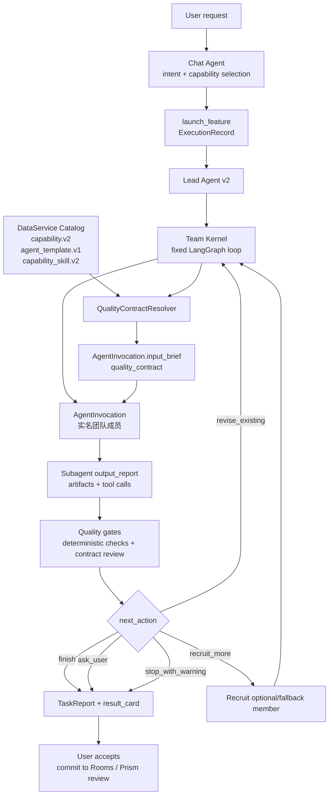

# Team Quality Contract Adaptation

Date: 2026-05-30
Status: Design ready for review
Scope: Chat Agent -> Lead Agent -> Team Kernel dynamic recruitment loop, capability/team policy, agent templates, capability skills, quality gate evaluation
Related: `docs/superpowers/specs/2026-05-30-team-realname-agent-architecture.md`

## Goal

把“团队实名制 agent”架构里的动态招募循环补上质量闭环，但不把系统扩展成第二套工作流平台。

目标是让后续扩充 subagent 角色、改进角色提示词、调整工作流和提升生成质量时，有一套稳定的 schema-like 业务规范可依赖：

1. Chat Agent 仍然只负责识别用户意图、选择 capability、发起任务。
2. Lead Agent 仍然是团队负责人，读取 capability / agent template / skill 配置后组织团队。
3. Team Kernel 仍然是固定 LangGraph 控制循环，用运行时 `AgentInvocation` 表达动态团队。
4. 质量规范来自现有 DataService catalog，不新增独立 `quality_spec` catalog。
5. Leader Agent 获得轻量约束和决策辅助，但保留足够自主空间。

## Background

当前已经具备团队化架构的骨架：

- `capability.v2` 定义任务入口、工作空间类型、质量门、运行模式和 `team_policy`。
- `agent_template.v1` 定义可被 Leader 招募的专家角色、默认 skills、工具偏好、风险画像、输出契约和质量期望。
- `capability_skill.v2` 定义 subagent 可执行的工作方法、输入输出契约、工具策略和质量门。
- `TeamKernelRuntime` 负责 core team 执行、质量门评估、动态补位招募和最终 `TaskReport` 输出。
- `QualityGateResult` 已经能表达 pass / warning / fail、required fixes、suggested recruits 和 next action。

缺口在于：这些字段目前还没有被收敛成一个清晰的运行时质量契约。质量门更多是字符串和提示词约定，Team Kernel 的质量判断还偏薄，动态招募循环无法充分理解“为什么要返工、为什么要补人、补谁、补完怎么判定足够好”。

本 spec 解决这个缺口。

## Non-Goals

- 不新增 `quality_spec.v1` DataService catalog。
- 不新增独立 workflow engine，不绕过现有 Chat Agent -> Lead Agent -> ExecutionRecord -> result_card -> Rooms 主链路。
- 不让 subagent 互相招募。动态招募仍由 Lead Agent / Team Kernel 统一决策。
- 不把质量判断全部交给重型 LLM judge。第一阶段优先做确定性契约解析、结构校验、轻量 gate 和可解释的循环决策。
- 不修改前端主设计语言，也不新增第二套 execution UI 状态。

## Core Decision

引入一个运行时派生概念：`ResolvedQualityContract`。

它不是新的 DataService 记录，也不是新的 YAML 顶层对象；它由 Team Kernel 在每次创建 `AgentInvocation` 前，从现有 DataService catalog 派生出来，并注入 member `input_brief`。

```text
capability.v2
  + capability.team_policy
  + agent_template.v1
  + capability_skill.v2
  -> ResolvedQualityContract
  -> AgentInvocation.input_brief.quality_contract
  -> Subagent output
  -> QualityGateResult
  -> finish | revise_existing | recruit_more | ask_user | stop_with_warning
```

这个设计让架构收敛在现有业务对象上：管理员继续维护 capability、agent template、skill；Leader 继续按团队模式工作；Team Kernel 只多一个质量契约解析层和更明确的 gate 决策。

## Target Architecture



## DataService Source Of Truth

### Existing Records

| Record | Fields Used For Quality Contract |
| --- | --- |
| `capability.v2` | `quality_gates`, `team_policy.quality_pipeline`, `team_policy.recruitment_triggers`, `review_policy`, `citation_policy`, `sandbox_policy`, `mission.allowed_deliverables` |
| `agent_template.v1` | `display_role`, `persona_prompt`, `default_skills`, `risk_profile`, `output_contracts`, `quality_expectations`, `tool_affinity` |
| `capability_skill.v2` | `io_contract.input_schema`, `io_contract.output_schema`, `quality_gates`, `tool_policy.allowed_tools`, `context_access`, `sandbox_access`, `worker.role_prompt` |
| Runtime policy | effective tools, effective skills, workspace policy, user/account policy, sandbox policy |

### No New Catalog In This Phase

不新增独立 `quality_spec` 的原因：

1. 当前质量信息已经分布在 capability、template、skill 三个合理归属中。
2. 用户后续最常改的是 subagent 角色和提示词，维护入口应该仍在 agent template / skill。
3. 动态招募问题是 Team Kernel runtime 解析与决策问题，不需要先升级成 DataService 新领域。
4. 新 catalog 会引入同步、版本、引用和 admin UI 成本，短期会增加架构复杂度。

后续只有在以下条件同时出现时，才把质量规则提升为独立 catalog：

- 同一类质量规则被多个 workspace type / capability 大量重复。
- admin 需要单独版本化质量规则并跨 capability 复用。
- `ResolvedQualityContract` 的派生逻辑变得难以从 capability / template / skill 解释。

## ResolvedQualityContract

### Contract Shape

`ResolvedQualityContract` 是运行时内部模型，建议位置：

`backend/src/agents/lead_agent/v2/team/quality_contract.py`

建议字段：

```python
class ResolvedQualityContract(BaseModel):
    schema_version: Literal["resolved_quality_contract.v1"] = "resolved_quality_contract.v1"
    capability_id: str
    template_id: str
    skill_ids: list[str]
    role: str
    output_contracts: list[str]
    output_schema: dict[str, Any]
    quality_gates: list[str]
    quality_expectations: list[str]
    must_rules: list[str]
    should_rules: list[str]
    may_rules: list[str]
    recruitment_hints: dict[str, list[str]]
    source_refs: dict[str, list[str]]
```

其中：

- `output_contracts` 来自 agent template，是角色级产物类型约束。
- `output_schema` 由 effective skills 的 `io_contract.output_schema` 合并而来。
- `quality_gates` 合并 capability、team policy、agent template、effective skills 的质量门。
- `quality_expectations` 来自 agent template 和 skill prompt 中已结构化的规则。
- `must_rules` 是硬约束，违反后不能正常完成。
- `should_rules` 是质量建议，Leader 可带原因降级为 warning。
- `may_rules` 是风格或偏好，不应阻断产出。
- `recruitment_hints` 把质量问题映射到可招募模板。
- `source_refs` 记录这些规则来自哪些 catalog 字段，便于审计和调试。

### Merge Rules

解析顺序固定，保证可测试、可解释：

1. capability mission / review / citation / sandbox policy 生成全局 rules。
2. `team_policy.quality_pipeline` 和 `capability.quality_gates` 进入 gate 列表。
3. agent template 的 `output_contracts`、`quality_expectations`、`risk_profile` 进入角色级规则。
4. effective skills 的 `io_contract.output_schema`、`quality_gates`、`tool_policy` 进入技能级规则。
5. `team_policy.recruitment_triggers` 转换为 `recruitment_hints`。
6. 对同类字符串去重，保留首次出现顺序。
7. resolver 不修改 DataService record，只返回派生对象。

### Example

```json
{
  "schema_version": "resolved_quality_contract.v1",
  "capability_id": "thesis_reference_curation",
  "template_id": "research_scholar.v1",
  "skill_ids": ["research-scout", "citation-auditor"],
  "role": "文献专家",
  "output_contracts": ["literature_evidence_report.v1", "citation_quality_report.v1"],
  "quality_gates": [
    "no_direct_primary_document_write",
    "no_fabricated_sources",
    "source_log_required",
    "query_strategy_recorded"
  ],
  "must_rules": [
    "Do not fabricate bibliographic metadata.",
    "Do not write canonical workspace room state directly.",
    "Every accepted source must include traceable title, year/date, venue or URL/DOI when available."
  ],
  "should_rules": [
    "Separate included, borderline, and rejected sources.",
    "Mark missing DOI/pages/venue explicitly instead of guessing."
  ],
  "may_rules": [
    "Prefer compact tables when source count is high."
  ],
  "recruitment_hints": {
    "missing_sources": ["research_scholar.v1"],
    "unsupported_claims": ["critical_reviewer.v1"]
  },
  "source_refs": {
    "quality_gates": [
      "capability.quality_gates",
      "skill.research-scout.quality_gates",
      "skill.citation-auditor.quality_gates"
    ]
  }
}
```

## Leader Guardrails

约束 Leader Agent 时，规则必须轻重分层，避免把团队能力压死。

| Level | Meaning | Runtime Behavior |
| --- | --- | --- |
| `must` | 安全、写入边界、引用真实性、保护区、强结构要求 | 违反后不能正常 finish；必须 revise、recruit_more、ask_user 或 stop_with_warning |
| `should` | 影响质量但不一定阻断，如证据完整性、解释充分性、最终审稿建议 | 默认要求修复；Leader 可给出理由降级为 warning |
| `may` | 风格、篇幅、组织偏好 | 只进入提示词和审阅建议，不阻断流程 |

基础 hard rules：

- subagent 不直接写入 canonical Rooms / Prism 主稿，只能 staged output / review item。
- 引用、来源、实验结果、代码运行结论不能编造。
- `citation_policy.required_for_prism_manuscript` 命中时，Prism 相关输出必须保留 citation gap。
- sandbox / tool access 只能来自 runtime effective tools，不因 template 自述而提权。
- protected section / direct apply 类操作必须走既有 review / commit 链路。

## Runtime Flow

### Launch

Chat Agent 根据用户请求和 capability 数据发起 `launch_feature`。Chat Agent 不需要理解团队细节，也不直接选择 subagent。

### Team Setup

Lead Agent / Team Kernel：

1. 加载 enabled `agent_template.v1`。
2. 构造 `CapabilityTeamPolicy`。
3. 根据 `core_templates` 创建第一批实名 `AgentInvocation`。
4. 解析 effective tools / effective skills。
5. 调用 `QualityContractResolver` 生成 `quality_contract`。
6. 将 `quality_contract` 注入 `input_brief`。

### Member Execution

subagent 收到：

- 用户原始任务和结构化 brief。
- 自己的 `team_role`、`display_name`、`team_blackboard`。
- effective tools / skills。
- `quality_contract`。

subagent 输出应尽量包含：

- `summary` / `text` / `report_markdown` 之一。
- `quality_gates_checked`，列出自己实际检查过的 gates。
- `open_questions`，列出需要用户或其他成员补齐的问题。
- 领域产物字段，例如 sources、claims、experiments、patches、figures。

### Quality Evaluation

每轮 batch 完成后，Team Kernel 运行 gate：

1. 成员是否失败或取消。
2. 是否产出可展示文本。
3. 是否满足 skill output schema 的最低结构要求。
4. 是否确认了声明的 quality gates。
5. 是否出现 hard rule 违反。
6. 是否存在可由 optional/fallback template 解决的 gap。

gate 输出 `QualityGateResult`，并通过 `execution.team.quality_gate` 事件进入 execution stream。

### Dynamic Recruitment

当 gate 给出 `next_action = recruit_more`：

1. Team Kernel 从 `suggested_recruits` 读取候选 template。
2. 候选必须存在于 `team_policy.core_templates` 或 `team_policy.optional_templates`。
3. 候选必须满足 `max_invocations_total`、`max_parallel_invocations`、`max_invocations_per_template`。
4. 新成员获得上一轮 blackboard、相关 gap、quality_contract。
5. 新一轮完成后再次评估 gate。

当 gate 给出 `next_action = revise_existing`：

- 优先要求同一 role 返修，避免无意义扩队。
- 如果同一 role 已达到 per-template 限制，再按 recruitment hints 选择补位 agent。

## Gate To Recruitment Mapping

| Gate Finding | Default Action | Preferred Recruit |
| --- | --- | --- |
| `missing_sources` | `recruit_more` | `research_scholar.v1` |
| `unsupported_claims` | `recruit_more` | `critical_reviewer.v1` |
| `code_or_experiment_required` | `recruit_more` | `code_engineer.v1`, `experiment_runner.v1` |
| `tables_or_figures_required` | `recruit_more` | `data_analyst.v1`, `figure_table_specialist.v1` |
| `format_or_submission_risk` | `recruit_more` | `format_compliance_specialist.v1` |
| `unclear_user_decision` | `ask_user` | none |
| `member_failed` | `recruit_more` if replacement exists, else `stop_with_warning` | trigger-defined fallback |
| `output_schema_violation` | `revise_existing` first, then `recruit_more` if repeated | same template or `generalist_assistant.v1` |
| `must_rule_violation` | `revise_existing` or `stop_with_warning` | `critical_reviewer.v1` for reviewable violations |

Team Kernel 不应该凭空生成 template id。所有招募建议必须来自 `team_policy.recruitment_triggers` 或当前 policy 允许的 template 集合。

## Quality Checks

第一阶段建议实现以下轻量 checks。

### `member_output_available`

通过条件：

- invocation succeeded。
- `output_report` 中存在非空 `summary`、`report_markdown`、`markdown` 或 `text`。

失败处理：

- 单个成员失败：warning。
- core member 全部无有效输出：fail。
- 有 replacement trigger：`recruit_more`。
- 无 replacement trigger：`stop_with_warning`。

### `output_schema_min_shape`

通过条件：

- skill `io_contract.output_schema.type == object` 时，output 是 object。
- schema 声明的 required 字段存在。
- 常见字段类型匹配：string / array / object / boolean / number。

失败处理：

- 第一次：`revise_existing`。
- 重复失败或达到 template limit：`recruit_more` 或 `stop_with_warning`。

### `quality_gates_acknowledged`

通过条件：

- 当 effective skill 声明 `quality_gates` 时，output 中的 `quality_gates_checked` 至少覆盖 must gates。

失败处理：

- 如果缺失的是 `must` gate：`revise_existing`。
- 如果缺失的是 `should` gate：warning，可由 Leader 降级。

### `no_direct_commit_intent`

通过条件：

- invocation tool calls 不包含 direct commit 工具。
- output 不宣称已直接写入 canonical Rooms / Prism。

失败处理：

- hard fail。
- 输出只能作为 staged review material。
- 记录到 `quality_gate_history`。

### `citation_and_evidence_required`

通过条件：

- 对要求引用的 capability，涉及事实性 claim 的输出必须带 source ids、citation gaps 或 explicit uncertainty。
- 未进入 Workspace Library 的 source 只能作为 candidate，不应直接伪装成已入库 citation。

失败处理：

- `missing_sources` 或 `unsupported_claims`。
- 根据 recruitment hints 招募 `research_scholar.v1` 或 `critical_reviewer.v1`。

## Data Validation

### Capability Validation

`runtime.mode = team_kernel` 的 capability 应满足：

- 必须有 `team_policy`。
- `core_templates` 和 `optional_templates` 至少一个非空。
- `recruitment_triggers` 中引用的 template 必须存在，并且在当前 policy 可招募集合内。
- 新增或迁移后的 team capability 应声明非空 `team_policy.quality_pipeline`。
- `quality_pipeline` 和 `quality_gates` 应使用非空字符串 id。

### Agent Template Validation

`agent_template.v1` 应满足：

- `display_role` 面向用户可读。
- `default_skills` 指向 enabled skill。
- `output_contracts` 和 `quality_expectations` 使用短句或稳定 contract id，不写大段自由说明。
- `tool_affinity` 只表达偏好，不表达最终权限。

### Skill Validation

`capability_skill.v2` 应满足：

- `io_contract.output_schema` 是 object schema。
- 如声明 `quality_gates`，输出 schema 应支持 `quality_gates_checked`。
- `tool_policy.allowed_tools` 不能包含 direct commit tools。
- `sandbox_access` 不能扩大 capability sandbox policy。

## Execution UX Projection

现有 execution projection 不需要重建。质量闭环只增加事实：

- `execution.team.invocation`：显示成员实名、角色、状态、招募原因。
- `execution.team.quality_gate`：显示质量门状态、warning/fail 数量、下一步动作。
- `node_metadata.team = true`：让 LiveWorkflowPanel / Runs drawer 能识别团队成员节点。

前端原则：

- 用户看到的是“谁在干什么、为什么补人、还有什么风险”。
- 不展示内部 schema 细节。
- result_card 仍然是最终用户确认入口。
- 默认全选和“全部接受”流程不变。

## Safety Model

能力上限可以高，但权限必须由 runtime 收口：

1. Template 可以声明 `preferred` / `can_request` tools。
2. Capability、workspace、user/account policy 共同计算 effective tools。
3. Direct commit tools 在 team member 层默认移除。
4. Sandbox 访问由 capability sandbox policy 和 skill sandbox access 共同决定。
5. 所有写入仍经过 staged output / review item / user acceptance。
6. quality gate 记录 must-rule 违反，供 run history 和后续调试使用。

## Implementation Plan

### Phase 1: Runtime Contract Resolver

Create `backend/src/agents/lead_agent/v2/team/quality_contract.py`:

- 定义 `ResolvedQualityContract`。
- 定义 `QualityContractResolver`。
- 从 capability、template、effective skills、team policy 合并质量契约。
- 保证 deterministic order 和 dedupe。
- 单元测试覆盖合并、空字段、重复 gate、trigger 转换和 source refs。

### Phase 2: Invocation Brief Integration

Modify Team Kernel:

- 在 `_build_invocation_batch` 中解析 effective skills 后生成 `quality_contract`。
- 在 `_build_member_brief` 或 assignment 前注入 `quality_contract`。
- 保持 `AgentInvocation` contract 不新增独立持久化字段，仍通过 `input_brief` 记录。
- 事件和 node metadata 保持向后兼容。

### Phase 3: Lightweight Gate Evaluation

Extend `_run_quality_gates`:

- 增加 output availability check。
- 增加 output schema minimum-shape check。
- 增加 quality gate acknowledged check。
- 增加 direct commit intent check。
- 根据 finding 生成 `QualityGateResult.required_fixes`、`suggested_recruits` 和 `next_action`。

### Phase 4: Seed And Validation Convergence

Update seed/admin validation:

- team capability 的 template / trigger 引用继续强校验。
- skill output schema 的 object shape 做轻量校验。
- 新 team capability 要求显式 `quality_pipeline`。
- agent template 的 `output_contracts` / `quality_expectations` 保持短、稳定、可复用。

### Phase 5: Runtime Tests And Docs

Add focused tests:

- resolver unit tests。
- team kernel member brief 注入测试。
- quality gate next_action 映射测试。
- dynamic recruitment respects policy limits 测试。
- validation tests for invalid triggers / malformed schemas。

Run:

```bash
cd backend && .venv/bin/python -m pytest tests/ -v
```

## Acceptance Criteria

功能闭环达到以下状态才算完成：

- Leader 可从现有 DataService catalog 派生每个成员的 `quality_contract`。
- 每个 subagent invocation 都能看到自己的角色、技能、工具和质量要求。
- Team Kernel 能基于结构化 gate 判断 finish / revise / recruit / ask / warn。
- 动态招募只从当前 capability policy 允许的 template 中选择成员。
- 质量失败能解释原因、要求修复项、建议补位角色。
- 输出仍然进入 result_card staged review，不绕过用户确认。
- 后续扩充角色或 prompt 时，只需要改 agent template / skill / capability policy，不需要改主执行链路。

## Architecture After Convergence

收敛后的架构不是“更多层”，而是现有层之间职责更清楚：

```text
Chat Agent
  capability selection only

Lead Agent / Team Kernel
  planning, recruitment, dispatch, quality loop, final report

DataService Catalog
  capability, team policy, agent template, skill, quality metadata

QualityContractResolver
  runtime-only adapter from existing catalog records to member-level contract

Subagents
  execute assigned role with effective tools/skills and explicit quality contract

ExecutionRecord / result_card
  canonical execution fact and user-reviewed commit path
```

这保持了原始设计：Chat Agent 根据 capability 起任务，Lead Agent 根据任务和模板组建团队，给 subagent 分配 skills，Team Kernel 负责动态循环和质量闭环。区别只是把“质量要怎么判断、什么时候补人、补谁”从隐式提示词变成可测试、可审计、可逐步优化的运行时契约。
