# Architecture Hotspot Convergence Design

日期：2026-05-31
状态：Implementation started

## 1. 背景

本 spec 基于 2026-05-31 的 code-review-graph 全局扫描结果，用于规划 Wenjin 下一轮架构收敛拆分。目标不是为了“文件变短”而拆，而是降低关键路径的变更风险，让后续继续扩展 subagent、workflow schema、workspace sandbox、积分计费、模型后台、文献/写作能力时，有清晰的模块归属和测试边界。

图谱基线：

- Files: 1347
- Nodes: 12581
- Edges: 93711
- Tests: 2581
- 最大热点：
  - `frontend/components/latex/LatexEditorShell.tsx`：3340 行，degree 495
  - `frontend/app/(workbench)/workspaces/[id]/components/LiveWorkflowPanel.tsx`：3075 行，degree 147
  - `backend/src/dataservice_client/client.py`：3068 行，`AsyncDataServiceClient` degree 283，`_request` degree 283
  - `backend/src/dataservice/domains/source/service.py`：1200 行，`SourceDataDomainService` degree 115
  - `backend/src/gateway/routers/uploads.py`：573 行，`upload_thread_files` degree 128
  - `backend/src/agents/lead_agent/v2/sandbox_runtime.py`：626 行，`run_python_script` degree 105

## 2. 目标

1. 把高风险大文件拆成领域明确、外部契约稳定的小模块。
2. 保持现有用户体验、API contract、DataService contract 不变。
3. 每个拆分都配套单测或架构守卫，防止逻辑回流到旧热点文件。
4. 优先拆对后续产品迭代最有价值的边界：DataService client、Source domain、Execution UX、LaTeX editor、Upload/Sandbox。
5. 不引入兼容层、双路径、fallback 业务逻辑。拆分是 clean migration。

## 3. 非目标

- 不在本轮改变执行流、agent orchestration、workspace room 数据模型。
- 不重做 UI 视觉设计。
- 不迁移数据库 schema，除非拆分过程中发现明确 bug。
- 不一次性删除 code-review-graph 报出的所有 dead-code 候选。
- 不把 router 改成业务编排层；router 继续只做协议、鉴权、响应组装。

## 4. 总体原则

1. 外部入口稳定：HTTP path、DataService client 方法签名、frontend store contract 默认不变。
2. 先提纯函数 / service / hook，再移动 UI 或 runtime 入口。
3. 一个 PR 或一次实现只拆一个主边界，避免同时重构 source、sandbox、frontend。
4. 每拆一个边界，加一个防回流 guard。
5. 大组件拆分时优先抽 view model、hooks、pure utils，不先拆视觉布局。
6. 后端 domain service 拆分时保留 facade，router 和 DataService app 不直接依赖内部子 service。

## 5. 目标架构图

```mermaid
flowchart TD
  A["AsyncDataServiceClient shell"] --> A1["ExecutionDataServiceClientMixin"]
  A --> A2["SourceDataServiceClientMixin"]
  A --> A3["CreditDataServiceClientMixin"]
  A --> A4["ModelCatalogDataServiceClientMixin"]
  A --> A5["SandboxDataServiceClientMixin"]

  S["SourceDataDomainService facade"] --> S1["SourceImportService"]
  S --> S2["SourceAssetService"]
  S --> S3["SourceBibliographyService"]
  S --> S4["SourceProjectionService"]

  E["LiveWorkflowPanel shell"] --> E1["useLiveWorkflowViewModel"]
  E --> E2["RunHeader"]
  E --> E3["WorkflowTimeline"]
  E --> E4["TeamAndEvidencePanels"]
  E1 --> P["frontend/lib/execution-run-view.ts"]

  L["LatexEditorShell shell"] --> L1["useLatexProjectState"]
  L --> L2["useLatexCompile"]
  L --> L3["useLatexSynctexSelection"]
  L --> L4["Latex toolbar / panes"]

  U["uploads router"] --> U1["UploadApplicationService"]
  B["sandbox_runtime"] --> B1["SandboxEnvironmentInstaller"]
  B --> B2["SandboxJobRunner"]
```

## 6. 拆分清单

### 6.1 DataService client 领域 mixin

当前状态：

- `backend/src/dataservice_client/client.py` 已拆出 `execution_client.py`，但主 client 仍有 3068 行。
- `AsyncDataServiceClient` 仍是跨领域热点，后续新增 DataService API 可能继续塞回主文件。

要拆的模块：

| 新模块 | 内容 | 保留入口 |
|---|---|---|
| `execution_client.py` | execution、execution nodes、compute sessions、generation records | 已完成，继续保留 |
| `source_client.py` | source、reference、bibliography、citation usage、evidence pack、source assets | `AsyncDataServiceClient.*source*` 方法签名不变 |
| `credit_client.py` | credit summary、consume/refund、reservation、grant rules、redeem code、referral | `AsyncDataServiceClient.*credit*` 方法签名不变 |
| `model_catalog_client.py` | model catalog、runtime config、health、admin model CRUD | `AsyncDataServiceClient.*model*` 方法签名不变 |
| `pricing_client.py` | pricing policy、pricing simulation | `AsyncDataServiceClient.*pricing*` 方法签名不变 |
| `sandbox_client.py` | sandbox environment、job、lease、artifact | `AsyncDataServiceClient.*sandbox*` 方法签名不变 |
| `workspace_client.py` | workspace、settings、stats、template | 可放到第二批，先不阻塞核心链路 |

实现方式：

- `AsyncDataServiceClient` 只保留：
  - constructor / close / context manager
  - `livez` / `readyz`
  - `_request`
  - `_clean_request_params`
  - 尚未拆分领域的临时方法
- 领域方法移动到 mixin，主类通过多继承挂载。
- 不改变 import 方：业务代码仍 `from src.dataservice_client import AsyncDataServiceClient`。

测试与守卫：

- 每拆一个 mixin，补或迁移 `backend/tests/dataservice/test_foundation.py` 里的 MockTransport contract tests。
- 在 `backend/tests/architecture/test_dataservice_boundaries.py` 添加 guard：
  - 新增 source API 不允许落回 `client.py`
  - 新增 credit/model/sandbox API 不允许落回 `client.py`
- `cd backend && .venv/bin/python -m pytest tests/dataservice/test_foundation.py tests/architecture -q`

验收标准：

- `client.py` 第一阶段降到 2200 行以下，第二阶段降到 1500 行以下。
- 新增 DataService API 有明确 mixin 归属。
- 所有现有业务 import 不变。

### 6.2 Source DataService domain

当前状态：

- `backend/src/dataservice/domains/source/service.py` 1200 行。
- `SourceDataDomainService` 是图谱 bridge node，连接文献导入、引用、资产、投影、Prism refs sync 等核心路径。
- 这是垂直科研业务质量的高价值拆分点。

要拆的模块：

| 新模块 | 职责 |
|---|---|
| `service.py` | facade，只负责组装子服务并保留现有 public methods |
| `import_service.py` | manual import、BibTeX import、external source import、dedupe/upsert policy |
| `asset_service.py` | reference PDF / asset link / asset metadata / source asset update |
| `bibliography_service.py` | bibliography create/update、snapshot、citation usage |
| `projection_service.py` | library list/detail/outline/text-unit projection |
| `index_service.py` | source index replace、search/read projections，如当前逻辑足够多再拆 |

边界规则：

- Repository 仍在 `repository.py`，子 service 不绕过 repository。
- DataService app router 仍依赖 `SourceDataDomainService` facade，不直接依赖内部子 service。
- Contracts 不在本轮拆；先保持请求/响应模型稳定。
- Prism `refs.bib` sync 继续只通过 Source/Prism DataService client，不引入 DB session。

测试与守卫：

- 拆分前先补 characterization tests，覆盖：
  - BibTeX import dedupe
  - source asset update
  - bibliography snapshot
  - reference detail projection
- 架构 guard：
  - `dataservice/domains/source/*_service.py` 不允许 import gateway/agents/runtime。
  - gateway references router 继续只能通过 DataService client。

验收标准：

- `service.py` facade 低于 350 行。
- 子 service 单文件低于 500 行。
- Source domain 现有测试全部通过。

### 6.3 LiveWorkflowPanel / execution UX

当前状态：

- `LiveWorkflowPanel.tsx` 3075 行。
- Execution UX 事实源已经收敛到 `frontend/lib/execution-run-view.ts`，但组件内部仍混合：
  - current run header
  - phase timeline
  - team/subagent display
  - evidence/result preview
  - review actions
  - drawer/focus interaction

要拆的模块：

| 新模块 | 职责 |
|---|---|
| `live-workflow/types.ts` | panel-local display types，不重新定义 API contract |
| `live-workflow/useLiveWorkflowViewModel.ts` | 从 `RunView` + stores 生成组件 view model |
| `live-workflow/RunHeader.tsx` | current run 标题、状态、主要 actions |
| `live-workflow/WorkflowTimeline.tsx` | phase/node timeline |
| `live-workflow/TeamRoster.tsx` | team member/subagent 展示 |
| `live-workflow/EvidencePanel.tsx` | evidence/result preview |
| `live-workflow/ReviewQueuePanel.tsx` | result card / review actions |
| `LiveWorkflowPanel.tsx` | composition shell，只做布局和子组件装配 |

边界规则：

- 不新增 execution store。
- 不复制 `execution-run-view.ts` 的 projection 逻辑。
- `run-ui-store` 继续只管理 UI focus/badges。
- 子组件只能消费 view model，不直接订阅多个 store。

测试：

- `frontend/tests/unit/lib/execution-run-view.test.ts` 保持 canonical projection 覆盖。
- 新增 `useLiveWorkflowViewModel` 单测：
  - running node selection
  - terminal run display
  - team roster projection
  - empty/pending state
- 保留/更新 `frontend/tests/unit/v2/LiveWorkflowPanel.test.tsx` 做 smoke test。

验收标准：

- `LiveWorkflowPanel.tsx` 第一阶段低于 1800 行，第二阶段低于 900 行。
- 主要 display decision 落到 view model 单测里。
- UI 行为不变，视觉不做主动 redesign。

### 6.4 LatexEditorShell

当前状态：

- `LatexEditorShell.tsx` 3340 行，degree 495，是全项目最大热点。
- 该组件承载 editor state、project files、compile、PDF preview、SyncTeX selection、review/apply、autosave、toolbar、pane layout。
- 不适合一次性大拆；需要按 hook / pure utils / small components 逐步抽。

要拆的模块：

| 新模块 | 职责 |
|---|---|
| `latex-editor/useLatexProjectState.ts` | project/files/tabs/current file 状态 |
| `latex-editor/useLatexCompile.ts` | compile trigger、compile status、error/result handling |
| `latex-editor/useLatexSynctexSelection.ts` | editor/PDF selection mapping、highlight state |
| `latex-editor/useLatexReviewActions.ts` | Prism review apply/reject/revert 操作 |
| `latex-editor/useLatexAutosave.ts` | debounced save、dirty tracking |
| `latex-editor/latexEditorCommands.ts` | editor commands、keyboard command helpers |
| `latex-editor/latexFileMatching.ts` | file/path matching、active file resolve |
| `latex-editor/LatexEditorToolbar.tsx` | toolbar buttons and status controls |
| `latex-editor/LatexEditorPanes.tsx` | editor/PDF/file tree pane composition |

边界规则：

- `LatexEditorShell` 保留为 composition shell。
- 不改变 `/workspaces/{workspace_id}/prism` 入口。
- 不恢复旧 `/latex/{project_id}` 页面入口。
- 不改变 `LatexPdfPreview` 的外部 props，除非先补 contract test。
- SyncTeX fallback 是当前业务能力，不按“compat layer”删除。

测试：

- pure utils 单测：
  - file matching
  - tab dirty state
  - command enable/disable
- hooks 单测：
  - compile lifecycle
  - autosave debounce
  - review actions 调用正确 API
- 组件 smoke：
  - shell renders with minimal project
  - compile button disabled/enabled state

验收标准：

- 第一阶段抽 utils/hooks 后 `LatexEditorShell.tsx` 低于 2400 行。
- 第二阶段抽 toolbar/panes 后低于 1200 行。
- 第三阶段目标低于 800 行。
- 不改变现有 LaTeX 编辑体验。

### 6.5 Upload gateway 与 Sandbox runtime

当前状态：

- `backend/src/gateway/routers/uploads.py` 573 行，router 承担了较多上传、预处理、响应组装逻辑。
- `backend/src/agents/lead_agent/v2/sandbox_runtime.py` 626 行，混合命令执行、运行环境、脚本执行、artifact 捕获。
- 这两个文件直接影响 workspace 长程任务体验、sandbox 安装闭环和用户上传体验。

要拆的模块：

Upload：

| 新模块 | 职责 |
|---|---|
| `application/services/upload_application_service.py` | 上传 use case 编排 |
| `services/upload_preflight_policy.py` | 文件大小、类型、路径、安全策略 |
| `services/thread_upload_service.py` | thread message attachment upload |
| `services/workspace_upload_service.py` | workspace asset/library upload |
| `services/layout_preprocess_orchestrator.py` | layout/document preprocess 调度 |

Sandbox：

| 新模块 | 职责 |
|---|---|
| `sandbox_environment_installer.py` | 自动环境安装、依赖计划、幂等安装记录 |
| `sandbox_job_runner.py` | command/script execution、timeout、stdout/stderr |
| `sandbox_artifact_collector.py` | generated files/artifacts collection |
| `sandbox_runtime_session.py` | provider/manager resolve、environment context、lease acquire/release |
| `sandbox_script_executor.py` | script validate/write、declared dependency install、missing-module retry |
| `sandbox_runtime.py` | facade，保留现有外部调用入口 |

边界规则：

- Upload router 只做 auth、request parsing、response mapping。
- Sandbox 继续遵守 “一个 workspace 一个 active sandbox environment”。
- 自动安装不计费，但 job/run 仍按既有 credit admission/reservation 规则。
- 不让 subagent 自己决定计费；sandbox job 由 runtime/facade 统一记录。

测试：

- upload preflight policy 单测。
- workspace-relative path 安全测试。
- sandbox installer 幂等测试。
- sandbox runner timeout/error mapping 测试。

验收标准：

- `uploads.py` 低于 300 行。
- `sandbox_runtime.py` facade 低于 300 行。
- `sandbox_job_runner.py` 不成为新热点，低于 350 行，session/script 细节继续下沉。
- sandbox install 与 run 的责任边界在测试名中可读。

### 6.6 Dead-code cleanup

当前状态：

- code-review-graph 给出 815 个 refactor suggestion，大部分是 unused symbol 候选。
- 不能直接批量删除，因为 graph 无法完全理解动态 import、FastAPI route、React export、测试 fixture、Pydantic contract、admin UI future hooks。

清理策略：

1. 每批只清一个目录或一个领域。
2. 删除前必须用 `rg` 验证没有字符串引用、动态 import、文档引用。
3. public contract、migration model、Pydantic schema、React UI exports 默认不删，除非有明确替代路径。
4. 优先清：
   - 已退役 application command/result
   - 明确未使用 scripts helper
   - 已无入口的 frontend workspace legacy components
5. 暂缓清：
   - reference enums / source contracts
   - migration model enum
   - shared UI primitive
   - test fixture classes

验收标准：

- 每批 dead-code cleanup 都必须有独立 commit。
- 每批后运行对应 backend/frontend 测试。
- 不把 dead-code cleanup 混进功能性拆分 PR。

## 7. 优先级与实施顺序

### Phase 1：低风险后端边界

1. DataService client mixin 拆分：
   - `source_client.py`
   - `credit_client.py`
   - `model_catalog_client.py`
   - `pricing_client.py`
   - `sandbox_client.py`
2. 添加 architecture guard，阻止新领域 API 回流主 client。

原因：行为不变、测试容易、收益直接，能先降低 `AsyncDataServiceClient` 热点。

### Phase 2：Source domain 收敛

1. 为现有 source service 补 characterization tests。
2. 拆 `import_service.py`、`asset_service.py`、`bibliography_service.py`、`projection_service.py`。
3. 保留 `SourceDataDomainService` facade。

原因：这是科研/文献核心域，拆好后后续优化文献质量、引用质量、Prism refs sync 会更稳。

### Phase 3：Upload / Sandbox runtime

1. Upload router 下沉 application/service。
2. Sandbox runtime 拆 installer、runner、artifact collector。
3. 补一 workspace 一 sandbox、安装不计费、job 计费边界测试。

原因：和长程任务连续性、自动环境安装、用户体验直接相关。

### Phase 4：Execution frontend

1. 为 `LiveWorkflowPanel` 抽 view model。
2. 拆 timeline、team roster、evidence/review panels。
3. 保持 `execution-run-view.ts` 为唯一 projection source。

原因：execution UX 是用户感知核心，但前端拆分回归风险高于后端纯搬移，需要在后端边界稳定后做。

### Phase 5：LaTeX editor

1. 抽 pure utils。
2. 抽 hooks。
3. 抽 toolbar/panes。
4. 最后压缩 `LatexEditorShell` composition shell。

原因：最大热点，但功能面太宽，必须最谨慎地分阶段拆。

### Phase 6：Dead-code cleanup

按领域小批量清理，不和上述 phase 混做。

## 8. 验收总标准

架构指标：

- `backend/src/dataservice_client/client.py` 低于 1500 行。
- `backend/src/dataservice/domains/source/service.py` facade 低于 350 行。
- `frontend/app/(workbench)/workspaces/[id]/components/LiveWorkflowPanel.tsx` 低于 900 行。
- `frontend/components/latex/LatexEditorShell.tsx` 低于 1200 行，长期目标 800 行。
- `backend/src/gateway/routers/uploads.py` 低于 300 行。
- `backend/src/agents/lead_agent/v2/sandbox_runtime.py` 低于 300 行。

测试指标：

- Backend full tests pass: `cd backend && .venv/bin/python -m pytest tests/ -q`
- Backend architecture tests pass: `cd backend && .venv/bin/python -m pytest tests/architecture -q`
- Frontend typecheck pass: `cd frontend && npm run typecheck`
- Frontend unit tests for touched areas pass: `cd frontend && npx vitest run <paths>`
- UI touched phases require browser verification or Playwright screenshot check.

行为指标：

- 用户工作流入口不变。
- API response shape 不变。
- DataService contract 不变。
- Execution / sandbox / upload / LaTeX 用户体验不退化。
- 不新增 fallback/compat 双路径。

## 9. 风险与缓解

| 风险 | 缓解 |
|---|---|
| 纯搬移导致 import cycle | 每个 phase 先画依赖方向，facade 只向下依赖子 service |
| 大组件拆分后 props drilling 增多 | 先抽 view model，子组件只读 view model slice |
| DataService client 多继承变难读 | 每个 mixin 只承载一个领域，主类文档列出领域归属 |
| Source domain 拆分中改变业务行为 | 先补 characterization tests，再拆实现 |
| Dead-code 误删动态入口 | 每批小删，`rg` + typecheck + tests，public contract 默认保留 |
| 前端视觉回归 | Phase 4/5 必须浏览器或 Playwright 验证关键页面 |

## 10. 不拆或暂缓拆的热点

- Alembic `upgrade()` 高 degree：迁移天然引用大量表/列，不作为优先拆分对象。
- `envelope_ok`：DataService response envelope 的刻意中心点，不拆。
- `get_uow`：DataService app dependency 注入点，属于合理 hub，不拆。
- `get_current_user`：gateway auth dependency 合理 hub，不拆；只需要保持测试覆盖。
- `dataservice_client()` provider：合理中心点，不拆。

## 11. Open Review Points

默认推荐按 Phase 1 → Phase 2 → Phase 3 → Phase 4 → Phase 5 → Phase 6 推进。

需要你评审的点：

1. 是否同意先拆后端 DataService client 和 Source domain，再碰前端大组件。
2. `LatexEditorShell` 是否接受分三阶段拆，而不是一次性压到目标行数。
3. dead-code cleanup 是否单独排期，不混入主拆分。

## 12. Spec Self-review

- Placeholder scan: no placeholder markers.
- Scope check: this spec 是总拆分策略，不是单个 implementation plan；后续应按 phase 分别写计划。
- Contract check: 所有拆分均要求 API/DataService/frontend store contract 不变。
- Ambiguity check: 每个热点文件都有目标模块、边界规则、测试要求和验收标准。
