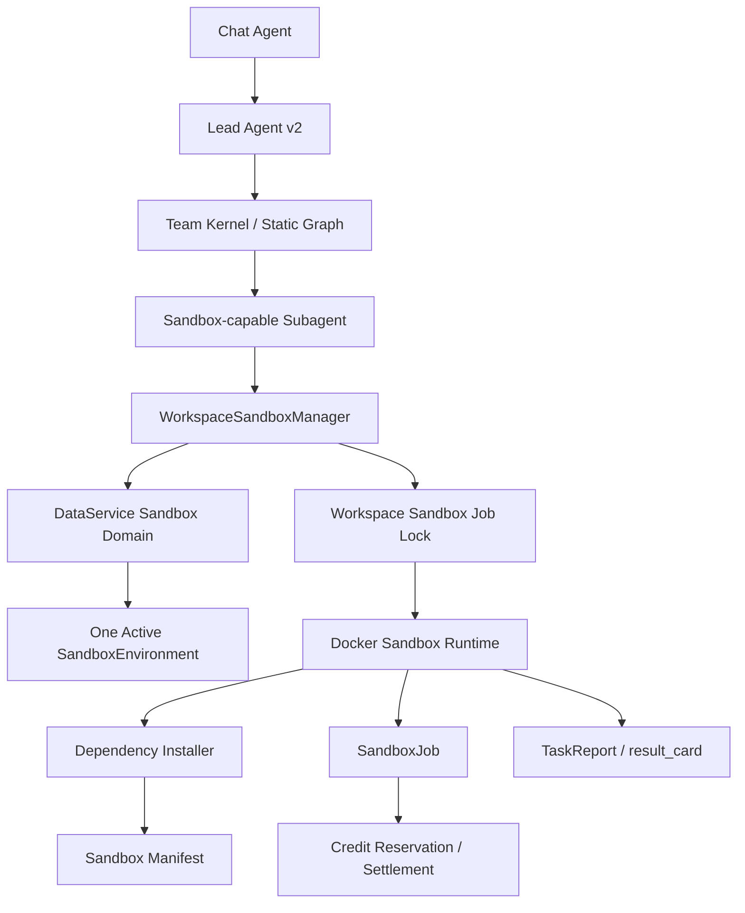

# Workspace Sandbox Convergence Design

Date: 2026-05-31
Status: Design ready for review
Scope: Lead Agent v2 sandbox runtime, DataService sandbox domain, credit billing, execution UX projection

## Goal

Converge Wenjin sandbox execution into one persistent workspace-level experiment environment.

Each workspace should have at most one active sandbox environment. All later experiments in that workspace reuse the same files, code, datasets, dependency environment, cache, and manifest. This improves long-running research continuity while keeping runtime management simple.

The selected target is **B-lite: persistent files + persistent dependency environment, no persistent processes**.

This means:

1. A workspace has one active sandbox environment record and one physical sandbox workspace directory.
2. Each sandbox job still runs inside a short-lived Docker container.
3. Containers are destroyed after the job, but they mount the same workspace files, Python virtual environment, and package cache.
4. Services, background processes, kernels, notebooks, and ports do not stay alive across jobs.
5. Dependency installation is automatic, does not require user confirmation, and is not billed as a separate credit event.
6. Sandbox run jobs remain billable: starting a sandbox task consumes credits according to the admin sandbox pricing policy.

## Non-Negotiable Constraints

- Keep sandbox execution inside the right-side Lead Agent path. Chat Agent may launch capabilities but must not acquire or mutate sandbox state.
- Sandbox remains an internal execution base, not a user-operable workspace room.
- DataService is the source of truth for sandbox environment, job, artifact, manifest snapshot, and billing linkage.
- A workspace may have only one active sandbox environment.
- Subagents may request sandbox work, but package installation mechanics are owned by sandbox runtime, not hand-written by individual subagents.
- Automatic installation is allowed, but only through controlled package-manager operations. Agent-generated `curl | bash`, `sudo`, `docker`, host mounts, host networking, and service control remain forbidden.
- Dependency installation has no separate user confirmation and no separate credit charge.
- User-visible outputs still go through execution/result-card/review flow. Sandbox artifacts do not directly commit to rooms.

## Current State

The existing code already has useful building blocks:

- `backend/src/dataservice/domains/sandbox/` defines sandbox environment, job, and artifact records.
- `SandboxDataDomainService.get_or_create_environment()` can reuse an active environment when one exists.
- `backend/src/agents/lead_agent/v2/sandbox_runtime.py` owns Docker sandbox helper functions for Lead Agent subagents.
- `backend/src/subagents/v2/types/sandbox.py` handles sandbox Python execution and credit reservation/settlement.
- `DockerSandboxProvider` already uses a host directory mounted into short-lived Docker containers.

The current mismatch:

- Runtime sandbox keys are execution/node scoped, so experiments do not naturally share one workspace environment.
- DataService does not enforce one active environment per workspace at the database invariant level.
- Dependency installation is not a first-class runtime loop.
- Sandbox pricing and runtime policy need clearer separation: capability policy controls permission/resource boundaries, admin pricing controls credits.

## Product Principles

1. **Continuity beats container permanence.** Users need previous datasets, scripts, outputs, and installed packages to remain visible. They do not need a long-running container process.
2. **The runtime should repair ordinary missing dependencies.** A missing Python package should not force user intervention or a full Lead Agent replanning loop.
3. **One sandbox should be easy to explain.** Workspace settings and run history should show one sandbox environment with many jobs, not many temporary environments.
4. **Installation is operational setup, not a premium feature.** It should be automatic and unbilled separately, while the sandbox task itself remains billable.
5. **Safety is centralized.** Package installation must be controlled by runtime policy and audited in DataService, not scattered across subagent prompts.
6. **No process continuity in this phase.** Avoid long-lived containers, Jupyter kernels, daemon processes, ports, and service lifecycle management until there is a clear user-facing need.

## Target Architecture



The Lead Agent decides when sandbox work is needed. Subagents produce code and optional dependency hints. The sandbox runtime owns environment preparation, dependency installation, retry, job recording, and billing linkage.

## Core Model

### Workspace Sandbox Environment

A workspace sandbox environment is the persistent experiment base for one workspace.

It owns:

- workspace id
- provider id
- active/stopped/error state
- physical workspace path
- runtime image
- dependency environment path
- package cache path
- policy snapshot
- resource limits snapshot
- current manifest snapshot

Invariant:

```text
at most one active sandbox environment per workspace
```

Implementation should enforce this both in service logic and database schema. PostgreSQL should use a partial unique index on `workspace_id` where `state = 'active'`. SQLite tests can use service-level guards plus deterministic conflict handling.

### Sandbox Job

A sandbox job is one auditable operation performed in the workspace sandbox.

Job operations:

- `run_python`
- `smoke_check`
- `install_dependencies`
- future: `run_node`, `run_notebook_export`, `artifact_pack`

Add `operation` as a first-class job field. It is part of the sandbox job contract, not an optional metadata convention.

Job records must include:

- workspace id
- sandbox environment id
- execution id
- execution node/invocation id
- operation
- runtime image
- command summary
- script hash when applicable
- dependency hints
- auto-installed packages
- install duration seconds
- run duration seconds
- exit code/status/error
- billing reservation/transaction ids for billable run jobs

### Sandbox Manifest

The manifest describes the executable state of the workspace sandbox.

DataService owns the canonical latest snapshot. A filesystem copy at `/workspace/.wenjin/sandbox-manifest.json` is an operational cache used by runtime jobs.

Manifest fields:

```json
{
  "schema_version": "wenjin.sandbox_manifest.v1",
  "workspace_id": "workspace-id",
  "environment_id": "sandbox-environment-id",
  "runtime_image": "wenjin/sandbox-python:2026-05",
  "python": {
    "version": "3.13",
    "venv_path": "/workspace/.wenjin/env/python",
    "packages": {
      "pandas": "2.2.3",
      "scikit-learn": "1.6.1"
    }
  },
  "package_manager": {
    "preferred": "uv",
    "cache_path": "/workspace/.wenjin/cache"
  },
  "last_install_job_id": "sandbox-job-id",
  "last_verified_at": "2026-05-31T00:00:00Z"
}
```

The manifest is not a prompt artifact. Agents can see a compact summary, but runtime code owns the full schema and updates.

## Filesystem Layout

Each workspace sandbox maps to one provider key:

```text
workspace-{workspace_id}
```

Host layout under `WENJIN_AGENT_SANDBOX_BASE_DIR`:

```text
agent_sandboxes/
  workspace-{workspace_id}/
    workspace/
      datasets/
      scripts/
      outputs/
      .wenjin/
        env/
          python/
        cache/
          pip/
          uv/
        sandbox-manifest.json
```

Container mount layout:

```text
/workspace                 -> persistent workspace files
/workspace/.wenjin/env     -> persistent dependency environment
/workspace/.wenjin/cache   -> persistent package caches
```

Existing sandbox helpers that write under older mount paths should be migrated to `/workspace` as part of this change. Do not add a parallel path alias as a long-term contract.

## Runtime Flow

### Normal Sandbox Run

```text
Subagent calls sandbox.run_python
  -> WorkspaceSandboxManager resolves or creates active environment
  -> acquire workspace sandbox job lock
  -> create SandboxJob(operation=run_python)
  -> reserve credits for run job
  -> ensure Python venv exists
  -> apply dependency hints if provided
  -> write script into workspace sandbox
  -> execute script with workspace venv Python
  -> if missing dependency error: auto-install and retry
  -> update manifest
  -> settle run billing
  -> update SandboxJob
  -> return structured output/tool_calls to subagent
```

### Automatic Dependency Installation

Dependency installation is not a separate agent workflow. It is a runtime subroutine.

Inputs:

- subagent `dependency_hints`, e.g. `["pandas", "scikit-learn"]`
- imports discovered from generated code
- failure analysis from `ModuleNotFoundError` / `ImportError`
- package/module mapping table
- current manifest package set

Flow:

```text
resolve requested packages
  -> skip packages already present in manifest
  -> create unbilled SandboxJob(operation=install_dependencies)
  -> temporarily allow package index egress
  -> run controlled installer command
  -> verify import/package metadata
  -> update manifest and environment metadata
  -> return install summary
```

Allowed first-phase installer commands:

```text
python -m venv /workspace/.wenjin/env/python
/workspace/.wenjin/env/python/bin/python -m pip install <packages>
/workspace/.wenjin/env/python/bin/python -m pip show <packages>
```

If `uv` is preinstalled in the sandbox image, runtime may use `uv pip install` with the same target venv and cache. The runtime chooses the package manager; subagents do not choose raw install commands.

First-phase automatic installation supports Python packages only. System packages are handled by improving the base Docker image, not by allowing agents to run `apt-get`, `sudo`, or shell installers.

### Missing Dependency Retry

The runtime retries missing dependency failures without returning to the Leader Agent first.

Rules:

- Detect common Python dependency failures:
  - `ModuleNotFoundError: No module named 'x'`
  - `ImportError: No module named x`
  - common package import hints from stderr
- Map known module names to package names:
  - `sklearn` -> `scikit-learn`
  - `PIL` -> `pillow`
  - `cv2` -> `opencv-python`
  - `yaml` -> `PyYAML`
  - `bs4` -> `beautifulsoup4`
  - `skimage` -> `scikit-image`
  - `dateutil` -> `python-dateutil`
- Install missing packages through the controlled installer.
- Retry the user script at most two times per sandbox job.
- If dependency resolution still fails, return `environment_setup_failed` with install logs, failed package names, and next-action hints for the Leader Agent.

## Agent Responsibility Boundary

### Leader Agent

The Leader Agent decides:

- whether sandbox execution is appropriate for the task
- which subagent should produce or run experiment code
- whether the final result is good enough
- whether a failed sandbox output requires another team iteration

The Leader Agent does not decide every package installation step in the normal path.

### Subagents

Sandbox-capable subagents may:

- generate scripts
- call sandbox tools
- provide `dependency_hints`
- read structured sandbox results
- revise code after failures

Subagents may not:

- run arbitrary package installation shell commands
- use direct Docker/host/server control tools
- write directly to workspace rooms
- bypass runtime dependency installer

### Sandbox Runtime

Sandbox runtime owns:

- environment resolution
- venv creation
- package installation
- dependency failure detection
- retry budget
- manifest updates
- job record updates
- runtime-level safety checks

This keeps the system faster than a Leader-mediated install loop and safer than prompt-level installation by every subagent.

## Billing

Billing remains job-based, but installation has no separate charge.

Billable:

- `run_python`
- `smoke_check` if exposed as a user-triggered sandbox task
- future experiment job operations

Not separately billable:

- automatic dependency installation
- venv creation
- manifest refresh
- package metadata verification

If a run job triggers installation, the run job still consumes the normal sandbox-start/run credits. The install sub-job does not create a separate credit reservation or transaction.

If admin sandbox pricing later includes duration-sensitive settlement, runtime should record `install_duration_seconds` separately and exclude it from additional duration-based compute charges. The user pays for starting the sandbox task, not for Wenjin repairing its dependency environment.

Billing invariants:

- Credit reservation checks must use spendable balance: `credits - reserved_credits`.
- Normal credit consumption must not ignore already reserved credits.
- Sandbox run settlement must be idempotent by reservation id and execution/node/job id.
- Failed runtime setup before a billable command starts releases the reservation.
- Failed user code after the sandbox job starts settles according to the sandbox pricing policy.

## Safety Policy

Automatic install is allowed, but it is not arbitrary shell execution.

Runtime must enforce:

- no privileged containers
- no host network
- no Docker socket
- no sibling container access
- no host path mounts beyond the workspace sandbox directory
- no `sudo`, `docker`, `kubectl`, `systemctl`, `service`, `mount`, `ssh`, `scp`, or raw server-control commands
- installer egress is temporary and scoped to package index access
- package install timeout
- package count limit per job
- output size limit
- disk usage guard

The first implementation should prefer a prebuilt Wenjin sandbox image with common research dependencies installed. Automatic installation then handles smaller missing packages instead of rebuilding the world during a user run.

Suggested base image contents:

- Python 3.13
- pip and uv
- numpy
- pandas
- scipy
- matplotlib
- seaborn
- scikit-learn
- statsmodels
- requests
- beautifulsoup4
- lxml
- pydantic
- pytest
- jupyter client libraries without persistent kernel service
- common native libraries needed by scientific wheels

## Concurrency

One active sandbox environment does not mean unlimited concurrent writes to the same environment.

First-phase policy:

- Serialize sandbox jobs per workspace sandbox environment.
- Show queued/running status in execution events when a job waits.
- Use a workspace sandbox lock around environment mutation and script execution.
- Keep per-job output folders to avoid overwriting previous results.

This is conservative but reliable. It matches the existing lead-busy product behavior and avoids dependency install races.

Future optimization can split locks:

- installation lock for venv mutation
- run lock for write-heavy jobs
- read-only concurrent jobs when commands declare no environment mutation

That optimization is out of scope for the first converged implementation.

## DataService Changes

### Environment

Add or enforce:

- one active environment per workspace
- deterministic workspace sandbox id, e.g. `workspace-{workspace_id}`
- workspace path and provider key derived from workspace id
- environment metadata fields for manifest snapshot, image version, venv path, cache path, and last verified time

`get_or_create_environment()` must be safe under concurrent calls:

1. Try to find active environment.
2. If absent, create active environment in a transaction.
3. If a unique conflict occurs, fetch and return the now-existing active environment.

### Job

Normalize operation tracking and dependency metadata:

- operation
- dependency hints
- installed packages
- install duration seconds
- retry count
- billable boolean
- credit reservation id
- credit transaction id

`install_dependencies` jobs are recorded for audit but marked `billable=false`.

### Artifact

Existing artifact flow remains. Sandbox-produced files should be registered as artifacts only when they become user-visible outputs or reviewable result-card items.

## Runtime API Contract

Extend sandbox tool inputs to support dependency hints:

```json
{
  "operation": "python_script",
  "script": "...",
  "script_name": "analysis.py",
  "dependency_hints": ["pandas", "scikit-learn"],
  "expected_outputs": ["outputs/summary.csv", "outputs/figure.png"]
}
```

Runtime output should include environment details:

```json
{
  "status": "completed",
  "operation": "python_script",
  "sandbox_environment_id": "env-id",
  "sandbox_job_id": "job-id",
  "script_path": "/workspace/scripts/analysis.py",
  "stdout": "...",
  "stderr": "...",
  "exit_code": 0,
  "dependency_install": {
    "attempted": true,
    "packages": ["scikit-learn"],
    "status": "succeeded",
    "billable": false
  },
  "billing": {
    "operation": "run_python",
    "credits_charged": 20
  }
}
```

## Execution UX

Sandbox should stay inside execution detail, not become a new workspace room.

User-facing projection should show:

- one workspace sandbox identity
- current sandbox job status
- script name/hash
- installed packages summary when relevant
- runtime image
- stdout/stderr excerpts
- generated artifacts
- billing summary for the run job

Status lines should be simple:

```text
正在准备 workspace sandbox 环境
自动安装缺失依赖：scikit-learn
正在运行实验脚本 analysis.py
实验完成，已生成 2 个产物
```

The user should not see package installation as a separate paid action.

## Error Handling

### Environment Creation Race

If two tasks try to create the workspace sandbox environment at the same time, the database invariant wins. The losing request fetches the existing active environment and continues.

### Corrupted Dependency Environment

If the venv is corrupted:

1. Mark environment health as degraded in metadata.
2. Move the old venv to a timestamped quarantine path.
3. Recreate venv.
4. Reinstall packages from manifest where possible.
5. Keep user workspace files intact.

If repair fails, mark the environment `error` and return a structured setup failure.

### Dependency Conflict

If installation fails because of dependency conflicts:

- record failed packages and installer stderr
- do not repeatedly reinstall the same failing set in the same execution
- return `environment_setup_failed`
- allow the Leader Agent to revise the script or ask a code/experiment subagent to choose alternative dependencies

### Runtime Image Mismatch

If the base image version changes:

- keep the same workspace files
- verify venv compatibility
- if incompatible, rebuild venv from manifest
- record image change in environment metadata

### Disk Pressure

If sandbox disk usage exceeds limits:

- fail the current job with `sandbox_storage_limit_exceeded`
- surface largest paths in diagnostics
- do not delete user-visible datasets or outputs automatically
- allow an explicit cleanup workflow later

## Rollout Plan

1. Add DataService invariants and projection fields for one active sandbox per workspace.
2. Introduce `WorkspaceSandboxManager` in Lead Agent runtime.
3. Change sandbox provider key from execution/node scoped to workspace scoped.
4. Add persistent `/workspace/.wenjin/env` and `/workspace/.wenjin/cache` mounts.
5. Add controlled Python dependency installer.
6. Add dependency hints to sandbox subagent input/output contract.
7. Add missing dependency detection and bounded retry.
8. Split billable run jobs from unbilled install jobs.
9. Fix credit spendable-balance reservation invariants before relying on sandbox reservations.
10. Update execution UX projection to show sandbox environment/job/install summaries.
11. Add backend and frontend tests.
12. Update current architecture docs after implementation.

## Testing Strategy

### DataService

- Creating a second active environment for the same workspace is rejected or converges to the existing environment.
- `get_or_create_environment()` is idempotent.
- `install_dependencies` jobs are recorded with `billable=false`.
- Run jobs can link credit reservation and transaction ids.
- Environment metadata stores manifest snapshot updates.

### Runtime

- Two sandbox Python jobs in the same workspace can see the same persisted file.
- A package installed in one job is available to a later job.
- `dependency_hints` trigger install before script execution.
- `ModuleNotFoundError` triggers automatic install and bounded retry.
- Repeated dependency failure returns structured `environment_setup_failed`.
- Installer commands reject forbidden host/server/container controls.
- Workspace sandbox key no longer includes execution/node id.

### Billing

- Sandbox run job reserves and settles credits once.
- Automatic install job creates no separate credit transaction.
- If duration pricing is enabled, install duration is recorded separately.
- Credit consumption respects reserved credits and cannot spend through existing reservations.
- Reservation release/settlement remains idempotent.

### Agent Runtime

- Subagents can pass dependency hints without owning install shell commands.
- Leader receives structured sandbox output and does not need to handle normal missing-package loops.
- Team kernel can record sandbox tool calls with sandbox environment/job ids.

### Frontend

- Execution detail shows one workspace sandbox identity.
- Live status includes automatic dependency installation events.
- Result card remains the handoff for generated artifacts.
- No user-facing sandbox room or independent sandbox state store is introduced.

### Browser Smoke

Run a workspace capability that:

1. launches sandbox execution,
2. writes a file,
3. imports a package not present in the minimal image,
4. auto-installs it,
5. reruns successfully,
6. starts a second sandbox job that reads the previous file and package,
7. returns a result card with generated artifact metadata.

## Out Of Scope

- Long-running Docker containers.
- Persistent Jupyter kernels or background services.
- User-confirmed dependency installation.
- Separate install pricing.
- Agent-controlled `apt-get`, shell installers, Docker control, or server control.
- Parallel sandbox jobs that mutate the same environment.
- User-facing sandbox file manager.
- Per-workspace Docker image commit/snapshot management.
