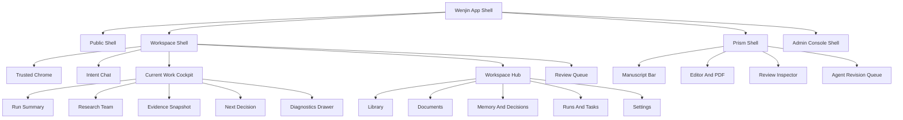

# Wenjin Full Shell UIUX Refactor Design

> 状态：Draft for review  
> 日期：2026-06-05  
> 决策：按 C 方案推进，即全站 Shell 重构，而不是局部 polish  
> 范围：Public、Auth、Workspace list、Workspace Shell、Chat、Current Work Cockpit、Workspace Hub、Rooms、Prism、Admin/DataService、共享 UI 组件  
> 目标：把 Wenjin 全站收敛为一个成熟、可信、低认知负担、适合长流程科研产出的研究操作系统。

## 1. 背景与问题判断

当前 Wenjin 已经完成了 System-Grade Research Workbench 的视觉基准迁移，但仍存在一类更深层问题：界面不是单纯“不够好看”，而是信息架构和动作层级仍保留了多轮迭代后的局部拼接痕迹。

典型症状：

- 顶部 `SurfaceSwitch`、`RoomsTopbar`、右侧 `WorkbenchHeader`、Prism header 同时承担导航职责。
- 用户在工作区里会看到一排 rooms、一排 workbench tabs、多个运行操作、多个审阅入口、Prism 保存/编译/Agent 入口，动作优先级不清。
- 技术细节、节点、输入预览、workspace id、template id、sandbox 数量、tool/skill 权限等在默认层级过早暴露。
- Chat、Workbench、Rooms、Prism 之间的职责边界还不够尖锐，导致用户需要理解“我应该在哪个面板做这件事”。
- 共享 UI 组件还没有完全托底，许多页面继续使用局部 inline style 和局部按钮体系，导致全站容易再次漂移。

本 spec 的核心判断：需要做全站 Shell 重构。目标不是一次性重写所有业务，而是建立统一外壳、组件体系、动作规则和页面母版，然后分阶段迁移。

## 2. 继承与取舍

### 2.1 继承旧 v2 设计语言中仍然正确的部分

旧 `2026-05-09-v2-design-language.md` 虽然视觉方向已被 System-Grade 取代，但其中部分交互原则仍然是正确的，必须继承：

- **左右分工非对称**：Chat 隐入背景，右侧工作面承担执行和审阅焦点。
- **自动适配优先**：不要让用户管理内部 focus、lock、恢复自动聚焦等工程状态。
- **信息分层优先**：摘要、列表、详情、诊断、审计 trace 必须分层，而不是同屏堆叠。
- **内部状态不外露**：用户看到“运行中 / 待审阅 / 已保存 / 需要补充”，不是 `focusedRunId`、hydration、projection、node payload。
- **导航先折叠，内容后折叠**：窄空间优先牺牲导航标签和次要动作，不能压缩核心内容。
- **操作显隐跟随上下文**：运行中才突出中断，已完成才突出审阅和保存。

### 2.2 放弃旧 v2 中不再适合的部分

以下内容不再作为新设计依据：

- purple-blue glass orb 背景。
- 大面积 glass card / LiquidGlassCard 主容器。
- 装饰性光斑、循环 glow、过度未来感。
- 过多拟人化 agent 表达。
- 将 “Apple visionOS” 理解为透明材质堆叠，而不是层级和空间关系。

### 2.3 继承当前 System-Grade 基准

当前 `2026-06-04-system-grade-research-workbench-uiux-design.md` 是视觉基准，继续有效：

- 冷白、浅灰、蓝灰、机构深蓝。
- `--wjn-*` 是唯一新组件 token。
- Apple / OpenAI / Chrome / OxSci 作为成熟感和系统壳参考。
- 证据、审阅、团队责任、质量门高于装饰。
- 工作台不做营销页，不做 glass dashboard。

本 spec 是 2026-06-04 spec 的下一层：从视觉基准推进到全站 Shell、组件、动作和信息架构重构。

## 3. 产品原则

### 3.1 一句话目标

Wenjin 应该像一个可信研究操作系统：用户用自然语言提出目标，系统组织团队和证据推进工作，界面只在需要用户判断时显性。

### 3.2 核心原则

1. **One Surface, One Primary Decision**  
   每个主视图同一时刻只突出一个主动作。用户不应该在多个同级按钮里猜下一步。

2. **Chrome Carries Trust, Content Carries Work**  
   顶层 shell 负责身份、导航、权限、状态、命令入口；内容区只展示当前工作和可判断材料。

3. **Default Summary, Available Detail**  
   默认展示摘要和下一步。详细节点、raw input、tool calls、sandbox、template id 保留，但进入详情/诊断层。

4. **Chat For Intent, Cockpit For Execution, Hub For Assets, Prism For Manuscript**  
   四个区域的职责必须明确，不互相抢入口。

5. **Review Before Commit**  
   所有 agent 输出进入 review queue / result card / Prism diff，用户确认后写入 rooms。

6. **Team As Responsibility, Not Performance**  
   团队实名制用于说明谁负责什么、产出归谁、质量门如何通过，不用于角色表演。

7. **Low Cognitive Load Over Feature Visibility**  
   功能不是越可见越好。低频、危险、诊断、恢复动作进入 overflow、drawer 或设置。

8. **System Consistency Beats Local Cleverness**  
   页面不得各自发明按钮、badge、section header、toolbar、empty state 和卡片样式。

## 4. 目标信息架构

### 4.1 Public Shell

适用页面：

- `/`
- `/pricing`
- `/docs`
- `/login`
- `/register`

职责：

- 建立品牌可信感。
- 解释产品路径，但不堆砌工作台内部概念。
- 引导进入 workspace。

约束：

- 第一屏展示真实产品价值或工作流入口。
- 不展示复杂 agent 运行细节。
- Auth 页面要更轻，不出现过多营销内容和次级 CTA。

### 4.2 Workspace Shell

适用页面：

- `/workspaces`
- `/workspaces/[id]`

职责：

- 承载 workspace 身份、当前工作、资产库、审阅队列。
- 将 Chat、Cockpit、Hub 的边界明确化。

目标结构：

- 顶部一个 trusted chrome。
- 左侧 Intent Chat。
- 右侧 Current Work Cockpit。
- Workspace Hub 作为资产抽屉或侧向 surface，而不是常驻 7 个横向按钮。
- Review Queue 是系统级状态，可从 Cockpit 和 Prism 到达。

### 4.3 Prism Shell

适用页面：

- `/workspaces/[id]/prism`

职责：

- 专注稿件控制、编译、diff、审阅和 Agent 修改。
- 不复用普通 Workbench 的运行导航层。

目标结构：

- Manuscript Bar：稿件名、保存状态、编译状态、review count、主操作。
- Editor/PDF split：编辑和预览。
- Inspector：review item、Agent 建议、证据来源、diff action。
- Advanced：文件树、编译日志、保护文件、同步 BibTeX 等低频操作进入工具区或 overflow。

### 4.4 Admin Console Shell

适用页面：

- `/dashboard/admin/**`
- 模型、积分、capability、skills、analytics、logs、release gate。

职责：

- 高密度控制台，不追求 workspace 的低按钮密度。
- 但仍遵守动作层级和危险动作隔离。

目标结构：

- Admin sidebar / section nav 固定。
- Metric row + table + detail drawer。
- 创建/保存为 primary。
- 低频批处理、重置、危险操作进 overflow 或 danger zone。

## 5. Shell 与页面母版

### 5.1 App Shell

新增或收敛一组 shell primitives：

- `AppShell`
- `PublicShell`
- `WorkspaceShell`
- `PrismShell`
- `AdminShell`
- `TrustedChrome`
- `SurfaceTabs`
- `WorkspaceIdentity`
- `GlobalCommandEntry`
- `UserAccountMenu`

App Shell 负责：

- 页面 chrome。
- 布局栅格。
- 安全和登录态入口。
- 全局命令入口。
- 响应式断点。
- 页面级 overflow 和 diagnostics 入口。

App Shell 不负责：

- 执行业务状态。
- Chat stream。
- Prism 文件编辑。
- DataService 管理逻辑。

### 5.2 Trusted Chrome

Workspace 顶部只保留一层 chrome，合并当前 `SurfaceSwitch` 和 `RoomsTopbar` 的职责。

默认展示：

- Wenjin brand。
- Workspace 名称和类型。
- Workbench / Prism surface switch。
- 当前状态摘要：运行中、待审阅、已保存、余额/积分风险。
- Command entry。
- Account menu。

默认不展示：

- workspace id。
- “证据 · 审阅 · 运行记录”这类说明性 slogan。
- 7 个 room 横向按钮。
- sandbox 数量。
- 低频设置入口。

Workspace id 可以在详情、设置、复制链接或诊断中展示。

### 5.3 Current Work Cockpit

右侧工作台从 tab-heavy panel 收敛为驾驶舱。

默认展示顺序：

1. Current objective：当前任务目标。
2. Progress summary：阶段进度、耗时、状态。
3. Research Team compact roster：谁在负责什么。
4. Evidence snapshot：关键证据数量和最近证据。
5. Next decision：用户现在最该做什么。

次级入口：

- 证据详情。
- 审阅队列。
- 运行历史。
- 诊断详情。

不再默认把 Overview / Run / Evidence / Review 作为同级 tab 暴露给用户。它们可以变成 cockpit 内部 sections、drawers 或 segmented secondary navigation。

### 5.4 Workspace Hub

`RoomsTopbar` 不再作为常驻横向按钮存在。Rooms 合并为一个 Workspace Hub。

Hub 一级分组：

- 资料：Library、Documents、Uploads。
- 产出：Prism drafts、committed documents、result cards。
- 记忆：Memory、Decisions。
- 运行：Runs、Tasks、Sandbox。
- 设置：Workspace settings、permissions、diagnostics。

Hub 默认行为：

- 顶层只显示“资料库”或 icon。
- 有未处理内容时显示 badge。
- 打开后展示分组和搜索。
- 具体 room 进入 drawer/detail surface。

### 5.5 Review Queue

Review Queue 是跨 Workbench 和 Prism 的产品概念，不应散落在多个局部按钮里。

统一展示：

- 待确认数量。
- 来源：execution output / Prism diff / citation update / sandbox artifact。
- 推荐动作：全部接受、逐项审阅、打开 Prism。
- 产出归属：团队成员、capability、run。
- 写入目标：Library、Documents、Memory、Prism。

Review Queue 不是普通 room，它是“用户决策 surface”。

## 6. 动作层级规范

### 6.1 Action Taxonomy

每个动作必须归类：

| 层级 | 定义 | 示例 | 展示规则 |
|---|---|---|---|
| Primary | 当前上下文最推荐的下一步 | 全部接受、继续补充、打开 Prism、保存模型 | 每个主视图最多一个 |
| Secondary | 常用但非唯一下一步 | 查看证据、逐项审阅、编译、保存草稿 | 每个主视图最多两个 |
| Tertiary | 导航或轻量切换 | 切换视图、排序、筛选 | compact controls |
| Overflow | 低频或可替代动作 | 复制 ID、重新同步、导出、删除 | `...` menu |
| Diagnostic | 技术和调试动作 | 查看 raw payload、节点输入、tool calls、sandbox logs | diagnostics drawer |
| Danger | 不可逆或高风险 | 删除 workspace、清空项目、撤销写入 | danger zone + 二次确认 |

### 6.2 Button Budget

工作台主视图：

- Primary：最多 1 个。
- Secondary：最多 2 个。
- Tertiary controls：最多 1 组。
- Overflow：最多 1 个。

Prism 主编辑面：

- Primary：保存或应用审阅。
- Secondary：编译、对照/审阅模式。
- 文件级低频动作进入 file toolbar overflow。

Admin：

- 可有多个操作，但每个模块 header 仍最多一个 primary。
- 表格行操作默认 icon-only 或 row overflow。

### 6.3 Disabled Action Rule

长期 disabled 的文字按钮会增加负担，应避免。

规则：

- 如果动作当前上下文不可用且用户不需要知道它，隐藏。
- 如果动作不可用但用户需要理解原因，显示为 muted chip 或 tooltip。
- 如果动作很关键但暂不可用，保留按钮并给出明确原因。

例如：

- 没有运行中任务时，不显示大号“中断并补充”按钮；可在 overflow 或状态提示里说明。
- 没有待审阅内容时，不显示“全部接受”按钮。
- Prism 未绑定项目时，只显示“从 Workbench 启动写作任务”。

## 7. Progressive Disclosure 策略

### 7.1 默认层

默认层只展示用户能判断和行动的信息：

- 当前目标。
- 任务是否运行中。
- 团队成员和职责摘要。
- 关键证据摘要。
- 待审阅数量。
- 下一步动作。

### 7.2 详情层

详情层展示专业用户可能需要的信息：

- 阶段列表。
- 文献标题、作者、引用数、DOI。
- 文档片段。
- Prism diff。
- 产出预览。
- 团队成员权限摘要。

### 7.3 诊断层

诊断层展示工程和审计信息：

- node id。
- execution id。
- graph structure。
- node input / output payload。
- tool invocation / tool result。
- token usage。
- sandbox logs。
- raw JSON。

诊断层入口命名为“运行详情”或“诊断”，不能把内部字段直接放在默认界面。

### 7.4 信息暴露矩阵

| 信息 | 默认展示 | 详情展示 | 诊断展示 |
|---|---:|---:|---:|
| 当前目标 | 是 | 是 | 是 |
| 运行状态 | 是 | 是 | 是 |
| 团队成员显示名 | 是 | 是 | 是 |
| 成员 template id | 否 | 可选 | 是 |
| effective tools / skills | 摘要 | 是 | 是 |
| 质量门 | 摘要 | 是 | 是 |
| node label | 摘要 | 是 | 是 |
| node raw input | 否 | 否 | 是 |
| tool call payload | 否 | 否 | 是 |
| workspace id | 否 | 设置 | 是 |
| sandbox logs | 否 | 可选 | 是 |
| token usage | 否 | 可选 | 是 |

## 8. 团队实名制 Agent 前端

### 8.1 默认表现

团队前端默认是 compact roster：

- 成员显示名：文献专家、实验工程师、证据审稿人、学术编辑等。
- 当前职责：检索、实验、证据核查、写作、审阅。
- 状态：待命、准备中、处理中、待审阅、已完成、失败。
- 输出归属：证据、文档、Prism diff、review item。

### 8.2 展开详情

成员展开后展示：

- template id。
- capability / skill 来源。
- effective tools / skills。
- quality gates。
- 最近产出。
- 失败或风险说明。

### 8.3 不允许的表达

- 卡通头像。
- 角色口头禅。
- 表演型动画。
- 与产出无关的人设卡。
- 暴露内部 subagent 名称替代用户可理解名称。

### 8.4 团队与 Review Queue 的关系

每个 review item 应能追溯：

- 来自哪个 run。
- 哪个团队成员或阶段产出。
- 写入哪个 room 或 Prism 文件。
- 通过了哪些质量门。

## 9. Prism 重构规范

### 9.1 Prism 定位

Prism 是稿件控制台，不是 Workbench 的普通详情页。

Prism 默认任务：

- 编辑稿件。
- 编译查看。
- 审阅 Agent diff。
- 应用或拒绝修改。
- 管理引用和文件。

### 9.2 Manuscript Bar

顶部 Manuscript Bar 默认展示：

- 稿件名。
- 主文件。
- 保存状态。
- 编译状态。
- 待审阅修改数。
- 主动作。

主动作优先级：

1. 有待审阅 diff：`审阅修改` 或 `全部应用`。
2. 有未保存编辑：`保存`。
3. 无未保存编辑：`编译` 或 `查看 PDF`。

### 9.3 Editor/PDF/Inspector

默认布局：

- 宽屏：Editor 主区 + Inspector，PDF 可在对照模式出现。
- 窄屏：Editor list-first，Inspector / PDF 进入 drawer 或 mode switch。

Inspector 默认展示：

- 当前选中 review item。
- diff 摘要。
- 证据来源。
- Agent 责任归属。
- 应用/拒绝动作。

低频入口：

- 文件保护。
- 删除项目。
- 编译日志。
- BibTeX 同步。
- raw LaTeX diagnostics。

这些进入 overflow 或工具抽屉。

## 10. Workspace List 与 Public 页面

### 10.1 Workspace List

问题：

- 当前 workspace card 上暴露删除按钮，视觉和风险都太靠前。
- workspace 数量、筛选、创建入口应更像工作路径管理。

目标：

- Card 主动作是“进入”。
- 删除、复制 ID、归档进入 overflow。
- 新建 workspace 是全页 primary。
- 最近活跃、待审阅、运行中作为状态 badge。
- 搜索和类型 filter 保持 compact。

### 10.2 Public / Auth

目标：

- 继续沿用 OxSci 式白底、深蓝、机构可信感。
- Auth 页面减少干扰，只保留必要说明和表单。
- Public landing 不展示过多内部 agent 概念，强调结果质量、证据链、审阅闭环。

## 11. Admin / DataService Console

Admin 不追求和 Workbench 一样少按钮，但必须一致：

- Sidebar 分区清晰。
- Header 显示模块名、说明、主动作。
- Tables 是默认信息承载。
- Detail drawer 承载编辑。
- Danger zone 独立。
- API key 永不展示明文。
- 模型、积分、pricing、capability、skills 使用相同的 create/edit/delete 交互模型。

Admin 组件优先使用共享 primitives，不再每个页面自定义 card/header/button 组合。

## 12. 共享组件体系

### 12.1 Foundation

必须收敛或新增：

- `Button`
- `IconButton`
- `ActionBar`
- `OverflowMenu`
- `StatusChip`
- `CountBadge`
- `SectionHeader`
- `Panel`
- `Drawer`
- `DisclosureSection`
- `EmptyState`
- `Toolbar`
- `SegmentedControl`
- `SearchInput`
- `DangerZone`

### 12.2 Workspace-specific

新增或收敛：

- `WorkspaceChrome`
- `WorkspaceHub`
- `CurrentWorkCockpit`
- `NextDecisionCard`
- `ResearchTeamRoster`
- `EvidenceSnapshot`
- `ReviewQueue`
- `RunDiagnosticsDrawer`
- `WorkspaceAssetList`

### 12.3 Prism-specific

新增或收敛：

- `PrismShell`
- `ManuscriptBar`
- `PrismModeSwitch`
- `PrismInspector`
- `PrismReviewActionBar`
- `CompileStatusChip`
- `FileActionOverflow`

### 12.4 Admin-specific

新增或收敛：

- `AdminShell`
- `AdminPageHeader`
- `AdminMetricRow`
- `AdminTableToolbar`
- `AdminDetailDrawer`
- `AdminDangerZone`

## 13. 视觉 Token 与样式规则

### 13.1 Token

新组件只使用 `--wjn-*`。

允许：

- `--wjn-navy`
- `--wjn-blue`
- `--wjn-line`
- `--wjn-surface`
- `--wjn-surface-subtle`
- `--wjn-text`
- `--wjn-text-secondary`
- `--wjn-evidence`
- `--wjn-review`
- `--wjn-success`
- `--wjn-error`
- `--wjn-radius`
- `--wjn-shadow-sm`

不允许新组件直接使用：

- `--v2-*`
- `--brand-*`
- `--compute-*`
- `--glass-*`
- `--orb-*`

旧 token 只能作为迁移 alias 存在。

### 13.2 颜色和材质

- 主背景冷白。
- Shell 可使用轻微 translucent material。
- 内容卡片实体白底。
- 不使用离散光球。
- 不使用 purple-blue 大渐变。
- Gold 只做细针脚和推荐强调。

### 13.3 圆角与密度

- 控件 8-10px。
- Panel / drawer 12-16px。
- 默认不超过 16px。
- 卡片不嵌套卡片。
- 表格和列表优先 hairline 分隔。

### 13.4 文案

用户可见文案应短、具体、专业：

- 用“运行中 / 待审阅 / 已保存 / 已完成 / 需要补充”。
- 不用“投影 / hydration / lock / focusedRunId / graph payload”。
- 不用拟人化夸张语气。
- 中文优先，必要英文术语保持产品稳定，例如 Prism、Workbench、Review Queue。

## 14. 响应式策略

### 14.1 Desktop

- Workspace：Chat + Cockpit split。
- Hub 作为 drawer 或 side panel。
- Review Queue 可作为右侧 detail。
- Prism：Editor + Inspector，PDF 进入对照模式。

### 14.2 Tablet

- Chat 和 Cockpit 可切换，默认 Cockpit 跟随运行状态。
- Hub drawer 覆盖式。
- Prism inspector drawer 化。

### 14.3 Mobile

- 单列。
- Chat、Work、Hub、Prism 作为 bottom navigation 或 top segmented surface。
- 当前任务优先于历史和设置。
- 长文本 line clamp。
- primary action 固定在底部 action bar。

## 15. 迁移计划

### Phase 0: Audit And Guardrails

目标：

- 建立按钮、入口、内部信息暴露审计表。
- 标记所有 `--v2-*`、`--glass-*`、局部 inline button style。
- 标记用户可见 raw ids、technical labels。

输出：

- UI debt inventory。
- 每个页面的 action budget。
- 不进入实现前不改变业务逻辑。

### Phase 1: Design System Foundation

目标：

- 收敛共享组件和 tokens。
- 补齐 ActionBar / OverflowMenu / StatusChip / DisclosureSection。
- 统一 empty/loading/error state。

重点文件：

- `frontend/components/ui/button.tsx`
- `frontend/components/ui/card.tsx`
- `frontend/components/ui/badge.tsx`
- `frontend/components/ui/dialog.tsx`
- `frontend/app/globals.css`

验收：

- 新组件可支撑 shell 重构。
- 无新增旧 token。
- typecheck 通过。

### Phase 2: App Shell And Workspace Chrome

目标：

- 合并 `SurfaceSwitch` 与 `RoomsTopbar` 职责。
- 建立 `WorkspaceChrome`。
- Workspace Hub 替代 7 个常驻 room buttons。
- Workspace id 默认隐藏。

重点文件：

- `frontend/app/(workbench)/workspaces/[id]/components/SurfaceSwitch.tsx`
- `frontend/app/(workbench)/workspaces/[id]/components/RoomsTopbar.tsx`
- `frontend/app/(workbench)/workspaces/[id]/page.tsx`

验收：

- 顶部只剩一层主要 chrome。
- Workbench / Prism 切换仍稳定。
- 登录态 cookie 同步不回退。
- Rooms 可通过 Hub 进入。

### Phase 3: Current Work Cockpit

目标：

- 重构 `LiveWorkflowPanel` 为 cockpit。
- Overview / Run / Evidence / Review 不再同级压在 header。
- 默认展示当前目标、团队、证据摘要、下一步决策。
- 运行详情进入 diagnostics drawer。

重点文件：

- `frontend/app/(workbench)/workspaces/[id]/components/LiveWorkflowPanel.tsx`
- `frontend/app/(workbench)/workspaces/[id]/components/live-workflow/WorkbenchHeader.tsx`
- `frontend/app/(workbench)/workspaces/[id]/components/live-workflow/RunView.tsx`
- `frontend/app/(workbench)/workspaces/[id]/components/live-workflow/ReviewView.tsx`
- `frontend/app/(workbench)/workspaces/[id]/components/live-workflow/EvidenceView.tsx`
- `frontend/lib/execution-run-view.ts`

验收：

- 当前运行默认聚焦 cockpit。
- 待审阅时主动作是 review。
- 无运行时不显示长期 disabled 中断按钮。
- 技术 payload 默认不可见。

### Phase 4: Workspace Hub And Rooms

目标：

- Rooms 改成资产库体验。
- Library / Documents / Memory / Decisions / Runs / Tasks / Settings 统一 drawer shell。
- Runs / Tasks 合并为运行历史与任务记录分组。

重点文件：

- `frontend/app/(workbench)/workspaces/[id]/components/rooms/*`
- `frontend/stores/room-refresh-store.ts`
- `frontend/lib/execution-run-view.ts`

验收：

- 用户从 Hub 搜索/进入资产。
- Room drawers 信息密度一致。
- 删除、复制、导出进入 overflow。

### Phase 5: Prism Shell

目标：

- Prism 拥有独立 Manuscript Bar。
- 保存、编译、审阅、模式切换重新分层。
- Agent 修改建议和 diff inspector 收敛。

重点文件：

- `frontend/app/(workbench)/workspaces/[id]/prism/page.tsx`
- `frontend/app/(workbench)/workspaces/[id]/prism/PrismContextRail.tsx`
- `frontend/components/latex/LatexEditorShell.tsx`
- `frontend/components/latex/latex-editor/*`
- `frontend/components/prism/PrismReviewList.tsx`

验收：

- Prism 顶部动作不拥挤。
- 待审阅 diff 是默认主路径。
- 编译日志、文件保护等低频动作不抢主区。

### Phase 6: Public, Workspace List, Admin

目标：

- Public / Auth 收敛为机构可信风格。
- Workspace list 降噪，危险动作 overflow。
- Admin 使用统一 console shell。

重点文件：

- `frontend/app/page.tsx`
- `frontend/app/workspaces/page.tsx`
- `frontend/app/(auth)/*`
- `frontend/app/dashboard/admin/**`
- `frontend/components/layout/*`

验收：

- Public 与 workspace 风格一致但密度不同。
- Workspace list 主动作清晰。
- Admin 高密度但动作分组清楚。

### Phase 7: Cleanup And Regression

目标：

- 清理旧 glass / v2 / brand / compute 视觉债务。
- 更新 docs/current。
- 浏览器回归所有主链路。

验收：

- 没有新组件引用旧 token。
- 主要页面截图风格统一。
- 关键业务链路不回退。

## 16. 非目标与保护线

非目标：

- 不重写后端 agent 架构。
- 不改变 Chat Agent -> Lead Agent -> Execution 主链路。
- 不改变 block protocol。
- 不改变 result_card / review before commit 契约。
- 不改变 DataService SSOT。
- 不改变 billing、sandbox、model routing 业务规则。

保护线：

- `execution-run-view.ts` 继续作为前端 execution projection 收敛点。
- `run-ui-store` 不重新承载业务执行状态。
- `useWorkspaceEventStream` 继续是 execution 发现与订阅单入口。
- Workspace-owned Prism 仍只通过 `/workspaces/[id]/prism`。
- 技术详情可隐藏，但不能丢失。
- 用户能力入口可以减少，但不能削弱 agent 实际能力。

## 17. 风险与缓解

### 17.1 Big-bang 风险

风险：C 方案范围大，如果一次性改完，容易打断执行、Prism、Rooms 闭环。

缓解：

- 按 phase 合并。
- 每 phase 保持业务入口可用。
- 每 phase 只改一层架构。
- 使用 feature-level browser regression。

### 17.2 过度隐藏风险

风险：隐藏太多技术细节后，高级用户无法判断质量。

缓解：

- 默认隐藏，不删除。
- 提供运行详情、诊断 drawer、成员展开、证据详情。
- Review item 保留来源和归属。

### 17.3 组件抽象过度风险

风险：为了统一而创建过多组件，降低开发速度。

缓解：

- 只抽共享交互和壳层组件。
- 业务组件保留领域语义。
- 每个新增组件必须服务至少两个页面或一个复杂页面的多个区域。

### 17.4 风格漂移风险

风险：迁移中再次出现 glass、purple、古风、营销页式卡片。

缓解：

- token 扫描。
- screenshot review。
- 新组件只用 `--wjn-*`。
- 文档明确禁止项。

## 18. 测试与验证标准

### 18.1 Static

- `frontend npm run typecheck`
- `frontend npm run build`
- relevant `npx vitest run`
- token scan：不得新增 `--v2-*`、`--glass-*`、`--brand-*`、`--compute-*`。
- text scan：不得新增 raw technical user-facing labels。

### 18.2 Browser

每个 phase 至少验证：

- 登录态进入 `/workspaces`。
- Workspace list 创建/进入 workspace。
- Workbench / Prism 切换。
- Chat 发送任务。
- 当前运行展示。
- 团队实名制展示。
- 待审阅结果展示和接受。
- Workspace Hub 打开 Library / Documents / Runs。
- Prism 保存、编译、review diff。
- Admin 模型或积分页面基础打开。

### 18.3 Visual

截图覆盖：

- Desktop 1440px。
- Tablet 1024px。
- Mobile 390px。

检查：

- 主动作是否唯一。
- 顶部 chrome 是否只有一层主导航。
- 技术细节是否默认隐藏。
- 长文本是否截断。
- 空状态是否给出清晰下一步。
- 风格是否符合 System-Grade。

## 19. 成功标准

功能成功：

- 用户进入 workspace 后能立即知道当前任务、下一步、待审阅内容在哪里。
- Workbench / Prism / Hub 的职责清晰。
- 团队实名制前端能解释责任和产出，而不增加表演噪声。
- 所有现有执行、审阅、Prism、Rooms 主链路可用。

体验成功：

- 默认屏幕按钮数量明显减少。
- 没有多层横向导航堆叠。
- 低频操作不抢主区。
- 技术细节可查但不压迫普通用户。
- 全站风格稳定、成熟、机构可信。

工程成功：

- 共享组件承载主要按钮和状态表达。
- 新页面不再手写局部 action hierarchy。
- 文档和组件约束能防止后续架构漂移。
- 每 phase 可独立 review、测试和回滚。

## 20. 下一步

用户确认本 spec 后，进入 implementation planning。计划阶段应输出：

- Phase 0 审计清单。
- 每个 phase 的具体文件级任务。
- 单测和浏览器测试计划。
- 每阶段合并策略。
- 风险回滚点。

实现过程中必须优先保证现有主链路稳定：Chat Agent -> Lead Agent -> Execution -> Review Queue -> Rooms / Prism。
