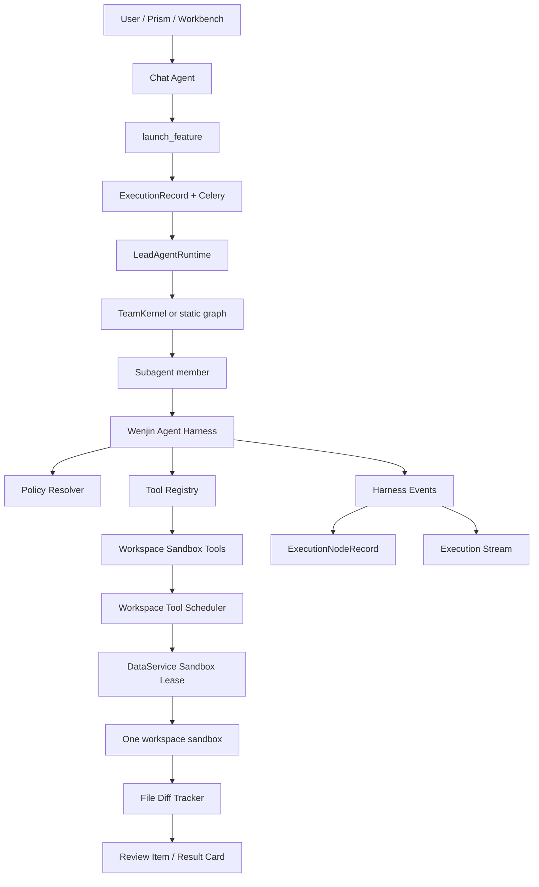

# Wenjin Native Agent Harness Design

Date: 2026-06-06
Status: First implementation slice implemented on `codex/wenjin-native-harness`; self-reviewed against Codex, deer-flow, and current Wenjin master

Implementation note:

- Implemented first slice: `contracts`, `policy`, `tool_registry`, `events`, `output_budget`, `loop_guard`, `diff_tracker`, `scheduler`, `sandbox_tools`, `sandbox_execution_tools`, built-in tool specs, and LangChain adapter.
- ReactSubagent now resolves requested harness tools explicitly; unknown/forbidden tools still fail instead of falling back to plain LLM.
- TeamKernel and static graph subagent contexts forward the existing execution event publisher to harness tools.
- TeamKernel tool policy canonicalizes `sandbox_python` / `sandbox_exec` to `sandbox.run_python`.
- `sandbox.run_python` reuses the existing DataService sandbox job/lease/environment path. File tools operate on the existing workspace sandbox provider with the same workspace key and scheduler; they do not create a new execution fact source.
- Workspace sandbox filesystem contract is now centralized in `backend/src/sandbox/workspace_layout.py`. Docker and Local providers call `ensure_workspace_sandbox_layout()` and expose `/workspace` as the only new harness virtual root. The same module now owns workspace path normalization, protected/internal classification, and user-reviewable artifact root classification for file tools, artifact discovery, and review staging.
- Tool output budget now externalizes oversized `sandbox.read_file` output and Lead-owned `sandbox.run_python` stdout/stderr into `/workspace/outputs/harness/{execution_id}/{node_id}/{invocation_id}/`, returning compact previews plus `output_refs`; ReactSubagent tool records and `execution.harness.output_externalized` events retain those refs.
- Lead-owned `sandbox.run_python` now discovers user-reviewable generated artifact candidates under `/workspace/outputs` and `/workspace/reports`, excludes `/workspace/outputs/harness/**`, and returns `generated_artifacts[]` with `materialization_status=candidate`; ReactSubagent tool records and completed events retain these candidates plus job ownership, and Lead runtime registers trusted candidates as DataService sandbox artifact review items.
- `sandbox.write_file` and `sandbox.str_replace` now return hash + bounded unified-diff `file_change` records; large diffs are stored under `/workspace/outputs/harness/**` with `diff_output_refs`, `diff_externalized`, and `diff_truncated`, while ReactSubagent tool records, `execution.harness.tool_call.completed`, and dedicated `execution.harness.file_change` events retain the preview + refs so Lead/runtime surfaces do not need to parse raw tool JSON.
- Lead runtime and TeamKernel now aggregate those per-tool records into `ExecutionNodeRecord.node_metadata.harness.file_change_summary` (`wenjin.harness.file_change_summary.v1`), giving each static graph node or team-member invocation a path/hash-level net summary and preserving large-diff refs without adding a harness run table.
- Repeated identical tool calls now publish `execution.harness.loop_warning` as `team_visible` when the loop guard warning threshold is reached. The event does not inject messages between assistant tool calls and tool results.
- Command audit / argv-first contract foundation is implemented in `backend/src/agents/harness/command_audit.py`; Lead-owned `run_python` and `install_dependencies` sandbox jobs now include `metadata.command_audit`, and harness `sandbox.run_python` publishes those audits through `execution.harness.command_audit` plus tool record metadata. General `sandbox.run_command` and frontend debug surfaces remain future work and are not enabled by this slice.

## 1. Objective

Build a Wenjin-native agent harness that gives Lead Agent and team members Codex-like abilities inside the workspace sandbox: read and write workspace files, search files, run Python experiments, later run bounded commands after policy review, install dependencies automatically when policy allows, capture file diffs, publish runtime events, and feed outputs back into Wenjin's review/commit flow.

This design deliberately does not embed Codex SDK, cc-switch, or deer-flow as a runtime dependency. Codex and deer-flow are reference systems only. Wenjin remains centered on:

- Chat Agent -> Lead Agent -> ExecutionRecord.
- TeamKernel dynamic team runtime.
- DataService as business SSOT.
- One active sandbox environment per workspace.
- Capability and skill definitions as the execution contract.
- Review-first commit for Prism, rooms, and sandbox artifacts.

## 2. Current State

Wenjin already has several converged foundations:

- `ExecutionRecord` is the product execution SSOT.
- `ExecutionNodeRecord` owns node-level runtime detail.
- Execution streams are keyed by `execution_id`.
- TeamKernel supports core members, optional recruitment, quality gates, and bounded iterations.
- Agent templates live in DataService and can be dynamically loaded.
- Workspace sandbox has one active environment per workspace through DataService.
- Sandbox lease prevents multiple concurrent jobs from mutating the same workspace sandbox.
- Dependency installation is already separated from billable experiment runs.
- Prism file changes already stage into review items instead of directly mutating the manuscript.

Main gaps:

- `ReactSubagent` tool execution is now wired through the Wenjin-native harness for sandbox file/search/write and Python tools.
- Team members can use the shared audited harness runtime when their capability/skill policy grants tools, but more role templates still need to be migrated onto tool-based workflows.
- Sandbox execution is exposed through `sandbox.run_python`; arbitrary `sandbox.run_command` is intentionally not exposed yet.
- Runtime events now capture harness tool start/completion/failure, output externalization refs, generated artifact candidates, per-tool file changes, node-level path/hash file change summaries, loop warnings, and command-audit events. Content-level net diff externalization and frontend debug projections still need further convergence.
- Workspace sandbox tool calls are serialized through the workspace scheduler; long-running whole-team orchestration still needs higher-level queue UX and cancellation polish.
- DataService sandbox policy currently validates a Python-job contract, not arbitrary shell execution. This is a useful safety boundary and should not be bypassed by the first harness slice.

## 2.5 Design Self-Review Corrections

The first draft correctly chose a Wenjin-native harness, but it was still too loose in places. The corrections below are now part of the spec:

- The harness is not a new agent framework. It is the tool execution substrate used by TeamKernel and graph subagents.
- `ExecutionRecord`, `ExecutionNodeRecord`, DataService execution events, sandbox jobs, assets, and review items remain the only durable facts. No harness run table, no harness stream, and no direct frontend execution state.
- General `sandbox.run_command` is delayed. The first production slice should ship file tools plus `sandbox.run_python`, because current DataService validation and user workflows already converge on Python experiments.
- Tool events must distinguish `user_visible`, `team_visible`, and `debug_only` payloads. The default UI consumes only the first category.
- Team member LLM calls may still run in parallel. Sandbox-affecting tools are serialized per workspace above the DataService lease.
- Capability policy is the maximum permission envelope. Agent templates and skills can narrow it, never widen it.
- Unknown or forbidden tools fail explicitly. There is no fallback to plain model execution when tools were requested.
- The tool registry must be deterministic and testable: canonical names, duplicate detection, schema validation, risk metadata, and strict mismatch checks.
- Large outputs and diffs are externalized into DataService-owned run/sandbox artifacts, not ad hoc files that only the model knows about.

## 2.6 Current Wenjin Code Impact

Observed current-code constraints:

- `backend/src/subagents/v2/types/react.py` already fails explicitly when tools are requested but unresolved. Keep that invariant and replace `_resolve_tools()` with harness resolution.
- `backend/src/agents/lead_agent/v2/team/kernel.py` runs invocation batches with `asyncio.gather`. Keep LLM parallelism, but route all sandbox tool calls through a per-workspace scheduler.
- `backend/src/agents/lead_agent/v2/workspace_sandbox.py` and `backend/src/dataservice/domains/sandbox/service.py` already enforce one active workspace sandbox environment and a lease. The harness must reuse these contracts.
- `backend/src/dataservice/domains/sandbox/policy.py` currently validates `run_python`, `install_dependencies`, and `smoke_check`. That is the reason `run_command` must not be first slice.
- `backend/src/services/execution_event_publisher.py` and DataService execution events already provide the stream and durable event path. Harness events must be subtypes there.
- `docs/current/architecture.md` explicitly says React subagents must not silently fall back, ExecutionRecord is SSOT, workspace sandbox is one per workspace, and model catalog is DataService SSOT. The harness spec follows those rules.

## 3. External References

### 3.1 Codex: Borrow Concepts, Not Runtime

Useful ideas:

- Typed command contract with argv-first command shape, timeout, cancellation, cwd, env, output cap, and network/sandbox policy.
- File API split: read, write, copy, remove, directory listing, metadata, watch.
- Output retention caps and live output delta caps.
- Process kill hardening: timeout, cancellation, process-group termination, IO drain timeout.
- Exec policy based on command prefixes and explicit network rules.
- Turn-level diff tracking: record net file changes made during one agent turn.
- App-server protocol clarity: commands, filesystem, permissions, thread/turn events are separate surfaces.
- Streaming output is separate from final tool result. Output delta events are lightweight; final result carries exit code and bounded stdout/stderr.
- File changes are first-class run items, not buried inside tool text.
- Protected metadata paths are explicit. Codex protects `.git`, `.codex`, and agent metadata; Wenjin should protect `.git`, `.wenjin`, model secrets, env files, Docker sockets, and service control paths.
- Dynamic tool specs are useful as a protocol shape, but Wenjin should source tools from capability/skill policy instead of external plugin state.

Do not migrate:

- Codex SDK as the primary Prism or research runtime.
- app-server thread/fork/resume model.
- Codex approval workflow as-is. Wenjin already has capability policy plus review-card commit.
- Rust exec-server or app-server daemon.
- cc-switch style Responses-to-Chat bridge.

Reason: those layers would introduce a second agent runtime and a second thread/execution model, conflicting with Wenjin's ExecutionRecord, DataService, TeamKernel, and workspace-scoped sandbox architecture.

### 3.2 deer-flow: Borrow Harness Patterns, Not App Factory

Useful ideas:

- Harness package boundary independent from product routers.
- Tool set shape: `bash`, `ls`, `glob`, `grep`, `read_file`, `write_file`, `str_replace`.
- Tool output budget: externalize or truncate large outputs before they enter model context.
- Tool error handling: convert tool exceptions into structured tool errors so the loop can continue.
- Loop detection: repeated tool-call warnings and hard stops without breaking provider tool-call pairing.
- Sandbox command audit: block high-risk commands, warn for medium-risk commands.
- Skill tool policy: tools are filtered by skill/capability declarations.
- Subagent execution status and token collection.
- Run journal categories: message, trace, tool, output, error.
- Deferred tool discovery: expose tool names and promote schemas only when needed. Wenjin should apply this selectively to external/high-noise tools, not to every built-in research tool.
- Tool registry hygiene: deterministic load order, duplicate-name rejection, config name versus callable name validation, async-only wrappers where required, and no host-bash exposure under local sandbox.
- Middleware order invariants: warning or recovery messages must never be inserted between assistant tool calls and corresponding tool results.
- Safety finish reason protection: if a provider safety-truncates a response while returning partial tool calls, suppress those calls and record a structured event.
- Subagent concurrency limits should be enforced by runtime limits, not only by prompt wording.
- Root-only tracing/token collection avoids duplicate spans and double-counted usage.

Do not migrate:

- deer-flow `create_deerflow_agent` factory.
- Its thread-local workspace model.
- Its full LangChain middleware stack as a direct dependency.
- Its skills storage, agent gallery, or ACP agent surface.
- Legacy allow-all semantics for dangerous tools.

Reason: Wenjin's DataService rooms, capability catalog, TeamKernel, and execution stream already own those responsibilities.

## 4. Recommended Direction

Use a Wenjin-native harness package under `backend/src/agents/harness/`.

The harness should be a Lead-only runtime layer. It should not be callable directly by Chat Agent, routers, or frontend feature code. Chat still creates a capability execution; Lead chooses team/workflow; subagents call the harness.

### Rejected Options

Option A: embed Codex SDK for deep tasks.

- Pros: mature file/command agent behavior.
- Cons: heavy runtime, provider protocol uncertainty, second execution model, hard to align with review-card commit, hard to make product-specific.
- Decision: keep as reference only.

Option B: transplant deer-flow harness.

- Pros: many useful middleware and sandbox tool patterns.
- Cons: second app architecture, different thread and sandbox assumptions, too many compatibility surfaces.
- Decision: borrow patterns and tests, not code shape.

Option C: Wenjin-native harness.

- Pros: fits one-sandbox-per-workspace, DataService, TeamKernel, capability/skill policy, Prism review, credit billing, and academic workflows.
- Cons: more initial engineering.
- Decision: recommended.

## 5. Target Architecture



### 5.1 Non-Negotiable Convergence Boundaries

The harness must stay inside the current execution chain:

```text
Chat Agent
  -> launch_feature
  -> ExecutionRecord
  -> ExecutionEngineV2
  -> LeadAgentRuntime
  -> TeamKernel or static graph
  -> ReactSubagent / specialized subagent
  -> Wenjin Agent Harness
  -> DataService sandbox / execution / review domains
```

Rules:

- Chat Agent never calls harness tools directly.
- Routers never start harness runs directly.
- Frontend never subscribes to a new harness stream.
- Harness events are execution events with `execution.harness.*` types.
- Harness tool calls are stored on the owning `ExecutionNodeRecord`.
- Sandbox jobs still use DataService sandbox contracts and one active workspace environment.
- Product file changes still enter review/result-card flow before being committed.
- Model selection remains DataService model catalog SSOT. The harness must not read `LLM_MODELS` as production fallback.
- The harness package must not import Codex SDK, cc-switch, or deer-flow runtime code.

### 5.2 Workspace Sandbox Filesystem Contract

Wenjin should not copy deer-flow's thread-local `/mnt/user-data/{workspace,uploads,outputs}` model into the harness. Deer-flow's split is useful for its thread middleware, but Wenjin's product constraint is one active sandbox per workspace. The harness therefore uses a workspace-first filesystem contract:

```text
/workspace/
  main/              primary project files: manuscript, code, experiment entrypoints
  datasets/          datasets and input materials
  scripts/           reusable experiment scripts and agent-generated scripts
  outputs/           generated artifacts, plots, compile outputs, result files
  reports/           analysis notes, phase summaries, delivery reports
  tmp/               scratch files, not surfaced by default
  .wenjin/
    env/             Lead-owned Python/runtime environment
    cache/           package/runtime cache
    manifest.json    deterministic machine-readable layout contract
```

Implementation rules:

- `backend/src/sandbox/workspace_layout.py` is the single source of truth for `WORKSPACE_ROOT`, standard directories, protected paths, internal paths, artifact roots, manifest path, helper virtual-path construction, and workspace path classification.
- Every provider that creates a workspace sandbox calls `ensure_workspace_sandbox_layout()` during acquire.
- Tool-using ReactSubagents receive the same compact filesystem contract in both `_sandbox_workspace` default payload data and a `Sandbox workspace contract` system prompt section, so custom `user_template` skills still know where scripts, reports, outputs, scratch files, protected paths, and internal harness refs belong.
- Harness tools accept only `/workspace` virtual paths. New harness code must not introduce `/mnt/user-data` aliases.
- Existing thread artifact/upload helpers that still use `/mnt/user-data` are legacy non-harness boundaries and should be migrated deliberately when that product surface is touched.
- `.wenjin/env/**`, `.wenjin/cache/**`, `.wenjin/manifest.json`, `.git/**`, `.env`, `*.pem`, and `*.key` are protected by default policy.
- `/workspace/outputs/harness/**` is internal runtime state. It can be returned as an `output_ref`, but it must not be staged as a user-facing sandbox artifact.
- Generated user-reviewable files should prefer `/workspace/outputs` or `/workspace/reports`; ephemeral scratch belongs in `/workspace/tmp`.
- Python runtime scripts generated by the harness use `/workspace/scripts`.
- Harness-internal large tool outputs use `/workspace/outputs/harness/{execution_id}/{node_id}/{invocation_id}/`. This is a stable workspace sandbox ref layer and must not be registered as a user-reviewable `sandbox_artifact`.
- `sandbox.run_python` discovers generated artifact candidates by scanning `/workspace/outputs` and `/workspace/reports` inside the same lease after script execution. Candidate payloads use `schema=wenjin.sandbox.generated_artifact_candidate.v1`, `path`, `root`, `artifact_kind`, `mime_type`, `size`, optional `content_hash`, `review_surface=sandbox_artifact`, and `materialization_status=candidate`. ReactSubagent enriches tool records with `sandbox_job_id` / `sandbox_environment_id`; Lead runtime registers trusted candidates as `workspace_asset(storage_backend=sandbox)` plus `sandbox_artifact` review items. Discovery or staging failures must not fail an otherwise successful script.
- `/workspace/outputs/harness/**` is reserved for internal bounded-output refs and must not be surfaced as a user-reviewable generated artifact candidate.
- A deterministic manifest is preferred over timestamped metadata so repeated acquires do not create noisy file churn.

### 5.3 Tool Schema Contract

Every callable tool must be registered as a `HarnessToolSpec`. The registry output should be serializable so it can be tested without creating a LangGraph runtime.

```python
HarnessToolSpec(
    name="sandbox.read_file",
    namespace="sandbox",
    description="Read a bounded preview of a workspace file.",
    input_schema={
        "type": "object",
        "properties": {
            "path": {"type": "string"},
            "start_line": {"type": "integer", "minimum": 1},
            "end_line": {"type": "integer", "minimum": 1},
        },
        "required": ["path"],
        "additionalProperties": False,
    },
    risk_level="read",
    required_permissions=["filesystem.read"],
    output_policy={"max_chars": 12000, "externalize_above": 40000},
    user_visibility="debug_only",
)
```

Registry invariants:

- Tool names are canonical and globally unique.
- Declared capability/template/skill tool names must resolve exactly.
- Duplicate names fail in tests and startup validation.
- Configured name and callable `.name` mismatch is an error for built-ins.
- Built-ins are loaded before external tools; external tools cannot override built-ins.
- Async tools stay async. Sync wrappers are allowed only at the LangChain adapter edge.
- Dangerous names such as `bash`, `run_command`, `write_file`, and `prism_apply` require explicit risk metadata.
- Deferred tool search may expose names and descriptions, but it cannot promote a tool outside the effective policy envelope.

### 5.3 Event Protocol

Harness events are emitted through the existing execution event publisher and optionally reflected onto `ExecutionNodeRecord.tool_calls`.

Common envelope:

```json
{
  "execution_id": "uuid",
  "node_id": "team.1.code_engineer_v1.1",
  "invocation_id": "team.1.code_engineer_v1.1",
  "workspace_id": "uuid",
  "visibility": "user_visible | team_visible | debug_only",
  "sequence_kind": "tool | file_change | budget | loop | audit | final",
  "timestamp": "2026-06-06T00:00:00Z",
  "payload": {}
}
```

Required event types:

- `execution.harness.tool_call.started`
- `execution.harness.tool_call.delta`
- `execution.harness.tool_call.completed`
- `execution.harness.tool_call.failed`
- `execution.harness.output_externalized`
- `execution.harness.file_change`
- `execution.harness.command_audit`
- `execution.harness.loop_warning`
- `execution.harness.safety_suppressed_tool_call`
- `execution.harness.final`

Visibility rules:

- `user_visible`: short progress, human-readable outcome, review candidates.
- `team_visible`: summaries that later team members may consume through blackboard/context.
- `debug_only`: raw args summaries, command output previews, audit details, diff metadata.

The default UI must not render `debug_only` payloads. Debug surfaces and run drawers can expose them on demand.

## 6. New Module Boundaries

### 6.1 `backend/src/agents/harness/contracts.py`

Defines stable data contracts:

- `HarnessRunContext`: workspace id, user id, execution id, node id, invocation id, workspace type, capability id, capability policy, agent template snapshot, skill snapshot, bounded context bundle, abort checker, event publisher.
- `HarnessPolicy`: allowed tools, denied tools, filesystem roots, protected paths, network profile, package install permission, max tool calls, max iterations, max sandbox seconds, command policy, output budget, visibility defaults.
- `HarnessToolSpec`: name, namespace, description, input schema, risk level, required permissions, output policy, user visibility, deferred flag.
- `HarnessToolCall`: call id, node id, invocation id, name, args summary, started_at, completed_at, status, audit result, output refs, error.
- `HarnessToolResult`: preview text, structured payload, output refs, truncated/externalized flags, token estimate, stderr/stdout summary, error.
- `HarnessFileChange`: path, operation, before hash, after hash, unified diff preview, full diff ref, staged review target.
- `HarnessRunResult`: final text, parsed output, tool calls, token usage, file changes, artifacts, warnings, stop reason.

Stop reasons:

- `completed`
- `schema_invalid`
- `tool_forbidden`
- `tool_unknown`
- `tool_loop_hard_stop`
- `sandbox_queue_timeout`
- `sandbox_job_failed`
- `model_safety_suppressed`
- `aborted`
- `max_iterations`

### 6.2 `backend/src/agents/harness/policy.py`

Resolves effective policy from four layers:

1. Hard platform deny rules.
2. Capability `definition_json` policy.
3. Agent template `risk_profile` and `tool_affinity`.
4. Skill `allowed_tools` and runtime config.

Rules:

- Hard denies always win.
- Capability policy is the maximum permission envelope.
- Skill/template can narrow permissions but cannot widen beyond capability.
- Read-only tools may be broadly available.
- Write, command, package install, network, and external fetch require explicit policy flags.
- No dangerous allow-all fallback for write or exec tools.
- Effective policy must be included in debug-only node metadata so failures are explainable.
- Policy validation should run before the model sees tool schemas. Forbidden tools are withheld and also fail if called through a stale state.

Suggested permission names:

- `filesystem.read`
- `filesystem.write`
- `filesystem.diff`
- `sandbox.run_python`
- `sandbox.install_python_packages`
- `sandbox.run_command`
- `network.package_index`
- `network.restricted_egress`
- `prism.stage_review`

### 6.3 `backend/src/agents/harness/tool_registry.py`

Resolves tool names to callable tool implementations.

Initial built-ins:

- `sandbox.list_dir`
- `sandbox.glob`
- `sandbox.grep`
- `sandbox.read_file`
- `sandbox.write_file`
- `sandbox.str_replace`
- `sandbox.run_python`
- `sandbox.apply_patch` (optional convenience wrapper over tracked file changes; not a raw shell patch command)

Delayed built-ins:

- `sandbox.run_command` (bounded, argv-first, audited, policy-gated; not part of the first production slice)

The registry should fail loudly if a declared tool is unknown. This preserves the current architectural invariant: no silent downgrade to plain model calls when tools were requested.

Adapters:

- `langchain_adapter.py` can convert `HarnessToolSpec` into LangChain-compatible tools for `create_react_agent`.
- The adapter must not own policy, path validation, output budget, or persistence.
- The adapter is replaceable. The harness core should be testable without LangChain.

### 6.4 `backend/src/agents/harness/sandbox_tools.py`

Tool implementation boundary around the existing sandbox stack.

Principles:

- Use DataService sandbox environment and jobs; do not create a second sandbox identity model.
- Preserve one active sandbox per workspace.
- All file paths are workspace-virtual paths under `/workspace`.
- File reads and search return bounded previews.
- File writes and replacements record before/after hashes and diffs.
- Python execution uses the existing virtualenv and installer path.
- Dependency installs are automatic when policy allows and remain non-billable.
- First slice does not expose arbitrary shell commands.
- When command execution is later added, it must use argv-first input, explicit timeout, output cap, and network profile. `shell=true` is a separate risky mode and requires explicit policy.

Protected paths:

- Block `.git/**`.
- Block `.env`, `*.pem`, `*.key`, and obvious secret files.
- Block `/workspace/.wenjin/env/**` writes from model tools; only installer/runtime may write there.
- Block `/workspace/.wenjin/cache/**` writes except controlled installer/cache operations.
- Block Docker socket and host-control paths even if a provider bug exposes them.
- Prism protected sections are handled by Prism review/apply services, not raw file tools.

### 6.5 `backend/src/agents/harness/scheduler.py`

Serializes sandbox tool calls per workspace.

Reason: TeamKernel can run members in parallel, but the sandbox domain intentionally allows only one active lease per workspace. Without a scheduler, parallel subagents that call sandbox tools can fail with `workspace sandbox is busy`.

Behavior:

- In-process async lock per workspace for the common single-worker case.
- Cross-worker retry/backoff when DataService lease reports busy.
- Queue timeout produces a recoverable tool error, not a runtime crash.
- LLM-only team members can still run in parallel; only sandbox mutations/commands are serialized.
- First slice serializes all sandbox tools, including reads, for implementation simplicity and deterministic traces.
- Later optimization may allow parallel read-only tools with a read lock, but only after path and output budget tests are stable.
- Every queued call records queue wait time in debug-only tool metadata.
- Lease busy from another process should retry with bounded jitter; repeated busy becomes `sandbox_queue_timeout`.

### 6.6 `backend/src/agents/harness/output_budget.py`

Caps tool outputs before they return to the model:

- Read/search outputs: head or matched ranges, deterministic truncation.
- Command outputs: stdout/stderr caps plus summarized tail.
- Large outputs: first externalize to a stable workspace sandbox path and return a compact reference; final user-visible artifacts should later be materialized through DataService-owned sandbox artifact / workspace asset review flow.
- Output cap metadata is recorded in tool events.
- Exemptions are narrow. `read_file` can return larger previews than command output, but it still has a hard cap.
- Historical tool messages should be re-budgeted before the next model call so old oversized outputs do not re-enter context.

### 6.7 `backend/src/agents/harness/command_audit.py`

Classifies commands before execution. The current implementation is a policy/tested foundation, not an exposed command tool.

- Input is `HarnessCommand`: argv-first by default, optional `shell_command` only when `CommandAuditPolicy.allow_shell` is true.
- `CommandAuditResult` returns `verdict` (`pass` / `warn` / `block`), `risk_level`, machine-readable reasons, and masked metadata.
- Block: empty argv, mixed shell/argv shape, shell when not allowed, forbidden network profile, cwd/path outside `/workspace`, host/container control programs, dangerous shell patterns such as `curl|bash`, and destructive root operations.
- Warn: controlled package installation when `allow_package_install` is true.
- Pass: normal workspace-local argv commands.

Current persistence and projection:

- `run_python` sandbox jobs store `metadata.command_audit` for the Python execution argv.
- `install_dependencies` sandbox jobs store `metadata.command_audit` for the controlled pip install argv and record it as medium risk / warning.
- `run_python` payloads carry `command_audit` and `install_command_audits`; harness tool records and `execution.harness.tool_call.completed` retain them.
- Harness `sandbox.run_python` publishes `execution.harness.command_audit(team_visible)` for the run command and each dependency-install command.
- Smoke check stores shell audit metadata because the command is an internal fixed shell snippet.
- General `sandbox.run_command` is still absent; command audit is the prerequisite boundary.

General command requirements for the later slice:

- Input shape is `argv: list[str]` first.
- `shell_command: str` is allowed only when `allow_shell=true` and policy grants `sandbox.run_command.shell`.
- `cwd` must resolve under `/workspace`.
- `env` allowlist is explicit; secrets are never injected by default.
- Network defaults to `none`.
- Timeout defaults to a short value and has a hard platform max.
- Output is streamed as deltas and finalized as bounded stdout/stderr.

### 6.8 `backend/src/agents/harness/loop_guard.py`

Prevents repeated tool-call loops:

- Hash tool name plus stable salient args.
- Warn after repeated identical calls.
- Hard stop after configured limit.
- Track tool frequency to catch broad read loops.
- Never inject warnings between assistant tool calls and tool results.
- Suppress provider-truncated partial tool calls when finish reason indicates safety/refusal/content filter.
- Loop warnings should be `team_visible`, not default user-visible noise.

### 6.9 `backend/src/agents/harness/diff_tracker.py`

Tracks file mutations made by one harness run and summarizes them at the owning execution node:

- For `write_file` and `str_replace`, read before content, write after content, and compute unified diff.
- Store hash and path metadata.
- Collapse multiple per-tool changes for the same path into `wenjin.harness.file_change_summary.v1`, preserving the first before hash, final after hash, operation, path list, changed paths, reverted paths, and compact diff evidence.
- Store the node-level summary under `ExecutionNodeRecord.node_metadata.harness.file_change_summary` for both static graph nodes and TeamKernel invocations.
- Large diffs are externalized with a preview, `diff_output_refs`, `diff_externalized`, and `diff_truncated`; compact node summaries preserve those refs.
- Prism-facing changes still go through review item creation.
- Sandbox experiment files can become sandbox artifacts or workspace assets.

### 6.10 `backend/src/agents/harness/events.py`

Publishes structured events to existing Wenjin surfaces:

- `execution.harness.tool_call.started`
- `execution.harness.tool_call.delta`
- `execution.harness.tool_call.completed`
- `execution.harness.tool_call.failed`
- `execution.harness.output_externalized`
- `execution.harness.file_change`
- `execution.harness.command_audit`
- `execution.harness.loop_warning`
- `execution.harness.safety_suppressed_tool_call`
- `execution.harness.final`

Persistence rules:

- Detailed tool calls are stored on `ExecutionNodeRecord.tool_calls`.
- Durable event history uses DataService execution events.
- Live updates use the existing execution stream.
- Frontend user view remains simplified; raw tool details should live in debug/detail surfaces, not the default user path.

## 7. Subagent Integration

### 7.1 `ReactSubagent`

Replace the current `_resolve_tools() -> []` gap with harness-backed tool resolution.

New behavior:

- If no tools are requested, keep the existing plain model path.
- If tools are requested, build `HarnessRunContext`.
- Resolve policy and tool callables through the harness.
- Run the model/tool loop with bounded iterations, output budget, loop guard, and tool error conversion.
- Return final parsed output, tool calls, token usage, and file changes.
- Unknown or forbidden tools fail explicitly.
- Token usage must be attributed to `subagent:{template_id}` or `invocation_id` and aggregated into the TeamKernel report.
- Model/tool traces belong to the owning execution node; they should not create child executions.

### 7.2 TeamKernel

Do not replace TeamKernel.

TeamKernel remains responsible for:

- Team composition.
- Core and optional recruitment.
- Quality gates.
- Blackboard.
- Output mapping.

Harness becomes the per-member execution substrate.

Concurrency semantics:

- TeamKernel can still `asyncio.gather` member LLM work up to `max_parallel_invocations`.
- Harness sandbox calls enter the workspace scheduler and DataService lease.
- Blackboard updates happen after a member finishes; the first slice does not implement live shared-memory mutation during a member's tool loop.
- If a quality gate requests revision, TeamKernel reruns bounded member iterations rather than letting an individual member loop indefinitely.

### 7.3 Static Graph Runtime

Static graph subagents should use the same harness-backed `ReactSubagent`. Specialized subagents such as searcher, Prism optimizer, or sandbox smoke checks can remain direct implementations until they naturally move to tool-based execution.

## 8. Context Assembly

Add a harness context assembler that creates bounded context bundles from the existing DataService-backed room sources.

Inputs:

- `TaskBrief`.
- Capability `context_policy`.
- Frontend `context_requirements`.
- Team invocation role.
- Current Prism manuscript context when relevant.

Potential bundles:

- Main manuscript file and selected target files.
- Library/citation context.
- Decisions and memory facts.
- Recent executions and run summaries.
- Sandbox artifact summaries and important file tree.
- Pending Prism review summary.

Rules:

- Context must be bounded by token/character limits.
- The assembler should return structured fields, not a prompt blob.
- Large files should be represented by path plus preview; the agent can read more through tools.
- Context should include paths, provenance, and freshness timestamps so a member can decide what to inspect.
- Sandbox file tree context should be shallow by default: top-level directories, recent outputs, and important artifacts, not a full recursive dump.
- Prior run history should be summarized by execution id, capability id, status, key artifacts, and warnings.

## 9. Quality Loop

The harness should support self-check without turning into an unconstrained autonomous loop.

Recommended loop:

1. Member receives role/task/context.
2. Member may call tools.
3. Member produces structured output under skill/capability contract.
4. Harness validates output schema.
5. TeamKernel evaluates quality gates.
6. If gates fail and suggest recruitment, TeamKernel recruits optional members.
7. If gates ask for revision, rerun bounded member iteration with latest blackboard.
8. Stop on pass, no progress, max iterations, or user decision required.

The key is that workflow loops can be flexible but remain observable and bounded.

## 10. Safety Model

High capability does not mean unrestricted execution.

Baseline:

- Workspace file IO only under `/workspace`.
- No host path mounts, privileged containers, docker socket, host network, sibling container access, or server control.
- Network profile defaults to `none`; package install uses `package_index_only`; web data fetch requires explicit policy.
- Package specs are sanitized.
- Commands are audited before execution.
- Output is capped before entering model context.
- Sandbox jobs are recorded in DataService.
- File mutations are diffed and reviewed when they affect product artifacts.

For the user's goal of high ability ceiling, the harness should prefer powerful safe tools over hiding tools:

- Give agents good file search/read/write tools.
- Give them Python execution with automatic dependency install.
- Add general command execution only behind policy and audit, not as a default free-for-all.

## 10.5 Anti-Drift Rules

These rules prevent the harness from becoming another parallel runtime:

- Do not add a `HarnessExecutionRecord` or equivalent durable run table.
- Do not add a second frontend store for harness progress. Project into existing execution/run view models.
- Do not add a new sandbox provider key shape. Workspace sandbox key remains `workspace-{workspace_id}`.
- Do not add a plain-LLM fallback when tool resolution fails.
- Do not import external Codex/deer-flow runtime code into production source.
- Do not reintroduce `legacy`, `compat`, or broad `fallback` naming in production runtime.
- Do not let `run_command` bypass the Python-job DataService policy before a reviewed command policy exists.
- Do not store full raw command output in chat blocks or default UI payloads.
- Do not let skill `allowed_tools=None` mean dangerous allow-all. For Wenjin, omitted tool policy means read-only baseline unless the capability grants more.
- Do not allow external/deferred tools to override built-in sandbox or Prism tools.

## 11. UX Projection

Default user-facing UI should not expose raw tool spam.

Show:

- Team member display role.
- Short current action.
- Key produced artifact or review candidate.
- Human-readable failure or waiting state.

Hide by default:

- Full JSON args.
- Full command output.
- Raw file diffs unless the user opens review/debug detail.

This matches the previous UI direction: team real-name system for clarity, while technical traces remain available for inspection.

## 12. Migration Plan

### Phase 0: Cleanup

Done in this worktree:

- Removed Codex SDK / cc-switch trial files and docs.
- Reverted Codex-specific Docker/dependency/config changes.
- Verified Prism optimizer backend tests still pass.
- Preserved unrelated Prism feedback pending-state UX fix.

### Phase 1: Contracts and Policy

- Add harness contract models.
- Add effective policy resolver.
- Add tool registry skeleton.
- Unit tests for policy merge, forbidden tools, unknown tools, and skill/capability narrowing.
- Add startup/test validation for duplicate tool names and config/callable name mismatch.
- Add event envelope helpers with visibility classification.

### Phase 2: Read/Search/File Tools

- Implement `list_dir`, `glob`, `grep`, `read_file`.
- Implement output budgeting.
- Add path traversal and output cap tests.
- Wire `ReactSubagent` tool resolution to harness for read-only tools.
- Store tool call summaries on `ExecutionNodeRecord.tool_calls`.

### Phase 3: Write Tools and Diff Tracker

- Implement `write_file` and `str_replace`.
- Consider `apply_patch` only as a structured file-change helper, not a shell tool.
- Add per-run diff tracking.
- Externalize large diffs.
- Ensure Prism-affecting changes stage into review items.
- Add tests for unique replacement, replace-all, missing string, and review staging.

### Phase 4: Python Execution and Dependency Install

- Expose existing `SandboxJobRunner.run_python_script` through harness.
- Keep package install non-billable.
- Add missing-module retry behavior to tool metadata.
- Serialize sandbox tool calls through the workspace scheduler.
- Add tests for lease contention, install policy, missing module retry, and sandbox job recording.
- This is the first point where the harness can support real experiment/code-agent workflows end to end.

### Phase 5: Command Execution

- Add `sandbox.run_command` only after command audit, argv-first contract, and prefix policy are in place.
- Use timeout, output cap, network profile, and workspace-only path validation.
- Add tests for blocked commands, warned commands, allowed commands, timeout, and output cap.
- Keep shell string execution disabled until a separate policy flag exists.

### Phase 6: TeamKernel and Quality Integration

- Use harness in team-member invocations.
- Store tool calls and file changes on execution node records.
- Add loop guard.
- Tighten dynamic recruitment around quality gate findings.
- Add tests for parallel LLM members plus serialized sandbox tools.
- Add token attribution by invocation/member.
- Add safety-truncated tool-call suppression tests.

### Phase 7: Product Workflows

- Prism full-document improvement can call the harness for deep edits.
- Experiments can call Python execution in the shared workspace sandbox.
- Literature and writing agents can inspect sandbox outputs and workspace files.
- Browser testing should cover Prism edit/review, Workbench execution, sandbox experiment, and team real-name display.

## 13. Testing Strategy

Backend tests:

- `harness/test_policy.py`
- `harness/test_tool_registry.py`
- `harness/test_sandbox_file_tools.py`
- `harness/test_output_budget.py`
- `harness/test_command_audit.py`
- `harness/test_loop_guard.py`
- `harness/test_diff_tracker.py`
- `subagents/test_react_harness_tools.py`
- `team/test_team_harness_sandbox_serialization.py`
- `harness/test_event_visibility.py`
- `harness/test_deferred_tool_policy.py`
- `harness/test_protected_paths.py`
- `harness/test_safety_suppressed_tool_calls.py`

Integration tests:

- Capability execution with read-only file tools.
- TeamKernel run with one writer and one reviewer.
- Sandbox Python job with dependency install.
- Prism review item created from harness file change.
- Parallel team members where one is LLM-only and one queues sandbox tools.
- Unknown tool and forbidden tool failures stay node-scoped and understandable.

Frontend/browser tests:

- User sees simple team member progress, not raw JSON.
- Prism deep edit produces a review candidate.
- Sandbox experiment result appears as a reviewed artifact.
- Failure states are understandable and do not leave pending UI stuck.
- Debug/detail surfaces can reveal tool traces, while default workspace and Prism views stay clean.

## 14. Risk Review

Risk: team members run in parallel but one workspace sandbox permits only one lease.

Mitigation: workspace tool scheduler serializes sandbox tool calls while allowing LLM-only work to continue in parallel.

Risk: command execution becomes too permissive.

Mitigation: delay general command execution until after file tools and Python execution are stable; then require explicit capability policy, argv-first command contract, command audit, network profile, path validation, output cap, and DataService job records.

Risk: output floods model context.

Mitigation: output budget and externalization before tool result returns to model.

Risk: architecture drifts into a second execution system.

Mitigation: no new product execution table, run table, stream, or thread model; harness emits into existing ExecutionRecord, ExecutionNodeRecord, execution events, sandbox jobs, assets, and review items.

Risk: agents mutate product artifacts invisibly.

Mitigation: file diff tracker plus existing review item flow for product surfaces.

Risk: scope grows too large.

Mitigation: ship read/search first, then write/diff, then Python execution, then general command execution.

## 15. Defaults And Future Decisions

Recommended implementation defaults:

- Start with read/search/write/str_replace/run_python.
- Delay general `run_command` until after audit, argv policy, event streaming, and DataService command validation are reviewed.
- Keep package installation automatic and non-billable.
- Keep one active sandbox per workspace.
- Do not expose raw tool traces in default UI.

No open product decision is required before implementing the first slice. The recommended first slice excludes `sandbox.run_command`.

Future product decision:

- Whether to allow general shell execution for trusted research/code workflows after Python execution proves stable. If approved later, it should be introduced as a separately reviewed capability flag, not silently added to existing skills.
