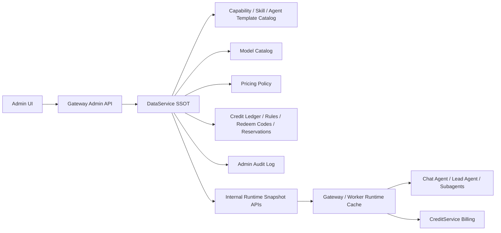
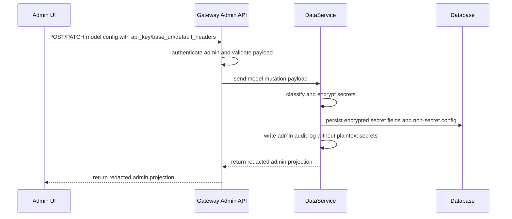

# Admin Control Plane SSOT Design

## Goal

Build a single-source-of-truth Admin Control Plane for Wenjin's runtime business configuration: model catalog, provider secrets, pricing policies, credit operations, capability orchestration, skill and agent-template catalog, release gates, and audit logs.

The goal is not only to make the admin pages "available". The goal is to make every user-visible execution path consume one consistent, safe, auditable configuration source owned by DataService.

## Current Baseline

The project already has most of the raw pieces:

- Admin pages exist for users, credits, credit rules, redeem codes, pricing policies, model management, capabilities, skills, analytics, release gate, MCP config, and logs.
- DataService already owns domains for model catalog, pricing, credit ledger, redeem codes, sandbox metadata, and catalog records.
- Gateway already has admin routers for model catalog, pricing policies, capability management, credit rules, redeem codes, and admin credit adjustment.
- Runtime billing already supports policy-driven model usage, capability reservation, sandbox reservation and settlement, and credit ledger writes.
- Capability management already uses YAML validation and DataService-backed catalog records.

The remaining problem is convergence. Several paths still behave like adjacent subsystems instead of one Admin Control Plane:

- Model pricing binding is not fully preserved in runtime cache because `pricing_policy_id` is not part of `RuntimeModelConfig`.
- Model health check currently validates config presence more than provider connectivity.
- Model admin UI accepts `pricing_policy_id` as free text and does not expose structured `default_headers`.
- Pricing policy UI is JSON-first, so it is powerful but operationally fragile.
- Credit operations exist, but they should be framed as part of the same ledger, reservation, and policy system.
- Secrets need a clearer rule: admin can write and rotate provider keys, but no admin or frontend read path may return plaintext.

## Decision

DataService is the only source of truth for admin-managed business configuration.

Runtime services may keep in-memory read-through caches, but those caches are projections. Seed YAML, environment variables, frontend state, and Gateway constants are not runtime sources of truth after bootstrapping.

## Scope

This spec covers:

- Admin model list management, including editable API Key, Base URL, model name, provider metadata, headers, health checks, defaults, and pricing binding.
- DataService-backed capability, skill, and agent-template catalog management.
- DataService-backed pricing policy management for global credit, model usage, capability execution, sandbox execution, and tools.
- Admin credit operations: grant, deduct, rules, redeem codes, history, export, refund, reservations, and settlement visibility.
- Secret handling, audit logging, release gate checks, and end-to-end verification.

This spec does not cover:

- Public pricing page copywriting.
- Multi-admin approval workflows.
- Payment provider integration.
- Fine-grained enterprise RBAC beyond admin-only access.
- A visual no-code capability workflow builder. YAML/schema editing remains acceptable for the first converged version.

## Architecture Principles

1. DataService owns facts.
   Gateway validates access and delegates mutations. Frontend displays and edits through Gateway. Runtime consumes DataService snapshots.

2. Ledger over balance mutation.
   Every credit change must be a ledger transaction, reservation, settlement, release, or refund. Direct balance edits are not allowed outside DataService transactional methods.

3. Secrets are write-only from admin UI.
   Admin can create, update, rotate, and clear provider secrets, but cannot read plaintext secrets back.

4. Runtime can access secrets through internal-only paths.
   Agent runtime and model clients can receive decrypted provider credentials from internal DataService runtime projections or Gateway caches. User-facing and admin list/detail projections must be redacted.

5. Pricing is policy-versioned.
   Runtime charges must include the policy snapshot or enough immutable metadata to explain historical charges after future policy edits.

6. Capability and pricing must converge.
   A visible capability should have a pricing policy. The release gate must catch missing pricing before production use.

7. No compatibility-layer accumulation.
   Existing fallback env-based model config may remain only as bootstrap/import input. New runtime behavior should use model catalog snapshots.

## DataService Domains

### Model Catalog

DataService owns model records with these logical fields:

- `model_id`: stable internal identifier used by runtime and references.
- `display_name`: admin and internal display name.
- `provider_protocol`: initially `openai_compatible`.
- `provider_name`: provider label such as Kimi, Xiaomi MiMo, OpenAI Compatible, or Custom.
- `category`: `llm`, `image`, or future model family.
- `model_name`: provider model identifier sent to the provider.
- `base_url`: provider endpoint, editable by admin.
- `api_key`: encrypted at rest, editable and rotatable by admin.
- `default_headers`: provider headers; sensitive header values are encrypted or redacted depending on projection.
- `pricing_policy_id`: required for enabled billable models.
- `max_tokens`, `temperature`, retry and timeout options.
- capability flags: streaming, tools, JSON mode, JSON schema, vision, reasoning effort.
- operational fields: enabled, default, health status, last tested, config version, audit metadata.

Admin projections return:

- all non-secret fields;
- `api_key_configured`;
- redacted sensitive header values;
- no plaintext `api_key`;
- no plaintext sensitive default header values.

Runtime projections return:

- decrypted provider credential material needed to call the provider;
- `pricing_policy_id`;
- default headers;
- config version.

Runtime projections must never be exposed to browser-facing routes.

### Pricing Policy

DataService owns pricing policy records:

- `policy_key`: stable key used for references.
- `policy_kind`: `global_credit`, `model_usage`, `capability`, `sandbox`, or `tool`.
- `name`, `enabled`, `version`.
- `config`: typed JSON validated by policy kind.
- admin created/updated metadata.

Policy kinds:

- `global_credit`: anchors points to currency value, for example `credits_per_cny`, `usd_to_cny`, target margin floor, and whether to show token details to users.
- `model_usage`: model token billing weights and provider cost guard, including input, cached input, output, reasoning weights, credits per 1k weighted tokens, raw provider cost, minimum charges, free tokens, and overdraft guard.
- `capability`: value-based reservation and settlement envelope for capability execution, including workspace type, capability id, base fee, estimate range, max charge, included revision loops, refund policy, and cancel policy.
- `sandbox`: startup and runtime pricing by tier, minimum billable duration, max charge, and operation type.
- `tool`: fixed or simple usage pricing for non-sandbox tools where needed.

Model usage resolution order:

1. model catalog `pricing_policy_id`;
2. policy key matching runtime model id or provider model name;
3. first enabled `model_usage` policy only as an explicit non-production fallback.

Production release gate should fail if any enabled billable model relies on fallback resolution.

### Credit Operations

DataService owns:

- user credit balance derived from ledger rows and active reservations;
- credit transactions;
- reservations;
- settlements;
- releases;
- refunds;
- grant rules;
- redeem codes;
- redemption records.

Admin capabilities:

- grant credits to a user;
- deduct credits from a user;
- view and export ledger history;
- filter by user, transaction type, feature, workspace, task, and time;
- create, edit, toggle, and delete grant rules;
- create redeem-code batches;
- disable redeem codes;
- export redeem-code batches;
- inspect reservation and settlement status;
- refund failed or incorrect charges through ledger records.

Credit transaction types should remain explicit:

- `admin_grant`;
- `admin_deduct`;
- `workflow_consume`;
- `thread_token_consume`;
- `registration_bonus`;
- `referral_bonus`;
- `redeem_code`;
- `refund`.

Every write must include:

- actor admin id or system actor;
- user id;
- amount;
- description;
- metadata snapshot;
- idempotency key for async or retried operations.

### Catalog: Capability, Skill, Agent Template

DataService owns:

- capabilities by workspace type;
- skills;
- agent templates;
- checksums;
- enabled flags;
- YAML or structured definition JSON;
- admin audit metadata.

Capability records remain schema-driven. Admin can import seed YAML and edit records at runtime. Runtime should load capability definitions from DataService, not directly from seed files.

Capability definitions should be able to reference:

- task brief schema;
- graph template;
- allowed or recommended agent templates;
- skill bundles;
- tool permissions;
- pricing policy key or capability id used to resolve pricing;
- UI metadata;
- quality gates.

The first converged implementation can keep YAML editing as the advanced editor. The admin UI should add safer summaries and validation panels around YAML rather than forcing all edits through raw text.

### Audit Log

DataService owns admin audit logs for all admin mutations:

- model create/update/disable/default/test;
- model secret rotation or clear;
- pricing policy create/update/disable;
- capability create/update/toggle/delete/import;
- skill and agent template mutations;
- credit grant/deduct/rule/redeem/refund operations;
- release-gate evaluations that are manually triggered by admin.

Audit logs must record changed field names and stable hashes for sensitive or large fields. They must not record plaintext API keys or secret header values.

## Secret Security

Admin model configuration must allow editing API Key and Base URL, but provider secrets must follow a write-only admin model.

### Write Path

### Read Paths

Admin read path:

- returns `api_key_configured`;
- returns redacted sensitive header values;
- returns editable non-secret fields;
- does not return plaintext secret material.

Runtime read path:

- internal-only;
- requires service authentication, not browser session auth;
- returns decrypted API key and headers only to runtime components;
- should be cached in memory for bounded time or until invalidation;
- safe logging helpers must redact secrets in errors and snapshots.

### Rotation and Clear

Editing API Key:

- empty input means keep existing key;
- non-empty input rotates key;
- explicit clear action clears key after confirmation;
- every rotation or clear writes audit log with old/new secret fingerprints, not values.

Base URL:

- editable as normal non-secret config;
- changes invalidate runtime cache;
- health status resets to unknown or pending until real provider test runs.

Default headers:

- structured editor should support key/value rows;
- keys matching `authorization`, `api-key`, `x-api-key`, `token`, `secret`, `cookie`, or similar patterns are sensitive;
- sensitive header values are encrypted and redacted in admin projection;
- non-sensitive header values can be displayed normally.

## Gateway Responsibilities

Gateway owns:

- admin authentication and authorization;
- request schema validation;
- DataService client calls;
- translating DataService errors to HTTP errors;
- runtime cache invalidation after successful mutations;
- browser-facing redaction boundaries;
- release-gate API composition.

Gateway does not own:

- model catalog truth;
- credit balance truth;
- pricing truth;
- capability truth;
- secret persistence;
- direct credit ledger writes outside DataService credit APIs.

## Runtime Responsibilities

Runtime services consume snapshots:

- model catalog runtime snapshot;
- pricing policies;
- capability catalog;
- skill and agent-template catalog;
- sandbox policy.

Runtime cache must include enough metadata for billing:

- runtime model id;
- provider model name;
- base URL;
- decrypted API key;
- default headers;
- max tokens;
- capabilities;
- `pricing_policy_id`;
- config version.

Known required fix:

- add `pricing_policy_id` to `RuntimeModelConfig`;
- populate it from DataService runtime model payload;
- include it in safe snapshots only as a non-secret id;
- update tests so model-specific pricing policy resolution cannot regress.

## Admin UI Surfaces

### Model Management

The model page should support:

- list models by category and enabled status;
- create model;
- edit model;
- enable or disable model;
- set default model;
- rotate API key;
- clear API key with confirmation;
- edit Base URL;
- edit provider model name;
- edit provider protocol and provider display name;
- edit structured default headers;
- bind pricing policy through a dropdown filtered to enabled `model_usage` policies;
- run real provider connection test;
- show last health status and last test error in redacted form.

The UI should show a clear but safe state:

- "API Key configured";
- "API Key missing";
- "Key rotated just now";
- never show the plaintext key.

### Pricing Management

The pricing page should support:

- policy list grouped by kind;
- create, edit, disable policy;
- typed forms for `global_credit`, `model_usage`, `capability`, and `sandbox`;
- advanced JSON mode for rare fields;
- pricing simulator;
- model selector in simulator;
- sample inputs for chat, writing, capability, and sandbox;
- margin and raw-cost guard display;
- warnings when a policy would undercharge relative to provider cost.

### Credit Center

The credit center should remain a first-class admin area:

- ledger history with filters and CSV export;
- user grant and deduct dialog;
- grant rules;
- redeem codes;
- reservation and settlement visibility;
- refund operation where supported;
- clear human-readable transaction summaries.

Credit pages should not be hidden behind pricing configuration. Pricing defines rules; Credit Center operates balances, grants, redemptions, and audit.

### Capability and Skill Management

The catalog pages should support:

- capability list grouped by workspace type;
- edit YAML or structured definition;
- validate schema and cross references before save;
- toggle enabled;
- import from seed;
- export backup;
- show linked pricing status;
- show linked agent templates and skills;
- warn when visible capability has no pricing policy.

## Billing Flows

### Chat Turn Billing

1. Chat request runs through configured model.
2. Usage metadata records model id or runtime model id.
3. CreditService resolves model catalog entry.
4. CreditService resolves `pricing_policy_id`.
5. CreditService calculates weighted token charge.
6. Ledger records `thread_token_consume` with usage, model id, policy snapshot, and breakdown.

### Capability Execution Billing

1. User launches capability.
2. Gateway resolves capability pricing policy.
3. DataService creates reservation with max charge or configured estimate.
4. Execution runs.
5. Runtime aggregates token usage, sandbox usage, and result status.
6. DataService settles reservation to actual charge, releases unused credits, or refunds/release on failure.
7. Ledger stores policy snapshot and execution metadata.

### Sandbox Billing

1. One workspace should have at most one active sandbox environment.
2. Each sandbox task acquires lease and creates job record.
3. Billing reserves startup/runtime estimate before compute starts.
4. Runtime duration and tier settle final sandbox charge.
5. Generated artifacts are staged for review before commit to workspace rooms.

## Release Gate

Release gate must fail production readiness if:

- no strong model secret key or key file is configured;
- no enabled default LLM exists;
- default model has not passed real provider health check;
- any enabled billable model lacks an enabled `model_usage` pricing policy;
- enabled visible capabilities lack capability pricing coverage;
- sandbox is enabled but no sandbox pricing policy exists;
- runtime model snapshot cannot include `pricing_policy_id`;
- admin routes can return plaintext provider secrets;
- pricing simulator cannot calculate model usage charges;
- credit grant/deduct endpoints cannot write audit logs.

## Migration Strategy

1. Preserve existing DataService records.
2. Add missing fields or projections without changing public ids.
3. Import seed YAML into DataService catalog as bootstrap data.
4. Import env-based model config into model catalog only as an explicit migration/admin bootstrap step.
5. After migration, runtime uses DataService model catalog snapshots.
6. Remove or demote env model config to emergency local development only.
7. Run release gate and admin browser smoke tests before merging.

## Testing Requirements

Backend unit and integration tests:

- model catalog create/update with encrypted API key;
- admin model projection redacts API key and sensitive headers;
- runtime model projection includes decrypted key and `pricing_policy_id`;
- runtime safe snapshot redacts secrets;
- model-specific pricing policy resolution uses `pricing_policy_id`;
- pricing simulator for model usage, capability, and sandbox;
- credit grant/deduct creates ledger rows and audit metadata;
- redeem-code batch generation and disable;
- capability save validates schema and cross references;
- release gate fails missing model pricing policy;
- release gate fails missing secret configuration.

Frontend tests:

- model dialog keeps existing key when API key field is empty;
- model dialog rotates key when new key is entered;
- pricing policy selector binds a model to a `model_usage` policy;
- pricing simulator displays expected charge breakdown;
- credit history filters by transaction type;
- credit grant/deduct dialog validates amount and reason;
- capability editor shows validation errors.

Browser smoke tests:

- admin opens model list, creates or edits a model, rotates key, edits Base URL, binds pricing policy, and runs test connection;
- admin creates a model pricing policy and simulates token charge;
- admin grants credits to a test user and sees ledger update;
- admin creates redeem-code batch and disables one code;
- admin edits a capability and sees validation;
- user launches a capability and resulting charge is visible in credit history.

## Acceptance Criteria

The Admin Control Plane is considered converged when:

- DataService is the SSOT for model catalog, pricing, credits, and catalog records.
- Admin can edit model API Key and Base URL through the UI.
- API Key and sensitive headers never appear in frontend responses, logs, safe snapshots, CSV exports, or audit details.
- Runtime model cache includes `pricing_policy_id`.
- Different models can use different model usage pricing policies.
- Pricing simulator and real billing use the same policy calculation code.
- Admin can manage credit grants, deductions, rules, redeem codes, and ledger history.
- Capability records can be edited, validated, enabled, disabled, imported, and backed by pricing coverage.
- Release gate catches missing model, pricing, secret, capability, and sandbox readiness.
- Main backend tests, frontend typecheck/tests, and admin browser smoke tests pass.

## Self-Review

Placeholder scan:

- No placeholder requirements remain.
- No deferred "fill later" sections remain.

Internal consistency:

- DataService is consistently defined as SSOT.
- Gateway is consistently limited to auth, validation, delegation, cache invalidation, and redaction boundary.
- Admin UI is consistently treated as a write/read client, not a source of truth.
- Runtime caches are consistently defined as projections.

Scope check:

- The spec is intentionally broad because these domains must converge around one Admin Control Plane.
- Implementation should be planned in phases: runtime model pricing fix first, then model admin security UX, pricing admin UX, credit center hardening, capability linkage, release gate and browser tests.

Ambiguity check:

- API Key edit behavior is explicit: empty keeps existing, non-empty rotates, explicit clear clears.
- Base URL edit behavior is explicit: normal editable config, invalidates runtime cache, health resets.
- Model pricing policy resolution order is explicit.
- Credit operations are explicit ledger/reservation operations, not direct balance mutation.
