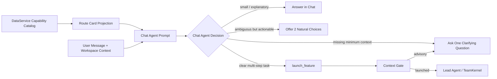

# LLM-only Capability Routing + UX Guidance Design

## Goal

Make Wenjin's workspace capability system feel intelligent, flexible, and low-friction when users describe research or writing needs in natural language.

The system should decide whether to answer directly, ask one useful clarification, offer a small choice, or launch a team task. The goal is not 100% automatic launching. The goal is fewer missed launches, fewer accidental launches, fewer rigid keyword requirements, and fewer form-like follow-up questions.

## Current Baseline

Wenjin already has the right execution architecture:

- Chat Agent is the left-panel conversation and intent layer.
- `launch_feature` is the only capability execution entry.
- Lead Agent / TeamKernel owns execution after launch.
- DataService Catalog is the source of truth for capabilities, skills, and agent templates.
- `launch_feature` context gate prevents missing-context launches from creating executions or consuming credits.

The weak point is capability routing. Current catalog records expose `intent.description`, `trigger_phrases`, display metadata, and mission promise to the Chat Agent prompt. This works when users use expected terms, but feels rigid when they describe the same intent with different wording. It also does not encode enough interaction guidance for ambiguous cases, lightweight questions, or user-friendly clarification.

## Decision

Use a single-LLM, non-embedding capability router inside the existing Chat Agent turn.

No embedding service, vector index, separate router microservice, or second router LLM is introduced in the first version. The Chat Agent receives compact route cards projected from DataService capability records and applies a stricter routing rubric before deciding whether to call `launch_feature`.



## Scope

This spec covers:

- `capability.v2` routing schema additions.
- DataService/Gateway projection of compact route cards.
- Chat Agent prompt/rubric changes for LLM-only routing.
- User interaction behavior for auto-launch, clarification, choice offering, and direct chat answers.
- Route and UX evaluation cases.
- Documentation updates for capability authors.

This spec does not cover:

- Embedding, vector search, semantic indexing, or external router services.
- Replacing Lead Agent or TeamKernel.
- Reworking execution graph templates.
- Adding a new frontend workflow builder.
- Building a new visible "router panel" or exposing routing confidence to users.
- Charging, sandbox execution, or Prism review behavior changes after launch.

## Design Principles

1. **Progressive commitment.** Wenjin should commit to execution only when the user's intent and minimum context are clear enough.

2. **Natural guidance over internal machinery.** Users should never see capability ids, route confidence, schema names, trigger phrases, or "routing decision" language.

3. **High confidence launches, medium confidence choices, low confidence conversation.** The system should avoid both under-triggering and aggressive over-triggering.

4. **One useful question.** Clarification should ask for the smallest missing piece, not present a form or checklist.

5. **Small tasks stay small.** Concept explanations, short sentence edits, and local discussion should remain in chat instead of becoming team executions.

6. **DataService remains the source of truth.** Routing guidance is part of capability catalog data, not a separate hard-coded frontend or prompt table.

7. **Context gate remains authoritative.** Chat Agent routing is an intent decision. `launch_feature` still decides whether execution can start.

## Capability Routing Schema

Add an optional `routing` object to `capability.v2`.

```yaml
routing:
  when_to_use:
    - 用户需要围绕研究主题整理文献、gap、创新点或相关工作定位。
  not_for:
    - 用户只是在询问概念解释。
    - 用户明确要直接写完整初稿。
  user_intents:
    - 找研究空白
    - 整理文献矩阵
    - 提炼 contribution
  positive_examples:
    - 联邦学习结合大模型有什么创新点？
    - 帮我整理这个方向的研究空白和相关工作。
  negative_examples:
    - 联邦学习是什么？
    - 帮我把这句话改得更学术一点。
  minimum_context:
    goal_or_topic: required
    source_artifact_id: optional
    target_format: optional
  ambiguity:
    overlaps_with:
      - research_question_to_paper
      - reproducibility_audit
    ask_user_when:
      - 同时像文献定位和完整论文写作。
      - 用户提到实验稳定性但没有数据、代码或结果。
  clarification:
    ask_when_missing:
      goal_or_topic: 你想聚焦哪个具体主题、研究问题或技术方向？
    choice_when_ambiguous:
      research_vs_writing:
        question: 你想先找研究空白，还是直接进入 SCI 初稿？
        options:
          - label: 先找研究空白
            capability_id: sci_literature_positioning
          - label: 直接写初稿
            capability_id: research_question_to_paper
  user_guidance:
    launch_intro: 我会让文献专家先整理相关工作、gap 和可用论断。
    clarification_prefix: 这个方向可以开始做，但我还需要一个关键信息。
    lightweight_answer_hint: 这个问题我可以先直接解释，不需要启动团队任务。
```

### Field Semantics

- `when_to_use`: semantic conditions that justify launching this capability.
- `not_for`: cases that should remain in chat or route elsewhere.
- `user_intents`: compact user-goal labels for prompt routing.
- `positive_examples`: natural user messages that should match.
- `negative_examples`: natural user messages that should not match.
- `minimum_context`: only the minimum launch context, not all desirable inputs.
- `ambiguity.overlaps_with`: nearby capabilities for choice or disambiguation.
- `clarification.ask_when_missing`: user-friendly one-question prompts.
- `clarification.choice_when_ambiguous`: natural choices when two capabilities are both plausible.
- `user_guidance`: product-language snippets that help the Chat Agent respond without exposing internals.

The schema should be optional for migration, but release guidance should require it for user-visible primary capabilities before production launch.

## Route Card Projection

The Chat Agent should not receive full capability YAML. It should receive compact route cards generated from catalog records.

Example prompt projection:

```xml
<capability_route_card
  id="sci_literature_positioning"
  name="文献定位与创新点"
  tier="primary"
  surface="prism"
  when="整理文献、gap、创新点、相关工作定位"
  not_for="概念解释；短句润色；直接完整写初稿"
  examples="联邦学习结合大模型有什么创新点？；帮我整理这个方向的研究空白"
  minimum_context="goal_or_topic"
  overlaps="research_question_to_paper,reproducibility_audit"
  launch_intro="我会让文献专家先整理相关工作、gap 和可用论断。"
/>
```

Projection rules:

- Only include enabled capabilities for the current workspace type.
- Exclude `entry_tier: hidden`.
- Preserve canonical `capability_id`.
- Keep route card text short and bounded.
- Include at most 2-3 positive examples and 2-3 negative hints.
- Use `routing` fields for user-visible capability route cards.
- During phased seed migration, non-migrated records may keep the current compact display/intent projection, but release gates should require explicit `routing` before a primary visible capability is considered production-ready.
- Do not expose route cards to the frontend or user messages.

## Chat Agent Routing Rubric

The Chat Agent prompt should instruct the model to classify the user's turn into one of these behaviors:

### 1. Answer in Chat

Use when:

- The user asks for a concept explanation.
- The user asks for a short local rewrite.
- The user is brainstorming and has not asked Wenjin to produce a durable artifact.
- The task can be answered quickly without team execution, sandbox, Prism review, or external evidence gathering.

User experience:

- Answer directly.
- Optionally mention that a deeper team task is available if useful.
- Do not call `launch_feature`.

Example:

> 联邦学习是什么？

Response:

> 联邦学习是一种让多方在不直接共享原始数据的情况下共同训练模型的方法。简单说，数据留在本地，模型参数或更新被聚合。你如果想进一步看它和大模型结合的研究空白，我也可以让文献专家做一轮定位。

### 2. Ask One Clarifying Question

Use when:

- The user wants a multi-step deliverable, but the minimum topic/object is missing.
- The likely capability is clear, but launch would be too vague.
- `launch_feature` would likely return missing params.

User experience:

- Ask exactly one question.
- Do not list all optional inputs.
- Explain why the question matters in one short phrase.

Example:

> 帮我写 SCI

Response:

> 可以。你想围绕哪个具体研究问题或已有材料来写？有了主题后我就能让论文团队开始搭结构和证据链。

### 3. Offer a Small Choice

Use when:

- Two capabilities are both plausible.
- The distinction affects user expectation or cost.
- The user has not made the intended deliverable clear.

User experience:

- Offer two natural options.
- Do not offer more than two primary options.
- Avoid internal capability names unless the display names are user-friendly.

Example:

> 联邦学习结合大模型这个方向帮我看看

Response:

> 这可以有两个做法：先让文献专家找研究空白和创新点，或者直接让论文团队按 SCI 初稿方向推进。你想先做哪一个？

### 4. Launch Feature

Use when:

- The user asks for a durable multi-step deliverable.
- The route card strongly matches.
- Minimum context is present or can be safely inferred from the message/current workspace.
- The work belongs in Lead Agent / TeamKernel rather than direct chat.

User experience:

- Call `launch_feature` in the same turn.
- After tool result, provide a short receipt.
- Mention what the team will do in user terms.
- Point to the right panel for progress only after the tool result confirms launch.

Example:

> 联邦学习结合大模型有什么创新点？帮我整理相关文献和 gap。

Tool call:

```json
{
  "feature_id": "sci_literature_positioning",
  "params": {
    "goal": "整理联邦学习结合大模型方向的相关文献、研究空白和创新点",
    "topic": "联邦学习结合大模型",
    "raw_message": "联邦学习结合大模型有什么创新点？帮我整理相关文献和 gap。"
  }
}
```

Response after launched:

> 我已经让文献专家开始整理这个方向的相关工作、gap 和可用论断。右侧会显示团队进展，完成后你可以预览并接受结果。

## Parameter Extraction

Chat Agent should extract a compact brief rather than trying to fill every schema field.

Recommended default params:

- `raw_message`: exact user message.
- `goal`: normalized user goal.
- `topic`: topic or research object when obvious.
- `query`: search query when user expresses a search/research need.
- `target_format`: journal, school, patent, software copyright, proposal, or template requirement when explicit.
- `source_artifact_id`: only when provided by route/query seed or artifact follow-up context.
- `existing_materials_summary`: only when current conversation or workspace context clearly provides it.
- `constraints`: only explicit constraints.

Do not invent:

- target journal;
- dataset availability;
- file ids;
- source ids;
- experimental claims;
- citation keys.

## Interaction Examples

### SCI Literature Positioning

User:

> agent memory 这个方向现在有什么研究机会？

Expected:

- `launch_feature`: `sci_literature_positioning`
- Params: topic/goal/raw_message
- UX: short launch receipt.

### SCI Paper Draft

User:

> 帮我写一篇 agent memory 的 SCI。

Expected:

- `ask_clarification` if there is no research question, method, or materials.
- One question about the concrete research problem or existing materials.

### Small Explanation

User:

> agent memory 是什么意思？

Expected:

- `answer_in_chat`
- No launch.
- Optional soft offer for deeper literature positioning.

### Ambiguous Research vs Experiment

User:

> 帮我看看这个方向能不能做实验。

Expected:

- If no data/code/materials: ask one question about available data/code or intended method.
- If current workspace has dataset/code context: launch `sci_empirical_package` or `reproducibility_audit` depending on wording.

### Prism Local Rewrite

User:

> 把这句话改得不那么 AI 味。

Expected:

- If selection context exists: use Prism local rewrite path, not a broad manuscript capability.
- If no selection but on Prism page: ask whether to改当前选中文本 or 全文风格.
- Do not launch unrelated literature or full-paper capability.

## UX Copy Rules

The Chat Agent should:

- Use concise Chinese by default.
- Avoid "我检测到", "路由到", "匹配 capability", "confidence", "schema", "feature id".
- Avoid saying "已启动" before the tool call succeeds.
- Avoid asking the user to choose from internal names.
- Ask one question at a time.
- Give a useful default when safe: "我先按文献定位处理".
- Mention cost/points only when a task is clearly heavy and the product surface already expects billing disclosure.
- Keep the user in control when ambiguity affects cost or deliverable.

Recommended language:

- "我可以先让文献专家做一轮定位。"
- "这更像一个投稿策略问题。"
- "这个我可以直接解释，不需要启动团队任务。"
- "你是想先找研究空白，还是直接进入初稿？"
- "有了具体主题后我就能开始。"

Avoid:

- "该请求匹配 `sci_literature_positioning`。"
- "根据 routing confidence，我建议..."
- "请填写以下参数..."
- "我将调用工作流..."
- "feature 已进入 compute pipeline..."

## Context Gate Behavior

`launch_feature` remains the final execution gate.

If Chat Agent calls `launch_feature` with insufficient params:

- no `ExecutionRecord`;
- no credit reservation;
- no Celery dispatch;
- no sandbox acquisition;
- return advisory/missing params;
- Chat Agent turns that advisory into one user-friendly question.

The context gate should not require optional fields. It should only block missing minimum context needed to make the execution meaningful.

## Frontend Behavior

First version should avoid major frontend changes.

Existing chat rendering is enough for:

- direct answers;
- one clarification question;
- two-option natural language choices;
- launch receipts;
- advisory follow-up.

Optional future frontend enhancement:

- render two natural choices as lightweight suggestion chips when the Chat Agent emits a `question_card` or equivalent structured block;
- store selected choice as a normal user turn so it re-enters the same Chat Agent route path.

Do not add a separate "capability router" UI, route debug panel, or confidence display.

## Evaluation

Add route/UX eval cases that exercise routing behavior without running real Lead Agent workflows.

### Eval Contract

Each case should include:

```yaml
- id: sci_lit_positioning_clear
  workspace_type: sci
  message: 联邦学习结合大模型有什么创新点？帮我整理相关文献和 gap。
  expected_decision: launch
  expected_capability: sci_literature_positioning
  expected_params:
    topic_contains: 联邦学习
    goal_contains: 创新点
  expected_user_experience: auto_start_with_short_receipt
```

Decision values:

- `launch`
- `ask_clarification`
- `offer_choices`
- `answer_in_chat`

UX values:

- `auto_start_with_short_receipt`
- `one_question_not_form`
- `two_choice_guidance`
- `direct_answer_no_team_task`
- `advisory_to_one_question`

### Eval Categories

1. Clear launch.
2. Missing minimum topic.
3. Ambiguous between two capabilities.
4. Small chat answer should not launch.
5. Prism local edit should not launch broad capability.
6. Sandbox-heavy task should ask for data/code when absent.
7. Artifact follow-up should preserve source artifact context.
8. Workspace type should constrain available capabilities.
9. Chinese colloquial wording should route correctly.
10. English academic wording should route correctly.

Initial target:

- at least 12 cases per workspace type;
- at least 10 cross-workspace negative cases;
- at least 10 Prism-specific cases;
- at least 10 ambiguous-choice cases.

Passing criteria:

- no false launch on small explanation cases;
- no launch when minimum topic is missing;
- clear multi-step deliverable routes to the expected capability or an acceptable nearby capability;
- clarification responses are one question, not a form;
- user-facing response does not expose internal ids, schema names, or confidence.

## Implementation Boundaries

### Backend

Likely files:

- `backend/src/services/capability_schema.py`: add `routing` schema models.
- `backend/src/dataservice/domains/catalog/service.py`: preserve/validate routing data in catalog records.
- `backend/src/dataservice/domains/catalog/projection.py`: include routing in capability projection.
- `backend/src/agents/chat_agent/agent.py`: render route cards and routing rubric.
- `backend/src/agents/chat_agent/prompts/system.py`: adjust base behavior language.
- `backend/seed/capabilities/**.yaml`: add routing to primary visible capabilities.
- `backend/tests/...`: add schema, projection, prompt, and route eval tests.

### Frontend

No required first-version changes.

Potential test-only or follow-up files:

- Chat panel tests verifying launch/advisory copy does not expose internals.
- Optional suggestion-chip integration if an existing block type supports choices cleanly.

### Docs

Update:

- `docs/current/workspace-feature-catalog.md`
- `docs/current/architecture.md`
- `docs/current/frontend-feature-plugin-contract.md`
- `docs/current/release-gate-checklist.md`

## Rollout Plan

### Phase 1: Infrastructure and Prompt

- Add optional routing schema.
- Project route cards.
- Update Chat Agent routing rubric.
- Add focused route eval harness with mocked LLM/tool behavior where possible.

### Phase 2: SCI and Thesis First

- Add routing blocks for SCI and thesis primary capabilities.
- Run eval cases against common user phrasings.
- Tune prompt and route cards.

### Phase 3: Proposal, Patent, Software Copyright

- Add routing blocks for remaining workspace types.
- Add domain-specific ambiguity examples.
- Extend eval cases.

### Phase 4: UX Tightening

- Review real browser behavior.
- Check launch receipts, clarification tone, and missed-launch cases.
- Add optional lightweight choice chips only if natural language choices are not enough.

## Risks and Mitigations

### Risk: Prompt bloat

Mitigation:

- Use compact route card projection.
- Include only current workspace capabilities.
- Cap examples per capability.
- Do not inject graph templates or full YAML.

### Risk: Over-launching

Mitigation:

- Explicit answer-in-chat rubric.
- Negative examples.
- Context gate remains authoritative.
- Eval false-launch cases are release blockers.

### Risk: Under-launching

Mitigation:

- Positive examples use colloquial wording.
- `trigger_phrases` become auxiliary, not primary.
- Eval includes indirect and English academic phrasings.

### Risk: Rigid clarification

Mitigation:

- One-question rule.
- User guidance fields in capability routing.
- UX eval checks for form-like responses.

### Risk: Capability YAML grows messy

Mitigation:

- Keep `routing` separate from `mission`, `team_policy`, and `graph_template`.
- Route card projection consumes only routing/display/mission fields.
- Capability author docs explain what belongs in each section.

## Success Criteria

The feature is successful when:

- users can trigger major tasks with natural wording, not only exact trigger phrases;
- small questions remain lightweight chat interactions;
- ambiguous requests produce helpful choices instead of wrong launches;
- missing context produces one useful question;
- route eval catches regressions;
- no new execution path bypasses `launch_feature`;
- no route internals leak to user-facing chat;
- DataService Catalog remains the routing source of truth.

## Self-review

- No embedding, vector store, or second router service is introduced.
- Lead Agent and TeamKernel boundaries remain unchanged.
- Context gate remains the final launch authority.
- User interaction is treated as part of the routing contract, not a prompt afterthought.
- Schema additions are optional for migration but required by release guidance for primary visible capabilities.
- The spec has no unresolved tokens or deferred undefined behavior.
