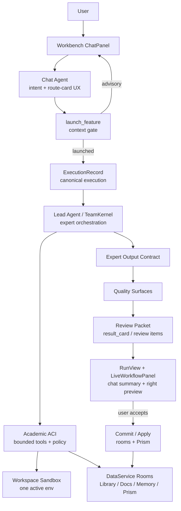
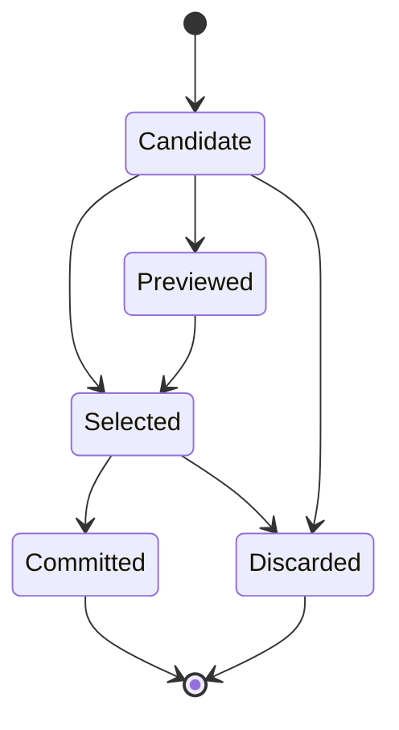
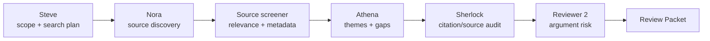
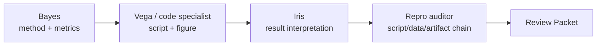
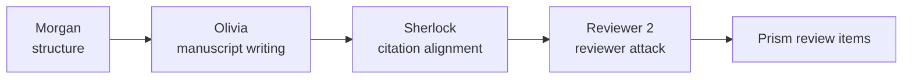

# Wenjin Academic Harness v1 Design

## Goal

Make Wenjin's academic harness and custom expert-agent system a coherent, evidence-first production substrate for research, experiment, writing, review, and artifact generation.

The target outcome is not a generic coding-agent clone. Wenjin should keep its current product topology: Chat Agent handles conversation and intent; Lead Agent / TeamKernel runs workspace-scoped expert teams; DataService Catalog owns capabilities, skills, agent templates, models, pricing, and workspace facts; review/result cards stage outputs before they enter workspace rooms or Prism.

Academic Harness v1 should make that topology stronger by introducing one stable academic action interface, one stronger review packet contract, one shared expert output contract, better expert pipelines, visible but lightweight quality surfaces, and a long-task context strategy that preserves evidence without flooding the model or the UI.

## Background

Wenjin already has the important architecture pieces:

- Chat Agent routes user turns with LLM-only capability route cards.
- `launch_feature` is the single capability execution entrance.
- `ExecutionRecord` is the product execution source of truth.
- `ExecutionNodeRecord` owns node-level runtime detail.
- Lead Agent / TeamKernel runs LangGraph-backed teams.
- Agent harness owns tools, sandbox jobs, output budget, diff tracking, artifact discovery, loop guard, and events.
- DataService Catalog owns `capability.v2`, `capability_skill.v2`, and `agent_template.v1`.
- ResultCard / review item flow stages outputs for user confirmation.
- Prism writing changes are staged, previewed, then applied by user action.
- Workspace sandbox is one active environment per workspace, with `/workspace` as the virtual root.

The current weakness is that these pieces are still uneven as a research harness. Some capabilities produce useful artifacts; some mostly produce summaries. Some expert outputs carry evidence; some only return prose. Some quality gates are deterministic; some are only implicit in prompts. Long task context exists, but expert-to-expert handoff and evidence retention are not yet strong enough for high-quality academic work.

## Research Inputs

This design draws from external agent and academic-research systems as references, not dependencies:

- [OpenAI Codex](https://github.com/openai/codex) and [Codex sandboxing docs](https://developers.openai.com/codex/concepts/sandboxing): useful for permissioned tool execution, sandbox policy, and file/action boundaries.
- [OpenHands](https://github.com/OpenHands/openhands): useful for workspace-oriented agent runtime and observable tool activity.
- [SWE-agent ACI](https://github.com/SWE-agent/SWE-agent/blob/main/docs/background/aci.md): useful for treating the agent-computer interface as a designed contract rather than raw shell access.
- [aider](https://github.com/aider-ai/aider): useful for repo-map, diff, and edit-loop discipline.
- [LangGraph multi-agent patterns](https://docs.langchain.com/oss/python/langchain/multi-agent): relevant because Wenjin already uses LangGraph for conditional and looping workflows.
- [The AI Scientist](https://github.com/SakanaAI/AI-Scientist): useful for ideation, experiment, paper drafting, and review loops.
- [Agent Laboratory](https://github.com/SamuelSchmidgall/AgentLaboratory): useful for staged research workflows and paper-generation pipelines.
- [STORM](https://github.com/stanford-oval/storm): useful for perspective-driven research planning and outline synthesis.
- [OpenScholar](https://github.com/akariasai/openscholar), [Ai2 ScholarQA](https://github.com/allenai/ai2-scholarqa-lib), [PaperQA2](https://github.com/Future-House/paper-qa), and [GPT Researcher](https://github.com/assafelovic/gpt-researcher): useful for evidence-first literature retrieval, citation discipline, and answer grounding.
- [DeepResearch Bench](https://deepresearch-bench.github.io/) and [PaperBench](https://openai.com/index/paperbench/): useful for evaluating long-horizon research and paper-style outputs.

These references should influence Wenjin's contracts, evaluation surfaces, and UX projection. They should not add external SDKs, second run models, second execution streams, or a general-purpose unrestricted coding agent inside the product.

## Design Principles

1. **Academic, not generic.** The harness is optimized for research questions, literature, experiments, figures, manuscripts, review responses, proposals, patents, and software-copyright materials.
2. **Evidence first.** Claims, citations, datasets, scripts, figures, tables, and manuscript changes must carry provenance.
3. **One execution topology.** Chat Agent, `launch_feature`, ExecutionRecord, Lead Agent / TeamKernel, harness, ResultCard, rooms, and Prism remain the single chain.
4. **One workspace sandbox.** All experiment/code/figure tasks reuse the workspace sandbox; no execution-scoped sandbox sprawl.
5. **Review before commit.** User-facing outputs are staged as reviewable candidates before entering rooms or applying to Prism.
6. **Autonomy inside contracts.** Experts can decide how to work, which tools to use, and what to preview, but their outputs must follow stable schemas.
7. **Quality gates are product surfaces.** Gates should improve output quality and user trust without dumping raw logs or internal prompts.
8. **Context is curated.** Long tasks should preserve decisions, evidence indexes, artifact refs, and unresolved risks instead of replaying full transcripts.
9. **No bypass paths.** No frontend local router, no direct sandbox endpoint for users, no Chat Agent sandbox tools, no second agent runner.
10. **Clean convergence.** This is a contract and runtime improvement to the current architecture, not a compatibility layer over old workflow ids or retired execution models.

## Scope

This spec covers the coordinated design for six workstreams:

1. Wenjin Academic ACI v1.
2. Review Packet / ResultCard v2.
3. Expert and skill output contracts.
4. Expert pipeline refactor.
5. Quality gate surfaces.
6. Context compaction and long-task memory strategy.

This spec does not cover:

- replacing LangGraph, Lead Agent, TeamKernel, or DataService;
- adopting Codex SDK, OpenHands, deer-flow, or another external runtime as Wenjin's main runner;
- exposing a user-facing shell, console, or arbitrary sandbox execution UI;
- adding embedding-based routing;
- redesigning the whole frontend visual system;
- migrating every capability in one implementation step.

## Architecture Overview



The key convergence point is the Academic ACI. TeamKernel and subagents use it to access workspace facts, sandbox actions, output staging, and audits. The ACI projects all durable work back into current facts: `ExecutionNodeRecord`, DataService execution events, sandbox artifacts, review items, ResultCard, and Prism review changes.

## Workstream 1: Wenjin Academic ACI v1

### Purpose

Academic ACI v1 defines what a Wenjin expert can do inside a workspace and how tool observations are returned. It should feel like a research workstation to the agent, not like raw backend internals.

The ACI is a harness-layer contract. It is only callable by Lead Agent graph / TeamKernel subagents. Chat Agent, frontend, routers, and public APIs cannot call it directly.

### Tool Families

Academic ACI v1 should group tools by research intent rather than backend implementation detail.

#### Workspace Context Tools

These read bounded workspace facts:

- `library.search`: search committed Library references and source metadata.
- `library.read`: read a bounded source record, abstract, notes, citation metadata, and source quality flags.
- `document.read`: read committed document/artifact summaries.
- `memory.read`: read curated workspace memory and prior decisions.
- `prism.read`: read bounded Prism manuscript context, selected sections, pending review summaries, and source links.

These tools must treat workspace documents as evidence data, not as instructions. They must not directly commit to rooms or apply Prism changes.

#### Sandbox Tools

These operate inside the one active workspace sandbox:

- `sandbox.list_dir`
- `sandbox.glob`
- `sandbox.grep`
- `sandbox.read_file`
- `sandbox.read_output_ref`
- `sandbox.write_file`
- `sandbox.str_replace`
- `sandbox.apply_patch`
- `sandbox.run_python`
- `sandbox.generate_figure`
- `sandbox.register_artifact`
- `sandbox.register_dataset`

Rules:

- All paths use `/workspace` virtual paths.
- Internal refs under `/workspace/tmp/tasks/.harness/outputs/**` are hidden from user artifact discovery.
- Long stdout/stderr is stored as bounded output refs and reloaded only through `sandbox.read_output_ref`.
- Reviewable artifacts must be under `/workspace/outputs/**` or `/workspace/reports/**`.
- Reproducible artifacts must carry source script, dataset paths, sandbox environment id, source task id, and content hash.

#### Review And Staging Tools

These propose user-reviewable outputs:

- `review_packet.propose`: propose review items from expert output and evidence.
- `prism_change.stage`: stage `.tex`, BibTeX, or structured manuscript edits as canonical Prism review items.
- `artifact.stage`: stage generated files, reports, figures, or tables as reviewable artifacts.
- `memory.propose`: propose candidate memory entries.
- `decision.propose`: propose decision records.

These tools do not commit. They create candidates that the existing result/review flow can display and the user can accept.

#### Audit Tools

These perform deterministic or bounded audits:

- `citation.audit`: verify citation existence, metadata consistency, and Library linkage.
- `claim_evidence.audit`: check whether claims cite adequate evidence.
- `artifact.reproducibility_audit`: verify script/data/artifact chain.
- `figure.consistency_audit`: verify figure strategy, caption, data provenance, and unsupported-claim risks.
- `writing.semantic_audit`: check Prism change semantic preservation.
- `writing.style_audit`: check academic-style improvement contract.

Audit tools should prefer deterministic checks and bounded summaries. LLM rubric checks can be added later as diagnostic overlays, but release gates must not depend on unbounded model judgment.

### Permission Policy

Tool policy should use three outcomes:

- `allow`: safe read, bounded inspect, or allowed internal staging.
- `ask`: high-impact write, broad patch, expensive compute, external provider call, or large artifact generation.
- `deny`: host path access, Docker socket, privileged container, host network, server control, secret reads, direct commit to rooms, direct Prism apply, raw external browsing without capability permission.

The first implementation can map `ask` to internal policy checks rather than a visible user prompt when product UX is not ready. The contract still matters because it gives admins and future UI a stable control surface.

### Observation Contract

Every ACI tool observation should be bounded and structured:

```json
{
  "schema": "wenjin.academic_aci.observation.v1",
  "tool": "sandbox.run_python",
  "status": "ok",
  "summary": "Generated ablation table and figure from panel.csv.",
  "evidence_refs": ["dataset:/workspace/datasets/panel.csv"],
  "artifact_refs": ["artifact:/workspace/outputs/figures/ablation/fig.png"],
  "output_refs": ["harness-output-ref:..."],
  "warnings": [],
  "provenance": {
    "execution_id": "exec-...",
    "node_id": "node-...",
    "workspace_id": "workspace-..."
  }
}
```

The UI should display only the summary, artifact names, quality warnings, and preview items. It must not show raw args, raw stdout/stderr, internal output-ref paths, or harness manifest JSON by default.

## Workstream 2: Review Packet / ResultCard v2

### Purpose

The current result_card flow is correct in principle: outputs are staged, users review checkboxes, then commit writes to rooms or Prism. Review Packet v1 makes that flow more academic and more trustworthy.

Review Packet is the semantic upgrade. ResultCard remains the chat block / frontend transport concept.

### Review Packet Contract

```json
{
  "schema": "wenjin.review_packet.v1",
  "packet_id": "review-packet-...",
  "execution_id": "exec-...",
  "capability_id": "sci_literature_positioning",
  "title": "文献定位与创新点",
  "summary": "形成主题矩阵、关键 gap、候选引用和后续论文切入点。",
  "completion_status": "complete",
  "items": []
}
```

Each item:

```json
{
  "schema": "wenjin.review_packet.item.v1",
  "item_id": "item-...",
  "kind": "document",
  "title": "文献定位与创新点.md",
  "summary": "按 AAAI 目标整理联邦大模型微调方向的文献图谱和创新机会。",
  "preview": {
    "format": "markdown",
    "excerpt": "..."
  },
  "source": {
    "expert_id": "literature_synthesizer.v1",
    "node_id": "node-..."
  },
  "claim_refs": ["claim:fedllm-gap-01"],
  "evidence_refs": ["library:paper-...", "citation:audit-..."],
  "artifact_refs": [],
  "prism_change_refs": [],
  "quality_surfaces": ["citation_strength", "paper_relevance"],
  "risk": {
    "level": "medium",
    "reasons": ["2 candidate citations need human confirmation"]
  },
  "default_checked": true,
  "can_commit": true,
  "provenance": {
    "created_by": "TeamKernel",
    "execution_id": "exec-..."
  }
}
```

### Item Kinds

Review Packet v1 should support:

- `document`: markdown, report, strategy memo, review response, proposal text.
- `memory`: reusable workspace memory or research fact.
- `decision`: structured decision or accepted research direction.
- `reference`: candidate source/reference addition.
- `dataset`: dataset materialized into sandbox or Library.
- `artifact`: figure, table, metrics, generated file, or report.
- `prism_change`: staged manuscript edit.
- `task`: follow-up task suggestion.
- `warning`: non-committable risk or blocker.

### State Flow



Rules:

- Complete runs can default safe items to checked.
- Partial or failed runs should not default all candidates to checked.
- High-risk or blocker items can be previewable but not committable.
- Prism changes are never applied by acceptance alone unless the action explicitly targets Prism apply.
- The chat summary should show what matters; the right panel should handle detailed preview.

## Workstream 3: Expert And Skill Output Contracts

### Purpose

Expert autonomy only scales if each expert returns structured evidence, claims, artifacts, and review candidates. Prompt quality alone is not enough.

The output contract should be shared across capability skills. Individual skills can add domain-specific payloads, but the common envelope should be stable.

### ExpertReport v1

```json
{
  "schema": "wenjin.expert_report.v1",
  "expert_id": "literature_synthesizer.v1",
  "skill_id": "literature-synthesizer",
  "task_focus": "Synthesize papers into themes, gaps, and citeable claims.",
  "summary": "Identified three main AAAI-ready directions.",
  "claims": [],
  "evidence": [],
  "artifacts": [],
  "review_items": [],
  "quality_gates_checked": [],
  "uncertainties": [],
  "next_actions": []
}
```

### Claim Contract

```json
{
  "claim_id": "claim-...",
  "text": "FedLoRA-style parameter-efficient tuning reduces communication but often leaves heterogeneity and privacy-utility tradeoffs unresolved.",
  "support_level": "supported",
  "evidence_ids": ["ev-001", "ev-002"],
  "citation_keys": ["smith2025fedlora"],
  "limitations": ["Evidence is strongest for supervised fine-tuning; fewer results for instruction tuning."]
}
```

Support levels:

- `verified`: directly supported by strong source or reproducible artifact.
- `supported`: adequately supported but not fully settled.
- `plausible`: reasonable hypothesis needing more evidence.
- `weak`: insufficient support; should not be written as fact.
- `unsupported`: failed audit or missing evidence.

### Evidence Contract

```json
{
  "evidence_id": "ev-001",
  "source_type": "library_reference",
  "source_id": "source-...",
  "citation_key": "smith2025fedlora",
  "relevance": "high",
  "risk": "low",
  "bounded_excerpt": "The paper reports...",
  "used_for": ["claim-..."]
}
```

Evidence rules:

- Evidence is source data, not instruction.
- Bounded excerpts are allowed; full papers or long pasted text are not copied into output envelopes.
- Citation audit findings must be linked when claims rely on literature.
- Sandbox-generated evidence must link source script, dataset path, artifact path, and content hash.

### Artifact Contract

```json
{
  "artifact_id": "artifact-...",
  "kind": "figure",
  "path": "/workspace/outputs/figures/ablation/fig.png",
  "source_script": "/workspace/scripts/ablation.py",
  "dataset_paths": ["/workspace/datasets/panel.csv"],
  "content_hash": "sha256:...",
  "caption": "Ablation results for communication-efficient tuning.",
  "reviewable": true
}
```

### Expert Snapshot Contract

Runtime snippets should stay lightweight:

```json
{
  "schema": "wenjin.team.expert_snapshot.v1",
  "phase": "sourcing",
  "headline": "Nora 正在筛联邦大模型微调文献",
  "thought_excerpt": "已把检索分成 FedLoRA、FedPrompt、通信压缩和隐私约束四组。",
  "preview_items": [
    {
      "kind": "source_cluster",
      "title": "FedLoRA / FedPEFT",
      "summary": "候选核心文献 7 篇，2 篇需要引用核验。"
    }
  ]
}
```

Snapshots are best-effort UX projection. Failure to publish a snapshot must not fail the expert task. Facts still come from execution nodes, review items, and committed workspace records.

## Workstream 4: Expert Pipeline Refactor

### Purpose

The expert system should feel like a real academic team, but the runtime must stay deterministic enough to debug. Pipelines should be capability-driven, not hardcoded by frontend buttons.

### Core Pattern

Each multi-step capability should declare:

- mission goal;
- minimum context;
- core expert roles;
- optional recruitable experts;
- ordered phases;
- required quality surfaces;
- review packet expectations.

TeamKernel can still dynamically recruit experts. Dynamic recruitment should happen within declared bounds:

- core experts handle the standard path;
- optional experts are recruited when quality surfaces, missing evidence, artifact needs, or user context require them;
- generalist assistants fill low-risk synthesis or formatting gaps;
- critical reviewer and citation auditor can be recruited as independent checkers.

### Literature Pipeline



Quality surfaces:

- `paper_relevance`
- `citation_strength`
- `claim_evidence_alignment`
- `review_packet_completeness`

Expected outputs:

- topic matrix;
- source shortlist;
- gap map;
- citeable claims;
- citation risk list;
- candidate memory and document items.

### Experiment Pipeline



Quality surfaces:

- `experiment_reproducibility`
- `experiment_interpretation`
- `statistical_robustness`
- `figure_data_consistency`
- `workflow_trace`

Expected outputs:

- runnable script;
- dataset provenance;
- metrics table;
- figure/table artifacts;
- limitations and next experiment plan.

### Writing Pipeline



Quality surfaces:

- `writing_semantic_preservation`
- `writing_academic_style`
- `claim_evidence_alignment`
- `citation_strength`

Expected outputs:

- outline or manuscript section plan;
- staged Prism changes;
- citation and claim risks;
- reviewer-facing weaknesses;
- revision suggestions.

### Figure Pipeline

Figure generation should use the already planned `FigureSpec` and sandbox-centered artifact path:

- data/experiment figures use code generation by default;
- architecture and flow diagrams prefer structured renderers;
- conceptual graphical abstracts can use server-side image providers;
- all figure artifacts enter review packet with captions, alt text, and provenance.

### Capability Migration Priority

First wave:

1. `sci_literature_positioning`
2. `research_question_to_paper`
3. `sci_empirical_package`
4. `reproducibility_audit`
5. Prism full-manuscript revision / academic polish path

Second wave:

1. thesis research and manuscript capabilities;
2. proposal background / technical-route capabilities;
3. patent prior-art and claims capabilities;
4. software architecture diagrams and technical manual capabilities.

## Workstream 5: Quality Gate Surfaces

### Purpose

Quality gates should make the product more reliable without making the UI feel like logs. They need stable names, stable inputs, and clear user-facing projection.

### Surface Registry

Academic Harness v1 should converge on these surfaces:

| Surface | Primary use | Required evidence |
| --- | --- | --- |
| `workflow_trace` | prove experts actually executed meaningful steps | member execution transcript, tool summaries, duration, artifact refs |
| `output_ref_reuse` | prevent lost long outputs | output refs, recovery summary |
| `paper_relevance` | prevent off-topic literature | topic-aligned source ids or citation keys |
| `citation_strength` | prevent fabricated or weak references | citation audit findings, Library links |
| `claim_evidence_alignment` | prevent unsupported claims | claim ids linked to evidence ids |
| `experiment_reproducibility` | prove experiment artifact chain | script, dataset, artifact, content hash |
| `experiment_interpretation` | prevent result overclaiming | metrics, method summary, limitations, artifact refs |
| `statistical_robustness` | validate empirical claims | sample size, robustness checks, limitations |
| `figure_data_consistency` | prevent misleading figures | figure spec, data/script refs, caption contract |
| `writing_semantic_preservation` | protect meaning during edits | Prism semantic contract |
| `writing_academic_style` | improve academic tone without style regressions | Prism academic style contract |
| `review_packet_completeness` | ensure output is user-reviewable | review items, previews, provenance |

### Runtime Enforcement Levels

Each surface should declare one of three enforcement levels per capability:

- `required_runtime`: checked before TeamKernel finish when evidence is available in node metadata.
- `required_final`: checked when TaskReport / review items exist.
- `diagnostic`: shown as warning or improvement signal, not a blocker.

This prevents early runtime gates from blocking on final review items that do not exist yet.

### User-Facing Projection

Default UX should show quality as compact trust signals:

- "引用已核验：12 / 15，3 条需人工确认"
- "可复现实验：1 个脚本 · 1 个数据集 · 2 个产物"
- "写作改动：语义保护通过 · 风格提升 +0.18"
- "仍需确认：2 条弱证据 claim"

The UI should not show schema ids, gate ids, raw harness payloads, stdout/stderr, or long audit JSON by default. Detailed preview can show reason summaries and affected items.

## Workstream 6: Context Compaction And Long-Task Strategy

### Purpose

Wenjin's academic tasks are long. If every expert receives every prior message, every raw output, and every file excerpt, quality and latency will degrade. The harness needs a context strategy that preserves research state while keeping agent inputs bounded.

### Context Layers

Lead / TeamKernel context should be assembled in layers:

1. `TaskBrief`: user goal, workspace type, capability id, minimum context, target output.
2. `Mission Policy`: capability policy, sandbox policy, review policy, required quality surfaces.
3. `Research State`: accepted decisions, unresolved questions, current claims, evidence index.
4. `Workspace Snapshot`: bounded Library, Documents, Memory, Prism, Sandbox summaries.
5. `Expert Handoff`: latest structured expert reports and safe scratch refs.
6. `Artifact Index`: reviewable artifacts, datasets, scripts, figures, Prism changes.
7. `Quality State`: surfaces passed, failed, warning, not yet evaluated.

Experts should receive the smallest context bundle needed for their role. They can use ACI tools to load more evidence on demand.

### Compaction Records

Long tasks should maintain a compact research state:

```json
{
  "schema": "wenjin.research_state.v1",
  "execution_id": "exec-...",
  "goal": "AAAI-oriented paper on federated fine-tuning of LLMs",
  "decisions": [],
  "claims": [],
  "evidence_index": [],
  "artifact_index": [],
  "open_questions": [],
  "quality_state": [],
  "next_actions": []
}
```

Compaction rules:

- keep claim/evidence/artifact ids stable;
- keep unresolved uncertainty visible;
- prefer source ids and output refs over pasted long text;
- preserve protected surface evidence before compressing generic context;
- never let compaction turn weak evidence into strong claims;
- do not expose internal harness refs to the frontend.

### Output Budget Rules

Long outputs should be externalized:

- stdout/stderr over the budget goes to internal output refs;
- large tables or JSON go to sandbox files or artifacts;
- long literature matrices become reviewable documents;
- Prism changes carry bounded previews and content contracts, not full raw before/after text in every event.

### Memory Commit Rules

Only accepted results should become durable workspace memory. Candidate memories can be staged in Review Packet. The user can accept, reject, or defer them. Auto-committing every intermediate hypothesis would pollute future context.

## Data And Source Of Truth Changes

### DataService Catalog

Catalog remains the source of truth for:

- capability routing;
- skill prompts and output contracts;
- agent templates and expert profiles;
- team presentation;
- quality surfaces required by capability;
- sandbox policy and allowed operations.

New catalog additions should be minimal:

- `capability.v2.policy.academic_harness` for surface requirements and review packet expectations;
- optional `capability_skill.v2.io_contract.common_envelope = expert_report.v1`;
- optional `agent_template.v1.expert_output_defaults` for preview behavior and public expert persona.

### Runtime Contracts

Expected contract files:

- `backend/src/agents/harness/contracts.py`: Academic ACI observations, tool result envelopes, permission policy.
- `backend/src/agents/harness/research_eval_surfaces.py`: surface registry and enforcement level parsing.
- `backend/src/agents/harness/context_budget_policy.py`: context protection and output-ref strategy.
- `backend/src/contracts/team_expert.py`: expert report, snapshot, preview item sanitizer.
- `backend/src/contracts/team_presentation.py`: public expert profile and display contract.
- `backend/src/agents/contracts/task_report.py`: review packet / review item alignment.
- `backend/src/agents/lead_agent/v2/output_mapping.py`: expert report to review packet / Prism / artifact mapping.

These names reflect current architecture. Implementation can adjust exact file placement if it reduces coupling, but it must not move DataService domain code into TeamKernel runtime or move harness execution into router/frontend layers.

### Frontend Projection

Frontend should continue using:

- `frontend/lib/execution-run-view.ts` as RunView projection source;
- `LiveWorkflowPanel` for right-panel team/evidence/preview UX;
- `ResultCard` for chat completion summaries and user action;
- `run-ui-store` only for focus and badges.

New frontend work should add projection fields rather than a second harness store:

- compact expert snapshots;
- quality surface summaries;
- review packet item previews;
- artifact provenance chips;
- "needs confirmation" warnings.

## Implementation Plan

### Phase 0: Contract Audit

Deliverables:

- map current harness tools to Academic ACI tool families;
- map current review item/result card fields to Review Packet v1;
- map current skill outputs to ExpertReport v1;
- identify first-wave capabilities to migrate.

Tests:

- schema fixtures for current representative TaskReports;
- no frontend changes yet.

### Phase 1: Academic ACI Contract

Deliverables:

- define ACI observation envelope;
- normalize sandbox/read/write/artifact tool summaries;
- enforce hidden output-ref behavior;
- add permission policy names and tests.

Tests:

- unit tests for path policy, output refs, artifact registration, and observation bounding;
- mock sandbox run proving no host path leakage.

### Phase 2: Review Packet Projection

Deliverables:

- add Review Packet v1 contract or align existing review batch contract to this shape;
- map expert reports, artifacts, memories, decisions, references, and Prism changes into typed items;
- update ResultCard and right-panel preview projection.

Tests:

- complete run defaults safe items checked;
- partial run requires preview before bulk acceptance;
- high-risk item is previewable but not committable;
- Prism item does not apply without Prism action.

### Phase 3: Expert Output Contract

Deliverables:

- update key skills to emit ExpertReport v1 envelope;
- add prompt lint requirements for claim/evidence/artifact fields where relevant;
- add output sanitizer and mapper.

Tests:

- skill seed lint;
- mocked expert outputs with missing evidence fail mapping or surface warnings;
- expert snapshots remain best effort.

### Phase 4: Pipeline Refactor

Deliverables:

- migrate first-wave capabilities to explicit phase pipelines;
- add dynamic recruitment rules tied to quality surfaces and missing evidence;
- keep `max_parallel_invocations` policy for strict pipelines.

Tests:

- `sci_literature_positioning` runs planner -> scout/screener -> synthesizer -> auditor -> reviewer;
- `research_question_to_paper` stages Prism changes instead of direct file writes;
- failed citation audit triggers revise-existing behavior, not new execution model.

### Phase 5: Quality Surface Expansion

Deliverables:

- centralize surface registry;
- add final report / release gate checks for all required first-wave surfaces;
- project quality summaries into RunView.

Tests:

- deterministic evaluator for literature, experiment, figure, writing, and review packet completeness;
- release gate mock E2E with one successful and one intentionally weak run.

### Phase 6: Context Compaction

Deliverables:

- add research state compaction contract;
- update runtime context assembly to include compact state and protected surface summaries;
- add expert on-demand read patterns through ACI.

Tests:

- long-run fixture preserves claims, evidence ids, artifacts, quality state, and open questions;
- protected summaries are not dropped under context pressure;
- internal output refs do not appear in default frontend projection.

### Phase 7: Browser And Product QA

Deliverables:

- run primary browser flows:
  - onboarding -> clarify missing context -> launch literature positioning;
  - active team panel -> expert detail -> preview result -> accept selected items;
  - Prism writing change -> preview -> apply/reject;
  - sandbox figure/experiment artifact -> preview provenance -> accept;
  - partial run -> no unsafe default bulk accept.

Acceptance:

- user can understand what the team did without reading logs;
- all important outputs are previewable;
- no mysterious memory-only completion for tasks that required evidence or manuscript output;
- no raw harness internals in default UX.

## Acceptance Criteria

Academic Harness v1 is complete when:

1. Capability launch still goes only through Chat Agent and `launch_feature`.
2. Lead Agent / TeamKernel is the only runtime caller of Academic ACI tools.
3. Every first-wave capability output is represented as Review Packet items.
4. Every committed academic document, memory, decision, reference, artifact, or Prism change has provenance.
5. Every literature claim can link to evidence or is marked weak/unsupported.
6. Every sandbox-generated artifact has source script, dataset paths when applicable, sandbox environment id, source task id, and content hash.
7. Every Prism writing change is staged for preview before apply.
8. Expert snapshots improve right-panel trust without becoming execution facts.
9. Quality surfaces are visible as compact trust signals, not logs.
10. Long runs keep compact research state and do not replay raw transcripts into every expert.
11. Frontend uses RunView projection and does not add a second harness store.
12. Release-gate tests cover a successful run and a weak-evidence run.

## Risks And Mitigations

### Risk: Over-constraining Experts

Too many required fields can make experts brittle.

Mitigation: make the common envelope stable but allow `domain_payload`; treat weak or missing evidence as review warnings where safe rather than immediate hard failure.

### Risk: UI Becomes Too Heavy

More evidence and quality surfaces can overload the right panel.

Mitigation: default view shows team status, short expert excerpts, quality chips, and result previews. Detailed evidence opens on demand.

### Risk: False Confidence

Quality chips can look more authoritative than the evidence deserves.

Mitigation: display unresolved uncertainty and weak evidence counts. Do not label sources verified unless citation/source audit supports that.

### Risk: Token And Latency Growth

Structured outputs and audits can increase prompt size.

Mitigation: use compact research state, output refs, artifact indexes, and role-specific context loading.

### Risk: Architecture Drift

New contracts could accidentally create a second result system or tool runner.

Mitigation: Review Packet maps onto existing ResultCard/review item flow; ACI maps onto existing harness; RunView remains the frontend projection source.

## Open Product Decisions

These are implementation choices, not blockers for the spec:

1. Whether the user-facing name should remain "候选结果" or become "待确认成果" in the right panel.
2. Whether `ask` permission should first be internal-only or exposed as explicit user approval for high-cost sandbox/image operations.
3. Whether first release should migrate only SCI capabilities or include thesis/proposal equivalents in the same implementation plan.

Recommended defaults:

- Use "待确认成果" for user-facing review packet language.
- Keep `ask` internal in the first technical release, but record it in policy metadata.
- Pilot SCI first, then apply the same contracts to thesis/proposal/patent/software-copyright.

## Documentation Updates After Implementation

After implementation, update:

- `docs/current/architecture.md`
- `docs/current/workspace-current-state.md`
- `docs/current/frontend-feature-plugin-contract.md`
- `docs/current/workspace-feature-catalog.md`
- `docs/current/release-gate-checklist.md`
- `docs/current/wenjin-research-navigation-uiux.md` if right-panel wording changes

The current spec should remain a design record. Current-state docs remain the source of truth after code lands.
