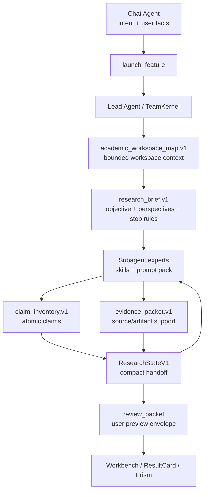

# Academic Harness v2: Research Brief, Claim Evidence, Workspace Map, Prompt Pack

## Goal

Deepen Wenjin's academic harness without changing the core product topology.

This spec implements the next narrow slice from the external research review:

1. `research_brief.v1` as the Lead run's structured academic task state.
2. `claim_inventory.v1` + `evidence_packet.v1` as the hard claim-evidence substrate.
5. `academic_workspace_map.v1` as a bounded map of workspace research assets.
6. Prompt pack upgrades for research, writing, review, citation, and reproducibility skills.

The goal is to improve output quality, reduce fabricated or weakly supported claims, and make expert teams more context-aware while staying inside the current chain:

`Chat Agent -> launch_feature -> ExecutionRecord -> Lead Agent / TeamKernel -> expert_report -> review_packet -> ResultCard / rooms / Prism`

This is not a new agent framework, not a Codex/OpenHands integration, and not a second execution stream.

## Background

Academic Harness v1 introduced the first shared contracts:

- `ExpertReportV1` carries bounded claims, evidence, artifacts, warnings, and expert previews.
- `TaskReport.review_packet` gives the frontend a semantic preview layer.
- `ResearchStateV1` compacts expert reports into a bounded state for later members.
- SCI first-wave capabilities require `review_packet_completeness` and `claim_evidence_alignment`.

The remaining quality gap is that expert outputs are still too coarse. A high-quality academic run needs a durable task brief, a workspace-level context map, atomized claims, explicit evidence links, and stronger prompts that force uncertainty, source grounding, and revision discipline.

External systems support this direction:

- STORM contributes multi-perspective question asking and outline-before-writing.
- PaperQA2 and OpenScholar contribute source-key grounding and evidence insufficiency behavior.
- PaperOrchestra contributes a research-material-to-manuscript intermediate state.
- Academic writing skill packs contribute two-pass refinement, style calibration, citation hardening, and reviewer-panel checks.
- Coding harnesses contribute the habit of small typed interfaces, validation gates, and observable state.

## Non-Goals

- Do not implement capability-derived sandbox permissions in this slice.
- Do not implement full append-only tool trajectory in this slice.
- Do not add embeddings or vector routing.
- Do not expose raw logs, raw expert reports, internal harness refs, or stdout/stderr in default UI.
- Do not let `review_packet` become a commit path. Room writes still go through `TaskReport.outputs`, DataService review items, ExecutionCommitService, or Prism apply/reject/revert.
- Do not add compatibility adapters that keep old prompt formats alive indefinitely. SCI first-wave skills should be migrated to the new output contract directly.

## Architecture



The convergence point is `ResearchStateV1`: it should stop being a loose list of claims/evidence and become the compact state built from `research_brief`, `academic_workspace_map`, `claim_inventory`, and `evidence_packet`.

## Contract 1: `research_brief.v1`

### Purpose

`research_brief.v1` is the run-level academic task brief. It converts conversation, capability routing, workspace facts, target venue, and user constraints into a stable structure that every expert can share.

It prevents two common failures:

- experts working from different interpretations of the task;
- long runs losing the original research objective and evidence standard.

### Owner

Backend contract:

- Create `backend/src/agents/harness/research_brief.py`
- Used by `backend/src/agents/lead_agent/v2/team/kernel.py`
- Injected by `backend/src/agents/lead_agent/v2/team/member_context.py`
- Stored in `ExecutionRecord.runtime_state["academic_harness"]["research_brief"]`

### Schema

```json
{
  "schema_version": "wenjin.research_brief.v1",
  "brief_id": "brief-exec-...",
  "workspace_id": "workspace-...",
  "execution_id": "exec-...",
  "workspace_type": "sci",
  "capability_id": "sci_literature_positioning",
  "user_objective": "围绕联邦大模型微调寻找 AAAI 级创新点",
  "research_topic": "Federated fine-tuning of large language models",
  "target_output": "文献图谱、gap 分析、创新点候选",
  "target_venue": {
    "name": "AAAI",
    "field": "AI/ML",
    "quality_bar": "top-tier conference"
  },
  "known_inputs": [
    {
      "kind": "user_message",
      "summary": "用户关注联邦场景下的大模型微调，目标 AAAI。"
    }
  ],
  "missing_inputs": [
    {
      "key": "dataset_or_benchmark",
      "reason": "创新点评估会受实验对象影响。",
      "ask_user_when_blocking": false
    }
  ],
  "perspectives": [
    {
      "perspective_id": "p-communication",
      "label": "通信效率",
      "questions": ["现有 FedLoRA/FedFT 方法如何降低通信？"]
    }
  ],
  "search_plan": {
    "seed_queries": ["federated learning large language model fine-tuning LoRA"],
    "source_policy": "prefer scholarly sources with DOI/arXiv/Semantic Scholar metadata",
    "stop_rules": [
      "每个核心 perspective 至少 3 个强相关来源",
      "新增检索连续两轮只产生重复或弱相关来源时停止"
    ]
  },
  "quality_contract": {
    "unsupported_claim_policy": "mark_insufficient_evidence",
    "citation_policy": "all literature claims must reference source keys",
    "artifact_policy": "numeric or figure claims must reference artifacts when present"
  },
  "handoff_notes": [],
  "risks": []
}
```

### Build Rules

1. Build once at TeamKernel run start from:
   - launch params;
   - workspace type;
   - capability route-card;
   - latest bounded workspace map;
   - existing chat context already passed to Lead Agent.
2. Do not ask the user unless a required capability `minimum_context` key is absent and cannot be inferred.
3. Preserve uncertainty. Unknowns go into `missing_inputs`, not invented assumptions.
4. Every dynamic recruitment decision should cite one brief field: objective, perspective, missing input, quality contract, or stop rule.

### Runtime Behavior

- Member context includes a compact brief summary, not the full JSON unless the expert owns planning or synthesis.
- Later experts receive the current brief plus updated `ResearchStateV1` deltas.
- If a run discovers a materially better framing, TeamKernel may append `handoff_notes` but should not rewrite the original user objective.

## Contract 2: `claim_inventory.v1`

### Purpose

`claim_inventory.v1` atomizes academic outputs into checkable claims. This is the foundation for fewer hallucinated citations, better reviewer feedback, and safer manuscript edits.

### Owner

Backend contract:

- Create `backend/src/agents/harness/claim_evidence.py`
- Referenced by `backend/src/contracts/team_expert.py`
- Evaluated by `backend/src/agents/harness/research_task_eval.py`
- Mapped by `backend/src/agents/lead_agent/v2/output_mapping.py`

### Claim Types

Use a closed enum:

- `background_fact`
- `literature_position`
- `method_description`
- `novelty`
- `comparison`
- `numeric_result`
- `figure_or_table_interpretation`
- `limitation`
- `recommendation`
- `writing_revision`

### Support Status

Use a closed enum:

- `supported`
- `partially_supported`
- `insufficient_evidence`
- `conflicting_evidence`
- `not_checked`

### Schema

```json
{
  "schema_version": "wenjin.claim_inventory.v1",
  "claims": [
    {
      "claim_id": "claim-fedllm-communication-gap",
      "claim_type": "literature_position",
      "text": "联邦大模型微调的主要瓶颈之一是低秩适配参数在异构客户端之间的通信与聚合效率。",
      "location": {
        "kind": "draft_section",
        "path": "sections/20_related_work.tex",
        "section": "Related Work"
      },
      "owner_expert_id": "literature_synthesizer.v1",
      "support_status": "partially_supported",
      "evidence_refs": ["evidence-s2-001", "evidence-arxiv-002"],
      "artifact_refs": [],
      "conflict_refs": [],
      "risk": {
        "level": "medium",
        "reasons": ["needs stronger AAAI-adjacent support"]
      },
      "recommended_action": {
        "kind": "strengthen_evidence",
        "summary": "补充 FedLoRA/FedPrompt 近两年强相关来源。"
      }
    }
  ]
}
```

### Rules

1. No paragraph-level vague claim ids. Claims must be atomic enough to verify.
2. `numeric_result` and `figure_or_table_interpretation` require `artifact_refs` unless explicitly marked `insufficient_evidence`.
3. `novelty` and `comparison` claims require at least two source keys or one source key plus one explicit limitation.
4. `unsupported_claim_policy` from `research_brief.quality_contract` controls whether unsupported claims become warnings or blockers.
5. Claims cannot cite raw URLs alone when Library/source metadata exists. Prefer `source_key`, DOI, arXiv, Semantic Scholar id, or workspace Library id.

## Contract 3: `evidence_packet.v1`

### Purpose

`evidence_packet.v1` is the normalized support layer behind the claim inventory. It tracks source excerpts, artifacts, datasets, and audit status without exposing raw tool output to users.

### Evidence Types

- `library_source`
- `external_source`
- `citation_audit`
- `dataset`
- `script`
- `sandbox_artifact`
- `prism_section`
- `user_provided_material`
- `expert_judgment`

`expert_judgment` is allowed only as a weak support type; it cannot satisfy hard evidence gates by itself.

### Schema

```json
{
  "schema_version": "wenjin.evidence_packet.v1",
  "packet_id": "evidence-exec-...",
  "items": [
    {
      "evidence_id": "evidence-s2-001",
      "evidence_type": "library_source",
      "title": "Federated Fine-tuning of Large Language Models",
      "source_key": "library:paper-...",
      "locator": {
        "kind": "abstract",
        "value": "abstract"
      },
      "excerpt": "The paper studies communication-efficient fine-tuning under federated constraints.",
      "support_strength": "medium",
      "relevance": "direct",
      "verification": {
        "status": "verified",
        "method": "semantic_scholar_metadata",
        "checked_at": "2026-06-19T00:00:00Z"
      },
      "limitations": ["abstract-only; full text not available"]
    }
  ],
  "links": [
    {
      "claim_id": "claim-fedllm-communication-gap",
      "evidence_id": "evidence-s2-001",
      "support_relation": "supports",
      "confidence": "medium"
    }
  ],
  "gate_decision": {
    "status": "warn",
    "blocking_reasons": [],
    "warnings": ["1 novelty claim has only partial support"]
  }
}
```

### Gate Rules

1. `pass`: all required claims are supported or intentionally scoped as limitations.
2. `warn`: non-critical claims are partial, weak, or need user review.
3. `block`: any core novelty, citation, numeric, figure, or manuscript-change claim is unsupported, conflicting, or unverifiable.

Deterministic checks:

- citation key exists in Library or staged citation audit;
- DOI/arXiv/Semantic Scholar id shape is valid when present;
- artifact path belongs to workspace sandbox output roots;
- dataset/script/artifact refs align for numeric claims;
- every `claim.evidence_refs[]` points to an evidence item;
- every evidence item is referenced by at least one claim or explicitly marked as background.

## Contract 5: `academic_workspace_map.v1`

### Purpose

`academic_workspace_map.v1` is the academic equivalent of a repo-map. It gives Chat Agent and Lead Agent a compact understanding of what exists in the workspace without loading full documents, all memories, or all sandbox files.

It is not an embedding index. It is a deterministic bounded summary from existing rooms and sandbox manifests.

### Owner

Backend service:

- Create `backend/src/services/workspace_academic_map_service.py`
- Contract in `backend/src/contracts/workspace_academic_map.py`
- Used by Chat Agent context builders and TeamKernel run start
- Stored only as a computed snapshot or runtime state, not a new user-facing room

### Schema

```json
{
  "schema_version": "wenjin.academic_workspace_map.v1",
  "workspace_id": "workspace-...",
  "workspace_type": "sci",
  "generated_at": "2026-06-19T00:00:00Z",
  "topic_hints": ["federated learning", "large language models", "fine-tuning"],
  "library": {
    "source_count": 34,
    "strong_sources": [
      {
        "source_key": "library:paper-...",
        "title": "Federated Fine-tuning of Large Language Models",
        "year": 2025,
        "tags": ["FedLLM", "LoRA"],
        "quality_flags": ["has_doi", "semantic_scholar_verified"]
      }
    ],
    "citation_risks": ["3 sources missing DOI"]
  },
  "manuscript": {
    "active_project_id": "latex-project-...",
    "main_file": "main.tex",
    "sections": [
      {
        "section_id": "related_work",
        "path": "sections/20_related_work.tex",
        "status": "draft",
        "word_estimate": 830
      }
    ],
    "pending_prism_changes": 2
  },
  "experiments": {
    "datasets": [
      {
        "path": "/workspace/datasets/panel.csv",
        "summary": "client-level benchmark data",
        "content_hash": "sha256:..."
      }
    ],
    "scripts": [
      {
        "path": "/workspace/experiments/run_ablation.py",
        "last_status": "success"
      }
    ],
    "artifacts": [
      {
        "path": "/workspace/outputs/figures/ablation.png",
        "kind": "figure",
        "source_script": "/workspace/experiments/run_ablation.py"
      }
    ]
  },
  "decisions": [
    {
      "decision_id": "decision-...",
      "summary": "目标会议暂定 AAAI",
      "status": "active"
    }
  ],
  "memory": [
    {
      "memory_id": "memory-...",
      "summary": "用户关注通信效率和异构客户端场景",
      "category": "context"
    }
  ],
  "open_questions": [
    "是否已有目标数据集或 baseline？"
  ],
  "token_budget": {
    "recommended_context_items": 24,
    "full_text_loaded": false
  }
}
```

### Boundaries

1. Do not include full paper text, full manuscript sections, raw memory dumps, or raw sandbox logs.
2. Include stable ids, short summaries, freshness, risk flags, and artifact provenance.
3. Keep the map small enough for every Lead run.
4. Chat Agent may use the map for better clarification and launch decisions, but still cannot bypass `launch_feature`.
5. TeamKernel may use the map to recruit experts and form the initial `research_brief`.

## Contract 6: Prompt Pack v2

### Purpose

Prompt Pack v2 upgrades skill prompts so they produce the new structures reliably and use a consistent evidence-first style.

### Global Prompt Rules

Every migrated SCI first-wave worker prompt must include:

1. **No source, no claim.** If evidence is absent, output `insufficient_evidence`.
2. **Atomic claims.** Separate background, comparison, novelty, numeric, limitation, and recommendation claims.
3. **Source-key discipline.** Use workspace source keys and artifact refs. Do not invent DOI, BibTeX keys, venues, years, or metrics.
4. **Uncertainty is useful.** Preserve missing evidence and conflicting evidence as structured warnings.
5. **Evidence compression.** When summarizing, preserve query, source key, excerpt, support strength, and limitation.
6. **Two-pass writing.** Draft locally, then refine globally for terminology, redundancy, section promises, and citation consistency.
7. **Reviewer panel.** Criticism should be separated by method, domain, citation, reproducibility, adversarial novelty, and editor synthesis.
8. **User-facing outputs are proposals.** Experts propose staged outputs; they do not claim that content has been saved.

### Skill-Specific Upgrades

#### `query-planner`

Add STORM-style multi-perspective planning:

- produce perspectives;
- produce seed queries per perspective;
- define stop rules;
- list missing inputs and whether they block progress.

Required output:

- `research_brief_delta`
- `expert_report.claims` for task framing claims only
- `expert_report.evidence` for user/workspace facts used

#### `research-scout`

Add source acquisition discipline:

- classify each source as `core`, `adjacent`, `background`, `weak`, or `discarded`;
- never treat search snippets as strong evidence;
- include metadata verification status.

Required output:

- `evidence_packet.items` for sources
- `citation_pool` summary
- warnings for metadata gaps

#### `source-screener`

Add relevance and quality screening:

- score relation to each perspective;
- flag off-topic, outdated, duplicate, inaccessible, or weak sources;
- keep rejected-source reasons for audit.

Required output:

- `evidence_packet.links`
- `claim_inventory` only when screening supports a literature-position claim

#### `literature-synthesizer`

Add claim-first synthesis:

- produce theme matrix;
- produce gap claims;
- produce novelty-risk claims;
- every gap claim must cite sources and limitations.

Required output:

- `claim_inventory`
- `evidence_packet`
- `review_packet` candidates via expert report artifacts

#### `citation-auditor`

Add hard citation checks:

- verify all BibTeX/source keys;
- mark fabricated, missing, weak-only, duplicate, or unsupported citations;
- produce downgrade suggestions.

Required output:

- `evidence_packet.items` with `evidence_type=citation_audit`
- blocker findings for fabricated or missing key claims

#### `method-design`

Add method feasibility:

- connect method choices to literature gaps;
- identify required datasets/baselines/metrics;
- mark assumptions that need experiments.

Required output:

- method claims with evidence links;
- missing experiment inputs;
- recommended reproducibility plan.

#### `evidence-analyst`

Add numerical support discipline:

- every metric or figure interpretation must link to artifact/data/script;
- unsupported numeric text must become a blocker or downgrade recommendation.

Required output:

- numeric claims;
- artifact evidence;
- reproducibility warnings.

#### `reproducibility-auditor`

Add reproducibility packet:

- input files;
- commands/scripts;
- environment;
- outputs;
- expected values;
- failed or unverified items.

Required output:

- `evidence_packet` for datasets/scripts/artifacts;
- gate decision for numeric and figure claims.

#### `manuscript-architect`

Add cross-section contract:

- every section has purpose, required evidence, and unresolved claim types;
- do not create sections unsupported by available evidence.

Required output:

- outline claims;
- section evidence requirements;
- user-facing document artifact.

#### `manuscript-writer`

Add two-pass refinement:

- pass 1: section draft with citations;
- pass 2: global consistency, terminology, redundancy, and unsupported claim downgrade.

Required output:

- writing claims;
- citation and source links;
- Prism changes or document outputs only as staged proposals.

#### `review-critic`

Add panel mode:

- method reviewer;
- domain reviewer;
- citation reviewer;
- reproducibility reviewer;
- adversarial novelty reviewer;
- editor synthesis.

The editor synthesis may only summarize panel findings. It cannot invent new blockers that no reviewer produced.

Required output:

- blocker/warn/pass decision;
- claim-level recommended actions;
- concise user-facing summary.

## Data Flow

### Run Start

1. TeamKernel loads capability policy and workspace map.
2. TeamKernel builds `research_brief.v1`.
3. TeamKernel recruits initial experts from capability skills and brief perspectives.
4. Member context includes:
   - brief summary;
   - map summary;
   - prior research state if any;
   - required output schema.

### Expert Execution

1. Expert reads the prompt pack contract for its skill.
2. Expert produces `expert_report` with nested:
   - `research_brief_delta` when relevant;
   - `claim_inventory`;
   - `evidence_packet`;
   - artifacts / warnings / preview items.
3. TeamKernel sanitizes and validates the report.
4. TeamKernel updates `ResearchStateV1`.

### Run Completion

1. Output mapping builds `review_packet` from claim/evidence/artifacts/warnings.
2. Deterministic eval checks:
   - packet completeness;
   - claim evidence alignment;
   - citation key validity;
   - numeric/figure artifact alignment when present.
3. ResultCard shows:
   - saveable outputs from `TaskReport.outputs`;
   - read-only claim/evidence warnings from `review_packet`;
   - Prism handoff when review items exist.

## Frontend UX Requirements

The default right panel should not show schema names. It should show:

- brief summary: "本次研究目标 / 当前证据状态 / 还缺什么";
- expert progress: "Athena · 综述：已归纳 4 个主题，2 个 gap 证据不足";
- claim groups: "已支持 / 需确认 / 阻断";
- evidence preview: source title, year, source key, excerpt, limitation;
- next action: "补证据 / 降级表述 / 保存已确认结果 / 继续检索".

Avoid:

- raw JSON;
- raw tool output;
- "schema_version";
- internal ids unless in debug/dev surfaces;
- making review packet items look directly saveable when they are only diagnostic.

## Implementation Plan

### Phase 1: Contracts

Files:

- `backend/src/agents/harness/research_brief.py`
- `backend/src/agents/harness/claim_evidence.py`
- `backend/src/contracts/workspace_academic_map.py`
- `backend/src/agents/harness/research_state.py`
- `backend/src/contracts/team_expert.py`
- `backend/src/agents/contracts/task_report.py`

Tasks:

1. Add Pydantic contracts for `ResearchBriefV1`, `ClaimInventoryV1`, `EvidencePacketV1`, `AcademicWorkspaceMapV1`.
2. Extend `ExpertReportV1` to include these nested structures.
3. Extend `ResearchStateV1` to carry brief summary, claim inventory summary, evidence index, and unresolved blockers.
4. Keep payload bounds strict.

Tests:

- contract validation;
- bounds and sanitizer tests;
- invalid enum rejection;
- missing evidence-ref detection.

### Phase 2: Workspace Map Builder

Files:

- `backend/src/services/workspace_academic_map_service.py`
- existing room services as read sources
- Chat Agent and TeamKernel context builders

Tasks:

1. Build a deterministic map from Library, Prism, Documents, Memory, Decisions, Tasks, and Sandbox artifact manifests.
2. Add map freshness and bounded counts.
3. Use map at TeamKernel run start to build `research_brief`.
4. Optionally expose a debug-only map endpoint for tests/admin, not default user UI.

Tests:

- map excludes full text and raw logs;
- map includes Library source ids and Prism sections;
- map includes reproducible sandbox artifacts;
- map remains bounded with large workspaces.

### Phase 3: TeamKernel Integration

Files:

- `backend/src/agents/lead_agent/v2/team/kernel.py`
- `backend/src/agents/lead_agent/v2/team/member_context.py`
- `backend/src/agents/lead_agent/v2/team/expert_runtime.py`
- `backend/src/agents/lead_agent/v2/output_mapping.py`
- `backend/src/agents/harness/research_task_eval.py`

Tasks:

1. Build initial research brief.
2. Pass compact brief + workspace map into member context.
3. Normalize nested claim/evidence packet from expert reports.
4. Merge claim/evidence state after each member.
5. Update review packet mapping to group claim-level warnings and blockers.
6. Add deterministic eval for evidence links and gate decisions.

Tests:

- later members receive updated research state;
- unsupported claims become review packet warnings/blockers;
- no packet item becomes directly commit-only unless mapped from outputs/review items;
- failed partial runs default to preview-before-save.

### Phase 4: Prompt Pack Migration

Files:

- `backend/seed/skills/query-planner.yaml`
- `backend/seed/skills/research-scout.yaml`
- `backend/seed/skills/source-screener.yaml`
- `backend/seed/skills/literature-synthesizer.yaml`
- `backend/seed/skills/citation-auditor.yaml`
- `backend/seed/skills/method-design.yaml`
- `backend/seed/skills/evidence-analyst.yaml`
- `backend/seed/skills/reproducibility-auditor.yaml`
- `backend/seed/skills/manuscript-architect.yaml`
- `backend/seed/skills/manuscript-writer.yaml`
- `backend/seed/skills/review-critic.yaml`
- `backend/tests/architecture/test_academic_harness_catalog.py`

Tasks:

1. Add Prompt Pack v2 output contract to all migrated skills.
2. Add skill-specific instructions from this spec.
3. Add seed validation that SCI first-wave skills declare the nested structures.
4. Remove vague "write a good summary" instructions where they conflict with evidence-first output.

Tests:

- seed schema validation;
- required prompt phrases / output fields;
- no raw schema leakage in public expert profile fields.

### Phase 5: Frontend Projection

Files:

- `frontend/lib/execution-run-view.ts`
- `frontend/lib/workspace-result-preview.ts`
- `frontend/app/(workbench)/workspaces/[id]/components/live-workflow/*`
- existing unit and E2E tests

Tasks:

1. Project research brief summary and claim/evidence groups from `review_packet`.
2. Add compact "supported / needs confirmation / blocker" grouping.
3. Show evidence previews without raw ids unless useful.
4. Preserve existing save semantics.

Tests:

- unit projection tests;
- review packet warning preview test;
- browser golden path for a literature task with one supported claim and one evidence warning.

## Acceptance Criteria

1. SCI first-wave runs carry a `research_brief`.
2. Expert reports can carry nested `claim_inventory` and `evidence_packet`.
3. `ResearchStateV1` gives later members compact brief + claim/evidence context.
4. Review packet shows claim/evidence risks without becoming a second commit path.
5. Workspace map exists and is bounded, deterministic, and free of full text/raw logs.
6. Prompt Pack v2 is applied to all SCI first-wave skills.
7. Deterministic tests cover contracts, map bounds, TeamKernel handoff, eval gates, and frontend projection.
8. Browser test confirms the right panel explains supported vs weak/blocked outcomes clearly.

## Risks And Mitigations

### Risk: Too much structure reduces agent flexibility

Mitigation: Require structure only at output boundaries. Experts remain free to reason and choose tactics inside their skill.

### Risk: Prompt pack becomes verbose and hurts model focus

Mitigation: Use progressive loading: global prompt rules stay short; skill-specific output contract is loaded only for the active skill.

### Risk: Workspace map becomes stale

Mitigation: Build at run start and include generated timestamp. Treat it as a snapshot, not a live database.

### Risk: Evidence gates over-block useful early exploration

Mitigation: Use `warn` for exploratory claims and reserve `block` for novelty, citation, numeric, figure, and manuscript-change claims.

### Risk: UI becomes heavy again

Mitigation: Default panel shows one-line expert status, brief summary, and grouped risks. Details open on demand.

## Review Checklist

- Does every new contract have a single owner?
- Does every user-visible output still flow through existing ResultCard / review item / Prism apply paths?
- Is there any new router, runner, event stream, or frontend store? If yes, reject.
- Are unsupported claims explicit instead of hidden in prose?
- Can a later expert use prior evidence without replaying full transcripts?
- Can a user understand what is reliable, what is uncertain, and what needs action?
- Are all raw internals hidden from default UI?

