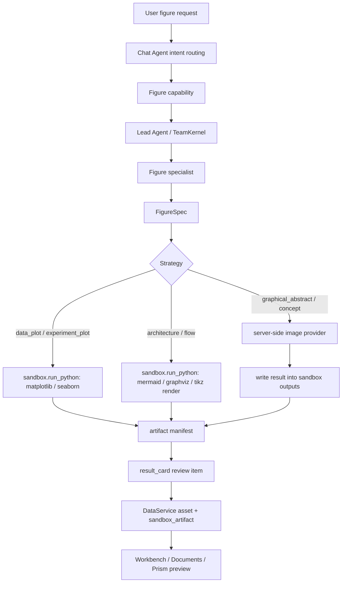

# Research Figure Generation Capability Design

## Goal

Make figure and image generation a first-class Wenjin capability instead of a loose set of image, Python, Mermaid, and thesis helper fragments.

The target outcome is a sandbox-centered visual production loop where agents can choose the right generation strategy for data plots, experiment charts, architecture diagrams, flow diagrams, mechanism illustrations, graphical abstracts, patent drawings, and document-ready captions, while every generated artifact remains reviewable, reproducible, and safe.

## Current Baseline

Wenjin already has partial building blocks:

- `backend/src/execution/providers/ai_image.py` can call an OpenAI-compatible image generation API and save a PNG result.
- `backend/src/execution/types.py` declares `ExecutionType.AI_IMAGE`.
- `backend/src/execution/capabilities.py` has readiness checks for image model routing and provider configuration.
- Model catalog and admin model management already support an `image` category.
- `backend/src/thesis/execution/figure_tool.py` has an old `mermaid`, `python`, and `kling` strategy wrapper.
- `backend/seed/skills/figure-engineer.yaml` defines a generic figure engineer skill.
- Several capability seeds already include `sandbox_policy.allowed_operations: render_figures`.
- The native harness already has `sandbox.run_python`, sandbox artifact discovery, artifact manifests, result-card staging, and DataService-backed sandbox artifact materialization.

The current product gap is not model availability. The gap is architectural closure:

- AI image generation runs as a backend execution provider, not as part of the workspace sandbox artifact lifecycle.
- The old thesis figure tool is isolated from capability, TeamKernel, harness tools, and result-card review.
- Chat execution middleware has image/chart/diagram tools commented out and should not become the new product path.
- `figure-engineer` describes figure planning, but it cannot reliably generate figures, register artifacts, or choose between code, diagram, and image strategies.
- Data plots, paper diagrams, conceptual illustrations, captions, source code, prompts, and provenance do not share one figure artifact contract.

## Design Principles

1. **Capability first.** Users should ask for figures naturally; routing should land on a capability, not a raw tool.
2. **Sandbox-centered outputs.** Every generated figure asset should land under `/workspace/outputs` or `/workspace/reports` with manifest metadata and review-card staging.
3. **Code before image for data.** Data, experiment, statistical, and evaluation figures must use reproducible code generation by default.
4. **Structured diagrams before freeform image.** Architecture, flow, and process figures should prefer Mermaid, Graphviz, or TikZ when structure matters.
5. **LLM image only where it fits.** Freeform image generation is appropriate for graphical abstracts, conceptual illustrations, visual metaphors, or polished non-data artwork.
6. **Provider secrets stay server-side.** Image model API keys must never be written into the sandbox or exposed to agent-written scripts.
7. **Agent autonomy within a schema.** The Lead Agent or figure specialist can choose a strategy, but must return a typed `FigureSpec`.
8. **Review before commit.** Generated figures are candidates until the user accepts them through the existing result-card and right-panel preview flow.
9. **No compatibility-layer drift.** The old thesis-only helper should be migrated or removed rather than kept as a second figure path.

## Scope

This spec covers:

- A shared figure generation contract.
- Capability and skill changes that let agents decide figure strategy.
- Sandbox-first code figure generation.
- Controlled server-side LLM image generation that writes outputs back into sandbox artifact space.
- Artifact manifest, result-card, and preview requirements.
- Tests and browser validation.

This spec does not cover:

- Replacing Prism, Documents, or the workspace room model.
- Building a separate image studio.
- Exposing raw generation logs in the default user experience.
- Full graphic design editing, layer editing, or Figma-style manipulation.
- Letting sandbox scripts call external image provider APIs directly.

## Proposed Architecture



## FigureSpec Contract

Add a canonical contract, for example `backend/src/contracts/figure_generation.py`.

`FigureSpec` should contain:

- `schema`: `wenjin.figure_generation.spec.v1`
- `figure_id`: stable slug scoped to the run.
- `title`: user-facing figure title.
- `figure_type`: one of:
  - `data_plot`
  - `experiment_plot`
  - `statistical_chart`
  - `architecture_diagram`
  - `method_flow`
  - `mechanism_illustration`
  - `graphical_abstract`
  - `patent_drawing`
  - `table_visual`
  - `other`
- `strategy`: one of:
  - `matplotlib`
  - `seaborn`
  - `plotly_static`
  - `mermaid`
  - `graphviz`
  - `tikz`
  - `llm_image`
  - `hybrid`
- `purpose`: the claim, process, or concept the figure supports.
- `inputs`: dataset paths, workspace file paths, Prism excerpts, upstream outputs, or user-provided description.
- `output_targets`: expected files under `/workspace/outputs/figures/<figure_id>/`.
- `caption`: draft caption.
- `alt_text`: accessibility summary.
- `provenance`: source data, scripts, prompt, model id, image provider, and upstream task ids.
- `quality_checks`: required validations for this figure type.

`FigureArtifactManifest` should contain:

- `schema`: `wenjin.figure_generation.artifact.v1`
- `figure_id`
- `figure_type`
- `strategy`
- `primary_path`
- `source_script`
- `source_prompt`
- `dataset_paths`
- `caption_path`
- `alt_text_path`
- `created_by`
- `content_hash`
- `review_notes`

## Strategy Policy

### Data and Experiment Figures

Default strategy:

- `matplotlib` or `seaborn` inside sandbox.
- Save PNG plus source script.
- Save CSV or dataset references in manifest.
- Register `artifact_kind: figure`.

Rules:

- Do not use LLM image generation for numeric values, curves, axes, ablation tables, benchmark plots, or statistical annotations.
- The script must set deterministic style, labels, units, legend, and layout.
- If source data is missing, generate a figure spec and ask for data; do not fabricate results.

### Architecture and Flow Diagrams

Default strategy:

- `mermaid`, `graphviz`, or `tikz` rendered from sandbox.

Rules:

- Prefer structure-preserving diagrams over freeform images.
- Use LLM image only when the user explicitly wants a conceptual visual or when a structured diagram would be unreadable.
- Keep source `.mmd`, `.dot`, or `.tex` next to the rendered artifact.

### Mechanism Illustrations and Graphical Abstracts

Default strategy:

- `llm_image` or `hybrid`.

Rules:

- LLM image generation must include a saved prompt and model/provider metadata.
- The image should not imply unsupported experimental results or cite nonexistent evidence.
- Captions must distinguish conceptual illustration from measured result.

### Patent Drawings

Default strategy:

- `graphviz`, `tikz`, SVG, or deterministic line drawing generated by code.

Rules:

- Freeform LLM image is not the primary route for claim-supporting patent drawings.
- Reference numerals, components, embodiments, and claim mappings must remain auditable.

## Runtime Design

### New Harness Tool Boundary

Introduce a figure generation tool at the harness layer rather than reviving old chat execution middleware:

- Public tool name: `sandbox.generate_figure`
- Required permission: `sandbox.generate_figure`
- Allowed only when capability `sandbox_policy.allowed_operations` contains `render_figures`.
- Uses the existing per-workspace sandbox scheduler and artifact discovery flow.

For code and structured diagram strategies:

- The tool runs sandbox Python through the existing `SandboxExecutionTools.run_python`.
- It writes artifacts under `/workspace/outputs/figures/<figure_id>/`.
- It writes or updates `/workspace/reports/artifacts.json`.

For LLM image strategy:

- The tool validates `FigureSpec`.
- The backend calls the server-side image provider using model catalog routing.
- The returned image bytes are written into the sandbox through controlled sandbox file APIs.
- The model API key never enters sandbox scripts, prompts, stdout, stderr, or artifact metadata.

### Reuse Existing Building Blocks

Keep:

- `AIImageProvider` as the low-level server-side image API adapter.
- Model catalog image category and admin configuration.
- Sandbox artifact discovery and result-card staging.
- Existing DataService asset and sandbox artifact domains.

Migrate or remove:

- `backend/src/thesis/execution/figure_tool.py` should not remain a product path.
- Commented chart/image entries in chat execution middleware should not be re-enabled as the default route.
- Old execution `PythonVizProvider` should not be used for new capability flows; sandbox `run_python` is the canonical code-generation route.

## Capability and Skill Design

### Shared Skill

Upgrade `backend/seed/skills/figure-engineer.yaml` from a planning-only role to a production-capable figure specialist.

Required additions:

- Explain `FigureSpec`.
- Require strategy choice before generation.
- Require data charts to use code.
- Require LLM images to preserve prompt and provider metadata.
- Require all outputs to be reviewable artifacts, not direct room writes.
- Allow sandbox tools through the recruitable expert template and TeamKernel policy.

### Capability Seeds

Add or update workspace capabilities so figure requests do not depend on brittle keywords:

- `sci`: research figures, experiment plots, method diagrams, graphical abstracts.
- `thesis`: thesis charts, framework diagrams, empirical figures.
- `proposal`: technical route diagrams, work-package timelines, risk matrices.
- `software_copyright`: reuse existing `software_architecture_diagrams`, but route through the new FigureSpec and sandbox artifact flow.
- `patent`: reuse drawing-related patent capabilities, but enforce patent drawing strategy policy.

Thin workspace-specific capabilities are acceptable because routing language and deliverable expectations differ. The shared behavior must live in the `figure-engineer` skill, the `FigureSpec` contract, and the harness tool.

### Expert Presentation

Recommended expert profile:

- Internal skill id: `figure-engineer`
- User-facing role: `科研制图师`
- Light nickname: `图表匠`
- Stage snippets:
  - `正在判断图的类型和证据来源`
  - `用 sandbox 生成可复现图表`
  - `正在整理 caption 和图注`
  - `已生成候选图，等待你确认`

Keep these snippets compact. Do not stream raw code or renderer logs by default.

## Artifact Layout

Every figure run should write a folder like:

```text
/workspace/outputs/figures/<figure_id>/
  figure.png
  figure.svg
  source.py
  diagram.mmd
  prompt.md
  caption.md
  alt_text.md
  manifest.json
```

Not every file is required for every strategy:

- `source.py` is required for `matplotlib`, `seaborn`, `plotly_static`, and deterministic line drawing.
- `diagram.mmd`, `diagram.dot`, or `diagram.tex` is required for structured diagrams.
- `prompt.md` is required for `llm_image`.
- `caption.md`, `alt_text.md`, and `manifest.json` are always required.

The root artifact manifest `/workspace/reports/artifacts.json` should include the primary figure path and metadata that artifact discovery can surface as `artifact_kind: figure`.

## Frontend UX

Default UX:

- Show generated figure candidates in the existing right-side preview/review surface.
- Use thumbnails for image artifacts.
- Show title, caption preview, strategy label, and source/provenance summary.
- Keep raw stdout, script logs, and provider internals hidden behind a secondary detail affordance.

Chat result-card:

- Include a compact figure card.
- Default checked if generated successfully.
- Actions:
  - `保存到产物库`
  - `重新生成`
  - `调整图注`
  - `忽略`

Prism/Documents:

- Accepted figure assets should be available for insertion or reference.
- Caption and alt text should be available alongside the image.

## Billing and Safety

Billing:

- Code-generated figures consume sandbox operation credits through existing sandbox pricing.
- LLM image generation should be billed through model/tool pricing, not hidden inside free sandbox usage.
- A future admin policy can price `tool.image_generation` per image, size, model, or provider.

Safety:

- Provider API keys remain in DataService/model secret storage or backend environment only.
- Sandbox scripts must not receive image provider secrets.
- Generated images must not be auto-committed to canonical workspace rooms.
- Data plots must not use LLM image generation.
- Artifact paths must pass existing workspace path validation.
- Prompts and manifests must not contain secrets or raw private tokens.

## Implementation Plan

### Task 1: Add Figure Generation Contracts

Files:

- Create `backend/src/contracts/figure_generation.py`
- Create `backend/tests/contracts/test_figure_generation.py`

Acceptance:

- Valid `FigureSpec` accepts supported figure types and strategies.
- Invalid data-plot + `llm_image` combination is rejected.
- Manifest paths must be under `/workspace/outputs` or `/workspace/reports`.

### Task 2: Add Harness Figure Tool

Files:

- Create `backend/src/agents/harness/figure_generation_tools.py`
- Modify `backend/src/agents/harness/builtins.py`
- Modify `backend/src/agents/harness/langchain_adapter.py`
- Modify `backend/src/agents/harness/policy.py`
- Test in `backend/tests/agents/harness/test_figure_generation_tool.py`

Acceptance:

- `sandbox.generate_figure` requires explicit permission.
- `matplotlib` strategy delegates to sandbox `run_python` and registers a `figure` artifact.
- `llm_image` strategy calls only server-side image adapter and materializes output into sandbox.
- Secrets are never present in tool result metadata.

### Task 3: Upgrade Capability and Skill Seeds

Files:

- Modify `backend/seed/skills/figure-engineer.yaml`
- Modify relevant `backend/seed/agent_templates/*.yaml`
- Add or update figure-generation capability seeds under each workspace type.
- Update capability schema tests for `render_figures`, `sandbox.generate_figure`, figure routing examples, and review-target validation.

Acceptance:

- Figure-capable capabilities include `render_figures`.
- Figure specialist can use `sandbox.generate_figure`.
- Routing examples cover data charts, architecture diagrams, graphical abstracts, and patent drawings.

### Task 4: Remove Old Product Path

Files:

- Remove or migrate `backend/src/thesis/execution/figure_tool.py`
- Update `backend/src/thesis/execution/__init__.py`
- Update any tests importing the old helper.

Acceptance:

- No runtime path depends on thesis-only figure generation.
- `rg "generate_figure\\(" backend` finds only the new harness path or tests.

### Task 5: Result Card and Preview UX

Files:

- Modify `frontend/lib/workspace-result-preview.ts`
- Modify `frontend/app/(workbench)/workspaces/[id]/components/ResultCard.tsx`
- Modify right-panel preview components if thumbnails are not already rendered for `figure`.

Acceptance:

- A generated figure review item shows a thumbnail, caption, strategy, and provenance summary.
- Accepted artifacts appear as workspace assets.
- Raw logs are not shown in the default view.

### Task 6: End-to-End Tests

Files:

- Add backend integration tests for a mock figure capability run.
- Add frontend/unit tests for figure preview projection.
- Add browser test for launching a figure request and accepting a generated candidate.

Acceptance:

- Data chart path produces a sandbox artifact with `artifact_kind: figure`.
- LLM image path can be mocked without exposing secrets.
- Browser flow shows figure candidate, preview, and accept action.

## Review Checklist

- Figure generation is reachable only through capability/team execution.
- No raw chat middleware bypass is introduced.
- Sandbox remains the lifecycle owner for generated artifacts.
- LLM image provider keys never enter sandbox.
- Data plots are code-generated, reproducible, and source-backed.
- Generated artifacts use result-card review before commit.
- Old thesis helper path is not retained as a second product route.
- UI stays lightweight: preview and caption first, logs/details secondary.

## First Phase Recommendation

Implement in this order:

1. Contract and harness tool.
2. `figure-engineer` skill upgrade.
3. SCI and thesis figure capability seeds.
4. Existing software/patent diagram capability migration.
5. Frontend preview polish.
6. Browser E2E.

This gives the product a real closed loop before expanding to every specialized figure subtype.
