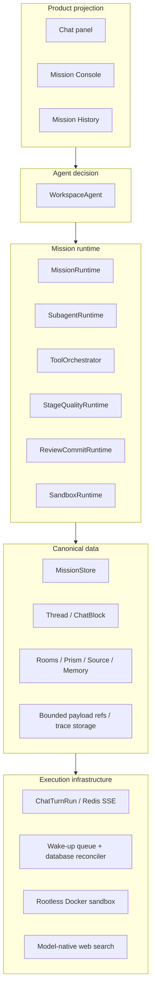
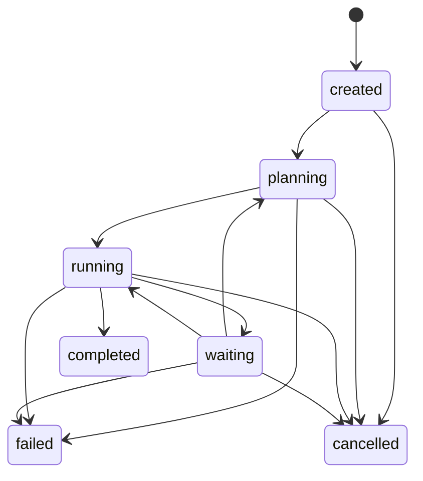
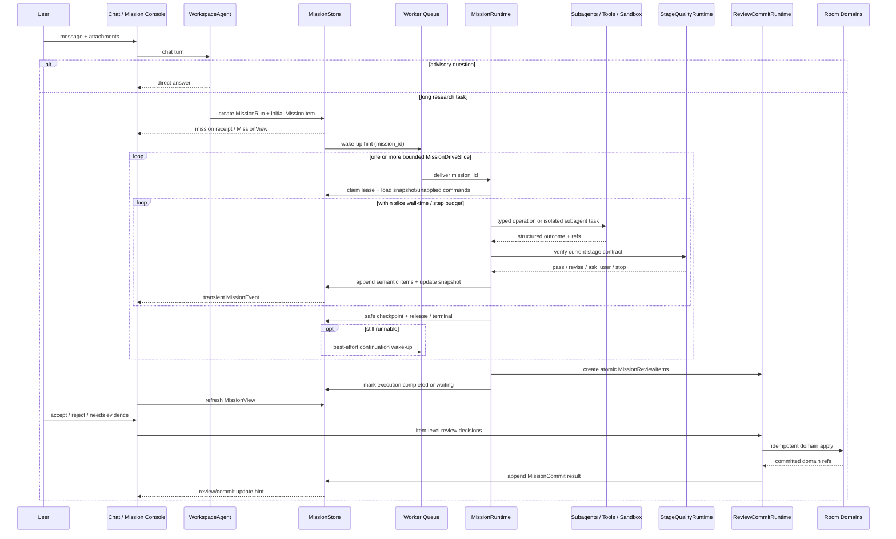

# Wenjin Mission Runtime 重构 Overview

> **状态**：Implemented - current truth moved to `docs/current/`; final deployment acceptance pending
> **版本**：2026-07-15
> **范围**：WorkspaceAgent、MissionRuntime、DataService Mission domain、Mission Console、review/commit、subagents、research tools、sandbox
> **文档定位**：本文件是目标架构的顶层 SSOT，负责冻结跨模块边界、对象权威性、通信合同和直接迁移路径；字段级 schema、算法和实现步骤由 `mission-runtime/01` 至 `13` 号子 spec 承担。
> **当前实现事实**：Mission 架构已完成 clean cut；生产事实以 `docs/current/` 和代码为准。本文件保留设计决策、边界与验收依据。

目标架构若与子 spec 冲突，以本 Overview 为准，并在开始对应实现前修正子 spec。它不保留旧方案的并行口径，也不为开发阶段数据设计运行时兼容层。

## 最终实现记录（2026-07-15）

- 持久 schema 为 `mission_runs`、`mission_items`、`mission_review_items`、`mission_commits` 四表。
- catalog 为 `mission_policies`、`worker_skills` 两表。
- 086 创建 Mission aggregate；087 引入 probe-backed model profile；088 迁移 linked domains；089 收敛 catalog；090 清理 auxiliary task 字段；091 增加 review-policy projection 与 commit-attempt fencing；092-096 完成 dispatch fencing、billing、workspace override clean cut、索引与 aggregate 外键完整性收敛。
- WorkspaceAgent、MissionRuntime、SubagentRuntime、ToolOrchestrator、StageAcceptance、ReviewCommitRuntime、PermissionRuntime、Sandbox vNext 与 MissionView 均已落地。
- 外部 operation claim/terminal receipt 以共享 operation key 追加到 MissionItem ledger，不创建第五张 operation 表；MissionRun 行锁与 lease epoch 提供原子 claim/reclaim 边界。
- StageGuard 统一检查前置阶段；WorkspaceAgent 先冻结完整内容寻址候选，并从服务端 `quality_reference_inventory` 复制精确引用，StageAcceptance 再从 Mission receipt 重建当前阶段的 candidate/evidence/artifact 并裁决。错误引用在 provider 边界内自修复，不消耗科研修订次数。可选 critic 只提供诊断，不参与通过权；用户复核只发生在最终质量通过后。
- Mission context checkpoint 已包含目标、阶段结论、证据/产物索引、失败和下一步；Memory 注入前执行确定性 staleness review；MissionView 对 waiting 投影 typed attention request。
- strict anti-compat gate 为零；旧运行路径无兼容层。
- 尚待发布验收：部署环境的 native-search receipts probe、Sandbox production attestations、真实 provider + Docker 的多轮浏览器主链。

读完本文件，参与者应能回答：

1. 什么是 chat transport，什么是持久 mission，谁拥有每类事实？
2. 服务端、DataService、前端和 sandbox 各改什么，又明确不拥有什么？
3. 一个任务如何启动、恢复、验收、复核、保存和失败降级？

---

## 0. 术语

| 术语 | 定义 | 权威来源 |
|---|---|---|
| **WorkspaceAgent** | workspace 中唯一面向用户的主 agent，合并原 Chat Agent 与 Lead Agent 的智能决策职责。 | 本文 D10；`01_workspace_agent.md` |
| **ChatTurnRun** | 一次聊天请求的短活 SSE、取消、断线和并发 transport；可过期，不是用户任务历史。 | 本文 D8；`01_workspace_agent.md` |
| **MissionRun** | 一个明确长任务目标从创建到终态的持久 aggregate；终态不重开，后续扩展创建关联的新 MissionRun。 | 本文 D1；`02_mission_runtime.md` |
| **MissionDriveSlice** | 一次有 wall-time/step 上限的 worker 驱动租约；只在安全边界结束并 checkpoint/续投，不是持久业务对象。 | 本文 D22；`02_mission_runtime.md` |
| **MissionState** | 由 MissionRun 标量列和 bounded snapshot 组装出的 typed runtime view；不是第二个持久化 owner。 | 本文 D11；`02_mission_runtime.md` |
| **MissionItem** | append-only、不可变的语义过程条目；记录阶段、工具、subagent、暂停、质量和提交里程碑。 | 本文 D1；`02_mission_runtime.md` |
| **MissionEvent** | 从 MissionRun/MissionItem 派生的短活通知，提示客户端刷新或增量投影；不承担恢复和历史。 | 本文 D14；`11_mission_trace_run_history.md` |
| **MissionPolicy** | 一类科研任务的目标、输入边界、工具权限、风险和交付约束；不是固定 graph。 | 本文 D11；`05_capability_skill_lite.md` |
| **StageAcceptanceContract** | 当前阶段必须达到的质量、证据、产物和推进条件。 | 本文 D19；`04_stage_acceptance_contract.md` |
| **MissionReviewItem** | 一个原子保存候选及其当前用户决定，是 mission review 的持久 SSOT。 | 本文 D9、D13；`07_review_commit_runtime.md` |
| **MissionCommit** | 对一个已接受 MissionReviewItem 的幂等领域写入记录，是保存结果 SSOT。 | 本文 D13；`07_review_commit_runtime.md` |
| **MissionView** | Chat、Mission Console 和 Run History 共用的服务端 read model；前端不得反推事实。 | 本文 D20；`08_mission_console_frontend.md` |
| **Workspace Rooms** | Library、Documents/Prism、Decisions、Tasks、Memory 等已提交领域事实的 owner。 | `docs/current/architecture.md` |

---

## 1. 问题陈述

当前系统已经具备 Chat Agent、Lead Agent、ExecutionRecord、capability graph、TeamKernel、review batch、sandbox 和前端 RunView，但它们形成了三个结构性问题：

1. **智能职责分裂**：Chat Agent 负责理解，Lead Agent 重新理解并执行；多轮上下文、任务状态和用户反馈需要跨两个 agent 翻译。
2. **运行事实分散**：ExecutionRecord、node state、TaskReport、ReviewBatch/ChangeSet、前端 store 和 Run History 分别掌握部分状态，导致 UI 需要拼事实，恢复和提交口径容易漂移。
3. **强模型被固定流程束缚**：capability graph 和固定专家模板规定过程，却没有稳定保证研究问题、证据、实验设计和逐阶段产出的质量。

**重要边界**：本次重构建立的是 evidence-driven academic mission runtime，不是通用科研 IDE、无约束自动写作器或新的 agent framework。MissionRuntime 负责运行纪律，不接管 Thread 消息、room 领域数据、模型供应商目录和前端临时交互态。

---

## 2. 目标与非目标

### 2.1 目标

- **G1** 用户只面对一个 WorkspaceAgent，普通聊天与长任务使用同一上下文和意图入口。
- **G2** MissionRun 成为长任务唯一生命周期 SSOT，支持刷新、重启、暂停、恢复、取消和历史回看。
- **G3** 内层 agent loop 自主规划、检索、派发 subagents 和修订；外层严格约束权限、预算、质量、证据、复核和写入。
- **G4** 每个关键科研阶段由 StageAcceptanceContract 验收，未达到 hard criteria 不能推进。
- **G5** Subagents、tools、sandbox 和 model-native web search 都通过统一 runtime 边界产生结构化结果。
- **G6** MissionReviewItem 与 MissionCommit 形成 item-level 复核和幂等保存链路，领域写入仍归 room services。
- **G7** Chat 与右侧 Mission Console 从同一个 MissionView 投影，默认界面保持轻、自然、可恢复。
- **G8** DataService 使用少表少索引、bounded snapshot、语义 ledger 和外部化大 payload，满足长任务性能与可维护性。
- **G9** 分布式执行具备单 active driver、bounded drive slice、lease fencing、at-least-once dispatch 和副作用幂等语义。
- **G10** 直接迁移到目标架构，删除 execution、Lead Agent、ReviewBatch/ChangeSet 和旧 search provider 运行路径。

### 2.2 非目标

- **NG1** 不建设文件树、终端、raw log 默认面板或通用 IDE shell。
- **NG2** 不把 capability、skill、专家模板或固定 graph 重新包装成用户入口。
- **NG3** 不持久化 ChatTurnRun，也不让它进入 Mission Console 或 Run History。
- **NG4** 不建立第二套 event store、run history、subagent job table 或每种工具一张表。
- **NG5** 不保留 Mission/Execution dual-write、旧 API redirect、旧字段 hydrate 或 provider fallback。
- **NG6** 不自动保存 citation、claim、evidence、实验结论、Prism structural edit、专利权利要求和长期 memory。
- **NG7** 不长期保存 token delta、raw reasoning、stdout/stderr、旧草稿版本和已完成 review diff 内容。
- **NG8** 不开放 unrestricted shell、Docker socket、宿主密钥、默认公网或外部目录访问。
- **NG9** 不把“模型说完成了”或“subagent 有文本输出”当作阶段通过。
- **NG10** 不在本轮优先建设 admin capability 编辑体验；生成质量、主链路和用户体验优先。

---

## 3. 系统边界

```text
┌──────────────────────── Input ────────────────────────┐
│ user message / sealed MissionInputs / workspace context│
│ selected model + effort / user review mode / policy refs│
│ active mission command or ordinary advisory question  │
└────────────────────────────────────────────────────────┘
                           │
                           ▼
┌──────────────── Wenjin Mission Runtime ───────────────┐
│ WorkspaceAgent                                         │
│ MissionRuntime + MissionStore                          │
│ Subagent / Tool / StageQuality / ReviewCommit Runtime  │
│ SandboxRuntime + model-native web search               │
└────────────────────────────────────────────────────────┘
                           │
                           ▼
┌──────────────────────── Output ───────────────────────┐
│ chat answer / mission receipt / stage summary          │
│ MissionView / evidence / artifact preview              │
│ MissionReviewItem / MissionCommit                      │
│ committed Workspace Room facts                         │
└────────────────────────────────────────────────────────┘
```

本子系统不拥有：

- Thread/ChatBlock 的对话持久化；
- Library、Prism、Decisions、Tasks、Memory 的领域内部规则；
- 账号、鉴权、模型目录、定价策略和 workspace membership；
- 浏览器登录态、外部账户和密钥本身；
- 模型供应商内部推理状态；
- 用户设备上的任意文件系统或通用终端。

---

## 4. 目标架构

### 4.1 分层



| Layer | 主要模块 | 改造重量 |
|---|---|---|
| Product projection | ChatPanel、Mission Console、Runs drawer、MissionView | Heavy |
| Agent decision | WorkspaceAgent | Heavy |
| Mission runtime | MissionRuntime、subagent/tool/quality/review/sandbox runtimes | Heavy |
| Canonical data | DataService Mission domain、Thread、Rooms、payload refs | Heavy |
| Infrastructure | Redis SSE、Celery/worker、Docker、model-native web search | Medium |

### 4.2 对象分类与 SSOT

| 类别 | 对象 | 规则 |
|---|---|---|
| **持久事实** | Thread/ChatBlock、MissionRun、MissionItem、MissionReviewItem、MissionCommit、Room facts | 只有这些对象可以恢复业务状态；每类事实只有一个 owner。 |
| **运行合同** | MissionSpec、MissionPolicy、StageAcceptanceContract、ResearchToolOutcome、MissionOutput、PermissionRequest | typed data，可写入 MissionItem payload/ref，但不各自创建事实表。 |
| **服务端投影** | MissionState、MissionView、SubagentActivity、EvidenceLedger、quality/review/commit summaries | 从持久事实组装；不得反向覆盖事实。 |
| **短活传输** | ChatTurnRun、MissionDriveSlice、MissionEvent、SSE delta、worker queue message | 可重复或丢失；恢复依赖持久事实，不依赖传输记忆。 |
| **受控临时材料** | raw trace、stdout/stderr、tool large output、review diff/version preview | 有 TTL、脱敏和大小上限；接受后由 room fact/manifest 取代。 |

`MissionTurn` 不进入目标 canonical model。Chat 的一次请求由 ChatTurnRun 表达；mission 内一次循环、用户输入或恢复点由 MissionItem 表达，避免再造含义重叠的 turn 层。

### 4.3 Mission 生命周期与 review/commit 状态轴

MissionRun 只描述 agent execution lifecycle：



MissionRun status 固定为：

```text
created | planning | running | waiting | completed | failed | cancelled
```

`blocked`、`awaiting_user_review`、`committing` 不再作为 MissionRun status：

- 可恢复的阻塞统一为 `waiting + waiting_reason`；不可恢复且本次任务停止统一为 `failed + failure_reason`。
- 最终研究工作可以 `completed` 且仍有 pending MissionReviewItem；“结果待确认”来自 review summary。
- “保存中/部分保存/保存失败”来自 MissionCommit summary，不污染 mission execution status。
- execution 进入终态后不再恢复 agent loop；后续 review/commit 可追加审计 MissionItems 和更新对应 counters/summary，但不能改变终态或 `completed_at/failed_at`。
- 用户界面显示“需要补充材料、结果待确认、正在保存”，不显示内部 `blocked/high risk`。

### 4.4 并发、恢复与输入

1. 一个 Thread 同时最多有一个非终态前台 MissionRun；同一 workspace 的不同 Thread 可以拥有不同 mission。
2. 一个 MissionRun 同时只有一个 active driver。每次 `MissionDriveSlice` 通过 `lease_owner + lease_epoch + lease_expires_at` claim，在低于 Celery hard limit/Redis visibility timeout 的 wall-time 与 step budget 内推进；所有状态写入校验 state version 和 fencing epoch。
3. worker queue 只携带 `mission_id` 和 command hint。数据库中的 runnable status、`next_wakeup_at`、pending command item 和 lease 才是事实；queue message 丢失由 reconciler 重投。创建/命令事务先提交，再 best-effort publish；不使用 outbox 双重记录同一 dispatch intent。
4. 用户在 mission 运行中发送的新消息，先由 WorkspaceAgent 分类为 `steer/context/correction/pause/cancel/review/advisory`。影响 mission 的输入以稳定 command id 追加为 MissionItem，并在安全边界触发 replan。
5. active driver 在每个 loop/operation 安全边界读取 `last_applied_command_seq` 之后的命令；Redis/Celery 通知只能降低延迟，不能成为命令可见性的前提。
6. advisory side question 可以使用独立 ChatTurnRun 回答，但不能隐式改写 active MissionRun。
7. 终态 MissionRun 不重开。实质性扩展任务创建新的 MissionRun，并以 `parent_mission_id` 关联来源。
8. 终态复核返工从 reviewed MissionItem 解析唯一来源阶段，创建幂等 child Mission，并按 StageAcceptance 依赖闭包失效受影响阶段；来源缺失时失败闭合，不全量猜测重跑。

### 4.5 Bounded snapshot、ledger 与事件

MissionRun 的普通列拥有 identity、title/objective、status、active stage、lease、version、计数和时间等查询/生命周期事实；bounded snapshot 只保存：

- user constraints 和当前 plan 摘要；
- stage quality 最新摘要；
- policy/context checkpoint refs；
- active subagent、evidence、review、commit 的短摘要/引用；其列表计数使用普通列；
- pending request、waiting/failure reason 和 next actions；
- prompt/policy/tool/sandbox 版本引用的 bounded runtime context 摘要。

snapshot 不重复普通列，不保存完整 evidence/tool/subagent/review 数组，不保存 raw transcript 或大 payload。完整语义历史进入 MissionItem，超限内容写 `payload_ref`。

MissionItem append 后不可修改。一个 operation 的 `started/progress/completed/failed` 是共享 `operation_id` 的独立条目；只有 terminal phase 才可作为稳定结果。Token delta、raw reasoning、逐行 stdout 和 subagent wire log 不进入 durable semantic ledger。

MissionEvent 是短活 typed notification，携带 `mission_id/state_version/last_item_seq/type`。客户端断线后读取 MissionView snapshot，再按 `last_item_seq` 补取语义 items；不建立 MissionEvent 表或第二套 replay store。

Compaction 是带版本/hash 的 `context_checkpoint` terminal MissionItem，不是聊天摘要。Checkpoint 保留 objective ref、用户决策、当前阶段与质量、证据/产物引用、未提交结果、失败尝试、pending request 和 next actions；恢复不依赖完整 transcript。

长期 Memory 仍是 room fact：agent 只能提出 MissionReviewItem 候选，写入前复核；注入新 mission 前执行 staleness review，过期选题、期刊、实验条件和偏好不得静默污染当前任务。

### 4.6 Agent loop、质量与 capability

WorkspaceAgent 的结构化动作收敛为：

```text
answer | ask_user | start_mission | steer_mission | propose_review | request_commit
```

MissionRuntime 内层循环：

```text
observe -> plan_or_replan -> act -> normalize -> verify -> continue_or_pause
```

StageAcceptanceContract 只规定“做到什么程度”，不固定 agent 必须走哪条 graph。每次验收结果为：

```text
pass | revise | ask_user | stop
```

- 只有 hard criteria 全部通过才可 `pass` 并推进。
- `revise` 在同一阶段内补证、重算或重写；只有显式用户审查或具体未决疑点才可派按需 critic。修复受 revision、token、tool、time 和 credit budget 限制，并必须形成新的完整候选。
- 通过后的内部阶段自动继续。只有最终受保护写入或用户显式要求的阶段检查点才创建 MissionReviewItem；Mission 只等待预览生成，不等待用户做保存决定。
- `ask_user` 写入 durable pause request。
- `stop` 结束本次执行，但仍返回安全、可解释的 partial outputs；不得伪造证据，也不得用“质量门失败”吞掉已有结果。
- capability/skill 只提供 MissionPolicy、acceptance contract、优秀示例/反例、工具边界和 output contract，不再提供固定专家团或 UI graph。
- 推理强度全局只使用 `low | medium | high | xhigh`。StageAcceptanceContract 判断产出质量，不因 effort 标签本身判失败；若实际质量/no-progress 表明需要提高 effort，先给出原因和成本提示，再由用户确认或缩小任务，禁止静默升级。

### 4.7 Research tools 与 sandbox

- 文献和网页检索只使用经过 live capability probe 的模型原生 web search；Semantic Scholar、curated academic、deep search 和 provider fallback 从 runtime 删除。模型 slug、普通 tool calling 或自然语言中的 URL 不能证明具有原生搜索能力。
- 新接入默认使用 Responses API `web_search`，强制检索的科研阶段使用 required tool choice；citation/source metadata 只信任 provider 的 `web_search_call`、annotations/sources 等结构化回执，不把模型自报 JSON 当作检索证据。
- `source_type` 只表达领域来源类型，不保存历史 provider 名。每个可引用结果保留 URL/标识、标题、访问时间、内容 hash/快照引用和 claim-evidence 关系。
- Sandbox 是内部研究执行基座，不承担文献联网检索。默认 typed operations、network `none`，依赖安装才使用受限 package-index profile。
- 第一阶段使用 Docker/rootless workspace provider，并要求无 Docker socket、无宿主密钥、最小挂载、资源上限、私网/metadata 拒绝和 command audit。
- Sandbox 只能产生 manifest-backed evidence/artifact；产出字节在 trusted control root 封存为内容寻址对象，公开工作路径后续覆盖不会改变历史回执。没有 Artifact/Dataset Manifest 的产物不能进入质量或用户保存链路。
- 外部网页、论文、repo 和 prompt-like 大段输入优先经 read-only delegate 提取事实，不能扩张主 agent 权限或长期 memory。

---

## 5. Project Map

> 变更等级固定为：🆕 New / 🔧 Modified / ➕ Field passthrough。本轮是直接切换，`Modified` 不表示保留旧运行时兼容路径。

### 5.1 服务端

| ID | Project / Module | 当前职责 | 等级 | 目标范围 |
|---|---|---|---|---|
| **S1** | `backend/src/agents/chat_agent` + `agents/lead_agent/v2` | 对话决策与 capability/team 执行分属两个 agent | 🔧 | 合并智能职责为 WorkspaceAgent；搬运可复用 planning/team 逻辑后删除 Lead Agent 身份和双重转译。 |
| **S2** | `backend/src/execution` + `backend/src/task/tasks/execution.py` + execution services | ExecutionRecord 生命周期、worker 入口和 node 状态 | 🆕 | 建立 MissionRuntime/MissionStore runner；直接删除 ExecutionRecord/ExecutionNodeRecord 产品写路径。 |
| **S3** | `backend/src/runtime/runs` + `gateway/services/run_*` + run routers | chat SSE、取消、断线和 multitask transport | 🔧 | 明确收敛为 ChatTurnRun Redis/memory TTL transport；名称、API 和依赖不得泄漏到 Mission domain。 |
| **S4** | `backend/src/subagents/v2` + TeamKernel + harness quality | 专家注册、成员执行、工具活动和质量门 | 🔧 | 拆为 SubagentRuntime、ToolOrchestrator、StageQualityRuntime；生命周期写 MissionItems，详细 trace 外部化。 |
| **S5** | execution commit、change set/unit、review services | accepted ids、ReviewBatch/ChangeSet 和领域物化 | 🔧 | 建立 MissionReviewItem/MissionCommit；保留必要 apply handler 到 room domains，删除旧 runtime facts。 |
| **S6** | `backend/src/sandbox` + harness sandbox helpers | workspace sandbox、command audit、manifests | 🔧 | 收敛为 Mission-linked SandboxRuntime，typed operations、fenced jobs、manifest/review boundary 和 hardened provider。 |
| **S7** | DataService execution domain/client/router | executions、nodes、events、leases、history | 🆕 | 建立 compact Mission domain 和 MissionStore API；drop/reseed execution schema。 |
| **S8** | DataService credit/sandbox/source/provenance/Prism/task/memory/rooms | 以 execution id 记录计费、产物和来源 | 🔧 | 同批迁移为 mission/mission item/mission commit provenance，删除 ReviewBatch 和 run history 事实源。 |
| **S9** | `services/search` + `academic/literature` + source contracts | 多 provider 文献搜索与 provider 枚举 | 🔧 | 只保留 model-native web search tool；清理旧 provider 文件、配置、enum、测试和运行时文案。 |
| **S10** | Gateway mission APIs / projection services | execution/run API 与前端聚合 | 🆕 | 提供 mission summary/detail/items/actions/review/commit API 和 MissionView；队列消息只传 mission id。 |
| **S11** | Model Catalog + model gateway/adapters | 单一 `openai_compatible` 协议和人工 `supports_*` 布尔值 | 🔧 | 建立 versioned ModelCapabilityProfile 与 live probes；区分 generation API、严格 tool args、native web search/citation 回执，禁止按模型名猜能力。 |

### 5.2 前端

| ID | Project / Module | 当前职责 | 等级 | 目标范围 |
|---|---|---|---|---|
| **C1** | execution APIs/types/store + `execution-run-view.ts` | 合并 live execution、history、node、review packet | 🆕 | 建立 Mission API/types/read cache 和 `mission-view.ts`；snapshot wins，store 只缓存 read model。 |
| **C2** | `ChatPanel.tsx` + message/result blocks | 对话、launch receipt、thinking、结果卡 | 🔧 | 使用 WorkspaceAgent/ChatTurnRun；展示 mission receipt、阶段摘要和自然语言控制，不承载工具日志。 |
| **C3** | `LiveWorkflowPanel.tsx` + `live-workflow/*` | execution team/evidence/review 右侧工作台 | 🔧 | 改为 Closed/Peek/Expanded Mission Console，只消费 MissionView 和按需 items。 |
| **C4** | ChangeSet review、Runs drawer、Prism review surfaces | batch review、execution history、文稿变更 | 🔧 | 改读 MissionReviewItem/MissionCommit/MissionRun；batch 仅是 UI selection，不再有 ChangeSet/ReviewBatch domain。 |

### 5.3 数据、配置与运行资产

| ID | Asset | 等级 | 目标范围 |
|---|---|---|---|
| **D1** | Mission persistence | 🆕 | 只建 `mission_runs`、`mission_items`、`mission_review_items`、`mission_commits` 四张核心表；不建 MissionEvent、MissionTurn、ChatTurnRun 或 subagent 表。 |
| **D2** | Redis / worker queue | 🔧 | Redis 只保存 ChatTurnRun/SSE TTL 和必要锁；queue 传 wake-up hint，MissionStore、bounded drive slice 与 reconciler 保证恢复；Celery result backend 不是真相。 |
| **D3** | capability/skill/template seeds | 🔧 | 六类 workspace 全部转换为 MissionPolicy、StageAcceptanceContract、worker guidance、按需 diagnostic skill 和 exemplar refs。 |
| **D4** | context/trace/review preview storage | 🆕 | 语义 MissionItems 持久；大 payload/raw trace/diff/version preview 外部化、脱敏、TTL 清理。 |
| **D5** | release gates / fixtures / docs | 🔧 | 加入精确 anti-compat scans、drop/reseed、browser E2E 和 current-doc cutover；不使用宽泛关键词误伤历史文档。 |

### 5.4 保持不变的服务边界

- Thread/ChatBlock 继续拥有对话历史；MissionItem 只保存消息引用，不复制完整 transcript。
- Account/Auth、workspace membership、Model Catalog 和 Pricing Policy 保持各自 DataService owner；Model Catalog 的 capability schema/probe 由 S11 重构，但 ownership 不迁入 Mission domain。
- Library、Prism、Source、Decision、Task、Memory 继续拥有已提交内容及领域校验。
- 前端 `run-ui-store` 类状态只保存 focus/selection/expanded，不升级为业务 store。
- Workspace sandbox 目录语义继续复用现有 canonical layout，但 execution/node provenance 全部换成 mission/item provenance。

### 5.5 直接迁移顺序

1. 冻结旧 execution/Lead Agent/capability graph 新功能。
2. 先把 `runtime/runs` 明确命名并隔离为 ChatTurnRun transport。
3. 建立四表 Mission domain、MissionStore、lease/fencing 和 projection contract。
4. 同批迁移 credit、sandbox、source/provenance、Prism、task、memory、rooms 与 history 的 execution 语义。
5. 开发环境 drop/reseed；仅必要 demo 数据使用一次性 offline importer。
6. 上线 MissionRuntime + WorkspaceAgent + subagent/tool/quality runtimes，删除旧 worker 主链。
7. 上线 MissionReviewItem/MissionCommit，删除 ReviewBatch/ChangeSet/accepted ids/review-packet commit。
8. 前端一次切换 MissionView/Mission Console，删除 execution fallback、node hydration 和双历史合并。
9. Sandbox operations 与 artifacts 只接受 mission provenance；credit reservation 只归属 Mission，工具用量通过 receipts 进入终态结算；Model Catalog 通过真实 tool/search probes 后，search runtime 才暴露 model-native web search。
10. 通过 anti-compat、contract、recovery、browser E2E 后更新 `docs/current/`。

迁移失败的回退方式是部署与数据库快照恢复，不是在应用运行时保留双读、双写或旧 API fallback。

---

## 6. 模块边界

| Module | Owns | Does NOT own | Upstream entry | Downstream output |
|---|---|---|---|---|
| **Frontend projection (C1-C4)** | Chat/Mission UI、selection、preview、用户动作 | 生命周期、质量、risk、review 或 commit 事实 | ChatTurn SSE + Mission APIs/events | 用户输入、mission actions、review decisions |
| **ChatTurn transport (S3/D2)** | 一次 chat request 的流、取消、断线、短 TTL 并发 | Mission lifecycle、history、credits、sandbox jobs | Thread turn request | Chat blocks/SSE；可选 mission command |
| **WorkspaceAgent (S1)** | 意图、回答/追问、mission spec、计划与 replan 决策 | 持久状态、权限最终裁决、room write | Thread context + active MissionView | AgentAction / MissionSpec / user-facing narrative |
| **MissionRuntime/Store (S2/S7/S10/D1)** | lifecycle、snapshot、items、lease、pause/resume、budget、commands | room 领域内容、UI selection、raw provider state | AgentAction + queue wake-up + user command | Mission facts + MissionEvent hints |
| **Subagent/Tool/Quality (S4)** | isolated jobs、tool policy、outcome normalization、stage acceptance | Chat narrative、user review、commit | Mission stage/context/contracts | semantic MissionItems、MissionOutput、ResearchToolOutcome |
| **SandboxRuntime (S6)** | typed compute、workspace isolation、network policy、manifests | 文献 web search、room commit、host filesystem | audited sandbox operation | structured outcome + manifest-backed candidate |
| **ReviewCommitRuntime (S5)** | MissionReviewItem decisions、item-level idempotent MissionCommit | 生成研究内容、实现 room 领域规则 | accepted review item / user decision | room-domain write result + commit facts |
| **DataService linked domains (S8)** | credit、source、provenance、Prism、rooms、memory 等领域事实 | agent loop 和 mission lifecycle | MissionRuntime/ReviewCommitRuntime | committed facts and provenance |
| **Model runtime adapter (S11)** | ModelCapabilityProfile、endpoint probes、provider protocol frames、model invocation | tool policy、search verification、mission lifecycle 或静默 model routing | Model Catalog config + requested model/effort | structured model/tool/search frames + capability health |
| **Model-native web search (S9)** | 受控联网检索和可验证 source metadata | sandbox 公网、引用真实性最终判断 | ToolOrchestrator query | ResearchToolOutcome + source refs |

关键关系：

1. WorkspaceAgent 决定“做什么”，MissionRuntime 决定“如何安全、可恢复地推进”。
2. Queue 和 MissionEvent 都是 transport hint；MissionStore 才能决定是否执行和客户端应显示什么。
3. Subagent、tool 和 sandbox 只能产出候选与证据，不能越过 ReviewCommitRuntime 写 room。
4. MissionReviewItem 是原子保存单位；前端 batch action 只是并行提交多个 item，不形成新 domain object。
5. Thread 保存完整对话，MissionItem 保存与 mission 有关的消息引用和语义里程碑，避免双份 transcript。
6. Model runtime adapter 只证明和传递 provider 能力/结构化 frame；ToolOrchestrator 仍负责工具权限、执行与证据归一化，二者不能互相越权。

---

## 7. 已锁定决策

| ID | Decision | Direction | Affected components |
|---|---|---|---|
| **D1** | 运行 SSOT | MissionRun scalar + bounded snapshot 是生命周期 SSOT；MissionItem 是 immutable semantic ledger。 | S2、S7、C1 |
| **D2** | 历史 execution | 开发阶段 drop/reseed；必要 demo 数据仅离线导入。 | S7、S8、D5 |
| **D3** | DataService 范围 | execution-linked domains 全部纳入同次 mission cutover。 | S7、S8 |
| **D4** | 表结构 | mission 运行域只建四张核心表，少索引、无 JSON 热查询、无 per-tool/per-agent 表。 | D1 |
| **D5** | Admin capability | admin 热编辑不是本轮优先；先保证主链质量、架构和 UX。 | D3 |
| **D6** | Review 粒度 | 存储和 commit 都是 item-level；前端可 batch，但不能绕过高风险确认。 | S5、C4 |
| **D7** | Sandbox provider | 第一阶段 Docker/rootless；产品合同 provider-neutral。 | S6 |
| **D8** | Run 边界 | ChatTurnRun 只做短活 chat transport；MissionRun 才是持久长任务。 | S2、S3、C1 |
| **D9** | 旧 review 对象 | 删除 runtime ReviewBatch、ChangeSet、accepted ids；职责归 MissionReviewItem/MissionCommit。 | S5、S8、C4 |
| **D10** | Agent topology | Chat Agent 与 Lead Agent 合并为 WorkspaceAgent；subagents 是原生 worker/tool。 | S1、S4 |
| **D11** | 对象层次 | 持久事实、运行合同、服务端投影、短活传输严格分层；MissionState 不成为第二存储 owner。 | 全链路 |
| **D12** | Mission status | execution status 与 review/commit status 分轴；删除 blocked/awaiting_user_review/committing mission 状态。 | S2、S5、C1-C4 |
| **D13** | Commit 单位 | 一个 MissionCommit 对应一个原子 MissionReviewItem apply；batch 允许部分成功和独立重试。 | S5、S8 |
| **D14** | Event 语义 | MissionEvent 易失；断线恢复使用 MissionView snapshot + items cursor，不建 event table。 | S2、S10、C1 |
| **D15** | 执行可靠性 | 一个 mission 一个 active driver；lease epoch fencing + at-least-once queue + operation idempotency。 | S2、S4、S6、S10 |
| **D16** | 数据体积 | snapshot 只放 bounded summaries/refs；raw trace、tool output、diff/version preview 外部化并按 TTL 清理。 | S2、S6、S7、D4 |
| **D17** | Runtime context 版本 | MissionRun 固化 model、`low/medium/high/xhigh` effort、prompt/policy/tool schema 和 sandbox image refs/hashes。 | S1、S2、S4、S6 |
| **D18** | Search source | runtime 只使用 live-probed model-native web search 与 provider structured receipts；source type 不记录 provider 历史值。 | S9、S8、S11 |
| **D19** | 质量推进 | agent 自由选择过程，StageAcceptanceContract 独占阶段推进裁决；失败循环有预算和 no-progress stop。 | S4、D3 |
| **D20** | UI projection | Chat 与 Mission Console 共用 MissionView；右侧默认关闭，不承担能力导航。 | C1-C4、S10 |
| **D21** | Model capability | Mission/runtime 只接受 provider structured tool frames；ModelCapabilityProfile 由 live probe 证实并 version/hash 固化，禁止文本伪工具和按 slug 推断。 | S1、S4、S9、S11 |
| **D22** | Worker tenure | 一个 queue delivery 只驱动一个 bounded MissionDriveSlice；安全 checkpoint 后续投，crash 由 lease expiry/reconciler 接管。 | S2、S10、D2 |
| **D23** | Dispatch/idempotency persistence | MissionRun runnable fields + immutable command item 是唯一 dispatch intent；领域唯一键拥有幂等。删除无生产消费者的 DataService operations outbox/idempotency/migration-report 脚手架。 | S2、S7、S10 |
| **D24** | Sandbox execution | 短命 hardened operation container + 持久、内容寻址的 workspace/environment；不引入长活容器会话 SSOT。 | S6 |
| **D25** | Model rollout baseline | 当前只启用 `gpt-5.6-sol`、`gpt-5.6-terra`、`gpt-5.6-luna`，Terra 默认；chat、Mission 与 subagent 共用 Chat Completions，保留用户的 `low/medium/high/xhigh` 且 `store=false`。联网检索是独立、probe-backed 的 Responses SSE tool transport，不保留替代 provider 或协议 fallback。 | S1、S4、S9、S11、C3 |
| **D26** | Attachment boundary | 可读附件只经 `MissionInput` 封装为 workspace/thread/hash/size 绑定的不可变引用；Chat 使用有界 excerpt，Mission/worker 只经 `workspace.read_input` 读取。删除 upload markup、中间件和重复预处理字段。 | S1、S4、S8、S12 |
| **D27** | Review ownership | review mode 是用户设置并由服务端注入；生成质量由主循环和 StageAcceptance 前置完成，critic 只在用户明确要求审查现有产出时触发。ReviewCommit 只负责受保护写入的用户确认。 | S1、S4、S5、C4 |
| **D28** | Completion/cardinality | 一个 completion target 同时绑定 required stage families 与 terminal output kinds；逐问数量只能由 WorkspaceAgent 在理解阶段通过后声明一次，由 MissionRuntime 校验并钉住，客户端无权提供。 | S1、S2、S4、D3 |

---

## 8. 通信合同

### 8.1 Chat transport

| Dimension | Contract |
|---|---|
| Scope | 单个 Thread 上的一次用户请求 |
| Identity | `chat_turn_run_id`，短 TTL，不写 DataService mission 表 |
| Owns | SSE stream、disconnect policy、cancel、heartbeat、temporary multitask lock |
| Does not own | mission idempotency、credits、sandbox、review、history |
| Recovery | Thread/ChatBlock 恢复对话；MissionView 恢复长任务；旧 stream 本身可丢失 |

目标 API 语义：

```text
POST /api/chat-turns/{thread_id}/stream
POST /api/chat-turns/{chat_turn_run_id}/cancel
```

### 8.2 Mission command and query

| Surface | Use | Truth |
|---|---|---|
| `POST /api/workspaces/{workspace_id}/missions` | 创建长任务，带稳定 idempotency key | MissionRun |
| `GET /api/workspaces/{workspace_id}/missions` | Mission History summary | MissionRun scalar/summary |
| `GET /api/missions/{mission_id}` | Current MissionView | MissionRun + review/commit summaries |
| `GET /api/missions/{mission_id}/items?after_seq=` | 懒加载语义 ledger / reconnect catch-up | MissionItem |
| `POST /api/missions/{mission_id}/actions` | steer/pause/resume/cancel/retry-stage | durable command MissionItem |
| `POST /api/missions/{mission_id}/review-decisions` | item-level accept/reject/needs-evidence | MissionReviewItem + audit item |
| `POST /api/missions/{mission_id}/commits` | 对 accepted item 发起幂等 apply | MissionCommit |

所有请求校验 actor 对 workspace/thread/mission 的访问权。前端传入的 status、risk、selection、commit result 一律不可信。

### 8.3 Durable dispatch

| Dimension | Contract |
|---|---|
| Queue payload | `mission_id`、`command_id`、可选 action hint；不携带完整 MissionState |
| Delivery | at-least-once；重复消息是正常情况 |
| Claim | 单 mission 按 id `FOR UPDATE`/CAS；reconciler 批量 claim 使用 `FOR UPDATE SKIP LOCKED`；数据库时间判定 expiry，并递增 `lease_epoch` |
| Fencing | 所有 driver 写入和外部 operation receipt 带当前 epoch/version |
| Drive slice | wall-time/step 上限低于 worker hard limit 和 broker visibility timeout；clean yield 只能发生在无未跟踪本地工作的安全边界 |
| Command visibility | driver 每个安全边界读取 durable command cursor；通知丢失不影响 steer/cancel/resume 可见性 |
| Recovery | reconciler 按 `next_wakeup_at` 扫描 runnable/expired-lease missions 并重投；queue/result backend 不参与状态恢复 |
| Publish order | Mission transaction commit -> best-effort queue publish；publish 失败由 indexed reconciler 修复，不写 outbox |
| Side effects | 稳定 `operation_key`；可幂等 provider 复用结果，不可幂等动作在 receipt 不明时不盲重试 |

### 8.4 Mission projection events

事件 envelope：

```text
event_id
mission_id
event_type
state_version
last_item_seq
occurred_at
summary
```

初始事件集合保持小而稳定：

```text
mission.created
mission.updated
mission.item.appended
mission.review.updated
mission.commit.updated
mission.terminal
```

事件只提示 patch/refresh。客户端发现 seq gap、version 倒退或 reconnect 时，立即以 GET snapshot/items 为准。

### 8.5 Tool and subagent outcomes

所有 tool/subagent terminal outcome 至少包含：

```text
operation_id
producer
status: success | partial | error
error_type
recoverable_by_model
recommended_next_action
evidence_refs
artifact_refs
payload_ref
redaction_applied
```

外部 effect 的 result 必须能关联 stable operation key。模型自然语言不得替代 tool receipt、source metadata、sandbox manifest 或 quality snapshot。

### 8.6 Review and commit

| Contract | Rule |
|---|---|
| Review modes | `review_all | balanced_default | auto_draft` |
| Non-bypassable | citation、claim、evidence、实验/统计结论、Prism structural edit、专利权利要求、长期 memory |
| Atomic unit | 一个 MissionReviewItem 表示一个可独立接受和保存的领域变更 |
| Write precondition | 修改既有目标时携带 base revision/hash；domain apply 不匹配即拒绝并生成新 candidate，不覆盖更新版本 |
| Batch | UI 选择 N 个 item，服务端执行 N 个独立幂等 MissionCommit |
| Partial failure | 成功项保持成功；失败项保留原因并可单独 retry，不伪造 batch 全成功 |
| Preview retention | 大 diff/旧版本只短期缓存；terminal 后清理内容，保留 decision、hash、target 和 commit audit |
| Protected write authority | 每个 target transaction 校验同一 `MissionWriteAuthority`：Mission、ReviewItem、Commit、attempt token、expiry 和 workspace 必须一致 |

---

## 9. 端到端主链路



图中只展示新主链。Thread 消息持久化、account auth、model gateway 和 room 内部规则继续使用现有领域边界。

---

## 10. 失败与降级模型

| Trigger | Handling | User-facing result / scope |
|---|---|---|
| Chat SSE 断线或 ChatTurnRun TTL 到期 | 结束旧 transport；重连读取 Thread 与 MissionView | 对话/mission 不丢，可能只丢瞬时 token delta |
| Queue publish 丢失或重复 | reconciler 重投；lease claim 和 command/operation idempotency 去重 | 任务继续，不重复执行已确认副作用 |
| Worker crash / lease expired | 新 worker 获取更高 lease epoch，从 bounded snapshot + terminal items 恢复 | 显示“正在恢复任务”，旧 worker 写入被 fencing 拒绝 |
| Projection event 丢失或乱序 | version/seq 检测后 snapshot refresh + items catch-up | UI 自愈，不将 stale event 写回事实层 |
| Model/tool 暂时错误 | 结构化重试、backoff、同工具去重；受 budget/no-progress 限制 | 显示可理解进度，不暴露 provider error |
| 模型不能稳定返回结构化 tool args | mission preflight 不启动或请求切换到已验证模型；不解析 assistant 文本冒充 tool call | 解释“当前模型不适合此研究任务”，不静默换模型 |
| Model-native web search 不可用或无结构化 search receipt | 不回退旧 provider；保留已有来源，标记 evidence gap，必要时 ask user | 返回部分梳理和明确缺口，不生成假引用 |
| Subagent timeout / token cap | terminal stop reason + partial result；主 agent 决定补位、缩小或继续 | 已产出内容仍可查看，不展示调度编号 |
| Stage hard criteria 未通过 | 在预算内 revise；需要材料则 waiting；无法修复则 stop with partial outputs | 不推进下一阶段，不用“质量门失败”吞输出 |
| Permission / budget / external data required | durable pending request，MissionRun `waiting` | 刷新后仍可继续；用户看到原因和影响 |
| Sandbox nonzero/timeout/policy deny | bounded logs + recovery guidance；无 manifest 不 stage | 主研究可 replan，内部命令不裸露 |
| Review preview 已过期 | 从 current target/accepted artifact 重新生成 candidate；不读取旧版本兼容数据 | 提示预览已更新，需要再次确认 |
| Review target 已在别处更新 | room domain 拒绝 stale base revision/hash；旧 item superseded，基于当前版本生成新 candidate | 不覆盖用户或其他任务的新版本，要求重新确认 |
| 单个 commit 失败 | MissionCommit 记录失败；其他 item 保持成功；失败项幂等重试 | 显示“部分内容未保存”及可操作建议 |
| Runtime context version 不兼容 | 显式 migration 或安全停止；不静默 hydrate | 保留可读结果，要求重新运行受影响阶段 |

任何 failed/stopped mission 都应返回已有安全结果、失败原因和下一步；只有确实没有可用产物时才显示空结果。

---

## 11. 端到端不变量与验收

### 11.1 不变量

1. **Run boundary**：ChatTurnRun 过期不能删除或改变 Thread、MissionRun、review、commit 或 room facts。
2. **Single mission owner**：没有 MissionRun 就不能创建长任务 worker、subagent、sandbox operation 或 credit reservation。
3. **Single active driver**：同一 mission 的有效状态写入必须携带当前 lease epoch 和 state version。
4. **Bounded recovery**：普通 mission detail 只读一行 MissionRun 和 bounded summaries；不得扫描全 ledger 才能恢复 Current Mission。
5. **Immutable ledger**：MissionItem append 后不修改；稳定结果必须有同 operation 的 terminal item。
6. **Transient events**：MissionEvent/SSE/queue 不得成为业务恢复 SSOT；任何 event loss 都可由 snapshot/items 修复。
7. **Idempotent effects**：可重试的 tool、sandbox、subagent dispatch 和 commit 都有 stable operation key；重复 delivery 不重复副作用。
8. **Quality progression**：StageAcceptanceContract 的 hard criteria 未通过时，后续 stage 不得启动。
9. **Evidence integrity**：model response 不是证据；claim 必须关联可验证 source、dataset、script、artifact 或明确标注未证实。
10. **Review authority**：MissionReviewItem 决定复核状态；checkbox、batch selection、chat 文案和 local store 都不是事实。
11. **Commit authority**：只有 accepted MissionReviewItem 才能生成 MissionCommit；修改既有内容必须通过 base revision/hash precondition，只有 successful MissionCommit 才能写入/确认 room fact。
12. **Domain ownership**：ReviewCommitRuntime 只编排，Library/Prism/Source/Task/Memory 等领域服务继续执行最终校验和写入。
13. **Sandbox provenance**：没有 manifest、command audit 和 mission/item provenance 的 sandbox 产物不能保存。
14. **Security boundary**：外部输入、网络、路径、密钥和权限判断在服务端 fail closed，不能依赖 prompt 或前端 guard。
15. **Projection purity**：前端不得根据计时器、按钮、node graph、raw tool JSON 或 stale cache 推断 lifecycle/quality/review/commit。
16. **Versioned execution**：MissionRun 必须记录 resolved model/effort 和 runtime policy/tool/sandbox refs；恢复不能默默换规则。
17. **No compatibility runtime**：ExecutionRecord、ExecutionNodeRecord、LeadAgentRuntime、ReviewBatch、ChangeSet、accepted ids 和旧 search providers 不得出现在目标运行路径。
18. **Friendly product language**：内部 risk/error/status 可以精确，默认 UI 只展示原因、影响和下一步，不展示 `blocked/high risk/schema/provider error`。
19. **Quality before review**：只有当前阶段通过验收的 exact candidate refs 才能创建 MissionReviewItem；agent 不读取或裁决用户复核队列。
20. **Immutable artifact bytes**：`sandbox-artifact:` 必须解析到 receipt 中的 `sbxobj_<sha256>`，不得回读可变 public path 作为历史证据。
21. **Structured model actions**：tool/subagent/search action 必须来自已验证 provider structured frame；XML/JSON/Markdown 文本中的“工具调用”永远只是文本。
22. **Bounded worker tenure**：单次 Celery task 不承载无限 mission 生命周期；每个 slice 在 hard limit 前 checkpoint/yield，Celery result backend 不作为完成依据。
23. **Single dispatch intent**：MissionStore runnable state/command ledger 是 dispatch SSOT；不得同时维护 outbox、通用 operations idempotency truth、Redis job truth 或本地 retry truth。
24. **Review is not generation**：阶段通过后自动推进；最终预览可等待用户稍后决定，但不得让保存选择反向成为内容质量裁决或 Mission 完成阻塞。
25. **Target-bound completion**：Mission 只按已钉住的 completion target 完成；所有动态展开阶段通过，且其 terminal output kinds 均由 accepted artifact 支撑并已向用户提供确认入口。
26. **Exact review continuation**：终态补证/再生成只失效 reviewed source stage 及其传递下游；无来源账本时不创建续作。
27. **One write authority**：当前 Mission materialization 仅开放 Prism、Source、Asset 三个完整目标域，并统一在 DataService target transaction 校验 MissionWriteAuthority。Memory、Room、Task、Sandbox 只有在 producer、preview、target transaction、receipt、tests 全链路同时落地时才能加入，禁止预留死分支。

### 11.2 Release gates

| Gate | Minimum proof |
|---|---|
| Contract | Mission/ChatTurn/review/commit API schema tests；unknown fields and actor mismatch fail closed |
| Persistence | lease/fencing、command dedupe、snapshot bound、items ordering、commit idempotency tests |
| Recovery | gateway/worker restart、SSE loss、queue duplicate/loss、expired lease、paused request refresh |
| Worker runtime | slice continuation、safe-yield、command polling、prefetch=1、visibility/hard-limit margin、DB-time lease tests |
| Model capability | real endpoint contract probe for strict tool args and hosted web search receipts；text/tool emulation rejected |
| Academic quality | SCI 选题/实验门、数模逐问门、citation/claim-evidence、reproducibility deterministic eval |
| Sandbox/security | path/symlink escape、network/private IP、secret redaction、resource limits、manifest/read-before-write |
| Frontend projection | MissionView unit tests；Closed/Peek/Expanded；lazy trace；no local lifecycle synthesis |
| Browser E2E | 多轮聊天、启动、动态 subagents、进度、补充信息、复核、部分保存、继续追问、刷新恢复 |
| Migration | dev drop/reseed、old import absence、精确 anti-compat scan、current docs synchronized |

Anti-compat scan 只针对 runtime imports/contracts/routes/fields，允许 historical docs、offline importer 和明确测试 fixture 出现旧词。重点扫描：

```text
ExecutionRecord runtime write
ExecutionNodeRecord runtime write
LeadAgentRuntime
launch_feature runtime path
node_states_json
accepted_ids / accepted_unit_ids
ReviewBatch runtime / ChangeSet runtime
review_packet as commit input
Semantic Scholar / curated_academic / deep_search provider path
provider-valued source_type
MissionView importing ChatTurnRun contracts
chat/completions + tools.web_search_preview
assistant-text tool-call parser in mission runtime
DataServiceOutboxEvent dispatch path
DataServiceIdempotencyKey / DataServiceMigrationReport unused operations path
```

---

## 12. 子文档路线

| Doc | Owns | Primary modules |
|---|---|---|
| [`01_workspace_agent.md`](mission-runtime/01_workspace_agent.md) | 单 agent identity、AgentAction、chat/mission input boundary | S1、S3 |
| [`02_mission_runtime.md`](mission-runtime/02_mission_runtime.md) | lifecycle、bounded state、lease/fencing、commands、agent loop | S2、S10 |
| [`03_dataservice_mission_schema.md`](mission-runtime/03_dataservice_mission_schema.md) | 四表 schema、MissionStore、linked-domain migration、indexes | S7、S8、D1 |
| [`04_stage_acceptance_contract.md`](mission-runtime/04_stage_acceptance_contract.md) | quality criteria、revision/no-progress、stage progression | S4、D3 |
| [`05_capability_skill_lite.md`](mission-runtime/05_capability_skill_lite.md) | 六 workspace MissionPolicy、skills/examples、catalog cleanup | D3 |
| [`06_subagent_runtime.md`](mission-runtime/06_subagent_runtime.md) | jobs、isolated context、stop reason、semantic ledger | S4 |
| [`07_review_commit_runtime.md`](mission-runtime/07_review_commit_runtime.md) | MissionReviewItem、item-level MissionCommit、retention | S5、S8 |
| [`08_mission_console_frontend.md`](mission-runtime/08_mission_console_frontend.md) | MissionView、Chat/Console、Closed/Peek/Expanded | C1-C4 |
| [`09_permission_pause.md`](mission-runtime/09_permission_pause.md) | durable requests、approval policy、budget/user pause | S2、S4 |
| [`10_sandbox_vnext.md`](mission-runtime/10_sandbox_vnext.md) | Docker/rootless、typed ops、network、manifest、delegate | S6 |
| [`11_mission_trace_run_history.md`](mission-runtime/11_mission_trace_run_history.md) | summary/items cursor、trace redaction/TTL、history | S10、C1、D4 |
| [`12_tool_orchestrator.md`](mission-runtime/12_tool_orchestrator.md) | ToolCatalog、ModelCapabilityProfile、policy/permission、operation idempotency、native web search、outcome normalization | S4、S9、S11 |
| [`13_migration_release_gate.md`](mission-runtime/13_migration_release_gate.md) | cutover order、drop/reseed、anti-compat、E2E/release | 全模块 |

子 spec 在实现前必须同步本次新增决策：MissionRun 状态分轴、immutable semantic MissionItems、lease epoch fencing、durable command/transient event、bounded snapshot、item-level commit 和 preview/raw-trace retention。

---

## 13. Open Questions

| ID | Residual owner decision | Known fact | Blocking scope |
|---|---|---|---|
| [**OQ1**](mission-runtime-open-questions.md#oq1-native-web-search-runtime) | 部署时 native-search probe 是否持续返回完整 receipts；若失败，是否接受搜索型 Mission 暂不开放？ | 独立 Responses SSE adapter 已实现并在验证完成边界关闭；runtime 要求 `web_search_call`、sources、URL citations 和 completed payload，失败即 fail closed。 | 不阻塞架构实现；阻塞搜索依赖型 policy 的部署开放。 |

目标架构不允许伪装搜索成功或恢复旧 provider。完整取证、选项和回写规则见 [`mission-runtime-open-questions.md`](mission-runtime-open-questions.md)。

除此之外，Run 边界、DataService 范围、表数、review 粒度、sandbox provider、状态轴、并发模型、事件语义、retention 和迁移方式均已锁定。具体 TTL、byte limit、heartbeat、slice wall-time 和 Docker 参数由 benchmark 决定，不回流为顶层架构分叉。

---

## 14. 资料与依据

### 14.1 本项目事实

- `docs/current/architecture.md`：当前 WorkspaceAgent、MissionRuntime、DataService、review、sandbox 和 frontend projection 事实。
- `docs/current/workspace-current-state.md`：当前 chat-native Mission、rooms、sandbox 和 Mission UX。
- `docs/current/frontend-mission-contract.md`：当前 Chat/MissionView/review/commit 前后端合同。
- `docs/current/workspace-mission-catalog.md`：当前 MissionPolicy/WorkerSkill catalog 和运行路径。
- `docs/superpowers/specs/mission-runtime/00_index.md`：目标子 spec 索引与跨 spec 不变量。
- Code Review Graph incremental scan（2026-07-10）：当前 execution、review、DataService、LiveWorkflowPanel 和 TeamKernel 是迁移高耦合点。

### 14.2 外部调研

- [OpenAI Codex app-server protocol](https://github.com/openai/codex/blob/main/codex-rs/app-server/README.md)：thread/turn/item、typed notifications、分页历史、approval request、context compaction，以及 ephemeral realtime 与 persisted items 分离。
- [DeerFlow changelog](https://github.com/bytedance/deer-flow/blob/main/CHANGELOG.md)：RunStore ownership、cross-worker cancel 限制、run/thread indexes、atomic subagent terminal state、isolated subagent checkpointer、bounded/externalized tool output 和 sandbox hardening。
- [DeerFlow AGENTS](https://github.com/bytedance/deer-flow/blob/main/AGENTS.md)：harness/app 分层、per-thread isolation、persistent memory、subagent delegation 和 sandbox/provider topology。
- [Kimi Code AGENTS](https://github.com/MoonshotAI/kimi-cli/blob/main/AGENTS.md)：core loop、isolated/resumable subagent store、ApprovalRuntime SSOT 与 Wire/UI projection 分离。
- [OpenCode agents and permissions](https://opencode.ai/docs/agents/)：primary/subagent distinction、hidden internal workers、allow/ask/deny policy 和 task-level subagent permission。
- [OpenAI Agents SDK HITL](https://openai.github.io/openai-agents-python/human_in_the_loop/)：stable tool call approval、serializable RunState、nested agent interruption 汇聚和 pending-state versioning。
- [LangGraph persistence](https://docs.langchain.com/oss/python/langgraph/persistence)：checkpoint/pending writes、snapshot/history 和长线程全量 state 增长风险。
- [LangGraph interrupts](https://docs.langchain.com/oss/python/langgraph/interrupts)：durable pause/resume、thread cursor 和 interrupt 前副作用幂等要求。
- [OpenScience](https://github.com/synthetic-sciences/openscience)：科研阶段 loop、facet literature review、critique gates、real citation/data discipline；仅吸收 harness，不采用 IDE 外壳。
- [OpenAI Web search guide](https://developers.openai.com/api/docs/guides/tools-web-search)：新集成使用 Responses API `web_search`；Chat Completions 只支持专用 search model；强制检索需 required tool choice，citation/source 来自结构化回执。
- [OpenAI Symphony SPEC](https://github.com/openai/symphony/blob/main/SPEC.md)：bounded agent turns、continuation retry、reconciliation、stall timeout 和单一 orchestrator scheduling authority。
- [Celery task reliability](https://docs.celeryq.dev/en/stable/userguide/tasks.html) 与 [Redis visibility timeout](https://docs.celeryq.dev/en/stable/getting-started/backends-and-brokers/redis.html)：late ack 仍要求任务幂等；visibility timeout 会重投，长任务必须有界且配置留 margin。
- [PostgreSQL locking](https://www.postgresql.org/docs/current/explicit-locking.html)：row lock/CAS 用于单 mission claim；`SKIP LOCKED` 只用于 queue-like reconciler 批量领取。
- [Docker rootless](https://docs.docker.com/engine/security/rootless/)、[resource constraints](https://docs.docker.com/engine/containers/resource_constraints/) 与 [container create controls](https://docs.docker.com/reference/cli/docker/container/create/)：生产 daemon 非 root、cap/read-only/pids/CPU/memory 等硬限制必须在容器边界执行。
- [SWE-ReX](https://github.com/SWE-agent/swe-rex)：agent/runtime provider 解耦、独立执行环境与并发控制；Wenjin 只借鉴 provider-neutral runtime，不开放通用 shell UI。

### 14.3 调研落地结论

| External pattern | Wenjin decision |
|---|---|
| Codex persisted item vs ephemeral realtime | MissionItem 持久，MissionEvent/ChatTurn SSE 易失 |
| DeerFlow RunStore owner/cross-worker limits | MissionRun lease epoch + active driver + reconciler |
| LangGraph checkpoint and replay side effects | bounded snapshot + stable operation idempotency，不盲 replay 外部动作 |
| Agents SDK durable approvals | pending request 进入 MissionItem/snapshot，按 request/operation id resume |
| Kimi ApprovalRuntime/Wire split | backend review/permission SSOT，前端只投影 |
| OpenCode hidden subagents/permissions | subagents 内部化，allowed tools/rooms/risk 由 policy 收窄 |
| DeerFlow/Kimi oversized output handling | durable semantic ledger + externalized bounded payload refs |
| OpenScience research loop | agent 自由探索，StageAcceptanceContract 严格验收科研质量 |
| Codex agent loop and user approvals | 生成阶段内循环修复质量；保护性写入交给用户复核，可选审查按需触发 |
| Symphony bounded turns/continuation | MissionDriveSlice 有界驱动 + safe checkpoint + reconciler 续投 |
| Celery late ack/visibility semantics | queue 只唤醒；任务幂等、prefetch=1、slice 小于 timeout，不信任 result backend |
| OpenAI hosted web search contract | live capability probe + Responses `web_search` + provider citation/source receipts |
| Codex root-scoped child threads | mission-scoped subagent registry、fresh bounded context、parent-mediated result、并发/深度上限 |
| Docker/SWE-ReX isolation boundary | 短命 hardened containers、持久 environment manifest、provider-neutral SandboxRuntime |

---

> **维护规则**：本 Overview 是迁移设计记录。当前生产事实只更新 `docs/current/`；只有设计决策或验收结论变化时才回写本文件。
